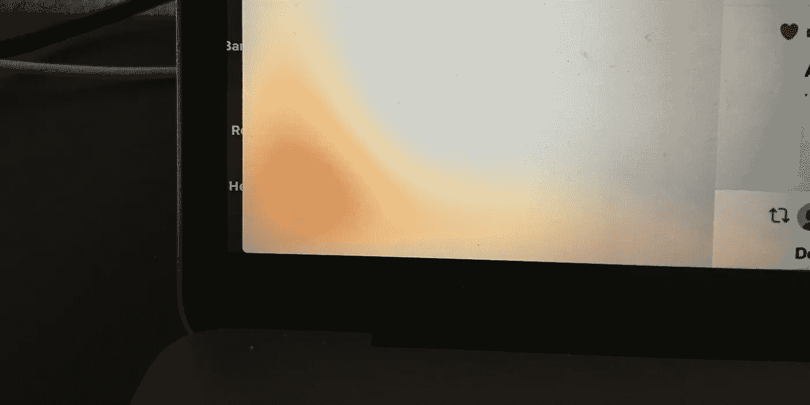

# 25 年来最差的苹果产品——2016 款 MacBook Pro

> 原文：<https://medium.com/hackernoon/worst-apple-product-2016-macbook-pro-5f1ad0036a75>

我从 20 世纪 80 年代末开始购买麦金塔电脑，随着时间的推移，我已经买了几十台。我还记得我的第一台麦金塔电脑:一台双软盘 Mac SE，内置 70 MB 光盘。

2017 年 1 月，我开始着手一个新项目，鉴于我的 2013 年 MacBook Air 出现了老化的迹象，我决定购买当时新推出的苹果 MacBook Pro。我不记得是什么让我跳过了最重要的苹果规则——永远不要购买新产品的第一代——但它发生了。

16 个月后，我真的很后悔浪费了近 3000 美元在 25 年来最差的苹果产品上。

The Worst Apple Product in 25 Years — The 2016 MacBook Pro

我认为最令人沮丧的十大教训是:

1.无用的触摸条——现在我至少要点击两次才能调暗屏幕或关掉声音。

2.屏幕的两个下边缘都变黄了；我相信这与他们使用的胶水有关。

3.我在三个不同的地方工作，我无法继续使用可用的 MagSafe 电源。(等式中再加上 250 美元。)

4.2016 款 MacBook Pro 速度慢。我想增加内存，但是我做不到。

5.电池寿命很少超过 4.5 小时——我既不是在看视频，也不是在编译代码。

6.适配器地狱——我已经花了至少 200 美元购买或更换丢失的适配器。

7.我再也不能在家里的影院显示器上使用 USB 集线器和电源了。

8.USB C 端口开始变得松松垮垮。顺便说一下，大多数问题都是由苹果适配器引起的。(轻轻触摸影院显示器的 Thunderbolt 适配器，屏幕变黑。)

9.命令和控制键罢工了:有时它们起作用，有时不起作用。太糟糕了，我不能参加集体诉讼。说到键盘:这也是我记忆中最吵的一个。(你怎么能为了让 MacBook Pro 变得更薄 1 毫米而牺牲一个有效的键盘设计呢？做出那个决定的人应该被判终身监禁。)

10.触控 ID:不到三个月就死在水里了。(我大概一周重启一次 MacBook。)

顺便说一下，我的 2013 年 MacBook Air 仍然工作正常。每当我组织聚会或研讨会，或者在会议上演讲时，它都是我首选的伙伴。

# 🎓你还想这样多读书吗？

好吧，那么:

*   📰*加入 17473 位同行和* [*报名我的每周简讯*](https://age-of-product.com/subscribe/?ref=Food4ThoughtMedium)
*   🐦*关注我的*[*Twitter*](https://twitter.com/stefanw)*并订阅我的博客* [*产品时代*](https://age-of-product.com)
*   💬*或者，免费加入* [*Slack 团队的 3000 多名同行“手把手的敏捷”*](https://goo.gl/forms/XIsABn0fLn9O0hqg2) *。*