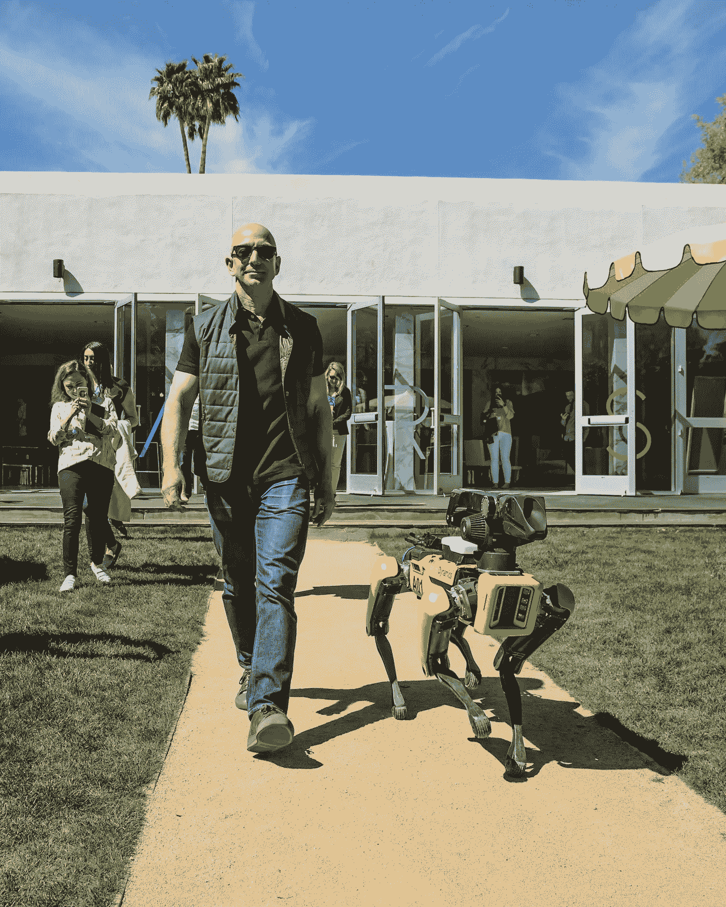
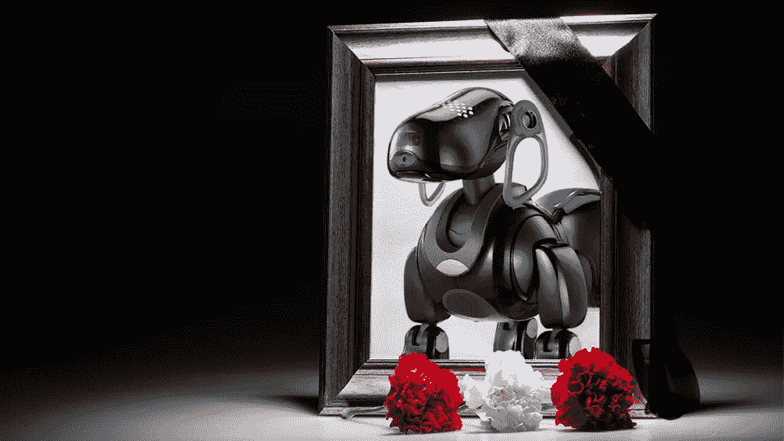

# 一只机器宠物会改善你的生活吗？

> 原文：<https://medium.com/hackernoon/would-a-robot-pet-enhance-your-life-92ae03ca04ae>

我们都知道狗是人类最好的朋友，但是这个世界真的到了这种地步吗？

Just Jeff walking his dog

在纽约市一个特别狂风大作的日子，我发现自己(像一个作家收入水平的人偶尔会做的那样)在上东区，置身于一群比你酷的高中生、专心致志的遛狗者和戴着看起来像沙皮狗的帽子的女人中间，这种帽子在形成过程中可能会遭受痛苦。

尽管如此，我还是冒着寒冷的空气，在史密森尼博物馆的设计机构库珀休伊特博物馆找到了慰藉。一进门，访客就会看到一个看起来像魔杖的笔工具，它可以作为你感兴趣的项目的交互式记事本。“多创新啊。”完美的创新博物馆，我说的对吗？手里拿着我的魔杖，我进入了物品的纳尼亚，第一站是一个名为“访问和能力”的展览。以专为残疾人设计的“人工制品”为特色，我惊讶地发现，在各种各样的创新中，有一只看起来非常可爱的小狗，我本能地想抚摸它。但我没有，因为害怕被逮捕，一拉罗汉 12。

但这不是普通的狗。这是…一个机器人。我的一部分认为这有点像某种梦想中的小狗:它很可爱，毛茸茸的，它喜欢成为宠物，并对你所有的爱做出反应。我们都知道狗是人类最好的朋友，但这个世界真的到了这种地步吗？

IMAGE: JOYFORALL AT HASBRO WEBSITE COVER PICTURE

[库珀·休伊特](https://collection.cooperhewitt.org/objects/1158817841/)收藏了一件孩之宝为所有同伴[宠物](https://hackernoon.com/tagged/pets)带来的快乐，这意味着如果在博物馆里，机器人宠物肯定是真实存在的，对吗？就像不仅仅是一些古怪的科技世界为反社会者开发的东西？许多不同的公司已经开发了机器人“宠物”,不是作为玩具给孩子，而是作为治疗设备给那些没有能力像正常人一样照顾宠物的人。

机器狗现在正超越世界，比真正的狗更受欢迎。开玩笑的。但是末日可能不会太远，正如这个令人毛骨悚然的视频所示，这是对地球的模仿。根据疾病预防控制中心的说法，宠物对你的健康有多种积极的好处。照顾宠物不仅会有降低血压和胆固醇水平的副作用，还能让主人有更多的机会锻炼和社交。那么…拥有一个机器人版本会产生同样的效果吗？

显然，当索尼在日本停止销售其长期受欢迎的艾博狗时，顾客们非常沮丧，他们甚至举行了真正的葬礼。

很明显他们之间有联系。专门针对老年痴呆症和自闭症患者的机器人宠物目前正在作为真实动物的替代品上市，其健康优势被吹捧为医学上的下一个重大事件。

# 显然，当索尼在日本停止销售其长期受欢迎的 AIBO 狗时，顾客们非常沮丧，他们甚至举行了真正的葬礼。

很明显他们之间有联系。专门针对老年痴呆症和自闭症患者的机器人宠物目前正在作为真实动物的替代品上市，其健康优势被吹捧为医学上的下一个重大事件。

IMAGE: SHUTTERSTOCK/HANZI-MOR VIA GIZMODO

你在《无主之物》中看到的可爱的小海豹机器人 PARO“被发现可以减轻病人的压力，并被证明对病人有心理影响，改善他们的放松和动力。”科技变得越来越聪明，很快就在我们自己版本的人类基本情感上击败了我们——动物配备了传感器，旨在对它们的照顾者的情感做出反应，包括触摸、光线、音频、温度和姿势。换句话说，你给 PARO 越多的爱，它也越爱你。随着时间的推移，你和 PARO 的关系越来越密切，宠物会对主人做出回应，表现出更容易被抚摸的行为，并奖励与可爱的小海豹的积极互动。谁不喜欢可爱的小海豹的行为呢？！

虽然孩之宝的版本没有 PARO 的高科技，但它也针对老年人作为治疗动物。孩之宝的版本比我们 90 年代童年时代的 Furbys 更上一层楼，价格低得多，同时仍然模仿拥有一只真正的宠物狗的感官元素，并以典型的宠物反应来回应爱抚和拥抱。所以下次你去米尔德里德奶奶家时，你可能会惊喜地发现，似乎永远不会消失的臭猫尿味被机器人菲多取代了。不错的交易。

想亲眼看看这个网络噩梦般的现实吗？前往 Cooper Hewitt，展望我们的未来——一个充满追逐你的机器狗的世界的水晶球——并在[回合应用](https://round.nyc)上分享你的反应。好的一面是，告别去奶奶家之前必须服用苯那君！

*By*[*DALYA BENOR*](https://www.instagram.com/dalyabenor/)*/2018 年 3 月 23 日上午 9 点 38 分
(* Dalya Benor 是一位常驻纽约的自由撰稿人。她是《办公室》杂志的副主编，为各种出版物撰稿

*感谢阅读。非常感谢你按住它👏按钮。* 圆媒体原帖:

 [## 一只机器宠物会改善你的生活吗？-圆形

### 我们都知道狗是人类最好的朋友，但这个世界真的到了这种地步吗？

round .纽约](https://round.nyc/stories/robot-pet)