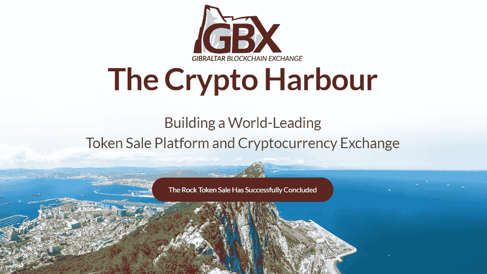
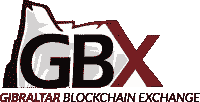
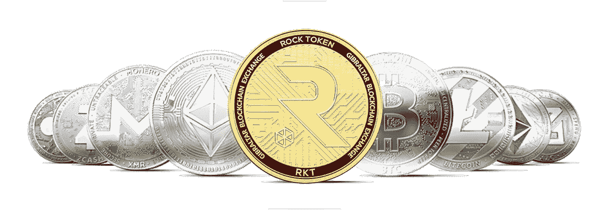

# GBX 会击败其他交易所，成为世界领先的加密交易所吗？

> 原文：<https://medium.com/hackernoon/would-gbx-knock-other-exchanges-off-their-perch-to-become-the-worlds-leading-crypto-exchange-7c71f0c9c8ee>

在去年(10 月)的香港金融科技峰会上，直布罗陀证券交易所(GSX)推出了 GBX，即直布罗陀区块链交易所，该平台的目标是成为世界上第一个受监管和获得许可的加密和基于区块链的令牌交易所。
随着直布罗陀政府引入新的分布式账本技术监管框架(于 2018 年 1 月 1 日生效)，直布罗陀区块链交易所处于独特的地位。

GBX 是 GSX(直布罗陀证券交易所)的子公司，为其平台上的交易者提供了新的安全性、交易透明度和可访问性。

直布罗陀证券交易所是一个自我监管的全球市场，其主要市场由欧盟监管，并得到 ESMA 和 HMRC 的承认。

作为欧洲联盟的成员，直布罗陀是数字技术领域的先锋。英国海外领地也恰好是一个完全受监管的司法管辖区，拥有欧洲各地的护照权利。

同样，它为游戏社区提供了一个避风港，直布罗陀的目标是在加密货币社区中引入、提供支持、提供结构以及促进增长。
直布罗陀区块链交易所(GBX)将成为下一代加密经济的交易平台，因为它建立了一个管理良好的加密货币社区，建立了最佳贸易实践以及代币销售的黄金标准行为准则。

不仅限于代币销售，GBX 还提供其他综合服务，包括咨询、银行、企业以及支付服务。该平台旨在为全球范围的企业服务、上市、钱包以及 KYC/反洗钱和银行服务提供端到端的生态系统。
GBX 通过严格接受经过彻底审查的高质量令牌产品，创建了加密令牌列表的卓越新标准。

只有经过严格审查的硬币和代币才会在这个交易平台上上市交易。这个受信任、治理良好的 GBX 平台拥有一个强大的、支持性的密码社区。

所有在直布罗陀区块链交易所上市的公司也可以优先在直布罗陀证券交易所上市。这给了加密初创公司更多的融资选择，以及更多元化的传统投资者基础。

**GBX 如何运作** 说到加密交易，已经有几家交易所可供选择。这就引出了一个问题，GBX 有什么不同？该平台提供了哪些加密社区尚未获得的功能？

好吧，让我们来分析一下，好吗？

GBX 希望创建一个更适合传统投资者的交易系统，也就是说，GBX 希望创建一个类似于证券交易所的革命性加密交易所。

例如，GBX 团队积极细致地审查新代币，以确保其安全性和合法性，然后才在平台上提供给潜在投资者。该平台的主要目标是“为那些过于紧张而不敢涉足加密市场未知领域的投资者创造一个港湾。”

从本质上讲，GBX 的突出特点是所有硬币和代币在上市前都经过彻底分析。GBX 已经成立了一个代币审核小组(即 GBX 联盟),其任务是在每一个代币在交易平台上市之前形成共识。

GBX 的其他关键特征包括创新的赞助商锁定机制以及勤勉的白名单程序。GBX 引以为豪的另一个关键特征是，其投资池完全由 KYC/反洗钱清算投资者组成，这使得该交易平台真正成为加密交易的未来。

GBX 的生态系统是围绕着平台内货币 Rock Token (RKT)展开的。

**摇滚 Token (RKT)如何运作？**
直布罗陀区块链交易所平台内货币被称为“Rock Token”，这个名字来源于直布罗陀标志性的“直布罗陀之石”地标。RKT 是 GBX 平台上交易、代币上市以及其他功能的首选货币。

从本质上讲，RKT 是为 GBX 和 GSX 生态系统提供动力的公用事业令牌。

*RKT 的主要特性和功能*
Rock Token 在直布罗陀交易平台上具有多种功能，包括用于:

在 GBX 平台内支付会员和治理费用

在交易平台上支付费用、刊登物品和赞助

访问银行服务(这包括用于交易的订单簿以及安全的离线托管)

投票选择社区发展

**为什么 GBX 是世界顶级的加密交易所/代币销售平台**
在直布罗陀区块链交易所出现之前，就已经存在多家加密交易所。然而，自推出以来，GBX 凭借其革命性的功能使其他交易所黯然失色，被认为是世界领先的加密交易所和代币销售平台。

那么，是什么让 GBX 从其他平台中脱颖而出呢？
GBX 最突出的特点是它提供的安全性。该平台的原则建立在公众承诺和信任的基础上，在任何代币上市前都有严格的审查流程，努力确保其社区的繁荣，同时通过最佳实践、公司治理和反洗钱/KYC 保护平台参与者。

GBX 已经为加密社区建立并继续培育一个开放和积极的未来，提升其平台参与者的信心、可信度、流动性和信任度。
此外，直布罗陀区块链交易所开辟了一条国际通道，由 DLT 支持的(分布式账本技术)直布罗陀政府提供的监管结构提供支持。

**关键 GBX 特征
显然，存在一长串的加密交换。像币安、Bittrex、Bitmex、BitFinex、Cryptopia、KuCoin 等等。然而，GBX 与其他交易平台有些不同。**

GBX 的主要目标是开发一个更适合传统投资者的系统。

实际上，GBX 已经创建了一个类似于证券交易所的秘密交易所。
通过在上市前对所有硬币进行彻底审查，GBX 为投资者提供了安全性，否则他们会犹豫是否要深入加密货币市场。如前所述，审查过程由直布罗陀区块链交易所(即 GBX 联盟)形成的社区模型处理。GBX 联盟将在每一个代币上市前就其达成共识。

其他关键功能包括一个巧妙的保荐人赌注制度，创新的白名单程序，以及一个专门的 KYC/反洗钱清理投资者小组。

**结论**
自 GBX 于 2017 年 8 月作为直布罗陀证券交易所(GSX)的子公司推出以来，该平台已经并仍在经历增长和转型，成为世界领先的加密交易平台，这归功于其提供的独特功能，以及该平台在保护投资者方面所做的努力。

让你的代币在 GBX 上市和在比特币基地上市有同样的潜力，甚至更好。正如大多数加密货币爱好者所知，这是任何加密货币的附加值。

该交易平台提供 KYC(了解你的客户)和反洗钱(反洗钱)保护，此外，与我们在区块链领域所习惯的相比，令牌接受了不同寻常的审查。

GBX 将利用许多证券交易所上市的法律要求，这意味着在 GSX 和 GBX 上市的证券可能会有重叠。

现在，证券交易所平台上的潜在重叠不仅限于直布罗陀证券交易所，还包括伦敦证券交易所以及其他证券交易所，考虑到在证券交易所上市的要求已经得到满足，因此，所述令牌将能够获得在证券交易所上市所需的验证。
受到欧盟法规的监管对直布罗陀区块链交易所来说也是一个好兆头，减少了未来的监管问题。