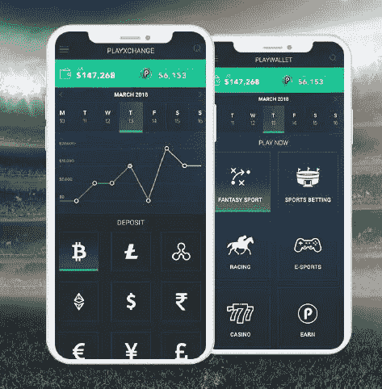
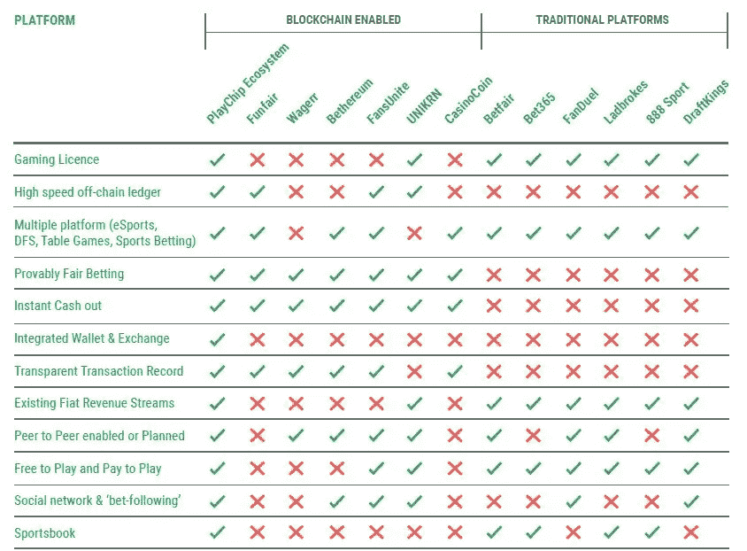

# 你会用加密货币玩梦幻运动吗？

> 原文：<https://medium.com/hackernoon/would-you-play-fantasy-sports-with-cryptocurrency-f2ac039573ee>

## 一个已经存在的平台(Google Play 上超过 50 万次下载)正在创建一个令牌

From [PlayChip](https://www.playchip.global/)

到 2018 年为止，我们在加密市场上所知道的只是熊市趋势。很多人将这种趋势比作 2014 年的熊市。2014 年我不在 crypto，但我读过很多关于当时震撼 crypto 领域的熊市的文章。不像今天，人们认为比特币实际上会消亡。尽管比特币明显占了上风，但事实仍然是，大量加密硬币消亡了，只有真正的加密硬币幸存了下来。

有真实用例的加密货币将经得起时间的考验。熊市趋势和波动总是存在的，但用例将在替代币的生存和增长中压倒一切。

当谈到一些区块链项目时，有一个令人信服的问题。当现有代币可以提供他们所需的解决方案时，有些公司开发代币是为了筹集资金和占据市场主导地位。受此影响的行业的一个例子是游戏行业。

有相当多的游戏代币。每一个都有与众不同的特征。我们有像 ENJ，乐趣和许多其他的例子。但是你知道问题所在；仅靠一枚硬币来统治这个行业是极其困难的。据说在线赌博每年产生约 560 亿美元的收入，这为大量竞争创造了空间。因此，这里的目标不是登上月球，而是拥有一个永远需要的令牌。一个已经存在的产品让我对一个加密项目打了很高的分数，这个加密项目就是这样。已经存在的平台是 [**PlayUp**](https://www.playup.com/) ，加密项目是 [**PlayChip**](https://www.playchip.global/) 。

> 现在，这不是一个金融或投资建议。这是一个信息丰富的审查和概述了一个加密项目的爱好者谁会感兴趣，它或类似的东西。

PlayChip 是 PlayUp 背后的团队创造的一种加密令牌，用于激励他们现有的体育社区和游戏生态系统。PlayChip 的愿景是成为体育博彩、游戏、梦幻体育和电子竞技的通用游戏代币。**该令牌连接到一个已经运营的企业，该企业在 70 个国家的 7 个平台上拥有超过 100 万用户**。

PlayChip 计划通过公平、透明、易用和更低的费用来扰乱不受监管的赌博行业(据说价值 3T 美元)。**目前 PlayChip 是 PlayUp 上的奖励代币，固定价值 0.01 美元**。玩家将奖励兑换成附属机构(包括万事达卡和亚马逊)的代金券。

PlayChip 将是一个 ERC-20 以太坊令牌，这将是目前由 7 个平台组成的 PlayChip 生态系统的独家令牌。PlayChip 基金会将负责 PlayChip 及其相关技术的运营。PlayWallet、PlayXchange 和 PlayChain。**play wallet 是 PlayChip 生态系统的钱包界面(和基础),玩家在这里持有和使用他们的 PlayChip 代币**。PlayXchange 是将 PlayChip 代币转换为法定货币和其他加密货币的媒介。PlayChip 到 fiat 和其他 crypto 的直接转换在钱包中是可能的，这使得 play chip 和 cryptocurrency 作为一个整体更容易被其庞大的用户群和 crypto 的新用户访问。

*为什么平台需要区块链解决方案？它能解决什么问题？*首先是**快速便捷取款，费用低廉**。提款没有最低金额限制，而且可以立即存取资金。区块链技术还提供了透明度、可见性和安全性，消除了任何内幕交易的谣言或生态系统中玩家的优惠条款。区块链也为生态系统的全球发展创造了一个平台。

使用 PlayChip 有很多好处。区块链的使用增加了对游戏平台的信任。PlayChip Foundation 可以审计交易并遵守监管机构的规定，同时维护用户隐私。监管部门可以监控平台，以确保合规。**play chip 带来的可访问性增加了全球流动性，从而带来更大的奖金池和更好的赔率，这反过来又增加了玩家的参与度**。(但是，PlayChip 值的变化会影响赢款的值)。由于取消了中间商，交易费用也减少了。将有 KYC/反洗钱参与该生态系统，但它将只进行一次，以参与所有平台。玩家也因社交网络发展活动而受到激励，如推荐、分享、下注、送礼等。

现在，关键时刻到了。以太坊的缩放问题。由于令牌将是以太坊令牌，因此需要解决它将如何应对缓慢的以太坊网络。为此创建的解决方案是 PlayChain。 **PlayChain 是 PlayChip 自己的链外网络，以实现(整个 PlayChip 生态系统的)定价和赔率的一致性、高交易速度、安全可靠的交易，以及平台内的实时总账交易批量转移到以太坊区块链**。PlayChip 的区块链架构也是以这样一种方式设计的，它将能够容纳任何解决以太坊效率低下的区块链解决方案。随着技术的进步，PlayChip 将被开发以匹配最近的发展，或者可以被移植。

为了应对市场波动并避免泵和转储，**对捐款超过 5 万美元的账户实施了 escrows】。团队成员、分支机构和顾问也要接受为期至少 12 个月的基于绩效的发布标准。总体而言，PlayChip 的价格将取决于人们使用该平台的数量以及对令牌的需求。**

下一个问题是，【PlayChip 如何从竞争对手中脱颖而出，尤其是在区块链领域？这里有很多要说的，但我们还是让下图来说吧。

The PlayChip Advantage

是的，PlayChip 正在进行一次象征性的销售，但参与其中应该是你在进一步仔细研究后自己的决定。此次象征性发售已将 1000 万美元软上限提高了一倍。加密市场目前处于熊市，这对每个人都是一个警钟。购买代币的目的只是为了以后以一个有希望的“更高”的价格出售，这不是一件明智的事情。然而，如果幻想体育，在线体育博彩是你的事情，那么这是一个平台(也可能是一个机会)给你。

> 附:本文仅供参考，不作为任何形式的财务建议。参与 ICOs 具有相当大的风险。做你自己的研究。这只是为了了解一个加密领域的创新项目。