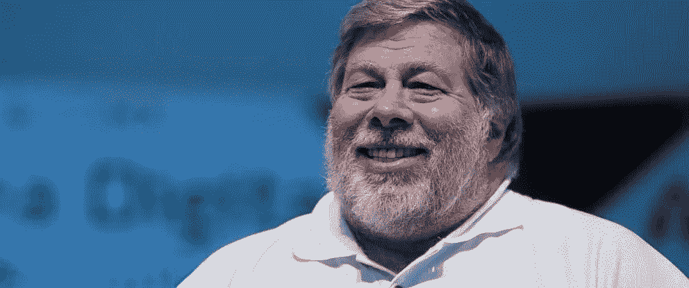

# 沃兹尼亚克的幸福算法

> 原文：<https://medium.com/hackernoon/wozniaks-happiness-algorithm-d411cd6420ee>

今天，我翘了所有的课去听史蒂夫·沃兹尼亚克的演讲。

以前见过我的发言人，我以为他很普通，但是我不想错过见到他的机会。

令我惊讶的是，他的热情和精力是显而易见的。

他谈论的最重要的事情之一是如何过好生活。这是很多[哲学家](https://hackernoon.com/tagged/philosophers)探索过的概念。尤其是，亚里斯多德把这个概念叫做 [arete](https://en.wikipedia.org/wiki/Arete_(moral_virtue)) 。

沃兹尼亚克认为，幸福是美好生活的关键。快乐胜过成功和成就。

现在我们都在想，我们如何获得幸福？史蒂夫·沃兹尼亚克给了我一个[算法](https://hackernoon.com/tagged/algorithm)，现在我将与你分享。

请记住，这个算法是由有史以来最杰出的工程师之一创造的，所以请试着跟随…

# 快乐=微笑-皱眉

*他后来提到，必需品(住房、水、食物)、娱乐和朋友都是你同样需要的东西。

在他的整个演讲中，他吐出了许多真知灼见，但我认为这是最重要的。他对它的强调让我相信他也认为这是最重要的事情。

*不要回头。*

*不要争辩。*

除了你自己，你永远不需要说服任何人。

*   史蒂夫·沃兹尼亚克