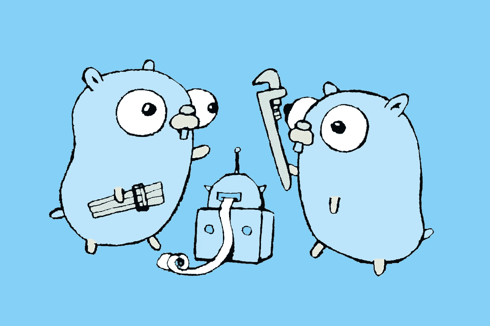

# 用 WebAssembly 和 Go 编写前端 Web 框架

> 原文：<https://medium.com/hackernoon/writing-a-frontend-web-framework-with-webassembly-and-go-ff84cd1346fe>



毫无疑问，JavaScript 前端框架有助于拓展以前在浏览器环境中可能实现的边界。在 React、Angular 和 VueJS(仅举几个例子)的基础上出现了更复杂的应用程序，还有一个众所周知的笑话，一个新的前端[框架](https://hackernoon.com/tagged/framework)似乎每天都在出现。

然而，这种发展速度对于全世界的开发者来说是一个非常好的消息。对于每一个新的框架，我们都发现了更好的处理状态的方法，或者用 shadow DOM 之类的东西高效地呈现。

然而，最新的趋势似乎是用 JavaScript 之外的语言编写这些框架，并将它们编译成 WebAssembly。我们开始看到 JavaScript 和 WebAssembly 通信方式的重大改进，这要感谢像 [Lin Clark](https://twitter.com/linclark) 这样的人，随着 WebAssembly 开始在我们的生活中变得更加突出，我们无疑会看到更多的重大改进。

# 介绍

因此，在本教程中，我认为构建一个用 Go 编写的极其简单的前端框架并编译成 WebAssembly 是一个好主意。至少，这将包括以下功能:

*   功能注册
*   成分
*   超级简单路由

我现在警告你，虽然这些将是难以置信的简单，并没有接近生产准备就绪。如果这篇文章有点受欢迎，我希望继续下去，并尝试构建一些满足半体面前端框架要求的东西。

> ***Github:*** *这个项目的完整源代码可以在我的 Github 账号上找到。如果你想为这个项目做贡献，请随意，我很乐意接受任何请求！*

[](https://github.com/elliotforbes/oak) [## Elliot 福布斯/橡树

### 一个基于 Go 的 WebAssembly 框架，用于在 Go！-埃利奥特福布斯/奥克

github.com](https://github.com/elliotforbes/oak) 

# 出发点

好了，让我们进入我们选择的编辑器，开始编码吧！我们要做的第一件事是创建一个非常简单的`index.html`,作为我们前端框架的入口点:

```
<!doctype html>
<!--
Copyright 2018 The Go Authors. All rights reserved.
Use of this source code is governed by a BSD-style
license that can be found in the LICENSE file.
-->
<html>

<head>
	<meta charset="utf-8">
	<title>Go wasm</title>
	<script src="./static/wasm_exec.js"></script>
	<script src="./static/entrypoint.js"></script>
</head>
<body>	

  <div class="container">
    <h2>Oak WebAssembly Framework</h2>
  </div>
</body>

</html>
```

你会注意到在顶部有 2 个`js`文件被导入，这些允许我们执行我们完成的 WebAssembly 二进制文件。第一部分大约有 414 行，因此，为了保持本教程的可读性，我建议您从这里下载:[https://github . com/Elliot Forbes/oak/blob/master/examples/blog/static/wasm _ exec . js](https://github.com/elliotforbes/oak/blob/master/examples/blog/static/wasm_exec.js)

第二个是我们的`entrypoint.js`档。这将获取并运行我们即将构建的`lib.wasm`。

```
// static/entrypoint.js
const go = new Go();
WebAssembly.instantiateStreaming(fetch("lib.wasm"), go.importObject).then((result) => {
    go.run(result.instance);
});
```

最后，现在我们已经解决了这个问题，我们可以开始研究一些 Go 代码了！创建一个名为`main.go`的新文件，它将包含我们 Oak Web 框架的入口点！

```
// main.go
package main

func main() {
	println("Oak Framework Initialized")
}
```

这再简单不过了。我们已经创建了一个非常简单的 Go 程序，当我们打开我们的 web 应用程序时，它应该会打印出`Oak Framework Initialized`。为了验证一切正常，我们需要使用以下命令来编译它:

```
$ **GOOS=js GOARCH=wasm go build -o lib.wasm main.go**
```

这将构建我们的 Go 代码并输出我们在`entrypoint.js`文件中引用的`lib.wasm`文件。

太棒了，如果一切正常，那么我们就可以在浏览器中试用了！我们可以使用这样一个非常简单的文件服务器:

```
// server.go
package main

import (
	"flag"
	"log"
	"net/http"
)

var (
	listen = flag.String("listen", ":8080", "listen address")
	dir    = flag.String("dir", ".", "directory to serve")
)

func main() {
	flag.Parse()
	log.Printf("listening on %q...", *listen)
	log.Fatal(http.ListenAndServe(*listen, http.FileServer(http.Dir(*dir))))
}
```

然后，您可以通过键入`go run server.go`来提供您的应用程序，您应该能够从`[http://localhost:8080](http://localhost:8080.)` [访问您的应用程序。](http://localhost:8080.)

# 功能注册

好了，我们已经有了一个相当基本的打印声明，但是从大的方面来看，我不认为它是一个 Web 框架。

让我们看看如何在 Go 中构建函数并注册这些函数，以便在我们的`index.html`中调用它们。我们将创建一个新的效用函数，它将接受一个`string`，这将是我们函数的名称，以及它将映射到的 Go 函数。

将以下内容添加到现有的`main.go`文件中:

```
// main.go
import "syscall/js"

// RegisterFunction
func RegisterFunction(funcName string, myfunc func(i []js.Value)) {
	js.Global().Set(funcName, js.NewCallback(myfunc))
}
```

所以，这就是事情开始变得更有用的地方。我们的框架现在允许我们注册函数，因此框架的用户可以开始创建他们自己的功能。

使用我们框架的其他项目可以开始注册它们自己的函数，这些函数随后可以在它们自己的前端应用程序中使用。

# 成分

所以，我想我们需要考虑添加到框架中的下一件事是组件的概念。基本上，我希望能够在一个使用它的项目中定义一个`components/`目录，并且在这个目录中，我希望能够构建一个类似于`home.go`的组件，包含我的主页所需的所有代码。

那么，我们如何着手做这件事呢？

好吧，React 倾向于以`render()`函数为特色的特性类，这些函数返回 HTML/JSX/你想为所述组件呈现的任何代码。让我们窃取它并在我们自己的组件中使用它。

我本质上希望能够在使用这个框架的项目中做这样的事情:

```
package components

type HomeComponent struct{}

var Home HomeComponent

func (h HomeComponent) Render() string {
	return "<h2>Home Component</h2>"
}
```

因此，在我的`components`包中，我定义了一个`HomeComponent`,它具有一个返回 HTML 的`Render()`方法。

为了给我们的框架添加组件，我们将保持简单，只定义一个`interface`,我们随后定义的任何组件都必须遵守它。在我们的 Oak 框架内创建一个名为`components/comopnent.go`的新文件:

```
// components/component.go
package component

type Component interface {
	Render() string
}
```

如果我们想给我们的各种组件添加新功能，会发生什么？这让我们可以做到这一点。我们可以在组件的`init`函数中使用`oak.RegisterFunction`调用来注册我们想要在组件中使用的任何函数！

```
package components

import (
	"syscall/js"

	"github.com/elliotforbes/oak"
)

type AboutComponent struct{}

var About AboutComponent

func init() {
	oak.RegisterFunction("coolFunc", CoolFunc)
}

func CoolFunc(i []js.Value) {
	println("does stuff")
}

func (a AboutComponent) Render() string {
	return `<div>
						<h2>About Component Actually Works</h2>
						<button onClick="coolFunc();">Cool Func</button>
					</div>`
}
```

当我们将它与路由器结合起来时，我们应该能够看到我们的`HTML`被渲染到我们的页面上，我们应该能够单击那个调用`coolFunc()`的按钮，它将在我们的浏览器控制台中打印出`does stuff`！

太棒了，现在让我们来看看如何构建一个简单的路由器。

# 构建路由器

好了，我们已经了解了 web 框架中的`components`的概念。我们差不多完成了，对吗？

不完全是，我们可能需要的下一件事是在不同组件之间导航的方法。大多数框架似乎都有一个带有特定`id`的`<div>`，它们绑定到这个`<div>`并在其中呈现所有组件，所以我们将在 Oak 中借鉴同样的策略。

让我们在 oak 框架内创建一个`router/router.go`文件，这样我们就可以开始破解了。

在这里，我们想要将`string`路径映射到组件，我们不会做任何 URL 检查，为了简单起见，我们暂时将所有内容保存在内存中:

```
// router/router.go
package router

import (
	"syscall/js"

	"github.com/elliotforbes/oak/component"
)

type Router struct {
	Routes map[string]component.Component
}

var router Router

func init() {
	router.Routes = make(map[string]component.Component)
}
```

因此，在这里，我们创建了一个新的包含`Routes`的`Router`结构，它是我们在上一节中定义的组件的字符串映射。

在我们的框架中，路由不是一个强制性的概念，我们希望用户选择何时初始化一个新的路由器。因此，让我们创建一个新函数，它将注册一个`Link`函数，并将地图中的第一条路线绑定到我们的`<div id="view"/>` html 标签:

```
// router/router.go
// ...
func NewRouter() {
	js.Global().Set("Link", js.NewCallback(Link))
	js.Global().Get("document").Call("getElementById", "view").Set("innerHTML", "")
}

func RegisterRoute(path string, component component.Component) {
	router.Routes[path] = component
}

func Link(i []js.Value) {
	println("Link Hit")

	comp := router.Routes[i[0].String()]
	html := comp.Render()

	js.Global().Get("document").Call("getElementById", "view").Set("innerHTML", html)
}
```

你应该注意到，我们已经创建了一个`RegisterRoute`函数，允许我们注册一个`path`给一个给定的组件。

我们的`Link`功能也很酷，它允许我们在一个项目的不同组件之间导航。我们可以指定非常简单的`<button>`元素来导航到注册的路径，如下所示:

```
<button onClick="Link('link')">Clicking this will render our mapped Link component</button>
```

太棒了，我们现在已经有了一个非常简单的路由器，如果我们想在一个简单的应用中使用它，我们可以这样做:

```
// my-project/main.go
package main

import (
	"github.com/elliotforbes/oak"
	"github.com/elliotforbes/oak/examples/blog/components"
	"github.com/elliotforbes/oak/router"
)

func main() {
	// Starts the Oak framework
	oak.Start()

	// Starts our Router
	router.NewRouter()
	router.RegisterRoute("home", components.Home)
	router.RegisterRoute("about", components.About)

	// keeps our app running
	done := make(chan struct{}, 0)
	<-done
}
```

# 完整的例子

将所有这些放在一起，我们就可以开始构建真正简单的、以组件和路由为特色的 web 应用程序了。如果你想看几个例子来说明这是如何工作的，那么看看官方回购中的例子:[Elliot Forbes/oak/examples](https://github.com/elliotforbes/oak/tree/master/examples)

# 未来的挑战

这个框架中的代码还没有准备好投入生产，但是我希望这篇文章能够引发关于我们如何在 Go 中开始构建更多的生产准备好的框架的讨论。

如果没有别的，它开始了一段旅程，确定还需要做什么才能使它成为 React/Angular/VueJS 之类的可行替代方案，所有这些都是显著提高开发人员生产率的框架。

我希望这篇文章能激励你们中的一些人开始考虑如何在这个极其简单的起点上进行改进。

# 结论

如果你喜欢这个教程，那么请随意分享给你的朋友，在你的 twitter 上，或者任何你喜欢的地方，它真的对网站有帮助，并直接支持我写更多！

我也在 YouTube 上，请随时订阅我的频道，了解更多 Go 内容:

[](https://youtube.com/tutorialedge) [## 教学大纲

### 嗨伙计们！欢迎来到我的频道，TutorialEdge！这是我将张贴我所有视频教程的地方…

youtube.com](https://youtube.com/tutorialedge) 

> *Oak 框架的完整源代码可以在这里找到:*[*github.com/elliotforbes/oak*](https://github.com/elliotforbes/oak/)*。请随意提交 PRs！*

*最初发表于*[*【tutorialedge.net】*](https://tutorialedge.net/golang/writing-frontend-web-framework-webassembly-go/)*。*