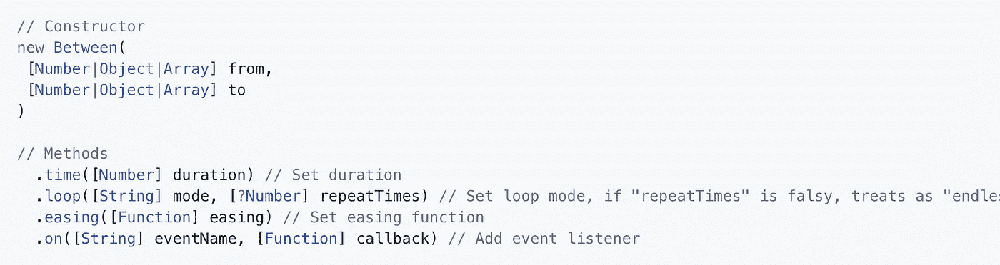
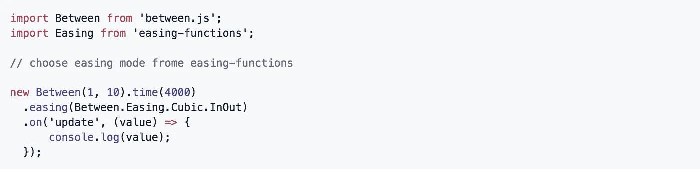
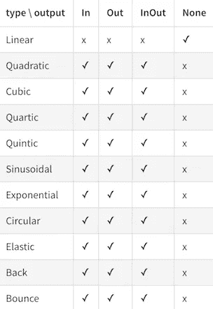
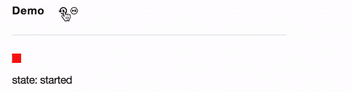
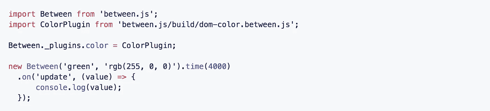

# 使用 Between.js 编写 Javascript 补间引擎

> 原文：<https://medium.com/hackernoon/writing-a-javascript-tweening-engine-between-js-b510a299c82c>

## 简短介绍

说实话，Javascript 生态系统里已经有成吨的补间引擎了，有很棒的(流行的)，比如 [**Tween.js**](https://github.com/tweenjs/tween.js/) 和[**GSAP**](https://greensock.com/) 。

两者都有优点和 CONS，因为我喜欢 Tween.js 的简单性和可访问性以及 GSAP 的性能/平滑。然而，网络在向前发展，图书馆需要升级以适应今天的情况。

一个月前，我决定尝试自己编写补间引擎的技巧，以下是我的做法…

# 准备和设置

每一个现代的库都需要被 Javascript 生态系统中的优秀工具所包围，比如林挺、单元测试、测试覆盖。理想情况下，我要么包括基准和更多的可视化例子，但我要说，在写这篇文章的时候，它们相当不完整。

以下是我在项目维护中使用过的优秀工具列表:

*   [**ava . js**](https://github.com/avajs/ava)**—**🚀未来派 JavaScript 测试运行程序****
*   ****[**伊斯坦布尔. js**](https://github.com/istanbuljs/nyc) —测试覆盖率分析工具****
*   ****[**XO**](https://github.com/xojs/xo)—JavaScript 幸福 style linter****

****开源库的每一行都应该经过测试，以遵循一定的规则，并最终成为一个伟大的软件，供数百万人进一步使用。这就是为什么我喜欢介绍这些工具，它们将帮助您自动化和保护您的开发工作流程。****

****对于远程运行测试/覆盖，我们使用 Travis CI，它在开源社区中被广泛使用。下面是它的样子:[https://travis-ci.org/sasha240100/between.js](https://travis-ci.org/sasha240100/between.js)****

# ****概念和 API****

****最重要也是最有趣的部分是 API 开发。从做研究开始，看看类似开源软件的现有实现，确保你真的需要创造一些新的东西🤔而不是使用优秀的、值得信赖的工具。****

****在我的例子中，我只是想要一个用 ES6 编写的带有中间件支持的 Tween.js 替代程序。也就是这个原因促使我在. js **之间写了一个 [**。**](https://github.com/sasha240100/between.js)******

****

**Standard Between.js API**

**一切就这么简单。是的，它看起来很像 Tween.js/GSAP，只是因为这个管道图案很棒。这没什么不好的。**

**那么 Tween.js 到底哪里出了问题*(不太好)*？对我(个人)来说，我会强调使用对象的必要性。唯一可以插值/补间的结构是对象。**

**在 *between.js* 中，我们决定对字面上的*一切*进行补间。这样你可以插入一个对象，数组，数字，甚至一个字符串(借助插件)。是的，比如你可以从`rgb(255, 0, 0)`过渡到`rgba(65, 255, 134, 0.5)`。**

**附注:…甚至可以转换成十六进制值，例如根据*color-hex.com 的说法，`#008B8B`是一种“青色 4”的颜色。***

**上面的魔术可以在 between.js 的*插件`dom-color.js`的帮助下完成。我们将在接近文章结尾时再次讨论这个话题。***

# **松开**

****

**在开发 between.js 的某一点上，我们认为制作一个强大的、使用简单的补间 API 会很棒。下面是一个基本的放松代码示例:**

****

**Basic easing usage example**

****

**Easing in action**

**我们使用了一个[缓和函数](https://www.npmjs.com/package/easing-functions)包，并通过`Between.Easing`对象公开它的函数。因此，如果你介意扩展 easing 集合，请贡献给那个包，我们将在依赖关系中更新它的版本，以包括更多种类的 easing。目前我们支持 31 种放松模式:**

****

**Easing — functions modes**

**根据您的技能和经验，easing API 可能是您在未来项目中可以尝试的强大工具，例如对象变换过渡:**

****

**Easing animation transition example.**

**几天前，一个 github 贡献者增加了另一个特性——“暂停补间”`pause()`、`play()`、`isPaused()`方法。这些可用于与补间动画进行动态交互，并扩展视频游戏和创意网站使用的 *between.js* 可能性。下面是如何使用它的一个简单示例:**

****

**Pausing/resuming a tween**

# **颜色插件**

**当 Between.js 差不多准备好的时候，我们决定开发一个额外的颜色插件，提供一个舒适的颜色变化方式。**

**插件支持的颜色类型:**

*   **RGB 或 RGBA**
*   **十六进制**
*   **high-speedlaunch 高速快艇**
*   **关键词(红色、绿色…)**

****

**Node/Webpack color plugin usage example**

****

**Color plugin in action**

**颜色插件的内部是什么？**

**我们使用了以下依赖关系:**

1.  **[颜色](https://www.npmjs.com/package/color)——一个漂亮的库，用于`initialize()`函数中的颜色转换**

> **JavaScript 库，用于不可变的颜色转换和操作，支持 CSS 颜色字符串。**

**2.[颜色字符串](https://www.npmjs.com/package/color-string) —我们用它来检查一个字符串是否是颜色关键字。要么是上面一个库的依赖。**

> **用于解析和生成 CSS 颜色字符串的库。**

** [## 彩色字符串

### CSS 颜色字符串的解析器和生成器

www.npmjs.com](https://www.npmjs.com/package/color-string) 

3. [lerp](https://www.npmjs.com/package/lerp) —一个简洁的线性插值函数，由[文档](https://medium.com/u/e455eba64dcd#color)中找到。

## 总而言之…

…对于我们来说，创造新的东西、重新设计旧的黄金模式以跟随现代 ES6 趋势并通过插件支持集成扩展功能是一次有趣的经历。

我们真的希望你尝试 *between.js* 行动起来，加入我们的社区来支持开源软件开发，所以请[开一期新的](https://github.com/sasha240100/between.js/issues)，提出你的想法。我们很快会推出更多的插件！** 

**非常感谢[亚历山大·巴甫洛夫·科尔尼延科](https://medium.com/u/83f51b9ec61?source=post_page-----b510a299c82c--------------------------------)的合作，他帮助我准备了这篇文章，并开发了一些很酷的视觉演示。**