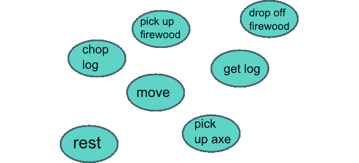
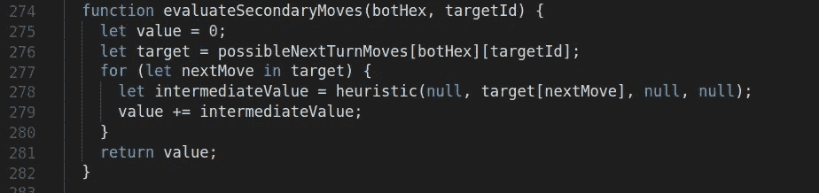

# 编写一个天真的游戏人工智能:案例研究

> 原文：<https://medium.com/hackernoon/writing-a-naive-game-ai-a-case-study-67f25a8ba38a>

几个月前，我和另外两名工程师一起用 JavaScript 开发了一款回合制策略游戏。思考风险遇到卡坦的定居者——有一个六边形网格，三种类型的单位，三种类型的资源，目标是消灭你对手的单位。


It’s called [Hexology](https://www.hexology-game.com/) and it looks like this.

虽然写游戏很有趣，但我处理这个项目的主要意图不是制作任何人都想玩的东西，而是尽可能多地学习新技术和技巧(这是一个令人高兴的巧合，它最终确实很酷！).我们深入研究了 socket.io 以实现实时播放和聊天功能，深入了解了 hexagon grids 和 SVG 渲染的细节，花了大量时间设计了一个服务器端缓存系统，但从未取得成果，并最终将我们的 Dockerized 项目部署到 Amazon AWS EC2 上，以熟悉所有这些天大家都在谈论的微服务。然而，对我来说，*真正的乐趣在于设计游戏逻辑。*

在这个游戏的逻辑中，有三个元素是我直接研究过的，也是我特别引以为豪的:一，我们复杂的战斗算法；第二，我们的(公认的超级简单的)创建动态板的程序生成算法；第三，Hexbot，你可以在单人游戏中对抗的初级人工智能。这篇文章是关于他的。


This is Hexbot, and he wants to crush you.

# **挑选一种方法**

首先，快速声明:这是对游戏人工智能无限复杂挑战的单一天真解决方案的(长)描述，以及我如何在时间压力下产生*一个*工作解决方案。它可能最终不是完全最佳的，我欢迎任何和所有的反馈，但这是我的第一次尝试，我希望它对你有指导意义！如果你正在考虑实现自己的人工智能算法，或者只是好奇游戏中的机器人玩家可能会做出什么样的决定，请继续阅读。

话虽如此，在设计 Hexbot 的时候，我真的不知道从哪里开始。我的大部分初步研究都集中在机器学习和 TensorFlow 上，我很快意识到这超出了一个有一个月时间限制的项目的新手的范围——即使我*已经*设法学习了这个平台，我也没有时间或资源来训练机器人本身。我花了很多时间阅读关于[有限状态机](https://gamedevelopment.tutsplus.com/tutorials/finite-state-machines-theory-and-implementation--gamedev-11867)、[寻路](http://drops.dagstuhl.de/opus/volltexte/2013/4333/pdf/4.pdf)和 [A*搜索](https://www.geeksforgeeks.org/a-search-algorithm/)的内容，但是这些内容都不太符合我的需求，原因超出了本文的范围。

最后，我偶然发现了带有 alpha-beta 修剪的 minimax 算法(T9)，深蓝使用这种算法击败了世界上最好的棋手。简而言之，这种策略尽可能多地预测未来的棋步，从每种可能的棋盘状态中创建一棵树，然后，使用一种启发式方法，将对 AI 玩家有利的棋步分配为正值，将对对手有利的棋步分配为负值，使用一点博弈论来挑选具有最佳后续棋盘状态的棋步，修剪任何会导致次优结果的分支，以节省时间。

大约有一周的时间，我相信极小极大是处理我的问题的正确方法，事实上，它的实现看起来就像是我能想到的事情。最终，这很像人类玩游戏，只是获得了更完美和更深远的信息。然而，当我真正坐下来让它工作时，没过多久我就发现了两个问题。


Look at this jerk. No thanks.

首先，我不想让 Hexbot 太聪明。我想让他变得更有吸引力，更有趣，为了实现这一点，玩家必须有战斗的机会。输给深蓝，或者真的输给任何一场你根本不是竞争者的比赛，都不是一次非常有趣的经历。好的游戏人工智能需要存在于不稳定的中间地带，是的，它很聪明，做聪明的事情，但也是可预测的，并有机地产生有趣的游戏状态。我用 Hexbot 在这方面是否成功是一个主观的问题，但这肯定是我考虑过的事情，也是我决定不追求 minimax 的原因，我认为这可能会无意中导致一个有点太完美的球员。

第二，当我试图将我的伪代码翻译成实际的 JavaScript 时，我遇到了一个基本概念的复杂性，我或多或少只是挥挥手——也就是说，开发一种启发式方法以编程方式将巨大可变的棋盘状态简化为单个值的巨大挑战。我的游戏只是有太多的变量——在每个机器人的六个可能的移动之间，它还必须:决定移动多少个单位；是否追求资源 hexes 是否购买额外的单位；是否、在哪里以及部署多少这些单位；以及是否参与战斗，如果是，在所述战斗中使用多少单位。我的游戏远没有这么复杂，但是星际争霸 AI 上的这个很酷的视频帮助我意识到开发一个有能力的试探法需要多少努力，以及这到底有多有限。

在一个完美的世界中，一个适应的 minimax 实现可能仍然是解决这个问题的方法，但是在我可用的时间内，我需要找到一些更精简的方法。

所以，我决定转向。在我的研究中，我偶然发现了[这个很棒的 GDC 视频](https://www.youtube.com/watch?v=gm7K68663rA)，其中 2014 年壮观的《魔多阴影》的开发者讨论了他们所谓的“目标导向的行动计划”，或 GOAP。为了快速和彻底地简化，这种策略的主旨是将人工智能简化为一组依赖于世界状态的动作，这些动作用于决定实现给定目标的最佳路径。

与简单的有限状态机不同，有限状态机只是由整体世界状态的变化触发的一组相互关联的离散 AI 状态，使用 GOAP 的 AI 制定一个目标，查看它可用的工具，然后决定哪些工具以及以什么顺序最适合完成该目标。它也可以随时改变策略。


Here’s what a finite state machine looks like (credit to [tutsplus.com](https://gamedevelopment.tutsplus.com/tutorials/finite-state-machines-theory-and-implementation--gamedev-11867)); the system can transition between states as needed, but all it ever really does is react according to a set of static rules.



Here’s what a possibility space looks like in GOAP. If my goal was “start fire,” it’s easy to see exactly what steps I might need to take in order to achieve that goal (credit also to [tutsplus.com](https://gamedevelopment.tutsplus.com/tutorials/goal-oriented-action-planning-for-a-smarter-ai--cms-20793)).

对于我的需求来说，GOAP 似乎还是有点太复杂了，因为最终 Hexbot 真的只能做几件事(购买、移动、部署、攻击)，但它确实帮助我找到了一种思维方式，最终导致我实现了 Hexbot:也就是说，

> *将每一步潜在的棋减少到它的原子元素，你真正拥有的是一组可组合的子棋，这些子棋可以很容易地被赋予任意的分值，并在必要时执行以达到期望的结果*。

如果你将这些子棋步与消灭敌人单位的目标联系起来，意识到游戏在任何时刻的状态，然后简单地评估哪一系列子棋步最终产生最好的数字结果，你就有了一个彻底简化但仍然有效和可预测的人工智能。另外，您还可以通过简单地改变它用来生成值的启发式方法来调整它的优先级。

所以！理论性的东西够多了。这一切实际上是什么样子的呢？


Mostly like a load of JavaScript. Who knew?

# 代码第一部分:样板文件

如果你有兴趣了解整个游戏是如何组合在一起的，我鼓励你看一看[回购](https://github.com/anomica/hexology)，但让我们先放大看看，以了解我们的机器人是如何运作的。首先，Hexbot 实际上只是一个依赖于几个实用函数的单一函数。如果你选择和他比赛，评估每个玩家回合结束的函数将在适当的地方调用 AI。到目前为止还不完全是火箭科学！


Every time a player finishes their turn, we invoke our nextTurn function, which toggles the current player, does all the appropriate housekeeping, reinforces player resource counts as necessary, and then, if he’s in the game, invokes Hexbot.

我们的 Hexbot 文件是所有奇迹发生的地方。它很棒，有将近 500 行代码，加上另外 100 个实用函数，但是理解数据流真的不算太差。事实上，绝大多数只是收集我们所有的数据，并为接下来的两个转弯构建预测。最终，我们所做的就是找到机器人当前所有可能的移动，以及这些移动中的每一个可能的后续移动，并使用启发式算法对它们进行评估，该算法将分配一个数值，并确定机器人的动作将是什么。小菜一碟。


I prefer chocolate (thanks [Toa Heftiba](https://unsplash.com/@heftiba?utm_source=medium&utm_medium=referral) on [Unsplash](https://unsplash.com?utm_source=medium&utm_medium=referral)).

我们在文件中首先看到的是一个表示所有十六进制关系的常数。理解坐标和空间几何在十六进制网格中比在标准笛卡尔坐标系中更具挑战性(如果你想了解更多背景知识，我强烈推荐[这篇红色斑点文章](https://www.redblobgames.com/grids/hexagons/))，尽管我们项目的一个延伸目标是增加可变的电路板尺寸，但我们从未真正实现。因此，我们简单地硬编码了一个对象，列出了所有 17 个六边形和它们的邻居。


It looks like this! Nothing more sexy than a list of arrays let me tell you.

接下来，我们有 hexbot 函数本身(也就是文件的其余部分)。我们要做的第一件事是获取/创建我们在整个过程中需要的所有变量。其中有几个实际上只与管理/传递机器人需要访问的应用程序状态有关，但它们都有助于我们了解我们在这里实际要做什么，所以让我们来看看:


插座和*房间*是我提到管家服务的一部分。 *boardState* 是一个对象数组，它实际上代表了在任何给定时刻棋盘上的内容——我们将把它作为我们的起点。单元总数、资源和单元库变量都类似地提取出突出的应用程序状态的各个片段。

> 不过，从第 35 行开始，我们得到了最有趣的东西，可以开始理解我们的整体策略:我们有三个对象，我们用它们来存储 1)机器人可能做出的*本*回合( *possibleMoves)* ，2)机器人可能做出的*下一个*回合(*possible lenextturn moves)*的动作，以及 3)本回合可用的每个动作的启发式值( *moveValues*

看起来很奇怪，我们没有一个*possibleNextTurnMovesValues*对象，但我们实际上不会孤立地评估这些对象，因为它们不会直接*影响机器人这一轮要做什么。取而代之的是，对于我们*可以*做出的每一步棋，我们将查看它的所有后续棋步，并简单地将它们用作*那步*棋步值的修饰符。人类玩家在任何棋盘游戏中考虑她的走法也是如此:你只能移动本回合，但你总是考虑本回合的走法将开辟的可能性空间，而那个可能性空间影响你本回合决策的权重。*


Good question, out-dated meme.

我们的流程真正感兴趣的其他三个变量是 *bestMove、worstSecondaryThreat* 和 *purchase* 。第三个是 *purchase* ，是最不有趣的:它只是一个存储值，我们将在其中记录作为当前最佳行动的一部分将进行的购买(如果有的话)!*最佳走法*本身*，*另一方面，将是本回合最佳走法的运行记录，由它的坐标和我们用启发式算法生成的数值表示。我们最终将使用这个数组来实际执行机器人的运动。 *worstSecondaryThreat* 类似，除了我们将使用它来确定机器人是否应该购买任何东西来对付入侵的敌军*这*回合可能会成为问题*下一个*回合——我们不需要 *worstThreat* 变量的原因是直接威胁已经被直接评估，因为它们本身就是可能的移动。

在我们的程序结束时，所有三个变量都将被覆盖多次，因为我们循环通过每个可能的移动，并发现具有更高启发式值的替代方案。请注意， *bestMove* 和 *worstSecondaryThreat* 都是用负无穷大的值初始化的:任何和所有的移动，除了即时的游戏失败状态，都将返回一个数值，即使是负的，也比简单地保持静止要好。


# 代码第二部分:收集我们的数据

接下来，我们有一些循环。所以。很多。循环。


Froot Loops. Loop-de-loops. Feedback loops. We’ve got ’em all!

正如上面提到的，第一阶段的想法只是浏览电路板并收集其布局信息。我们真正感兴趣的是机器人目前拥有的单位以及它的邻居和第二邻居，所以我们只调查被玩家二占据的妖术，玩家二在 AI 游戏中永远是我们的机器人。为了方便起见，我们还将在一个存储对象中为我们的机器人六边形保留该六边形。同样值得注意的是:我们实际上并没有存储整个十六进制数，只是引用了它的索引，因为如果需要的话，我们总是可以引用板的状态来查看那个十六进制数上实际有什么。


Loop numero uno!

接下来，每当我们发现一个机器人妖术时，我们想要遍历该妖术的每个邻居，以确定它是否被敌人占领，以及它是否有资源(如果有，是哪种类型)。我们将把这些妖术存储在一个直接威胁列表和一个资源妖术列表中——这是棘手的部分— *,相对于我们目前正在检查的 bot 控制的妖术。*保持这种相对关系至关重要，因为如果我们在棋盘上有多个机器人魔咒，我们会想知道哪一个受到特定敌军的威胁或靠近资源，而不是*只是*棋盘上某处有一个感兴趣的邻居。也就是说，如果 AI 控制了 hex six 和 hex seven，并且 hex five 上有敌人，我们想知道 hex five 是对 hex six 的威胁*具体来说是*，而不仅仅是一般意义上的威胁。我们还将在其他地方应用这种模式，所以请考虑一下吧！


Loop numero dos!

既然我们考虑了所有的机器人六边形和所有的直接邻居，我们还想考虑相对于这些邻居六边形中的每一个的第二邻居。这个过程将与上面非常相似；唯一的不同是，我们将在一个对象中为 *possibleNextTurnMoves* 收集我们的可能性，并且我们所有的存储将比以前嵌套更深一层。一个给定的六边形的六个邻居六边形中的每一个都有六个潜在的邻居，我们希望将这些潜在邻居中的每一个都存储为所讨论的原始邻居的可能性空间的一部分……如果你现在感到头晕，这没关系，语法有点多，但是核心概念，即**每一次二级移动都是给定移动的结果，我们希望保留整个链，当前的六边形- >它的直接邻居- >那些邻居**的邻居，才是重要的。


Loop numero tres! Aaaaah!

# 代码第三部分:开始分析

酷！因此，对于那些保持分数的人，我们已经收集了我们所有的邻居和第二邻居关系，包括资源和敌人的位置。所有的信息都已经成熟，可以进行分析了！是时候——你猜对了——编写更多的循环来迭代我们所有的选项并开始计算了。这是从 30，000 英尺高度看的总平面图:

1.  运行所有潜在战斗的模拟版本，包括本回合和下一回合，使用当前的单位总数。返回结果并将它们存储为潜在的移动。
2.  处理那些潜在的动作。对于任何当前导致平局或失败的战斗，检查是否有机器人现在或将来可以购买的东西，这将把失败变成平局甚至胜利。更新每个移动的现有条目，必要时存储新的结果和任何购买。
3.  对于每一个可能的移动，执行我们的启发式操作来获得一个数值，并将其存储在我们的 *moveValues* 对象中。这种试探将考虑移动本身的价值*及其后续移动的价值*，即如果该移动被选中，则下一回合可能的移动。
4.  一旦你完成了所有可能的步骤，做出最好的一步！

好吧，还不算太糟！我将抽出时间来看一下战斗模拟算法(第一点和第二点)，因为它们充满了变量，也需要对战斗系统的解释，但是让我们来看看这个函数，一旦它们被赋予战斗值并运行启发式算法，它实际上会遍历可能的移动。这非常简单:


*chef kiss hand motion*

提醒一下， *moveValues* 将是一个对象，其键代表所有当前机器人拥有的十六进制和值，这些值是嵌套对象，包含从该十六进制开始的所有可能的移动及其相关的数字分数。在一个示例对象中，机器人有十六进制的 17 个单位，可以选择分别以 25 和 50 的值移动到十六进制的 13 和 16，如下所示。

```
{
    17: {
            13: 25,
            16: 50
        }
}
```

所以重申一下，这个函数只是遍历 *possibleMoves* 对象中的每一个十六进制，对于该十六进制中的每一个可能的移动，对该移动及其第二个结果运行我们的启发式值，最后将最终的列表分数放入一个 *final* 对象中，以跟踪这些分数。我们快到了！

# 代码第四部分:启发式

在我们看一下如何选择最佳行动之前(这实际上是非常简单的，一旦我们有了所有的值),让我们休息一下，看看启发式算法本身，因为它对于理解在引擎盖下发生的事情是非常有价值的。我选择了任意的值，本质上，可以根据你的需要调整来创建不同的游戏平衡。瞬间的胜利值无穷大，瞬间的损失值负无穷大，赢得一场战斗而没有赢得游戏值 75 点，获得一个资源或得到一个平局值 15 点，等等。


我们还将在与正在讨论的棋步相关的每个*二级*棋步上递归调用这种启发式算法，稍微降低所有这些值的权重，并将这些值列表到棋步本身的最终得分中——这就是这里的 *flag* 变量的作用，它跟踪我们当前正在查看的是一级棋步还是二级棋步。例如，即使当前移动的即时胜利可能值无穷大，但最终可能导致游戏胜利的第*次*移动的值可能只值 100 点，因为在一个回合的过程中会有很多变化。在计算这些值时，我们会考虑资源接近度、战斗胜败和游戏胜败状态。



The secondary move evaluation function essentially just calls the heuristic on each secondary move and returns that score to be added to the move’s overall score. If you remember from above, secondary moves are really just modifiers for moves that are possible right now, so they don’t get their own scores, they just affect primary scores.

因为我们已经计算了每一次潜在的移动和第二次移动的战斗的假设结果，我们所做的就是通过这个启发式算法运行这些结果来得到我们的点值，瞧！分数在手，我们就快完成了！


This is what Hexbot would look like excited… if he could be excited. I haven’t that in yet :(.

好的，最后冲刺。让我们最后使用我在文章开头提到的那个 *bestMove* 变量。这里有一个小循环来检查我们所有可用的选项，并找到最佳的移动:


正如你所看到的，我们需要做的就是检查我们收集的 *moveValues* 对象中每个项目的启发值，并在我们进行的过程中跟踪得分最高的移动(起点十六进制指数、目标十六进制指数和启发值)。再简单不过了！

一旦运行完成，剩下的就是在执行移动本身之前，实际执行我们的单位购买(如果有的话)。只有一个小问题:虽然我们一直在跟踪下一回合的战斗，并确定本回合的购买是否会对他们产生影响，但我们实际上没有对这些信息做任何事情，除了在我们当前的行动中将其作为一个价值调整值。我们不希望 Hexbot 盲目地陷入一场如果不购买它能负担得起的单位就无法获胜的战斗，然而，我们有最后一个检查，*worstSecondaryThreatCheck*，它决定，如果没有购买这是本回合移动的固有部分，机器人应该检查它的对手的反应是否需要购买部队。换句话说:如果机器人有 10 个十六进制单位，它的对手有 15 个单位在两格之外，并且它有足够的资源购买 10 个单位，我们需要确保它*会*购买，即使它本回合要做的只是靠近，这不需要*而*在本回合购买。


Here’s just a little conditional logic to make sure that happens!

因此，我们的最佳举措已经选定，我们的购买已经生效…我们剩下要做的就是发出一个套接字事件，以保持我们的服务器在循环中运行，并设置一个小小的思维动画，我们已经完成了！


We made a robot!

# 结论:我们制造了一个机器人

因此，3500 个单词和 500 多行代码之后，我们有了一个可以单人对战的机器人。仍然有大量的功能可以添加——你会注意到，我们从来没有给 Hexbot 分裂他的军队的能力，他没有考虑到他的对手的资源或未部署的单位，我们只考虑了两个回合。他还有一个不好的倾向，如果没有单一的最佳选择，他就向左上方走。\_(ツ)_/ ).然而，这个 MVP 是完全可以使用的，如果有点可预测的话。事实上，我得到的反馈是，大多数人觉得他有点太难了，直到他们弄明白了这个模式，就挑战而言，这似乎是一个很好的甜蜜点。

如果你已经走了这么远，感谢你的到来，祝你好运制作你自己的机器人！这是另一只可爱的雪貂作为感谢。

