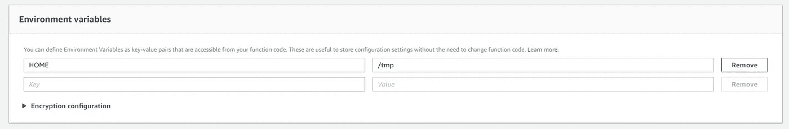
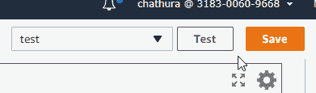
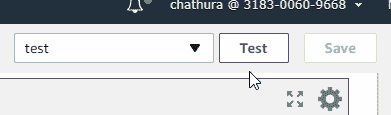

# 编写自给自足的 AWS Lambda 函数

> 原文：<https://medium.com/hackernoon/writing-a-self-sufficient-aws-lambda-function-da6c0586f48c>

如果你已经浏览了 [SLAppForge 的新闻文章](https://globenewswire.com/news-release/2018/02/06/1333797/0/en/SLAppForge-Announces-Sigma-a-Cloud-IDE-for-Serverless-Computing.html)和博客，你可能已经知道来自[斯里兰卡](http://srilanka.travel)的[一群工程师](http://slappforge.com)正在努力使无服务器开发者的生活变得更加容易。

当我们在试验各种 AWS 服务时，我们尝试了很多疯狂的事情，让适马 IDE 成为其他无服务器开发者最好的朋友。

如果你已经使用 AWS 控制台编写了 lambda 函数，你可能已经注意到，在 AWS 控制台中有一个内置的 IDE，你可以在浏览器中编写解释语言并立即部署。在 NodeJs 的情况下，当您想要使用第三方库时，这个功能就变得没有用了。(我们已经在适马解决了这个问题😎).因此，在我们使用适马之前，剩下的唯一选择是，在您的本地机器上编写代码，并将其上传为带有所需依赖项(node_modules)的 ZIP 文件。

然而，下面这段代码可以在一定程度上解决这个问题。

在这段代码中，第一步是将代码本身作为字符串读取，并查找所需的依赖项！

Snake eating itself 🤢

> 如果你还不知道，对于每个 lambda 函数，你会在 lambda 容器的/tmp 位置得到一个**512 MB 的非持久空间。**

下一步是，在所有已识别的依赖项上执行 *npm install* ，以生成所需的 **node_modules** 文件夹。

由于， */tmp* 是 Lambda 容器中唯一可写的文件夹，我们必须如下使用[前缀](https://docs.npmjs.com/misc/config#prefix)标志。

同时，您必须将 Lambda 容器的 HOME 环境变量设置为/tmp。

Setting environment variables in Lambda

在下载完所有依赖项后，我们将 *require* 函数的引用改为我们自己的引用，这样就将 */tmp/node_modules/* 追加到所有依赖项中。

现在，当您第一次为这个特定的 lambda 生成容器时，它会将所需的节点模块下载到 */tmp/node_modules* 目录。这将在第一次运行中花费相当多的时间(无论如何，冷启动时间在 lambda 中是个问题，但是这种方法花费的时间甚至更多)，从第二次开始(仅仅对于这个特定的容器)，执行时间将是正常的😊。

First Run (Cold Start) — Billed Duration: 1100 ms

A warm run 🔥 — Billed Duration: 300 ms

显然这不是一个生产就绪的解决方案，但这可能为解决[适马](https://sigma.slappforge.com/)的燃眉之急铺平道路(希望如此)。一旦我们将该功能添加到 [Sigma](https://sigma.slappforge.com/) 🧐.中，我们会让您知道我们解决了什么问题你一定会喜欢这个功能的。敬请期待&希望你喜欢！

## 更新(2018/02/24)

非常感谢埃里克抓住这个机会😊

基于这个建议，我们可以如下摆脱最初的代码解析循环。这段代码在需要的时候动态加载依赖项，仍然保持我们的 lambda 函数自给自足！！

然而，对于这个特殊的例子，您几乎不会注意到冷启动时间和运行时间的差异。

但是在下面的例子中这是显而易见的。

## 两种方法的区别

这两种方法在启动时和运行时表现不同。

在第一种方法中，由于函数预加载(下载)了所有需要的依赖项，运行时会经历一个类似的环境，就好像你已经将 lambda 函数上传为一个 ZIP 文件(带有 *node_modules* 目录)。

在第二种方法中，启动会更快，运行时间会花一些时间(只有在第一次，它遇到一个独特的依赖关系)，因为它必须下载依赖关系。

## 更新(2018/04/26)

基于上述概念，实现了适马 IDE 的测试框架。有关更多信息，

 [## 我们如何简化无服务器测试

### 如果这不是你第一次听说无服务器和 AWS Lambda，你可能已经看过橙色测试…

hackernoon.com](https://hackernoon.com/how-we-streamlined-serverless-testing-8f5e0bbdc7e5) 

# 行动呼吁

*   **拍手。**欣赏并让别人发现这篇文章。
*   **评论。**分享你对这篇文章的看法。
*   跟我来。[chat hura wid anage](/@cwidanage)**接收类似文章的更新。**
*   **保持联系。 [领英](https://www.linkedin.com/in/cwidanage/)，[推特](https://twitter.com/cwidanage)**