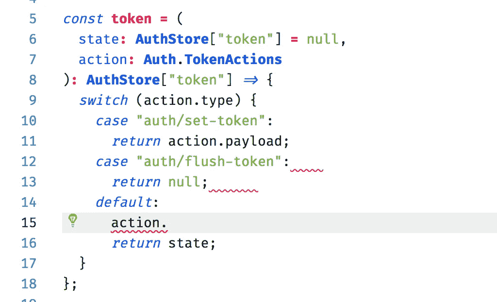

# 用 TypeScript 编写更好的 Redux 代码

> 原文：<https://medium.com/hackernoon/writing-better-reduxs-code-with-typescript-b7a3c1209bca>

如果使用得当，打字功能可以帮助我们写出更好的代码。这篇文章是关于如何使用 TypeScript 类型系统和 Redux 来创建完全类型化的状态管理存储。

> 我假设您已经知道 redux，可能还知道一点 TypeScript。我感谢任何投入，我只是最近才尝试实现这一点，我愿意接受任何改进。这是一篇非常固执己见和主观的文章。

我以前用 JS 写 Redux，然后把它的动作和类型定义为常量。对我来说，看到这样的事情并不稀奇。

上面代码的问题是，“AUTH_TYPES”不能作为一个整体来更改，但这可能会发生。

我们可以通过把这些常数变成常数来解决这个问题。

现在我们不必担心意外地(或故意地)改变动作类型常量。

现在我们的减速器可以参考开关盒上的那些常数了，大家都很开心！

现在假设我们添加了另一个动作类型，但是我们忘记了在依赖于它的某个 reducer 上处理它。嗯，别担心，我们有人保持系统每 108 分钟运行一次。

即使忘记添加动作类型处理程序的可能性很低(我的意思是你决定添加动作类型的时候也是你必须添加其处理程序的时候)，我们将看到 TypeScript 如何帮助我们确保所有的动作类型都得到正确处理。

我个人认为，当使用 Redux 时，我们必须编写的样板文件数量是巨大的，当维护巨大的样板文件代码时，我们可能会以大量的不一致结束(多个动作类型，reducer 处理错误的动作类型)。这就是 TypeScript 的用武之地(不过，我并不是说您不会再编写样板代码)。

# Redux，见打字稿

现在，根据上面的代码，我们可以看到我们有这些问题:

1.  动作类型常量很难维护。
2.  我们必须编写许多动作创建器来包装那些动作类型常量。
3.  可能有不一致的地方。
4.  我们可能会忘记在我们的 reducers 上处理新的动作类型。

你可能不会遇到所有这些问题，我只遇到了第 1、2、3 和 4 个问题(顺便说一下)。

现在，让我们试着解决这些问题。

## 问题#1 —使用类型脚本类型而不是常量

现在，即使我正在使用 TypeScript 和 Redux，我过去也是编写与上面相同的代码，在上面我将我的动作类型定义为常量。现在，我没有那样做，而是尝试扔掉那些类型常量，而使用 TypeScript 类型。

我们将接口 AuthStore 定义为我们的存储模式，这意味着我们的存储看起来就是这样。

下面是我们如何定义动作类型常量。我们使用 TypeScript 接口来实际定义动作的外观，而不是仅仅将动作类型名称作为字符串常量。

现在你可能想知道，什么是 PayloadedAction 和 Action ？这是一个简单的界面，看起来像这样:

因此，SetTokenAction 实际上会是这样的:

而 FlushTokenAction 只是一个没有任何负载的动作。

我们分开创建 Action 和 PayloadedAction 的原因是，我们可以有一个正确类型的 Action 创建者。你会在下面读到更多。

现在我们的常量被定义为一个类型，我们可以把它们称为它的类型。

等等，但是我们把常量写成了一个字符串！如果我们输错了怎么办？嗯，你不能，TypeScript 检查并确保那里只写了“auth/set-token”或“auth/flush-token”。


如果你使用的是 Visual Studio 代码，它会告诉你它在那里接受什么字符串常量。实际字符串常量作为常量！

现在我们确信，reducer 将准确地处理我们为 TokenActions 定义的类型。AuthStore["token"]的使用也确保了 reducer 的返回类型与我们的存储模式相匹配。

## 问题# 2——我们创建了自己的类型感知动作创建器

现在，我们仍然需要逐个定义动作创建者，但至少我们将创建一个动作创建者的创建者，它是类型感知的，并且与我们最初的接口定义相匹配。

这意味着 createPayloadedAction 应该接受 payloaded 操作类型定义，并且它将创建的类型和有效负载将与提供的类型定义相匹配。

createAction 也是一样的，只是没有有效负载。

上面的 setTokenAction 将变成如下所示的函数:

并且它是类型感知的，您将正确地获得代码完成。


如果您不喜欢定义一个动作创建者，您仍然可以通过在调用 dispatch 时提供其类型来调度一个类型感知的动作。

## 问题# 3——我们上面所做的解决了这个问题

当我们使用 TypeScript 来检查我们键入的所有内容时，不一致是可以避免的。

现在，每当缩减器接受一个新的动作时，我们必须定义动作的类型，然后我们必须更新缩减器，因为 TypeScript 检查所有的东西，我们将有很小的机会出现不一致。


如果类型没有作为 TokenActions 包含，我们将得到一个错误，如果返回类型不符合我们的模式，我们也将得到一个错误。开发过程中的错误是一种幸福，生产过程中的错误是一场爆炸。

## 问题# 4——已解决，TypeScript 检查您是否涵盖了所有开关情况

这里不需要做任何步骤，我们构建和键入代码的方式帮助我们避免了这个问题。

TypeScript 知道，在这里的默认情况下，所有的动作类型都已经被处理了，所以如果您尝试键入“action ”,然后打开代码完成，它不会提示您任何其他内容。这样，您就知道您处理了所有的代码案例(类型将变成 never)。



编辑:感谢[马修·德克雷](/@matt.dekrey?source=post_header_lockup)指出这一点:

虽然您的编辑器可能会告诉您操作的类型现在是 never，但是您可以创建一个实用函数来断言传递给该函数的任何内容都应该是 never 类型(当您处理所有案例时会发生这种情况)，如果您错过了一些案例，它实际上会导致一个错误。


如果你错过了一个案例，

```
[ts] Argument of type 'FlushTokenAction' is not assignable to parameter of type 'never'.
```

正如 Matthew 指出的，在 assertNever 内部抛出一个错误是可能的。然而，因为 Redux 将调用所有的 reducer，而不管它接收到什么动作类型，并让 reducer 决定它们是否应该对传递的动作做出反应，所以它将总是被调用，从而导致总是出现错误代码。

现在有一些 TypeScript 没有检查的东西，例如当我们的减速器上有重复的开关情况时:


但是，我们也可以使用 TSLint 来防止这种情况，启用该选项:

```
**"no-duplicate-switch-case"**: true
```

# 结论

TypeScript 类型系统是强大的，我们实际上可以删除那些 action 类型常量和那些无聊的 action creator 样板代码，这些代码实际上为我们提供了类型系统，帮助我们确保我们的代码是一致的。

本例中使用的代码可以在 https://github.com/adityapurwa/typescript-redux[的](https://github.com/adityapurwa/typescript-redux)查看

希望我们都从这篇文章中学到了一些东西！

阿迪蒂亚·普尔瓦