# 在时间压力下编写高质量的代码？

> 原文：<https://medium.com/hackernoon/writing-quality-code-under-time-pressure-62ebeb5f39c5>

## 这些黑客马拉松团队证明了这是可以做到的

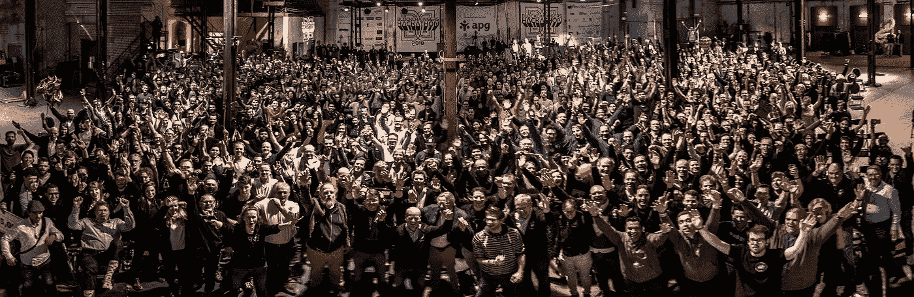

上周末，63 个团队聚集在荷兰格罗宁根市的旧糖厂，参加世界上最大的区块链黑客马拉松。以下是我们从这些团队学到的在时间压力下编写高质量代码的经验。

**质量压力下？**

任何人都可以编码。没有正式的进入标准。一颗好奇的心和一台笔记本电脑是你所需要的。

但是编写**质量代码**可能很难。每个编程问题都可以用许多不同的方法来解决，有些简单明了，有些杂乱无章。将最初的工作解决方案转化为可理解的、可适应的、可测试的、可重用的代码块需要时间和奉献。

但是大多数编程都是在时间压力下进行的。发布功能的压力，消灭 bug 的压力。用户、客户、测试人员、产品负责人和团队成员都在等着你关闭你的票证，继续前进。

随着时间的流逝，大多数团队发现自己在质量上妥协了。

**在质量上妥协**

当在质量上妥协是一个有意识的决定时，我们可以称之为*“技术债务”*:借一笔钱，通过未来的重构来偿还。

不管有没有意识到，当我们在代码质量上妥协时，我们很少在以后的阶段回头来修正我们的方式。相反，我们加倍下注。努力理解现有的代码，我们添加新的代码，甚至更混乱。[“破窗综合症”](https://blog.codinghorror.com/the-broken-window-theory/)也适用于软件。

于是开始了恶性循环。一旦质量下降超过临界点，恢复就变得不可行。没有时间，没有预算，不支持长时间的特性冻结来支持复杂的多 sprint 重构。

> “是的。我认为，一旦我们在质量上懈怠，我们就再也回不来了。我们将永远慢一些。”罗恩·杰弗里斯

最终，编码(太)快会弄巧成拙。低质量的代码更难维护和扩展。bug 需要更长的时间来发现和解决，并且经常重新出现。添加或更改功能变得困难且容易出错。

***能否保持速度和质量？***

是的。有一种方法可以在不影响质量的情况下快速编码。事实上，以可持续的速度编码的唯一方法是 **不牺牲**的质量。以下是实现这一目标的基本要素:

1.  代码质量完成的定义——一组清晰的指导方针，团队采用这些指导方针来决定代码何时达到足够高的质量，可以合并并继续前进。我们在 O'Reilly 的书 [***中定义了 10 条这样的指导方针，构建可维护的软件***](http://shop.oreilly.com/product/0636920049159.do) 。
2.  确定一段代码是否符合指南的即时反馈机制。并为我们提供关于如何快速恢复合规性的可操作信息。我们创建了这样一个反馈机制作为 GitHub 集成叫做 [***更好的代码 Hub***](https://www.sig.eu/better-code-hub/) 。

有了这些要素，质量缺陷就可以被标记出来，并被消灭在萌芽状态。在每一次提交中对质量的微小投资会在随后的所有提交中获得 100 倍的回报。保持机器无摩擦运转的一滴油。

***全球最大的区块链黑客马拉松*** 质量码

说到编码，最大的压力是黑客马拉松。在一两天内构建一个可工作的软件。你在计时。你一边走一边发明。想法是原始的，团队刚刚见面，解决方案仍未探索。

有一个巨大的诱惑，就是不回头地拼凑一些代码。

那么，还有什么比**全球最大的区块链黑客马拉松，**更好的机会来发现在时间的压力下是否能产生优质代码呢？上周末，63 支队伍聚集在荷兰格罗宁根市的旧糖厂参加 2018 年 Blockchaingers 黑客马拉松。周五中午开始编码，48 小时后周日中午结束。团队之间的竞争，与时间的赛跑，每个开发人员与头脑和机器的复杂性的激烈斗争。

> 为未来编码时，编写经得起未来考验的代码

**配套质量**

以下是我们为支持团队生产高质量代码所做的工作:

*   在黑客马拉松开始之前，我们给团队上了一堂关于代码质量的 **1 小时的大师课**，解释了相关性，介绍了基本概念，展示了从*构建可维护软件*编写经得起未来考验的代码的 **10 指南，并向他们展示了如何使用更好的 Code Hub 来关注这些指南的遵守情况。**

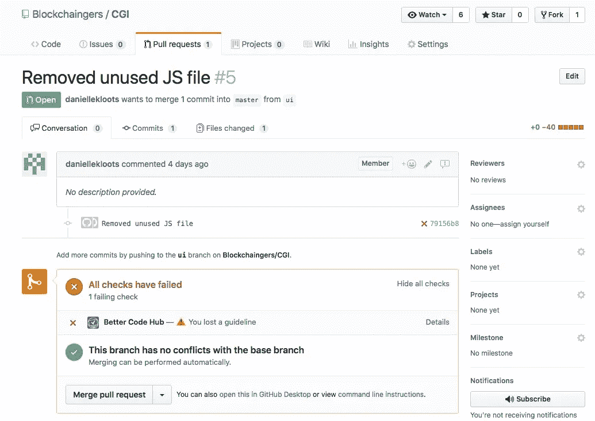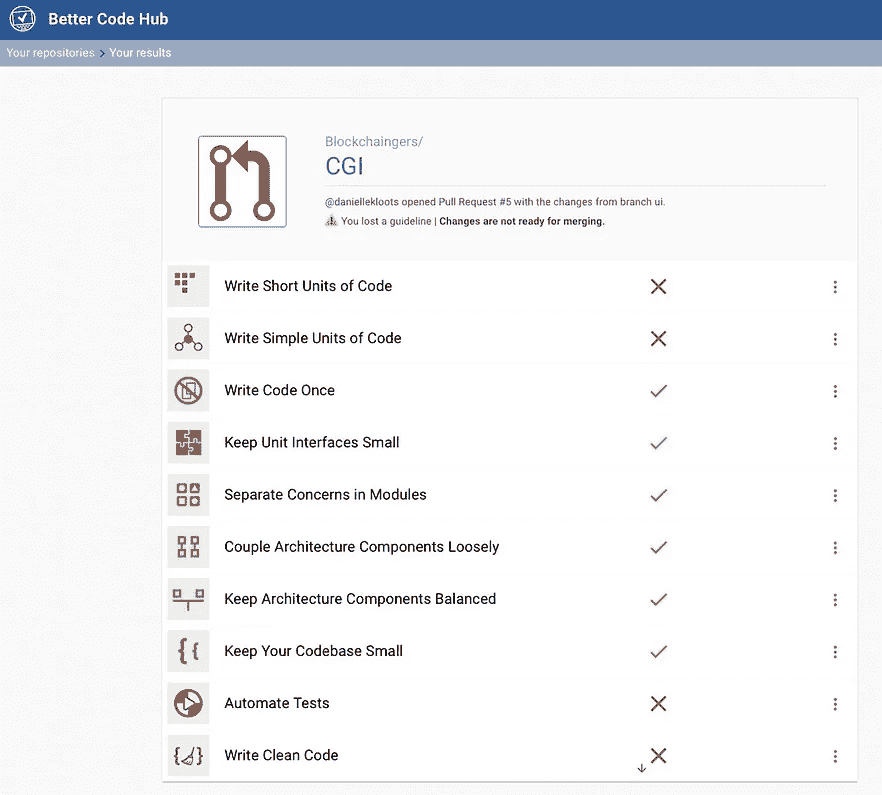

Each push and pull request is checked by **Better Code Hub** against the 10 guidelines for writing future-proof code from **Building Maintainable Software**. Feedback is provided in the GitHub conversation flow. When quality has decreased, click-through to detailed feedback per guidelines for concrete pointers on how to improve.

*   在黑客马拉松期间，Better Code Hub 提供了关于每次代码更改时对指南的影响的反馈。总的来说，大约有 4000 篇文章提供了这样的反馈。所有球队的当前得分都显示在一个巨大的屏幕上，让所有人都能看到。此外，**代码质量 Jedis** 亲自或通过 Slack 协助团队激活更好的代码中枢，询问有关其使用的问题，并就重构、设计模式、测试方法或任何其他与软件质量相关的主题进行辩论。

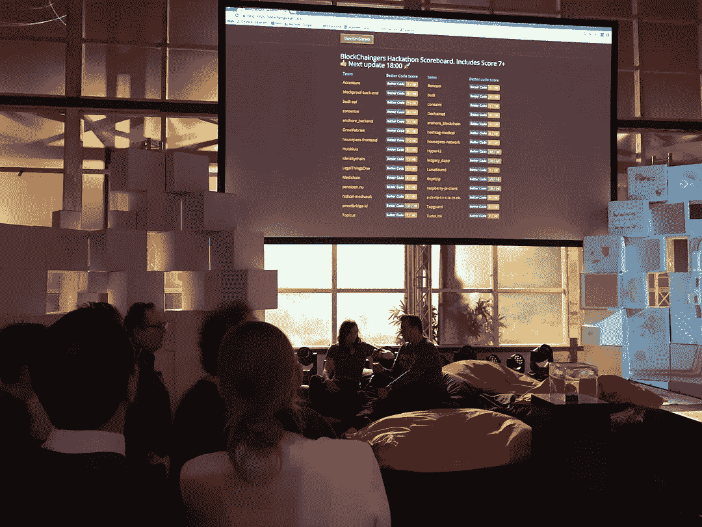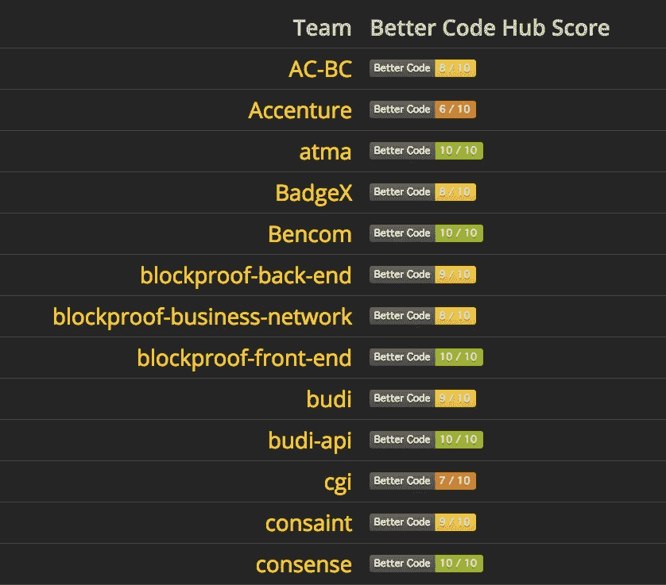

The current code quality scores for all teams were displayed as GitHub badges on a central scoreboard for all to see.

**质量结果**

所以现在“停止编码！”警报已经响起，获奖者已经获奖，黑客马拉松已经结束，尘埃落定。在代码质量方面取得了什么成就？

*   63 个团队中有 19 个团队交付了一个原型，得到了满分 10 分。哇！这些团队证明了在强烈的时间压力下交付高质量的代码是可能的！

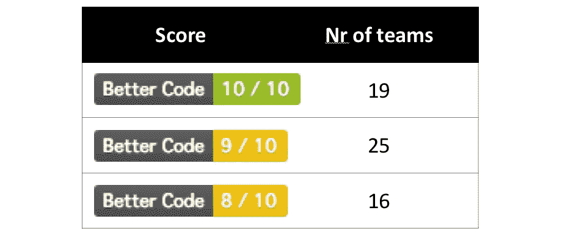

19 out of 63 teams (30%) delivered a prototype that scored 10 out of 10, proving that writing high-quality code under time pressure is possible.

*   在黑客马拉松期间，许多团队使用了来自 Better Code Hub 的反馈，不仅维持了他们最初的质量水平，还进行了质量改进。

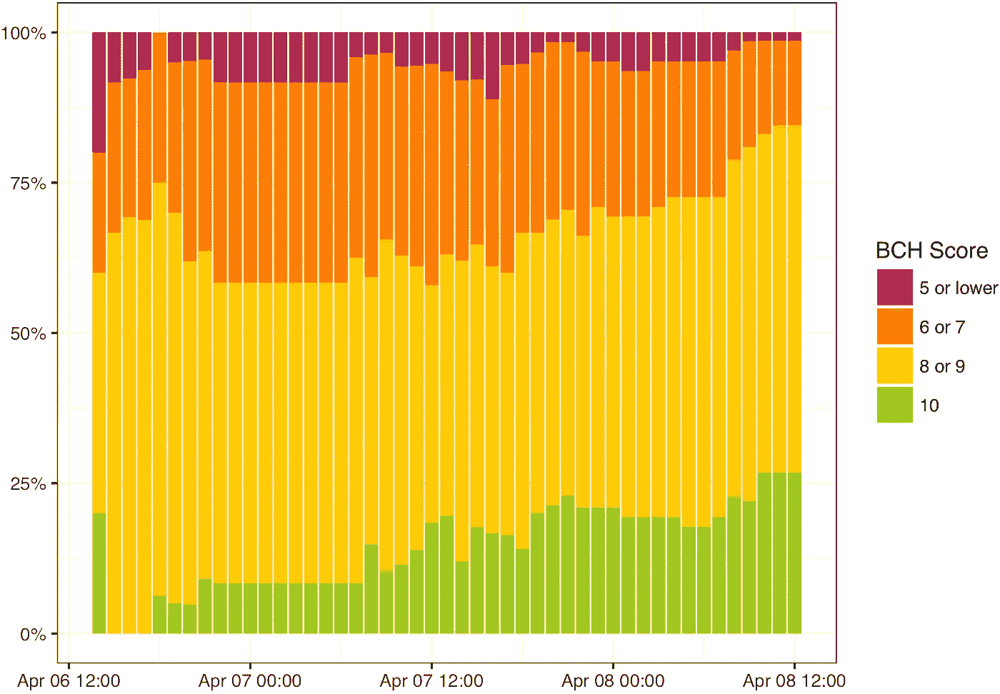

During the 48-hour hackathon, many teams were able to raise their scores above their initial level.

*   交付高质量的代码是有趣且值得的。看看这些团队如何在他们的影响力拉票上炫耀他们的分数！

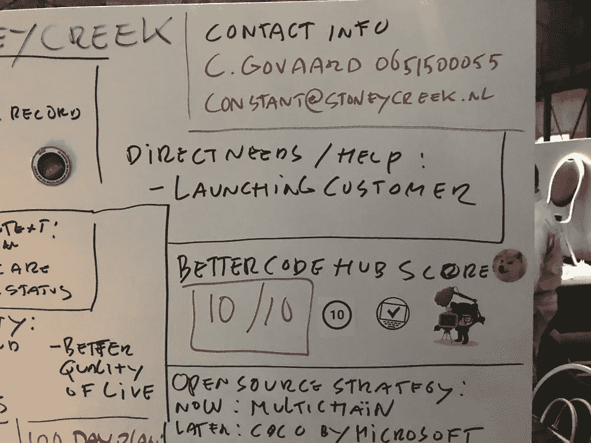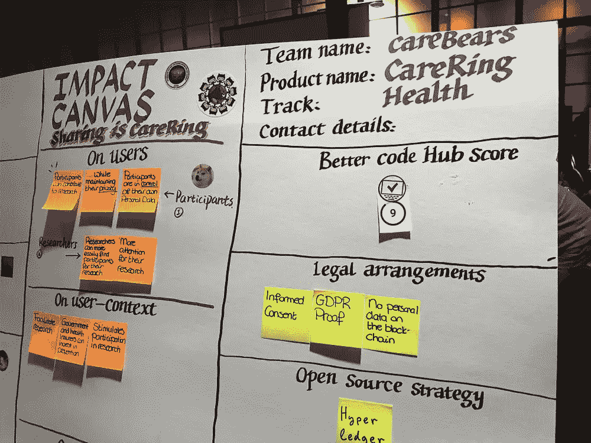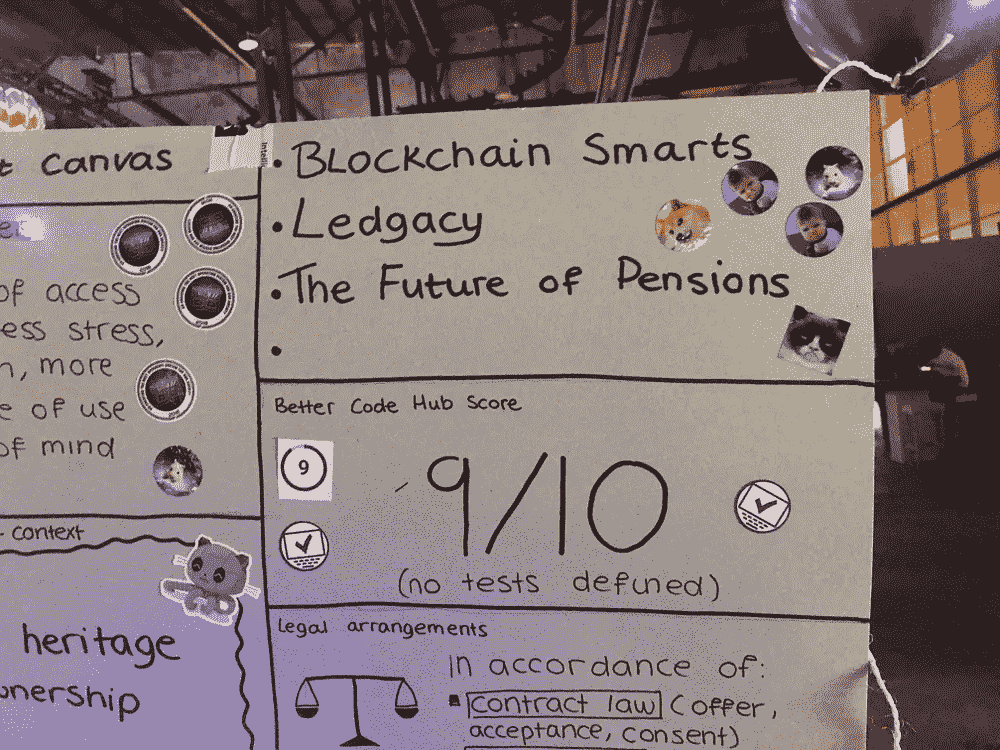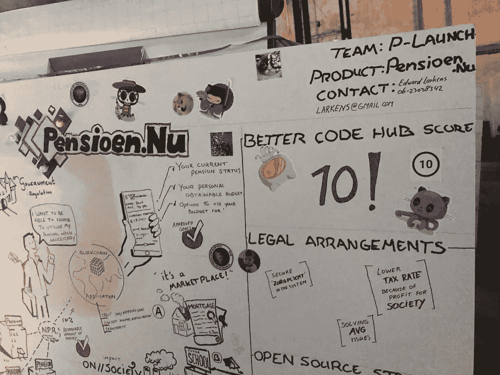

Some of the Impact Canvases showing Better Code Hub scores.

***教训***

这里是我从用更好的代码中枢支持 Blockchaingers Hackathon 中学到的一些重要经验。

*   *代码质量控制不必是破坏性的—*Better Code Hub 给开发人员的反馈简明扼要，并且在 GitHub 对话流程中本地化。当一个绿色的勾号出现时，你可以自由地继续你的下一个贡献。当一个红叉出现时，在继续下一步之前，深入了解清楚需要改进的地方。
*   *代码质量控制不会减慢你的速度，而是加快你的速度—* 通过对更好的代码中枢提供的零碎反馈立即采取行动，而不是等待以后遇到更大的问题，在保持代码库整洁方面花费的精力最少。这种努力会得到回报。
*   *设定并实现一个清晰的质量目标是有益的，也是激励性的—* 当目标是可实现的，并且所有人都可以观察到进展时，团队会从质量控制中获得大量积极的能量。
*   *高质量的代码为后黑客马拉松加速提供了坚实的基础—* 虽然一些黑客马拉松团队解散并放弃了他们的原型，但许多人将黑客马拉松作为一个跳板，开始新的冒险和新产品。高质量的代码提供了一个正确方向的开端。

**加速融资**

基于代码质量分数以及原型的整体设计质量，我们的 Jedis 选择了 7 个在非功能性质量方面工作出色的黑客马拉松团队。安全性、性能、可靠性、可维护性，以及[区块链](https://hackernoon.com/tagged/blockchain)技术是否以明智、面向未来的方式得到应用。

这些获胜的团队被授予 ***SIG 投资者准备研讨会*** ，在这里我们将帮助这些团队为未来的融资回合准备他们的代码库。在收购的*尽职调查阶段*，投资者越来越关注软件质量。我们知道，因为 SIG 交易服务团队定期为投资者执行所谓的 [IT 尽职调查](https://www.sig.eu/it-due-diligence/)调查。在研讨会上，我们帮助团队为那一刻做好准备。

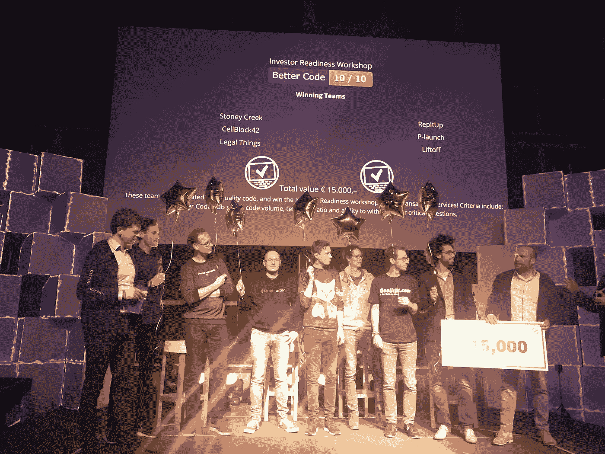

The 7 teams that built prototypes with outstanding software quality were awarded with the SIG Investor Readiness Workshop. Great job!

*   你在组织黑客马拉松吗？ —联系我讨论如何支持团队的代码质量。
*   你是一家**创业公司吗？** —查看更好的代码中枢 [**启动包**](https://gitpitch.com/software-improvement-group/startup-pack#/) **。**
*   你正在投资一家软件密集型公司吗？—联系我在 **SIG 交易服务**团队的同事进行 [**IT 尽职调查**](https://www.sig.eu/it-due-diligence/) 调查。
*   你是一个希望他的软件开发团队快速、可持续发展的 CTO 或 CIO 吗？—考虑让他们拥有 [**更好的代码中枢**](https://www.sig.eu/better-code-hub/) 。

[*Joost Visser*](https://www.linkedin.com/in/jstvssr)*是* [*软件改进小组*](https://www.sig.eu/) *(SIG)的 CTO，Radboud 大学大型软件系统教授，著有《O'Reilly 图书* ***构建可维护软件*** *和* ***构建软件团队*** *，并领导*

 [## 更好的代码中心- GitHub 市场

### 花更少的时间修复 bug。和更多时间来发布新功能

github.com](https://github.com/marketplace/better-code-hub)  [## IT 尽职调查-软件改进小组

### 在数字世界中，任何尽职调查都需要包括对 IT 风险和…

www.sig.eu](https://www.sig.eu/it-due-diligence/)  [## 构建可维护的软件，Java 版

### 你曾经因为使用别人的代码而感到沮丧吗？难以维护的源代码是一个大问题…

shop.oreilly.com](http://shop.oreilly.com/product/0636920049159.do)