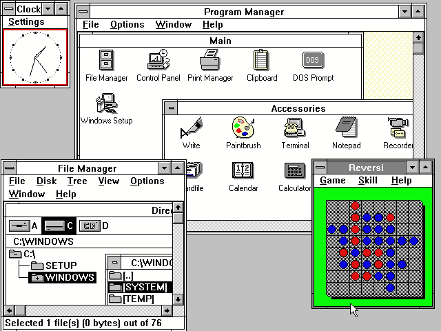

# 使用页面对象模型编写 UI 测试

> 原文：<https://medium.com/hackernoon/writing-ui-tests-using-page-object-models-with-nightwatchjs-part-i-2c6949a0430c>

我的博客记录了我作为一名技术人员进入硅谷的经历。我是一个有色人种的怪人，性别不合群，移民，曾被收养的年轻人。我来自一个非传统的编码背景。我在大学里学了几门 CS 课程，最后在成为老师之前主修了人文学科。向青少年教授 web 开发让我对编码产生了兴趣。在一所编码学校毕业后，我开始在旧金山的初创企业工作。我的博客一半是关于技术主题，另一半是关于平等和技术访问(我的旅程)。



在互联网到来之前的 Windows 95 时代，我们使用的许多应用程序都存在于我们的台式电脑中。不同规模的应用程序运行在我们的计算机上。这些程序允许我们玩游戏、管理任务、与音频/视频文件交互以及将文件保存到磁盘上。浏览器(UI)测试一个应用程序意味着编写一个程序，当用户与它的功能交互时，这个程序可以截屏。QA 工程师需要测试的一切都必须通过前端。你可以想象这是昂贵的(CPU 成本)和耗时的。

如今，我们使用的大多数应用程序都存在于网络上，或者作为智能手机上的应用程序。用户交互(UI)和前端变得极其重要。流畅的用户界面设计可以让一个应用程序从竞争者中脱颖而出。随着应用程序的前端变得越来越复杂，UI 测试也变得越来越复杂。虽然从某种意义上来说，UI 测试仍然很脆弱，但是 UI 测试工具的进步已经允许工程师比以前有更多的能力来测试 UI。

这篇博客将带你了解如何使用 page [对象模型](https://hackernoon.com/tagged/object-models)和 [NightwatchJS](https://hackernoon.com/tagged/nightwatchjs) 编写一个登录测试。[下面是对页面对象模型](https://github.com/SeleniumHQ/selenium/wiki/PageObjects)的深入概述。在高层次上，页面对象只是表示应用程序页面及其功能的对象或类。它不必代表整个页面。它可以是页面的一部分，例如导航条。

页面对象模型允许我们将页面的测试从选择器、布局和功能中分离出来。NightwatchJS 对其页面对象使用对象语法。让我们用 NightwatchJS 编写一个基本测试，然后使用页面对象模型重构它。

创建一个新目录，我们将在其中存储测试文件夹以及页面对象。

```
mkdir nightwatch-pageObject
cd nightwatch-pageObject
mkdir ui_tests
```

初始化您的节点程序包管理器。

```
cd nightwatch-pageObject
npm init
```

一旦你看到你的`package.json`文件，全局安装 Nightwatch，这样你就可以访问它的命令。您还需要将它作为一个依赖项来安装，以便能够运行我们的测试。

```
npm install -g nightwatch
npm install nightwatch --save-dev
```

为了自动化我们的测试并能够控制浏览器，我们需要能够启动 [Selenium](https://www.seleniumhq.org/) 服务器。确保你有 java 来检查类型

```
java -version
```

[如果你没有，看看这些文件](https://www.java.com/en/download/help/download_options.xml)

Nightwatch 能够通过其测试运行程序自动运行服务器。让我们在顶层目录中创建一个 nightwatch.conf.js 文件。

```
touch nightwatch.conf.js
```

我们现在将剪切和粘贴一个基本的配置文件，它可以在[这里](https://github.com/dwyl/learn-nightwatch)找到

```
const seleniumServer = require("selenium-server");
const chromedriver = require("chromedriver");
const SCREENSHOT_PATH = "./screenshots/";

module.exports = {
  "src_folders": [
    "test/ui_tests"
  ],
  "output_folder": "./reports", 
  "selenium": {
    "start_process": true, 
    "server_path": seleniumServer.path,
    "host": "127.0.0.1",
    "port": 4444, 
    "cli_args": {
      "webdriver.chrome.driver" : chromedriver.path
    }
  },
  "test_settings": {
    "default": {
      "screenshots": {
        "enabled": true, 
        "path": SCREENSHOT_PATH 
      },
      "globals": {
        "waitForConditionTimeout": 5000 
      },
      "desiredCapabilities": { 
        "browserName": "chrome",
      }
    }
  }
};

function padLeft (count) { // theregister.co.uk/2016/03/23/npm_left_pad_chaos/
  return count < 10 ? '0' + count : count.toString();
}

var FILECOUNT = 0; // "global" screenshot file count
/**
 * The default is to save screenshots to the root of your project even though
 * there is a screenshots path in the config object above! ... so we need a
 * function that returns the correct path for storing our screenshots.
 * While we're at it, we are adding some meta-data to the filename, specifically
 * the Platform/Browser where the test was run and the test (file) name.
 */
function imgpath (browser) {
  var a = browser.options.desiredCapabilities;
  var meta = [a.platform];
  meta.push(a.browserName ? a.browserName : 'any');
  meta.push(a.version ? a.version : 'any');
  meta.push(a.name); // this is the test filename so always exists.
  var metadata = meta.join('~').toLowerCase().replace(/ /g, '');
  return SCREENSHOT_PATH + metadata + '_' + padLeft(FILECOUNT++) + '_';
}

module.exports.imgpath = imgpath;
module.exports.SCREENSHOT_PATH = SCREENSHOT_PATH;
```

咻，代码真多。不要烦恼，它是密集的，但可读性强。首先，让我们安装 selenium-server 和 chromedriver

```
npm install selenium-server chromedriver --save-dev
```

下面是您粘贴到`nightwatch.conf.js`文件中的代码的快速运行:

1.  需要 selenium-server 和 chromedriver

```
const seleniumServer = require("selenium-server");
const chromedriver = require("chromedriver");
```

3.告诉 Nightwatch 测试代码的位置

```
"src_folders": [
    "test/ui_tests"
 ],
```

4.确保测试运行程序启动 selenium 服务器

```
"start_process": true, 
```

5.选择 Chrome 作为您想要的浏览器

```
"desiredCapabilities": { 
   "browserName": "chrome",
 }
```

现在，让我们运行配置文件来下载 selenium-server。

```
node nightwatch.conf.js
```

我们已经准备好编写测试了。让我们编写一个简单的测试，它访问 Google 的网站并检查页面标题是否正确。

```
cd ui_tests
touch sauceLabs.js
```

首先，需要我们新的 Nightwatch 配置文件:

```
require('../../nightwatch.conf.js');
```

接下来，让我们在同一个文件中编写我们的测试。Nightwatch 使用自己的语法，比一些测试框架(如 mocha)更简洁。

```
module.exports = {
  "Validate Sauce Labs' Page Title": function(browser) {
     browser
       .url('https://saucelabs.com')
       .waitForElementVisible('body')
       .assert.title('I am a page title - Sauce Labs')
       .saveScreenshot('saucelabs.png')
       .end();  
   }
};
```

让我们运行测试来验证 Sauce Lab 的页面标题。

```
node_modules/.bin/nightwatch --config nightwatch.conf.js
```

让我们将这个命令存储到我们的`package.json`文件的`script`中，这样我们就可以简单地调用`npm test`。

```
"scripts": {
  "test": "node_modules/.bin/nightwatch --config nightwatch.conf.js"
}
```

让我们使用新创建的脚本再次运行我们的测试。

```
npm test
```

吼吼！自动浏览器工作正常，我们的两个测试都通过了。

在下一部分中，我们将使用页面对象模型重写这个简单的测试。