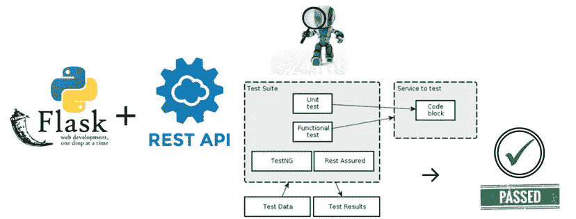
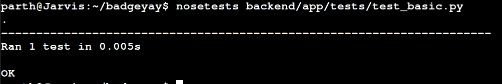

# 用 Python 编写 REST API 的单元测试

> 原文：<https://medium.com/hackernoon/writing-unit-tests-for-rest-api-in-python-web-application-2e675a601a53>



一点背景:在过去的几个月里，我一直在开源组织 [FOSSASIA](https://github.com/fossasia) 中做贡献，在那里我从事一个名为 [BadgeYaY](https://github.com/fossasia/badgeyay) 的项目。这是一个徽章生成器，具有简单的 web 用户界面，可以添加数据并生成 PDF 格式的可打印徽章。

[Badgeyay](https://github.com/fossasia/badgeyay) 后端现在转移到 [REST-API](https://en.wikipedia.org/wiki/Representational_state_transfer) 上，为了测试 REST-API 中使用的函数，我们需要一些测试技术来测试 API 中使用的每一个函数。出于我们的目的，我们选择了流行的[单元测试](https://docs.python.org/2/library/unittest.html) Python 测试套件。

在这篇博客中，我将讨论我是如何编写单元测试来测试 [Badgeyay](https://github.com/fossasia/badgeyay) REST-API 的。

首先，让我们了解什么是单元测试，以及我们为什么选择它。然后我们将继续为 [Badgeyay](https://github.com/fossasia/badgeyay) 编写 API 测试。这些测试有一个通用的结构，因此我提到的代码可以在其他 REST API 测试场景中工作，通常只需很少或不需要修改。

让我们开始一步一步地了解 API 测试。

什么是单元测试？

单元测试是一个 Python 单元测试框架，它支持测试自动化、测试设置和关闭代码的共享、测试集合的聚合以及测试与报告框架的独立性。[单元测试](https://docs.python.org/2/library/unittest.html#module-unittest)模块提供了一些类，使得支持一组测试的这些质量变得容易。

为什么要进行单元测试？

我们从单元测试中得到两个主要的好处，第一个好处占了大部分的价值:

*   引导您的设计松散耦合，并充分充实。如果进行测试驱动的开发，它将你写的代码限制在需要的范围内，并帮助你逐步发展这些代码。
*   为代码的重因子和小变化提供快速的自动化回归。
*   单元测试也给你关于系统的小部分如何工作的活文档。

我们应该总是努力编写全面的测试，很好地覆盖工作代码。

现在，让我们看一下我是如何编写单元测试来测试 [Badgeyay](https://github.com/fossasia/badgeyay) 的 REST-API 后端代码的。使用单元测试 python 包和[请求](http://docs.python-requests.org/)模块，我们可以在测试自动化中测试 REST API。

下面是我在一个拉请求中为其编写单元测试的代码片段。

```
def output(response_type, message, download_link):
    if download_link == ‘’:
       response = [
        {
             ‘type’: response_type,
             ‘message’: message
         }
     ]
     else:
     response = [
      {
              ‘type’: response_type,
              ‘message’: message,
              ‘download_link’: download_link
       }
     ]
     return jsonify({‘response’: response})
```

为了测试这个函数，我基本上创建了一个模拟对象，它可以以可控的方式模拟真实对象的行为，所以在这种情况下，模拟对象可以模拟输出函数的行为，并返回类似 JSON 响应的*信息*，而不会影响真实的 REST API。现在，下一个挑战是解析 JSON 响应，并将响应 JSON 的特定值提供给 Python 自动化脚本。因此 Python 将 JSON 作为字典对象读取，这确实简化了 JSON 的解析和使用方式。

而这里的内容是[***back end/tests/test _ basic . py***](https://github.com/fossasia/badgeyay/blob/development/backend/app/tests/test_basic.py)文件。

```
#!/usr/bin/env python3“””Tests for Basic Functions”””
import sys
import json
import unittestsys.path.append(“../..”)
from app.main import * class TestFunctions(unittest.TestCase):
 “””Test case for the client methods.”””
    def setup(self):
        app.app.config[‘TESTING’] = True
        self.app = app.app.test_client()
        # Test of Output function

        def test_output(self):
            with app.test_request_context():
            # mock object
            out = output(‘error’, ‘Test Error’, ‘local_host’)
            # Passing the mock object
            response = [
              {
                     ‘type’: ‘error’,
                     ‘message’: ‘Test Error’,
                     ‘download_link’: ‘local_host’
               }
            ]
            data = json.loads(out.get_data(as_text=True)
            # Assert response
            self.assertEqual(data[‘response’], response) if __name__ == ‘__main__’:
      unittest.main()
```

最后，我们可以通过运行 [*nosetests*](http://pythontesting.net/framework/nose/nose-introduction/) 来验证一切正常。



Screen-shot of Test Passing

这就是我如何在 [BadgeYaY](https://github.com/fossasia/badgeyay) 存储库中编写单元测试的。

至此，我已经结束了关于在 Python Web 应用程序中为 REST API 编写单元测试的讨论。我写这篇文章是为了解决 BadgeYaY 项目中的这个问题。如果你喜欢这篇文章，可以考虑看看我在 GitHub 上的其他作品🙂。

来源:[单元测试框架](https://docs.python.org/2/library/unittest.html)