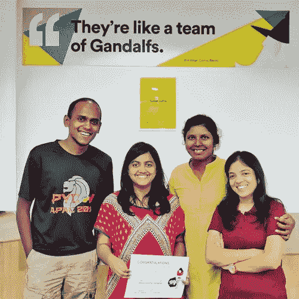

# 我们在 WTF 黑客马拉松上做了什么？

> 原文：<https://medium.com/hackernoon/wtf-did-we-do-at-the-wtf-hackathon-1b2b5e8ff82>



# 女性科技工厂

这些天来，我一直致力于将多样性引入科技领域，这是一场专为女性举办的黑客马拉松，我怎么能不参与其中呢？！对于过去的大多数黑客马拉松来说，我曾经指导并加入来自大学的团队，并在技术困难时帮助他们。这一次，我非常想参加，因为我有他们要求的一切:

1.  一个想法
2.  组
3.  当然是黑客马拉松

# 这个想法

## 故事

在我之前的公司，我习惯在谷歌文档中记录我的工作、思维过程、学习和设计决策。随着时间的推移，文档开始增长，最后，我有了一份 36 页的文档，从中我永远无法推断出我的学习/思考过程。另一个问题是你不能确保所有员工都记录他们的工作。最重要的是，我过去常常在 Slack 中设置一个提醒，提醒我的同事做一个条目。那时我想把它变成一个聊天机器人。

## ike 博客

一种聊天机器人，位于您组织的消息平台中，定期向您发送 pings 命令以获取您的状态更新。你可以用#标签记录你的状态，经过一段时间，它会产生一个学习和生产力曲线。虽然这是我想法的基础，但你会看到我们的海扁王团队是如何将其转化为黑客马拉松的。

# 团队

我的团队是整个黑客马拉松中最多样化的团队。我们不属于同一个公司。我们在钦奈的各种技术社区活动中相遇，成为了朋友。

[Bhuvana——她对进入软件开发的新发现的热情使 ThinkDiff S'kool 的创始人接触并成为我团队的一员。](https://medium.com/u/137ae83ea504# womenInTech，她是我的不二人选。她对 React.js 的新发现对于一个没有前端技能的团队来说很方便。</p><p id=)

# [**黑客马拉松**](https://medium.com/u/137ae83ea504# womenInTech，她是我的不二人选。她对 React.js 的新发现对于一个没有前端技能的团队来说很方便。</p><p id=)

## [应用](https://medium.com/u/137ae83ea504# womenInTech，她是我的不二人选。她对 React.js 的新发现对于一个没有前端技能的团队来说很方便。</p><p id=)

[在申请了 iKeepLog 之后，我想增加参加黑客马拉松的机会。我们成立了一个 Whatsapp 小组，并开始讨论其他想法。当我应用第二个想法时，组织成员打电话通知我两个想法都被选中了。我曾努力组建第二个团队，但不得不在接近尾声时放弃。](https://medium.com/u/137ae83ea504# womenInTech，她是我的不二人选。她对 React.js 的新发现对于一个没有前端技能的团队来说很方便。</p><p id=)

## [规划](https://medium.com/u/137ae83ea504# womenInTech，她是我的不二人选。她对 React.js 的新发现对于一个没有前端技能的团队来说很方便。</p><p id=)

[相信我，如果你打算用 Whatsapp 群组来讨论黑客马拉松，不要！打电话给他们，在一个共同的地方见面，集思广益。当我们意识到的时候，已经是黑客马拉松的前一天了！](https://medium.com/u/137ae83ea504# womenInTech，她是我的不二人选。她对 React.js 的新发现对于一个没有前端技能的团队来说很方便。</p><p id=)

[我们列出了我们在电话中交流的所有内容，并开始将主要功能与突然出现的每个新想法联系起来。在计划会议结束时，我们为团队的每个成员都制定了一个执行计划。](https://medium.com/u/137ae83ea504# womenInTech，她是我的不二人选。她对 React.js 的新发现对于一个没有前端技能的团队来说很方便。</p><p id=)

## [行动计划](https://medium.com/u/137ae83ea504# womenInTech，她是我的不二人选。她对 React.js 的新发现对于一个没有前端技能的团队来说很方便。</p><p id=)

[**第一天**](https://medium.com/u/137ae83ea504# womenInTech，她是我的不二人选。她对 React.js 的新发现对于一个没有前端技能的团队来说很方便。</p><p id=)

[作为一名努力为科技社区带来多样性的女性，进入一个满是同样渴望参加科技黑客马拉松的女性的房间是一个梦想成真。在令人振奋的主题演讲和早餐后，我们开始实施。](https://medium.com/u/137ae83ea504# womenInTech，她是我的不二人选。她对 React.js 的新发现对于一个没有前端技能的团队来说很方便。</p><p id=)

[导师们开始过来，听到我们的想法，并给我们不同的方面来接近和推销这个想法。来自](https://medium.com/u/137ae83ea504# womenInTech，她是我的不二人选。她对 React.js 的新发现对于一个没有前端技能的团队来说很方便。</p><p id=) [Mad Street Den](https://medium.com/u/e72244e3bbb7?source=post_page-----1b2b5e8ff82--------------------------------) 的 Vaishnavi 帮助我们破解了这个想法的商业方面。

当我在 Slack 的文档中努力让这个机器人活起来的时候。克里蒂卡从仪表板开始，那仁和布瓦纳埋头于后端实现。在第一天结束时，我们有一个 slackbot，它记录到一个数据库和一个后端 API，它从日志中生成一个标签云。那仁工作到深夜，在服务器上安装了一个版本。

## **第二天**

第二天开始为机器人带来更多的个性，为机器人提供 ping API 来 ping 用户和许多 UI。而克里蒂卡和那仁则致力于 UI 组件的布局。我输入幻灯片来回答什么？，为什么？，谁？又是怎么做到的？敬布瓦纳。一旦 Bhuvana 把幻灯片放好，我们就让它经过 Vaishnavi，她给了一个绿色的信号，并建议了几个更多的点。

## 最终演示

这是所有黑客马拉松的最后一部分。不管你准备了多少，压力还是会出现。当一个签把球队从第 1 名推到第 13 名的时候，当你看到许多伟大的想法呈现在你面前的时候，没有人会认为你变得如此紧张。幻灯片放了起来，我的手变得冰冷，深呼吸从我的肺中呼出，我恢复了信心来展示 iKeepLog 的内容、原因、方式和人员。

## 蛋糕上的樱桃

我在我的团队中感受到了成就感。我可以向你保证，他们很高兴这一切终于走到了一起。我们和 samosas 和 kachoris 一起庆祝。当我们坐回座位等待结果宣布时，当我们接近那一刻时，人群变得不耐烦了。当他们宣布我们是亚军时，我立刻欣喜若狂！这个世界上没有任何语言可以解释我在那一瞬间的情绪，所以这里有一个相同的视频。

# 在幕后

## 我们如何生产代码

How we produce code

## 让我们无法入睡的错误

```
> material-dashboard-react@1.2.0 build /home/bhavani/iKeepLog/ikeeplog/web
> react-scripts build
module.js:549
throw err;
^Error: Cannot find module ‘./lib/parse’at Function.Module._resolveFilename (module.js:547:15)
at Function.Module._load (module.js:474:25)
at Module.require (module.js:596:17)
at require (internal/module.js:11:18)
at Object.<anonymous> (/home/bhavani/iKeepLog/ikeeplog/web/node_modules/react-dev-utils/node_modules/cross-spawn/index.js:4:13)
at Module._compile (module.js:652:30)
at Object.Module._extensions..js (module.js:663:10)
at Module.load (module.js:565:32)
at tryModuleLoad (module.js:505:12)
at Function.Module._load (module.js:497:3)npm ERR! code ELIFECYCLE
npm ERR! errno 1
npm ERR! material-dashboard-react@1.2.0 build: `react-scripts build`
npm ERR! Exit status 1
npm ERR!
npm ERR! Failed at the material-dashboard-react@1.2.0 build script.
npm ERR! This is probably not a problem with npm. There is likely additional logging output above.
npm ERR! A complete log of this run can be found in:
npm ERR! /home/bhavani/.npm/_logs/2018–06–23T16_41_42_805Z-debug.log`
```

## 当你难过的时候，你的机器人不会放弃你。

# iKeeplog 的下一个目标是什么

iKeeplog 不仅仅是一个黑客马拉松。我们将继续努力，将原型转化为 MVP。

[](http://eepurl.com/gaEkp5)

Subscribe to newsletter