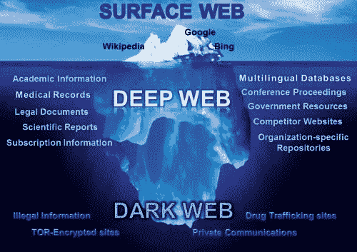
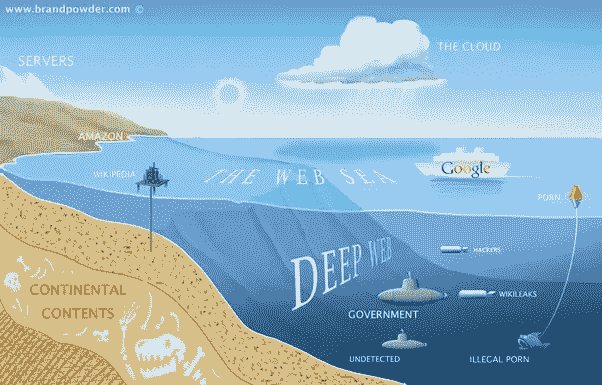
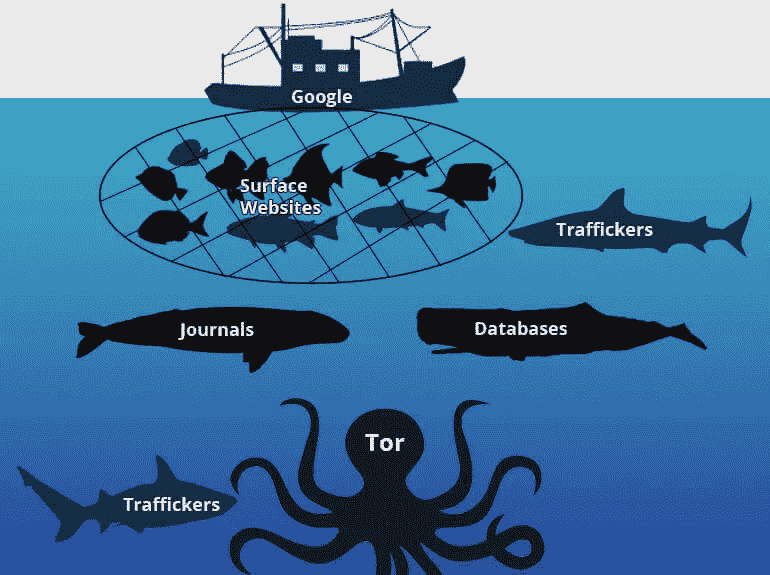
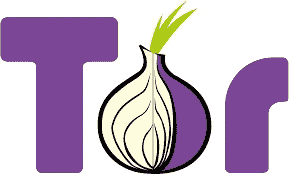

# WTF 是暗网？

> 原文：<https://medium.com/hackernoon/wtf-is-dark-web-358569fde822>

> 深层网络包含了惊人的有价值的信息。你能想象如果每个研究人员都能即时获得世界上每所大学和研究实验室的每篇研究论文，癌症研究将会如何发展吗？
> 
> 约翰·麦卡菲

Image sources: Google Images

**想想你在这个世界上最想要的是什么？如果我告诉你，你在这个世界上能想到的每一个需求，不管有多不合适，都会在这里得到满足。如果我告诉你，你可以成为你幻想中的坏人，而不想让他的手弄脏，会怎么样？如果你非常想要某样东西，但是你国家的政府不允许，而我告诉你那东西会送到你家门口，那该怎么办？无数这样的问题在这里都可以轻松解决。顺便说一下，我是 **CodesMyth** 的**馆长**，这是一个简化代码&打破神话的在线平台。那么，**暗网到底是什么？****

# 不相信我？

让我欢迎你来到*互联网最深最暗的区域*，**暗网**。没有意识的正常人会因为一个小小的错误而被彻底摧毁的区域。这里唯一重要的是钱。*完成付款后，您将获得服务。不需要您的身份，也不会有人追踪到您。**所有未完成的部分将被系紧**并且工作将严格按照**专业**进行。这就是黑暗网络的文化。你能想象现在的黑暗网络吗？*

Image sources: Google Images

把黑暗网络想象成一座冰山。冰山在海面上可见的那一小部分叫做海面网或晴网。隐藏在海洋表面深处不为外界所知的主要部分被称为暗网。

如果我说的有道理，你觉得你的生活充满了兴奋，一旦你意识到黑暗网络，那么你就大错特错了。几乎在世界上所有的国家，这些发生在黑暗网络上的事情都是非法的。它最初是由美国国防部从 ARPANET 中分离出来的，ARPANET 变得如此之大，以至于国防部都无法控制它。然后交给了另一个组织***Tor****，现在管理着* ***暗网。*它比谷歌、脸书或你管得大吗？**

清晰的网络是巨大的，但与黑暗的网络相比就不算什么了。Clearnet 是我们在 Chrome 这样的常规浏览器中打开的常规 web 或 surface web。为了让你知道晴空有多大，你必须把下面列出的所有数据加起来:

1 —完整的数据来自**谷歌**、**脸书**、**推特、** **不倒翁**、 **Reddit** 和**任何你可以打开的网站上的数据。**

2-来自 **YouTube** 和其他**媒体渠道**的完整视频。

3-所有数据来自成人网站。

4-数据来自**购物网站**和**银行**。

5-数据来自 **Play** **Store** ， **Appstore** ， **Extensions** ， **Add** - **ons** ， **WebApps** 。

基本上，存在于服务器或世界上任何地方的任何系统中的数据可以通过打开相应的 surface web 或 www 网站来获得。想想看，脸书每天会转储近 50–100tb 的数据。光是想想晴空网本身有多大就可能是一个令人难以置信的过程。那么，与表面网相比，暗网有多大呢？

# 黑暗之网到底有多大？

如果你有一个馅饼，那么这个馅饼中只有 4-5%是互联网，也就是我们几乎每天都在使用的互联网。剩下的 95–96%的空间被黑暗网络所使用。这就是这个隐藏网络的规模。

暗网能做什么？

尽管规模如此之大，但真正了解它的人却少之又少。

*暗网非常* ***挑战性*** *。你可以从* ***购买*******毒品*** *从几个地方到* ***销毁*******身份*******人*** *。从* ***社会诈骗*** *到* ***比特币理财*** *。从* ***假币印刷*** *到* ***无效美国国籍*** *。从* ***大学成绩造假*** *到* ***红房*** *到* ***虐童*** *。从* ***绑架*** *到* ***杀戮*** *到* ***呼唤*** *上一个* ***职业杀手*** *为* ***有人*** 从网上发布的 ***绝密政府文件*** *到* ***发布的*** *所有的* ***禁播和盗版电影*******电视剧*** *上*从* ***网志*** *由专家到* ***技术讨论*** *。从* ***暗网自有、个人社交网站*** *到* ***Tor 邮箱*** *到* ***Tor 的 Pastebin*** *。从***到* ***大丑闻*** *到* ***名人八卦*** *。从* ***病毒信息的*** *到* ***XSS 蠕虫脚本*** *到* ***FOIE 档案*** *，关于暗网还有一大堆我们不知道的事情。* ***暗网充满奇观*** *。*******

**

*image sources: Google Images*

*我们开始吧，好吗？*

*要了解暗网，我们必须了解 **Tor** 。一个 **Tor 网络**是一个完全隐藏的网络，提供**匿名**的**能力**。它还提供对暗网的访问，暗网是像谷歌这样的表面网络搜索引擎无法打开的**未索引** **页面**。deep web 上的这些**未编入索引的 onion 网站被称为 Tor 网站，可能用于合法/非法目的**。Tor 网站如此安全**是因为每个隐藏服务网站都有一个**公共**密钥和一个相应的**私有**密钥。洋葱地址是通过散列公钥并取其中的一半来生成的**。没有人能够模拟隐藏的服务，因为你需要只有你自己知道的私钥。*

***在这个**上补充一下:如果你的私钥泄露了，你的域名就一去不复返了，基本上你得去弄个新域。*

**

*Image sources: Google Images*

*因此，有必要总是**禁用 Tor 或其他浏览器上的脚本**。这是有必要的，因为这些脚本能够检测我们的计算机配置、我们的个人数据、访问我们的搜索历史，并可能最终在我们的系统上创建一个后门，只需要我们点击他们的网站或仅仅打开他们的网站。这就是暗网的邪恶程度。*

*如果你需要访问暗网页面，那么你可以在搜索引擎的帮助下这样做，搜索引擎还会列出其他搜索引擎没有能力做到的未索引页面。DuckDuckGo 通过不跟踪和存储您的搜索历史和其他活动来帮助您保持完全的隐私。*

**

*Image Source: Google Images*

*如果你真的想了解黑暗网络，那么我们必须浏览隐藏的维基。黑暗网络有自己的**维基百科**。暗网由表面网拥有的一切的**克隆**组成。HiddenWiki 包含了所有最受欢迎和危害最小的网站链接。例如，如果你打开隐藏的维基，你会发现他们免费出售大麻、大麻和各种毒品。他们有自己的电台和自己的技术论坛，黑客可以在那里联系。从枪支、在线托管、电子邮件、信息传递，一切都在这里发生。那么，我应该在这里参观它吗？*

*但首先，让我们了解一下网络的层次。网络主要分为 8 个级别*

***0 级**—0 级由**公共网**组成。每个人都可以在互联网的帮助下访问的东西，比如搜索引擎。*

***一级** -一级由表层网组成。这些事情需要一些在线服务的帮助，但并不危险。今天，它们也包含在公共网络中。这些包括论坛如 Reddit、临时电子邮件服务、网站如 Newgrounds、dig。除了像 VampireFreaks 这样的社交网络和文化网站，人工智能任务也包括在这个级别中。除此之外，**虚拟主机、MYSQL 网站和大学校园网站**也属于这一级类别。*

***二级** —二级俗称**伯奇网**。这些 Web**包括 FTP 服务器、Google 锁定结果、蜜罐和加载 Web 服务器**。基本上，所有这些东西的数据，谁想把自己隐藏起来，不希望其他人接触到它们。这些也包括来自 RSC 和 FeeHive 的数据。*

***三级-** 此三级俗称**暗**网**网**此点后需要**代理**。这个网页是在 **Tor 网络**的帮助下打开的。它包括**病毒信息、VIP 八卦、超级计算、丑闻等**。上面已经提到了。我们主要是想了解一下这个层面*

***Level -4** : **马里亚纳 Web** 一般认为是一个**神话**。我们还没有见过一个人达到这样的水平，或者接近这样一个敏感的水平。据称有**亚特兰大**失落之城的位置，基本上所有的东西都已经从 clearnet 上移除了。*

*如果你已经达到了马里亚纳网络以下的水平，那么你只是处于冷战或网络战争的**中，如果你继续在黑暗网络中挣扎，那么你可能最终成为互联网自己的上帝。***

*现在，我们不知道黑暗之网的真实性，但是下面可以看到一张图片。然而，有人声称最低水平是不可能的。但是，我们不知道暗网的完整范围，因此一切皆有可能。*

*所以，问题是**黑暗网络值得我们和我们的家庭去冒险吗**？这要因人而异。*

*我们中的一些人出去解决他们对黑暗网络的好奇心。其他一些人站出来反对一些来自黑暗中的强大实体，知道他们不会被起诉&其他只有黑暗网络才能提供的东西。其他人只是去从事非法活动，并匿名满足他们的非自然欲望，黑暗网络可以提供金钱。*

*因此，如何使用黑暗网络取决于我们。但是意识到黑暗网络也是很重要的，这样如果有人在策划针对我们的事情，我们就不会被蒙在鼓里。在我看来，你绝对应该用 Tor 浏览器代替 Chrome 和 Firefox 来做你的日常工作，以保持匿名。*

> *只是不要试图通过说一些与你和你的家庭有关的事情或做任何可能暴露你的傻事来暴露你的身份，因为我们不知道那些隐藏在黑暗网络阴影下的人有多危险。*

*保持安全，保持匿名。冲浪快乐。*