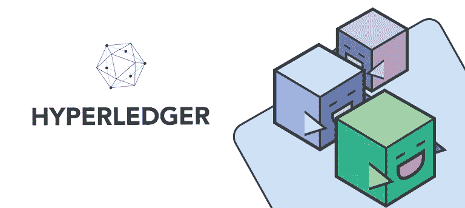
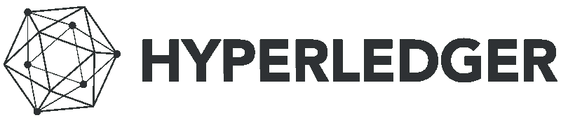
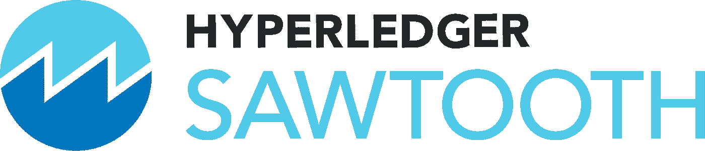
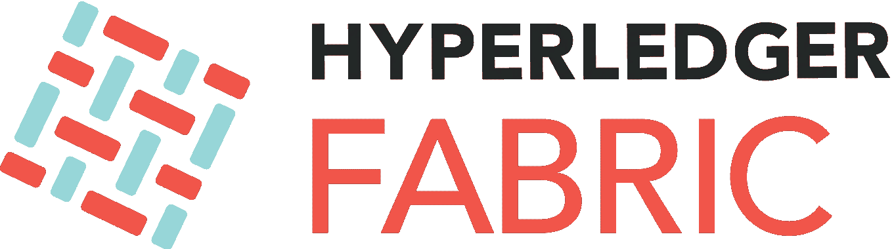
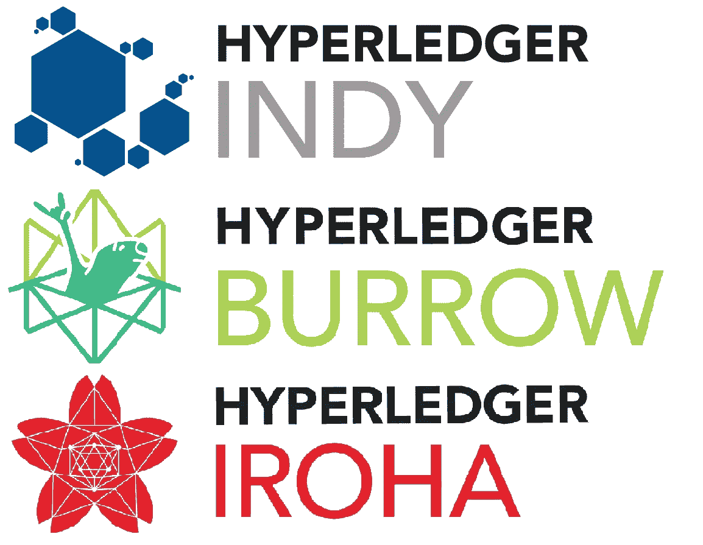
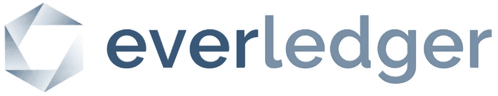

# WTF 是 Hyperledger？

> 原文：<https://medium.com/hackernoon/wtf-is-hyperledger-e433818b16aa>

在区块链和加密货币世界中，许多项目已经看到了曙光。最著名的是比特币和以太坊，受到了媒体的广泛报道。但是有一个项目还没有成为报纸的头条新闻，它试图完成一项巨大的工作。由于世界各地许多不同需求的区块链都是从零开始构建的，Linux 基金会发起的 Hyperledger 项目将试图在商业世界中实现区块链的标准化和民主化。Hyperledger 不是让公司自己解决问题，而是将跨行业的知识结合起来，让企业建立能够满足特定需求的定制区块链。

**让我们更深入地了解一下什么是总账。**

# 语境

2015 年，通过开源实现大规模创新的非营利组织 Linux 基金会[宣布了行业领导者在企业层面推进区块链技术的合作。](https://www.linuxfoundation.org/press-release/2015/12/linux-foundation-unites-industry-leaders-to-advance-blockchain-technology/)最初的目标是开发 ***“一个开源的分布式分类账框架，以构建健壮的、特定于行业的应用程序、平台和硬件系统来支持业务交易”。***Hyperledger 项目诞生。但是这个目的到底是什么意思呢？

第一批加入该运动的成员大多是银行、金融服务公司或 IT 公司。但是随着时间的推移，越来越多的公司加入了这个项目，截至 9 月 26 日，成员名单已经达到了 270 个来自不同行业和领域的组织。从物流到医疗保健，从金融到政府，我们可以在列表中找到大型行业领导者公司以及初创企业，他们都通过提供代码和开发进度做出了财务贡献。两个最大的贡献者是 IBM 和英特尔。截至 2018 年 7 月，Hyperledger 主持了 [10 个项目，360 万行代码，近 28，000 名参与者参加了世界各地的 110+次会议](https://www.hyperledger.org/wp-content/uploads/2018/07/HL_Whitepaper_IntroductiontoHyperledger.pdf)。

> “分布式账本将会改变很多行业”——吉姆·泽姆林，Linux 基金会的执行董事，在 Hyperledger 项目启动后说

由于区块链是最近的一项创新，对于非技术类的档案来说是一个难以捕捉的概念，因此在商业世界中跨行业合作的需求上升了。

> 你必须明白，Hyperledger 不是一家公司，不是加密货币，也不是区块链。这是一项全球性的合作努力，旨在透明、公开地启发区块链解决商业问题的潜力。

理解比特币和以太坊相当容易，因为它很实用，并且已经证明对开发者和用户非常有用。理解 Hyperledger 是另一个挑战。

Hyperledger logo, [https://www.hyperledger.org/](https://www.hyperledger.org/)

Hyperledger 在 2016 年初写了一份章程，一种白皮书，陈述了指导方针和它试图实现的目标。在宣布的 4 项任务中，我们可以读到:

*   *创建企业级开源分布式分类账框架和代码库*
*   *促进生态系统主要成员的参与*

还能再含糊一点吗？

在这些句子背后，你必须记住的是，Linux 基金会，通过它的 Hyperledger 项目**，想要创造一个环境，在这个环境中，软件开发者和公司的社区会面并协调来构建区块链框架。因此，在这里你可以找到正在进行的区块链相关项目。都是非货币项目和行业应用。这是很重要的一点。你不会有任何 Hyperledger 硬币，因为该项目不打算拥有自己的加密货币，例如以太坊。**

> “通过不推动一种货币，我们避免了许多必须维持全球一致货币的政治挑战。”——Hyperledger 执行董事布莱恩·贝伦多夫

因此，我们有一个全球性的运动，组织在几个项目中，由 Linux 基金会发起，由来自技术、开源和数据世界的具有多年经验的人领导，并得到 270 个贡献公司和组织的支持，旨在为商业世界开发非货币的区块链项目。

让我们深入研究这些项目。

# 超级分类帐项目

让我们从 Hyperledger 锯齿和 Hyperledger Fabric 这两个可用且可投入生产的项目开始。

[**Hyperledger 锯齿**](https://www.hyperledger.org/projects/sawtooth) 是一款主要由英特尔开发的区块链，旨在测试一种名为耗时证明(PoeT)的新共识机制的功能，并允许企业在没有中央授权的情况下运行分布式总账。

PoeT 是一个算法，试图通过一个公平的随机系统来分配网络采矿权。它旨在消除比特币和其他加密货币使用的工作证明共识算法背后的环境和能源消耗问题。该流程遵循公平的抽签制度，而不是奖励最强大的节点。简而言之，网络中的每个参与节点都需要等待一个随机选择的时间段，第一个完成指定等待时间的节点将赢得新块。

在他们的演示视频中，Hyperledger 展示了锯齿在海鲜供应链中的潜力，锯齿提供了鱼类等各种商品的来源和血统的不可改变的记录。由于物联网(物理连接的设备)和传感器结合锯齿，可以跟踪任何鱼从海洋到餐桌的旅程。

锯齿是用 Python 编写的，旨在提供最终可以应用于物联网和各种金融系统的区块链。

[**Hyperledger Fabric**](https://www.hyperledger.org/projects/fabric)**是在 IBM 的指导下驱动的项目。令人惊讶的是，织物是最大的企业最广泛采用的区块链。事实上，使用以太坊平台让公司在此基础上构建应用程序是一种限制，因为**以太坊有自己的协议，因此不太灵活**。Hyperledger Fabric 提供的是为特定行业构建特定区块链和运行与特定需求相关的应用程序的基础。**

**这对初学者来说一点都不友好，但是**提供设计和定制以满足精确的要求**是值得称赞的。Fabric 作为一个模块化框架构建，应用程序可以轻松扩展到任何级别，旨在提供基本的区块链服务，如透明性、去中心化和安全性。**

****

**除了锯齿和织物，其他项目值得一提。**

**[**Hyperledger Burrow**](https://www.hyperledger.org/projects/hyperledger-burrow)这是一个允许的智能合同机器，是根据以太坊虚拟机(EVM)的规范开发的。**

**[**Hyperledger Indy**](https://www.hyperledger.org/projects/hyperledger-indy)为分散身份建立的分布式账本。它为创建和使用独立的数字身份提供了工具、库和可重用组件。它不使用工作证明，而是使用基于区块链的身份解决方案。**

**[**Hyperledger Iroha**](https://www.hyperledger.org/projects/iroha) 这是一个区块链框架，旨在简化并易于集成到需要分布式账本技术的基础设施项目中。**

# **例子**

**让我们用 Hyperledger 白皮书中的一个用例来透视 Burrow 和 Indy。**

**通常，银行收集每个客户和潜在客户的个人身份信息(PII ),以评估贷款风险。这些信息对黑客来说是敏感而诱人的目标。此外，贷款申请人通常需要与几家银行共享这些信息，以增加他们获得贷款的机会，但也增加了这些信息被滥用的机会。**有了 Hyperledger Indy，申请人可以只分享银行做出决定所需的信息，而无需在等式中加入任何个人数据。**由于有了安全的区块链，申请人可以放心地披露评估信息，银行可以遵守监管规定，并依靠这种分布式分类账作为事实的来源。最重要的是，我们可以想象 Hyperledger Burrow 会将贷款申请转换为智能合同，将身份附加到贷款上。**

# **观点**

**虽然大多数 Hyperledger 的项目仍处于开发阶段，但一些公司已经开始使用锯齿或 Fabric 作为增强其产品或服务的使能器。例如，Everledger 是一家在区块链上追踪高价值商品的公司。**后者是通过 Hyperledger 结构设计的，允许客户、当局、律师、账户和钻石供应链的每一个中介透明地跟踪钻石的记录过程**。这减少了珠宝欺诈(估计数百万美元),因为它用数字化方法取代了纸质跟踪方法。**

****

**Everledger logo, [https://www.everledger.io/](https://www.everledger.io/)**

**Everledger 并不是唯一一个看到 Hyperledger 项目潜力的人。在英特尔和 IBM 的带领下，他们庞大的客户组合开始关注私人区块链提供的机会。幸运的是，随着锯齿和 Fabric 的启动和运行，公司关于业务用例的询问可以得到回答。**

****无论如何，Hyerperledger 的项目即将满足一个巨大的市场，这个市场对合作的需求从未如此之大。****

**考虑到这一点，Hyperledger 于 10 月 1 日宣布与其直接竞争对手[企业以太坊联盟](https://entethalliance.org/) (EEA)合作。EEA 是推动企业以太坊(Enterprise Ethereum)采用的全球标准组织，这是一个由初创企业和行业领导者组成的企业联盟，旨在通过以太坊平台的私有版本来满足业务需求。这两个组织现在都是对方的准成员，共同促进各自的发展。**

> **这种重要的合作伙伴关系证明，因为分布式账本正在各种行业中建立，所以为了实现区块链的承诺，需要一种支持全球多个参与者的开源和协作开发战略。**

**未来几年跨行业大规模采用的意愿[将带来数十亿的经济价值](https://www2.deloitte.com/content/dam/insights/us/articles/4436_Blockchain-primer/DI_Blockchain_Primer.pdf)单靠一家公司是无法实现的。**

# **结论**

**IBM 的首席执行官 Ginni Rometty 宣称**互联网对于信息，区块链对于交易**来说都是非常便宜的记录和容易验证的。这是全球公司都非常关心的问题。**

**从这个角度来看，为了使技术更加成熟，Linux 基金会做出了一个重要的声明:**

*   ***比特币和以太坊很难扩展，因为需要网络内的对等体同时发现共识***
*   ***比特币和以太坊不支持私下交易***

**基于此，Hyperledger 正试图寻找新的方法来达成共识，无论网络规模如何，并建立私人区块链来满足业务需求，同时留下工作证明。**

**从这篇文章中你需要记住的是 **Hyperledger 将有助于保护和定制实体之间的供应验证、物流、分配和支付验证。**除了最先进和最知名的项目锯齿和 Fabric，Hyperledger 还采取了其他八项举措，从以太坊智能合约引擎(Burrow)的实施到分布式数字身份系统(Indy)再到跨分类账进行交易的互操作性平台(Quilt)。**

**最后，无论你是企业家、项目经理、咨询师、顾问还是高管，都要小心哪家区块链公司能满足你的需求。以太坊和其他加密货币区块链不一定是解决商业世界中遇到的工业问题的钥匙。根据你的目标，你可以考虑使用 Hyperledger 织物或锯齿。**

**请记住布莱恩·贝伦多夫对区块链的正确评价: ***“它将改变商业交易的方式，尤其是在金融和医疗保健领域”。*****