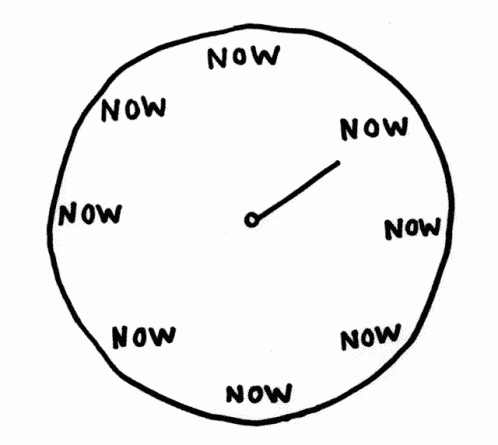
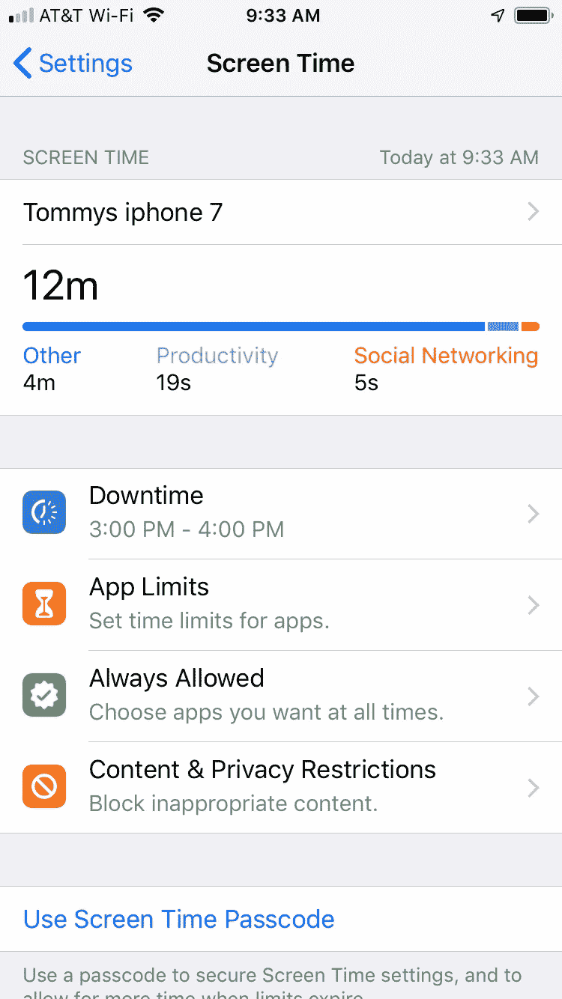
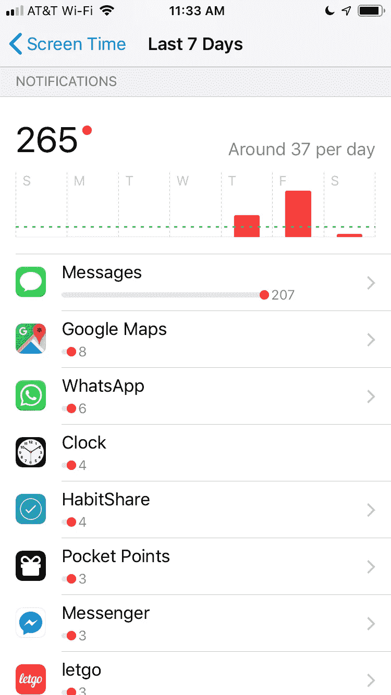

# WTF 是“屏幕时间？”:从苹果第一个试图让你离开手机的功能中真正受益的五种方式

> 原文：<https://medium.com/hackernoon/wtf-is-screen-time-ffcacb387f58>

## 今天，iPhone iOS 12 发布了首个“数字健康”功能。但是应该如何利用它来实现利益最大化呢？

如果你和大多数人一样，你每天会花 4 个小时以上的时间在手机上(有些长达 10 个小时)。这是一个惊人的数据:

# **如果你每天只花两个小时打电话，一年下来就是你一生中的整整一个月。**

我对我在我短暂的生命中花了这么多时间在手机上感到不寒而栗。尤其是因为我还没有学会如何潜水，或者去爬鲍尔迪山，或者读我书架上越来越多的娱乐书籍。

对于我们这些害怕和不安(或者羞愧？)根据我们的手机习惯，并希望在手机上花更少的时间，[苹果](https://hackernoon.com/tagged/apple)今天发布了软件更新 [iOS12](https://hackernoon.com/tagged/ios12) ，其中包括屏幕时间，这是他们第一个帮助跟踪和限制 iPhone 使用的“数字健康”功能。但是应该如何利用它来实现利益最大化呢？

我已经测试了几个星期的屏幕时间测试版，这里有五种方法可以用来支持更健康的手机生活平衡。

1.  **追踪手机时间—** 屏幕时间的核心功能是它的追踪功能。大多数人使用手机的时间是他们认为的两倍，所以看到你实际花费的时间会是一个难以置信的强大动力，让你真实地面对自己，并激发你控制手机习惯的需要。只需打开屏幕时间，并开始跟踪您的使用情况。
2.  **做一些参与现实世界的事情** —停机时间是屏幕时间内的一项功能，允许你安排离开手机的时间。在停机期间，应用程序被锁定不使用，在你和你的强迫检查之间建立了一个障碍。但如果你想作弊，在停机时间使用被屏蔽的应用程序，你只需点击“忽略限制”问题是，习惯是一种奇怪的、不稳定的东西。你可能真的想在今晚 7 点到明天早上放下手机，但是到了晚上 7 点，还有最后一封邮件需要发送，所以你不假思索地点击“忽略限制”。然后那天晚上晚些时候，无聊在床上占据了主导地位，对于一些社交媒体时间来说，突然太容易再次“忽略限制”了。每当你在休息时间点击“忽略限制”，你实际上是在加强你的注意力，削弱屏幕时间对你的帮助。

# **事实是，停机时间是不够的。你不能仅仅通过尝试戒掉一个坏习惯来改变它。**

习惯改变专家发现，成功戒掉不良习惯(如过度使用电话)的人会用一个能提供类似回报的新习惯来取代它。所以这里有一个窍门，当你想放下手机时，在头脑中有一个特定的活动。设置 7pm-8pm 的停机时间来做饭。或者在你去冲浪或者看书的时候做。选择一项你喜欢做的活动，或者一项新的活动(比如我想学的 S.C.U.B.A .潜水)是最好的选择，因为它们感觉很好，并且包含新奇感。在现实世界中，用一项引人入胜的活动来代替使用手机，你将有更好的机会坚持到底并放下手机。

我每天挑选一个醒着的时间，认真地放下手机，做一些与现实世界有关的事情。在工作日，我每天从早上 8 点到 9 点设定休息时间来冥想、做早餐和阅读。在完成这个仪式之前，我不会看手机。这是富有成效的一天的美好开始。事实上，我已经把这个仪式变成了我的生意。我的公司 [Brick](https://www.gobricknow.com/) 通过每天放下手机一小时来帮助人们花更多的时间参与现实世界(点击这里查看我们的[)。](http://www.gobricknow.com/)

**3。压制分散注意力的通知**——习惯改变专家说，能够集中注意力实际上不在于试图集中注意力，而在于抑制错误的事情成为焦点。我们的“注意力肌肉”很容易被消耗，试图忽略每一个叮声和嗡嗡声真的是很累的工作。这就是为什么我们经常屈服于我们的手机，一遍又一遍地检查它们，即使那个大的最后期限就要来了。减少手机干扰的一个方法是减少手机发送给你的通知总数。有了屏幕时间，你第一次可以看到你收到了多少通知，所以你可以真正看到你的手机分心来自哪里。看看那些向你发送通知最多的应用程序，如果可以的话，完全关闭这些应用程序的通知。为此，请前往“设置”中的“通知”，轻按一个应用程序，然后关闭“允许通知”

**4。为无意识使用的应用程序设置限制**——社交媒体旨在让人上瘾。无休止的滚动提要有目的地试图让你迷失在其中。因此，使用应用程序限制屏幕时间的功能，为无休止的滚动设置障碍。我为“社交网络”和“游戏”设置了每天 20 分钟的限制，因为我真的不想再花更多的时间了。当时间到了，我会被从应用程序中删除，并被提醒去做其他事情(见第二条关于如何控制自己)。

**5。和朋友一起做——习惯改变专家发现，当你和别人一起做的时候，尝试改变一个习惯会更容易。这会产生责任感和同伴压力感，因为没有人愿意在朋友面前失败。因此，如果你为自己设定了停机时间和应用程序限制，与愿意和你一起做这件事的人分享这些目标。然后每周一次，约定互相发送你的统计数据截图。它会让你保持诚实。**

就这样吧，现在放下手机，重拾生活！

汤米·索贝尔

Brick 的创始人兼首席执行官

www.gobricknow.com

1.  *尼尔森公司 2016 年观众报告*
2.  *就像查尔斯·杜希格在他的书《习惯的力量》中所说的那样*
3.  我的公司 Brick 致力于帮助人们在现实世界中投入更多时间。我们举办无手机活动，是一个由志同道合的人组成的不断壮大的社区，他们致力于寻找手机生活的平衡。如果这对你有吸引力，你可以在这里 *加入剧组* [*。*](http://www.gobricknow.com)

**这个故事刊登在** [**值得注意的**](http://blog.usejournal.com) **上，每天有超过 10，000 名读者前来了解塑造我们喜爱的产品的人们&的想法。**

[**关注我们的刊物**](http://blog.usejournal.com) **查看更多由** [**期刊**](https://usejournal.com/?/utm_source=usejournal.com&utm_medium=blog&utm_campaign=guest_post&utm_content=brad_armstong) **团队精选的产品&设计故事。**