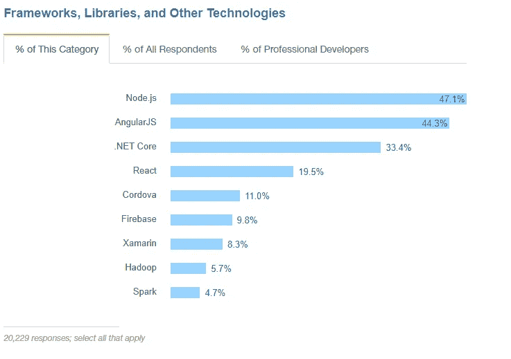

# Xamarin vs React Native vs Ionic:跨平台移动框架比较

> 原文：<https://medium.com/hackernoon/xamarin-vs-react-native-vs-ionic-cross-platform-mobile-frameworks-comparison-53d7fde4cbea>

跨平台移动开发长期以来一直是完全原生工程的可行替代方案。按照经典的原生方法，您会生成两个不同的应用程序:一个用 Java 编写，用于 Android，另一个用 Swift 或 Objective-C 编写，用于 iOS。这种方法非常耗时且昂贵，因为相同的代码必须写两次。另一方面，它确保了与原始应用程序外观和感觉的最高代码一致性。

相比之下，跨平台开发允许工程师编写一次代码，并在所有平台上应用其中的一些部分。通常，这是以性能和应用程序行为为代价的。跨平台工程社区通过不断引入新的方法和工具来努力减少这些缺点。

今天，我们将看看如何使用 Xamarin、React Native 和 Ionic 跨平台框架来构建移动应用。我们将考虑以下比较特征:

*   语言堆栈
*   运行代码和性能
*   图形用户界面
*   社区认可
*   定价

# 跨平台移动开发的优势

在我们仔细研究 React、Xamarin 和 Ionic 框架之间的区别之前，让我们简单讨论一下跨平台开发的核心价值。

根据市场和市场研究，跨平台应用市场的受欢迎程度正在快速增长，预计将从 2015 年的 251.9 亿美元增长到 2020 年的 804.5 亿美元。

跨平台开发是一种允许为多个平台或软件环境开发单个代码库的方法。

所以，跨平台开发的主要优势是:

*   **性价比**。它允许只对一个团队投资一次。
*   **一个技术栈。**开发人员可以使用单一技术组合完成各种工程任务。
*   **可重用代码。**多达 90%的代码可以从一个平台重用到另一个平台，而不是用另一种语言设计相同的功能。
*   **易于维护。**维护和部署变更更加容易，因为不需要在每个平台上单独维护应用程序。

如果你已经决定开发一个跨平台的应用程序，下一个挑战就是决定选择哪个工具。每个框架都有其优点和缺点。我们将考虑 Xamarin、React Native 和 Ionic 框架的基本选择标准，以帮助您做出正确的决定。

*   Xamarin 是微软支持的跨平台移动应用开发框架，使用 C#和封装在。网层。你可以在我们的文章[中找到更多关于 Xamarin 的详细信息，Xamarin 移动开发的好与坏。](https://www.altexsoft.com/blog/mobile/the-good-and-the-bad-of-xamarin-mobile-development/#utm_source=MediumCom&utm_medium=referral)
*   **React Native** 是一个框架，允许使用 JavaScript 和 React.JS 构建接近原生的移动应用(不是“HTML5 应用”或“混合应用”)。在[中阅读更多关于 React Native 开发的信息 ReactJS 和 React Native 的优缺点。](https://www.altexsoft.com/blog/engineering/the-good-and-the-bad-of-reactjs-and-react-native/#utm_source=MediumCom&utm_medium=referral)
*   Ionic 是一个旨在使用 HTML5 和 AngularJS 开发混合应用的框架。

# 语言堆栈

## Xamarin: C#在。网络环境

Xamarin 使用 C#，一种静态类型语言和。适用于所有移动平台的. NET 框架。任何可以用 Objective-C、Swift 或 Java 实现的事情，开发人员都可以用 Xamarin 在 C#中实现。

开发人员不能通过 Xamarin 使用 iOS 和 Android 的原生开源库，但有各种各样的。可用的. NET 库。大量现有的开源和内部源代码项目可以在 Xamarin.iOS 或 Xamarin 中重用。Android 项目多亏了 C#和。NET 框架组合。

## React Native:用 JavaScript 和 React 进行工程设计。射流研究…

React Native 使用 JavaScript，这是目前最流行的高级动态编程语言之一。根据最新的[堆栈溢出调查](https://insights.stackoverflow.com/survey/2017)，在工作中使用 JavaScript 的开发人员数量为 66.7%。这意味着为您的应用程序找到一个开发人员将会非常容易。

React Native 结合了 JavaScript 和 React 的优点。JS 是一个网络框架，由脸书提供支持。React Native 的强大之处在于，当开发人员需要时，它允许用 Objective-C、Swift 或 Java 语言编写模块。使用 React 原生应用程序中的原生模块和库，您可以处理图像编辑或视频处理等计算量大的操作。

## Ionic:使用 JavaScript 的超集——TypeScript 进行开发

Ionic 框架使用 HTML5、CSS 和 JavaScript 等 web 技术来编写和运行应用程序，并需要 [Cordova](https://cordova.apache.org/) 包装器来访问本机平台控制器。Ionic 内核是用 Sass 编写的，基于一个流行的 JavaScript 框架——AngularJS。

Ionic 的主要编程语言是 TypeScript，一般是编译成普通 JavaScript 的 JavaScript 的超集。TypeScript 提高了代码的质量，因为它有助于在代码键入过程中发现并消除错误。使用 TypeScript 是可选的，应用程序可以用简单的 JavaScript 编写。

# 运行代码和性能

## Xamarin。表单和 Xamarin.Android/iOS——构建应用程序的两种方法

一般来说，Xamarin 的性能被认为接近原生。但是 Xamarin 提出了两种开发移动应用的方法:

*   Xamarin。Android 和 Xamarin.iOS
*   Xamarin。形式

**Xamarin。Android 和 xa marin . IOs .**Xamarin.Android/iOS 的应用表现得像本地应用，因为它们的跨平台能力主要专注于共享业务逻辑，而不是代码库。它们使用本机用户界面控件，并利用特定于平台的硬件加速。它有助于实现接近本机的性能，这是在运行时解释代码的解决方案所无法做到的。Xamarin 将 C#编译成机器码，但更多内容将在下面介绍。

【Xamarin.Android/iOS,】Xamarin . forms .与 Xamarin 相反。Forms 专注于广泛的代码共享，而不是特定于平台的行为。96%的源代码可以在 Xamarin.Forms 中重用。根据我们的 [Xamarin 性能研究](https://www.altexsoft.com/blog/engineering/performance-comparison-xamarin-forms-xamarin-ios-xamarin-android-vs-android-and-ios-native-applications/#utm_source=MediumCom&utm_medium=referral)中的测量，与 Xamarin 相比，这在许多操作中显著降低了代码性能。原生和纯原生发展。

至于代码编译，C#在每个平台上以不同的方式编译成原生低级语言。

**iOS 版 AOT。**提前编译( [AOT](https://en.wikipedia.org/wiki/Ahead-of-time_compilation) )用于 iOS。AOT 意味着源代码编译成本地代码发生在应用程序启动之前。

**Android 的 JIT。** Just-in-time ( [JIT](https://en.wikipedia.org/wiki/Just-in-time_compilation) )编译常用于 Android。JIT 意味着代码在运行时以原生方式编译。

JIT 编译根本不适用于 iOS。但是 AOT 和 JIT 都可以在 Android 上使用。

## 反应本机:呈现到本机 API

React 本机性能接近本机，因为它将代码组件直接呈现给本机 API。React 还允许使用用 Objective-C 和 Java 编写的原生 iOS 和 Android 模块。它们不能跨两个平台重用，它们的主要目的是在图像编辑或视频播放等复杂操作中提高性能。代码库的其余部分可以跨平台共享。通常，React 本机应用程序可以共享 80–90%的 JS 代码。使用原生库还可以优化应用性能。

React Native 在 Android 上使用 JIT 编译，但在 iOS 上不提供 AOT。在 iOS 的情况下，它不编译而是解释 JavaScript 代码。

***快注意。*** *编译和解释的区别在于* ***编译*** *将源代码转换成低级语言，而* ***解释*** *直接执行编程语言中的指令，并随时翻译。解释在整个执行过程中花费更多的时间，但分析源代码的时间却更少。相比之下，编译器需要更多的时间来分析源代码，但总的执行时间较短。*

## Ionic:使用网络技术进行渲染

Ionic 的性能不像 Xamarin 或 React native 那样接近 Native，因为它使用 web 技术来呈现应用程序。这种方法大大降低了速度。此外，Ionic 不使用本地组件，而是试图使用 web 技术来重现本地行为。为了将应用程序与本机 API 连接起来，Ionic 使用本机包装器 Cordova，并使应用程序行为适应底层平台。

离子的强大的一面，它的测试过程非常快。它可以在浏览器中立即运行。该框架还附带了许多预先制作和预先设计的组件，这些组件简化了开发周期。

为了运行代码，Ionic 使用 Android 和平台浏览器 WKWebView 的 JIT 编译作为 iOS 的默认编译。正如我们提到的，通常不可能在 iOS 上运行 JIT 编译，但是有一个例外。iOS 上的 WKWebView 支持 JIT。因此，WKWebView 对象用于在应用程序中嵌入 web 内容。WKWebView 提供了 JS 代码到机器码的 JIT 转换，提高了渲染性能。

然而，在复杂和丰富的应用程序中，Ionic 无法获得与 React Native 和 Xamarin 相当的性能结果。

# 图形用户界面

## Xamarin:带有 Xamarin.Android/iOS 的本机外观和 Xamarin 中的自动 UI 映射。形式

Xamarin 允许您以两种方式创建用户界面:使用 Xamarin.Android/iOS 或 Xamarin.Forms

Xamarin.Android/iOS.第一种方法需要使用特定于平台的原生用户界面:工程师可以用原生用户界面控件和布局创建用户界面。这种方法耗费大量时间，但这样的划分确保了移动应用程序的原生外观和感觉。

**Xamarin.Forms.** 第二种方式是使用 Xamarin。在运行时自动将每个页面及其控件映射到特定于平台的界面元素的表单。用 Xamarin。表单可以使开发过程更快，并以牺牲原生外观为代价节省大量资源。然而，Xamarin。对于公司和内部项目来说，表单可能是一个很好的解决方案，在这些项目中，UI 部分不像在公共应用程序中那样重要。

## React Native:与原生 iOS/Android 控制器的交互以及 ReactJS 库的使用

React 原生模块与原生 iOS 和 Android UI 控制器交互，使用户体验接近原生应用。它还使用带有大量 UI 组件的 ReactJS 库，这可以简化 UI 开发。因此，React Native 有许多现成的 UI 组件，如按钮、模块和滑块，使开发人员工作更快。

## 爱奥尼亚:用科尔多瓦创造本土行为

Ionic UI 根本不使用原生组件，而是用 HTML 和 CSS 渲染一切。然后，它应用 Cordova 重新创建本地移动行为。框架自带的 AngularJS 组件也有助于 Ionic 看起来像是原生的。

目前，Ionic 提供了新的原生风格的 UI 元素和布局，这些元素和布局以前在网络上是不存在的，并且只能在 iOS 和 Android 上的原生 SDK 中使用。

# 社区认可

[Github 统计数据](https://facebook.github.io/react-native/)显示，这三个框架中最受欢迎的是 React Native，有 5.98 万颗星星，Ionic 以 3.33 万颗星星排在第二位，Xamarin 以 3.6 万颗星星排在 lat 之后。如此低的 Xamarin 结果可以用这样一个事实来解释，即它最近才成为一个开源产品，仍然需要使用专有的 Visual Studio IDE。

## Xamarin

根据最流行框架的最新[堆栈溢出技术概述](https://insights.stackoverflow.com/survey/2017#technology)，React 也是跨平台工具中使用最多的，占响应的 19.5%。8.3%的工程师使用 Xamarin。虽然 Ionic 没有上榜，但它的核心使用了 Cordova。

*来源:堆栈溢出*

值得一提的是，微软在 Xamarin 社区的教育和发展上投入了大量的精力。由于它的积极支持，在微软生态系统中工作的开发人员可以很容易地开始使用这项技术。还有为新来的人准备的 Xamarin 大学。这是一个电子学习门户网站，包括从初级到高级的课程。

Slack，Pinterest，西门子都用 Xamarin。在我们的专用文章中查看更多 [Xamarin 用例](https://www.altexsoft.com/blog/mobile/10-apps-made-with-xamarin-cross-platform-development-in-practice/#utm_source=MediumCom&utm_medium=referral)。

## 反应自然

React 本地开发人员社区正在快速发展，已经拥有了许多经验丰富的工程师。这使得快速启动 React 项目变得更加容易:1)开发人员可以轻松获得普通问题的答案，2)大型社区已经创建了许多第三方库。

Git Hub 仓库上的 React 原生统计数据令人印象深刻，它是 [GitHub](https://github.com/facebook/react-native) 上第 13 个最受欢迎的仓库。

根据 StackOverflow 技术概述，React Native framework 不仅是最常用的跨平台工具，也是开发人员最喜欢的工具。

*来源:堆栈溢出*

在上图中，我们可以看到 66.9%的受访者高度认可 React，而 Xamarin 爱好者的人数仅占所有受访工程师的 48.7%。同样，Ionic 没有被列入最受欢迎的框架，但它使用了 Cordova，这得到了 38.8%的工程师的高度认可。

脸书、Instagram 和 Airbnb 使用 React Native。

## 离子的

每个平台的成功都依赖于它的社区。Ionic 社区持续增长，根据 [2017 年 Ionic 开发者调查](https://ionicframework.com/survey/2017)，大约 80%的工程师认为自己经验丰富。有一个专门的 Q & A [Ionic 论坛](https://forum.ionicframework.com/)，开发者可以在这里提问并获得答案或建议。Ionic 通过 Slack 社区提供其 Slack 频道，开发者可以在这里与世界各地的其他 Ionic 工程师合作。 [Ionic](https://stackoverflow.com/questions/tagged/ionic-framework) 关于 StackOverflow 的问题比 [React Native](https://stackoverflow.com/questions/tagged/react-native) 多，但比 [Xamarin 少。](https://stackoverflow.com/questions/tagged/react-native)

Ionic 生态系统也在成长，并在专业 IT 服务公司中获得了新的合作伙伴，如 [Webjunto](http://webjunto.com/) 、 [Spatial Vision](https://www.spatialvision.com.au/) 和 [keensoft。](http://www.keensoft.es/en/)

卡特彼勒，柴油和目标使用离子。

# 定价

## Xamarin

Xamarin 已经成为 MIT 许可下的开源产品。尽管可以免费使用，但您仍然必须安装 Visual Studio IDE，它是专有的，是在订阅的基础上分发的。对于最多有 5 个用户的非企业项目，它是免费的。但是某些功能被锁定在专业版和企业版许可证之后。企业版的用户年费为 2999 美元，专业版为 539 美元。

## 反应自然

React Native 是一个完全开源的项目。你可以免费使用它和它的库。

## 离子的

Ionic 在注册和开发期间也是一个开源框架。但是有一个名为 [Ionic Pro](https://ionicframework.com/pro/pricing) 的配套平台，它有三个包:开发人员、团队和业务。订阅费用从每月 29 美元到 199 美元不等，并提供额外的功能，如更多天的错误历史跟踪和协作工具，允许管理大型团队的离子工作。

# 最后一条建议

**反应原生。得益于其开源发行版和 JavaScript 语言，React Native 是一个通用框架。如果您刚刚开始一个移动开发项目，之前没有移动经验，我们建议您首先考虑这个框架。雇佣一支 React 本地开发团队会容易得多。虽然 React Native 可以实现代码重用(某些应用中高达 90%的共享代码库)，但该框架背后的想法是使用单一技术，并根据最终平台的具体情况调整源代码。**

**Xamarin。**如果您已经有了。NET 团队使用微软产品、云解决方案或 Visual Studio 来完成其他任务。如果您需要高性能、可靠性和支持，这也是一个不错的选择。另一方面，Xamarin。Forms 允许您开发企业应用程序，其中 UI 不如功能重要，但代码共享的简化开发是至关重要的。

**离子型。** Ionic 是上述三种框架中最经济实惠的。由于 web nature，您甚至不需要专门的移动团队。我们建议使用它来开发中等流量的应用程序、企业解决方案或针对特定事件或任务的简单临时应用程序。

然而，这并不意味着你不能将 Ionic 用于全方位的公共应用。Ionic Pro 为设计高级应用基础设施提供了一个很好的机会，随着框架的不断发展，它可能会在未来变得更好。

***喜欢这个故事？为我们鼓掌，让更多人发现它！👏***
原载于 AltexSoft 的博客:*[*Xamarin vs React Native vs Ionic:跨平台移动框架对比*](https://www.altexsoft.com/blog/engineering/xamarin-vs-react-native-vs-ionic-cross-platform-mobile-frameworks-comparison/#utm_source=MediumCom&utm_medium=referral)*