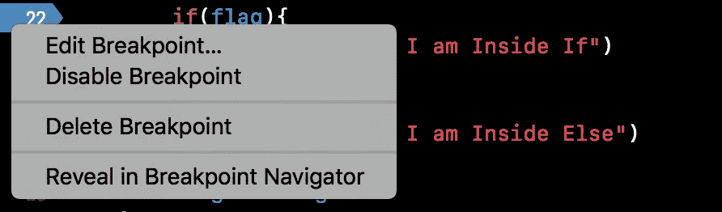
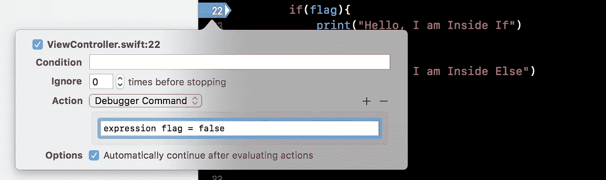
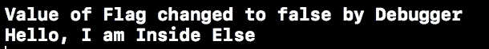
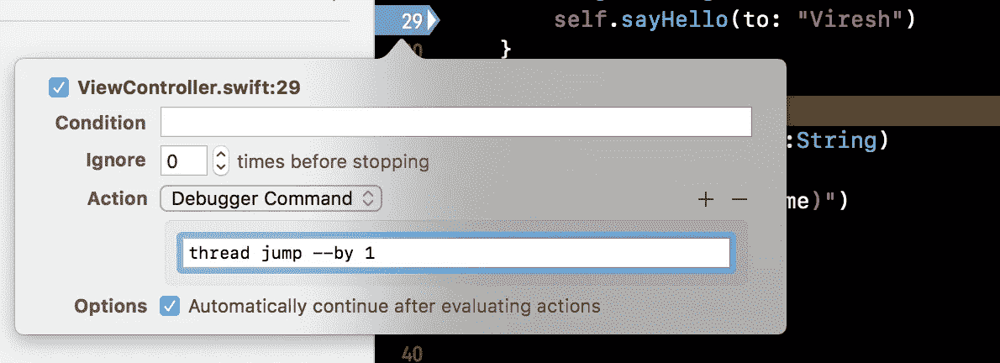
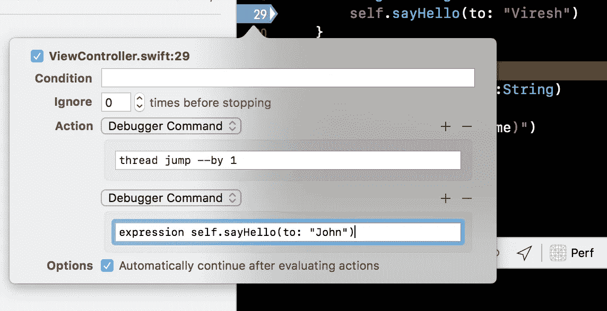

# XCode 高级调试

> 原文：<https://medium.com/hackernoon/xcode-advance-debugging-a60f57065d3f>

H 你有没有遇到过这样的情况:在修复一些 bug 时，甚至在开发过程中，为了模拟代码中的一些场景，你临时修改了现有的代码来实现这个场景？

这是很常见的，你更多的花费是重新编译代码，并重新开始调试，以使修改后的代码生效。

当你需要一次又一次地修改某些东西并一次又一次地重新开始调试时，这变得更加严重。

如果您的应用程序是一个简单的应用程序，这可能对您来说不是问题，但考虑一个需要登录的应用程序，您需要浏览各种屏幕并执行各种操作，以实际到达可以执行您修改的代码的情况或屏幕。

你可以在不重新编译和重新启动调试的情况下，在同一个调试会话中实现这一点，是的，你可以做到！

让我们试试看。考虑下面的代码，我需要更改`flag` 的值，只是为了输入第一个 if 条件来调试一些问题。

```
if(flag){
     print("Hello, I am Inside If")
}
else{
     print("Hello, I am Inside Else")
}
```

1.  只需在 if 条件上设置一个断点，然后运行应用程序。

2.一旦命中断点，右击断点，选择 ***编辑* *断点*** 。



3.点击 ***添加动作*** ，在*调试器命令*字段输入以下代码。(如果调试器命令选项在默认情况下没有在组合框中选择，请更改它并手动选择调试器命令，然后输入以下代码)

```
expression flag = true
```

4.另外，选中选项“ ***评估动作*** 后自动继续”。*选择此选项将允许调试器在评估提供的表达式后继续运行，而无需暂停控制，即使断点已启用。您也可以选择不选中它。*



5.继续被暂停的断点执行，从下一次执行开始，该标志将根据上述表达式自动设置为 *false* ，而不会因为断点而暂停，甚至不会重新编译代码。

这只是一个非常简单的例子，演示了如何插入带有断点的表达式。现实生活中的情况可能不仅仅取决于一个标志，很可能你需要插入多个语句来执行。

你甚至可以为更复杂的场景配置多行表达式，但是要记住每一行代码前面都应该有*表达式*。

例如，如果我只想在此自定义断点更改此标志的值时打印日志，我可以将调试器命令更新为:

```
expression flag = false
expression print("Value of Flag changed to false by Debugger")
```

一旦再次运行，每次执行该语句时都会打印日志。



## 跳过指令集:

除了插入指令之外，您还可以配置断点来跳过调试临时使用的一行或多行。当您想跳过一条指令，或者用其他临时指令替换一条指令，或者更改传递给方法调用的值时，这可能是必需的。

说，我们有以下代码

```
func someOtherMethod(){
     //Some other code 
     self.sayHello(to:"Viresh")
     //Some other code
}func sayHello(to name:String)
     print("Hello \(name)")
}
```

现在，在调用`sayHello` 方法时，我们想用其他值调用它，而不是“*权限*”。因此，要这样做，我们实际上可以跳过这条指令，插入一条具有新值的新指令。

1.  只需在`self.sayHello(to:”Viresh”)` 上放一个断点，运行你的 app。
2.  点击断点后，右键**和*编辑断点*** 并选择 ***添加动作*** 。(上面我们刚做的方式)。
3.  在*调试器命令*中添加以下表达式。



此语句将导致调试器跳过应用此断点的指令。

5.现在添加一个新的调试器命令来代替跳过的指令实际执行。只需在弹出的编辑断点行的 ***动作*** 中点击 **+** 即可添加指令。整个断点应该如下所示:



6.只需继续断点，您将看到更改生效，无需重新编译或重新启动调试。

因此，这里发生的是，我们在这个调试会话中，用一个新指令替换当前指令。

需要记住的几个要点:

*   您可以在调试器命令中添加多行代码，可以在同一个调试器命令中添加，也可以通过添加多个调试器命令来添加。
*   编辑断点时，调试应该处于活动状态，并且应该在您正在编辑的断点处暂停。
*   如果禁用断点，调试器中提供的指令将不会生效，只有在断点启用时才能看到它们的动作。

调试愉快！