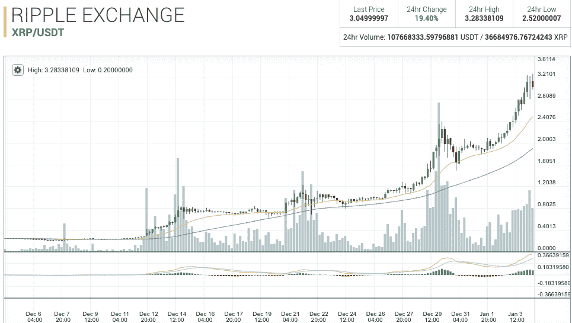
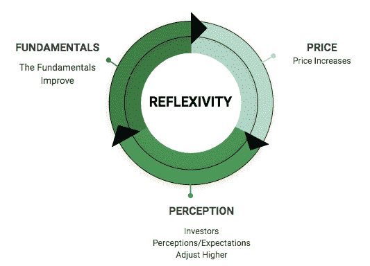
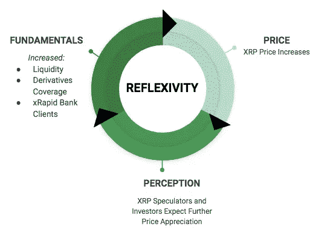

# XRP:涟漪的二分法

> 原文：<https://medium.com/hackernoon/xrp-the-dichotomy-of-ripple-2cce13d3241f>

# XRP 到底怎么了？

在过去的一个月里，Ripple (XRP)上涨了近 1400%，尽管有周期性的回调，但没有放缓的迹象。

* Poloniex chart

# **长期 XRP 基本面分析**

Pugilist Ventures 在 2017 年 12 月初发布了一份 [19 页的报告](https://view.attach.io/H1gCgXezM)，分析了 Ripple(该公司)和 native asset (XRP)。我们强调了 Ripple 优秀的公司基本面和 XRP 的投机投资潜力——高风险高回报。

XRP 的基本面基本上是其成为金融机构准储备货币(QRC)的长期概率。我们说“准”是因为我们不相信央行会不战而降地完全放弃本币。**通往 QRC 的道路需要包括以下领域的显著增长:**

*   流动性和做市商
*   允许银行对冲其资产负债表上外汇风险的机构衍生品
*   让金融机构登上[x current](https://ripple.com/solutions/process-payments/)+[x rapid](https://ripple.com/solutions/source-liquidity/)的奇特和非奇特走廊

# **短期 XRP 交易分析**

加密空间目前正处于投机性的“泡沫”狂潮中。在这种情况下，基本面分析在短期内变得不那么重要，因为与基本面相比，投机者会根据情绪和贪婪进行交易。在我们上个月发布报告后，Pugilist 向我们的内部投资者网络推荐了 XRP 交易。我们指出，尽管 XRP 面临长期障碍，他们的价格走势和技术分析图为价格上涨做好了准备。当时，XRP 的交易价格在 0.25 美元到 0.30 美元之间。鉴于我们没有水晶球，我们没有预测具体的价格目标，但我们确实看到了一个有趣的二分法的形成。

# **二分法**

Pugilist Ventures 维持对 XRP 的投机性基本面评估和积极的短期交易观点；同时。此外，如果 XRP 在 2018 年保持其指数增长，那么根据[反身性理论](https://en.wikipedia.org/wiki/Reflexivity_(social_theory))类似乔治·索罗斯，其长期基本面可能会变好。

# **反身性理论**

简单来说，反身性是一个由三部分组成的过程，通过这个过程，资产的价格上涨会推动投资者的预期上升，从而积极地改变资产的基本面，导致价格进一步上涨。冲洗并重复。

# **XRP 的反身性**

反射性价格升值和预期可能会大幅增加 XRP 的需求和主流采用。*比如*，想象一下如果 XRP 在 2018 年取代比特币(BTC)的市值。这种投机性需求激增将大幅增加流动性和潜在的衍生品覆盖范围，这将有助于更多银行(更少的反对者)加入 xCurrent + xRapid，从而改善 XRP 的基本面，即通往 QRC 地位的道路。

# **总结**

我们认为，推动 XRP 的主要是投机行为。然而，这种投机实际上可能通过增加市场流动性、衍生品覆盖面和主流采用作为交易和价值储存的媒介来增加 XRP 的长期成功概率；同时为未来的 QRC 辩论埋下种子。所有这些都为 Ripple 最重要的业务目标提供了动力，即发展使用 xCurrent 和 xRapid 进行全球支付的金融机构。只有时间能告诉我们这条路是否会给涟漪和 XRP 带来成果。

—
**免责声明:**本文作者和 Pugilist Ventures 均不提供投资、财务或法律建议。提供的内容仅供参考，不应被解释为任何投资机会的任何类型的投资邀约。