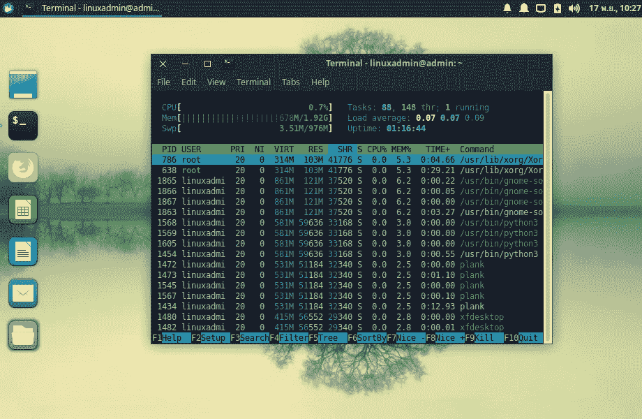

# xubuntu——学校里最好的 Linux 桌面？

> 原文：<https://medium.com/hackernoon/xubuntu-best-desktop-for-linux-in-school-cb7377ce8eed>

为我们学校的电脑寻找新的桌面[，我想看看不同的桌面环境。选择范围很广，选择几乎是无限的。今天我想从 Xubuntu 开始。Xubuntu 是 ubuntu 的衍生版本，它使用 Xfce 而不是 GNOME 作为桌面。这是 Xubuntu 在](https://openschoolsolutions.org/which-linux-distributions-are-best-for-schools/)[项目网站](https://xubuntu.org/)上对自己的描述:

> *Xubuntu 是一款优雅易用的操作系统。它附带了 Xfce，这是一个稳定、轻量级和可配置的桌面环境。*
> 
> *Xubuntu 非常适合那些希望充分利用其台式机、笔记本电脑和上网本的人，这些电脑拥有现代的外观和足够的功能，可满足日常高效使用。它在旧的硬件上也能很好地工作。*

Xubuntu 提供了它所承诺的吗？是对硬件要求不高的现代台式机的最佳妥协吗？我想用我们的标准仔细看看。

# 稳定性

安装没有任何问题。在今天的大多数情况下，这不再是一个问题🙂。在我的测试中，到目前为止我没有发现任何稳定性问题。

# 支持

与 Ubuntu LTS 相比，Xubuntu LTS 提供 3 年而不是 5 年的支持。5 年当然更好，但通常我们最迟 3 年后会更新形象。在服务器上，更长的支持期比在桌面上更重要。

# 硬件要求低

对 Xubuntu 的硬件要求相当低。他们推荐 1GB 内存和 20GB 空闲硬盘空间。启动后，Xubuntu 消耗大约 500MB 的内存。但是一旦你用几个标签启动 Firefox，消耗就迅速上升到 1GB 以上。因此，您应该安装至少 2GB 的内存。否则 Xubuntu 比 ubuntu 用 GNOME 或 Unity 要节俭得多。

# 使用方便

这一点比较主观，因为多年来大家已经习惯了桌面环境。不管是 Windows、macOS、Unity、Gnome、Xfce 还是 KDE——我都可以继续列举。例如，我已经非常习惯于 [Unity](https://openschoolsolutions.org/why-i-will-use-unity-ubuntu-18-04/) 并与之相处融洽。我发现很难切换到 GNOME 或任何其他桌面环境。在学校里有更多的“带宽”。我觉得在学校用 Linux 的话在这里也做不了那么多错事。对于您的大多数学生和教师来说，桌面环境将是全新的。更重要的是提供介绍、培训和研讨会，让同事们适应新环境。总的来说，你可以决定你更喜欢 Windows 10 还是 macOS“风格”。

Xfce 有一个开始菜单，可以用 dock 扩展(比如 [Plank](https://launchpad.net/plank) )。这应该有助于大多数人在一段时间后找到自己的路。

# 现代而美丽

默认情况下，Xubuntu 的外观是相当老式的，既不漂亮，也不是特别现代。您可以使用包管理器来安装额外的主题，使 Xfce 桌面更加美观。一个是 Arc 或 Numix 主题。我也发现 [Qogir](https://www.xfce-look.org/p/1230631/) 这个主题很有趣。

# 结论

Xubuntu 肯定会成为我们学校 Linux 桌面的候选。这主要是因为硬件要求低。一旦 linuxmuster.net[V7 作为测试版发布，我们将在我们的学校环境中测试 Xubuntu。如你所知，大多数困难和绊脚石只有在你实际使用的时候才会出现。即使你能把它变得更漂亮，看起来还是有点不舒服。虽然 Ubuntu 18.10 中新的 Ubuntu 主题还是比较好看。](https://openschoolsolutions.org/tag/linuxmuster-net/)

*原载于*[*openschoolsolutions.org*](https://openschoolsolutions.org/xubuntu-best-desktop-for-linux-in-school/)*。*