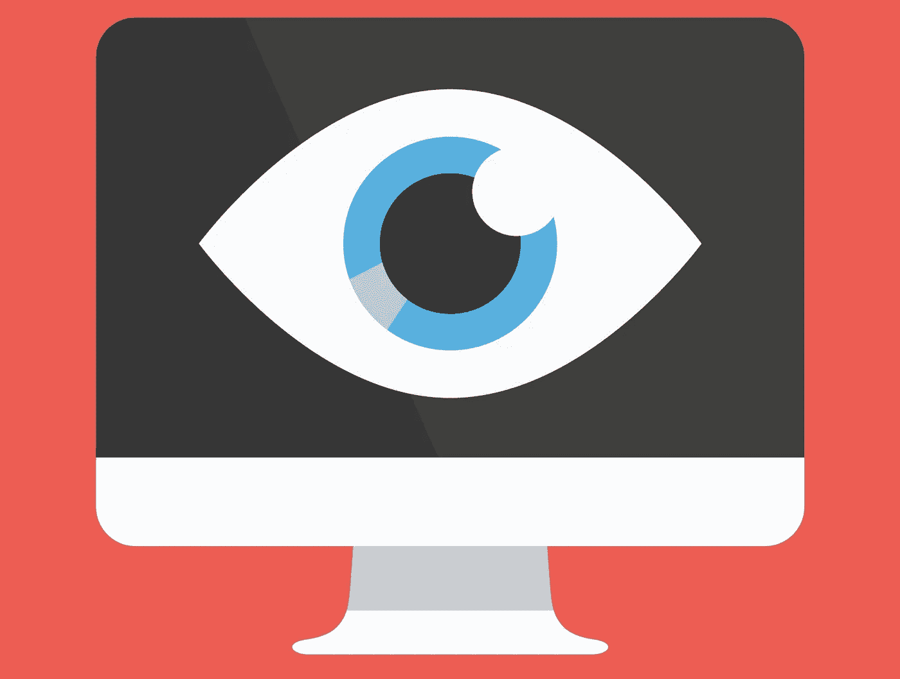

# 耶，这不是妄想症！一个关于我的梦想和广告定位的故事

> 原文：<https://medium.com/hackernoon/yay-it-wasnt-paranoia-a-story-about-my-dream-and-ad-targeting-346dce6da86e>

流鼻涕药广告的目标人群可能是勤奋的员工，经常去办公室，但最近几天没有去上班，这有时会变得很可怕。在过去的几年里，我逐渐意识到，我很高兴在我整个成年生活中都不信任信用卡，只在紧急情况下使用它们。

现在我要告诉你几个例子。只是一个旁注——我的律师建议我在这里和那里稍微温和一点，因此整个故事是我的拙见，可能与现实世界没有什么关系。很多都只是一个梦。

所以，我做了一个梦，人们可以根据他们的银行账户余额和他们的购买行为成为目标。例如，“此人已为人父母六年”的定位可以这样重新表述:“他或她五年前在特定的零售网络中通过支付终端频繁购物。”“这个人住在这个特定的社区，并且在他们的账户上有超过 100，000 美元”的目标是从经常光顾的商店中得出的，如果有两个集群，那么这个位置很可能更靠近郊区。

然后，好的谷歌有一个[功能，可以在 Gmail 收件箱中读取一个人最近的消息](https://support.google.com/google-ads/answer/6105478?hl=en)。当然，这是机器人做的。它可以从中提取某些关键词或主题，将它们与用户的个人资料对齐，并显示广告。至少，有传言说这个功能还在测试阶段，尽管我不知道它是否会进入生产阶段。这样，你可以在收到竞争对手的电子邮件简讯后调整产品的特价(哈哈)。你甚至可以确定具体的承包商并锁定他们。长话短说，你可以做很多有趣的事情。

还有什么？网站上的推荐服务都是关于大众个性化的。它们被嵌入到网站中，它们可以知道你通常购买什么(从多个在线资源共享的数据库中)，并根据你的硬件、网络浏览器、地理位置和一系列其他因素对你进行大致的描述。

移动网络运营商可以根据人们的地理位置和他们所知道的一切来锁定他们——访问过的网站列表，你打电话最多的朋友，在某些国家甚至包括你的护照信息。幸运的是，并不是所有的都利用了这一系列的功能。在你最喜欢的购物中心附近的商店打折是这种类型的典型优惠。最“感人”的是，这些优惠的措辞并没有暗示运营商知道用户的位置。

可以将文本消息发送给那些在竞争对手网站上购买商品的人(操作员可以看到订单页面加载的事实)。它们也可以发送给那些真正走进竞争对手销售点的人和那些联系竞争对手呼叫中心的人。同样，我在制药行业的熟人最近讨论了针对接触应召女郎的人的“性传播疾病”目标。

让我们来看看无线网络。在其中一个案例中，一家咖啡馆的营销人员知道他们的许多游客也是活跃的地铁乘客，当这些人在地铁里通过公共 Wi-Fi 上网时，他们会给他们分配唯一的标识符。这使得他们可以向这些观众发送有针对性的广告——不一定是当顾客在地铁或咖啡馆时——而是在任何地方。这项技术由许多公司提供:你可以安装一个 Wi-Fi 路由器，它将为你的客户分配标识符，这些 id 将成为公共 Wi-Fi 网络中的再销售令牌。因此，如果您使用需要您的电话号码才能连接的开放无线网络，那么您就可以被识别。

接下来，当你去安装了路由器的地方时，他们可以看到。这是因为当你连接到一个已知的 SSID 时，MAC 地址不会改变。公关人员不必把它带到明显的“免费 Wi-Fi”阶段——只需比 probe 更进一步几步就足够了。这就是参加主要会议和研讨会的访问者数据库的收集方式

我甚至不会细说那些出于各种目的使用你的麦克风的令人讨厌的应用程序，也不会细说那些识别嵌入在收到的信息中的图像文本的电子邮件服务:“为了你的方便。”优步需要 24 小时定位做什么？为了我的方便，他们似乎又解释了一遍。一些出租车服务甚至为低收入客户提供折扣——有些人可能会觉得这是奉承，但我不是其中之一。不管怎样，这些做法已经被官方否认过几次了。

无论如何，当我们的系统管理员曾经说他担心他的键盘，因为它使用了一个非加密的无线信道，任何人都可以拦截信号，我很高兴告诉他现代在线生活的其他警告。嗯，键盘问题似乎不再那么困扰他了。

有趣的是，我们已经不得不接受这一切。是的，整个系统都在看着你。然而，这已经成为一种常态，在不久的将来，隐私将会是一个非常模糊的概念。这只是道德规范的转变，仅此而已。顺便说一下，我最近和一位在德国零售公司工作的分析师聊过。在了解了一些营销“创新”后，她表示，这些东西中有许多在她的国家是被禁止的，她认为它们是不可接受的，因为不管付出什么代价，针对特定人群都是一种令人厌恶的策略。然而，我们还没有发现这些禁令有多有效。此时，你可以通过使用 [VPN](https://en.wikipedia.org/wiki/Virtual_private_network) 和 [TOR](https://www.torproject.org/projects/torbrowser.html.en) 甚至 [Tor over VPN](https://www.ibvpn.com/2017/02/maximize-your-privacy-with-tor-over-vpn/) 来获得一些额外的保护，但这很可能不会持续太久，因为所有 VPN 和 TOR 的所有服务器都为真正需要它们的人所知。