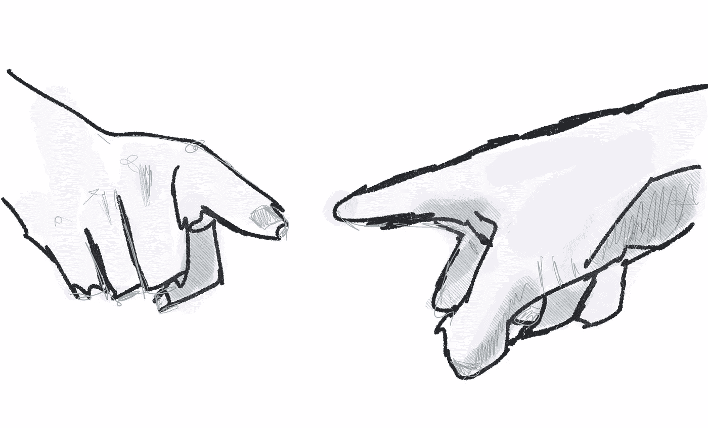

# 是的，但是…

> 原文：<https://medium.com/hackernoon/yes-but-43a03e52ff38>

在大多数功能失调的情况下，每个人(多少)都是“对的”。

**是的**，【对方】不完全信任你。

**但是**…你也不会完全信任【其他人】。这是一个循环。

**是的**，技术债务越积越多，而你几个月来一直对此束手无策。

**但是**…你挥动的手已经近乎有毒的愤怒。这是一个循环。

**是的**，有人在微观管理你。

**但是**…你还故意把他们排除在对话之外，竖起一堵墙。这是一个循环。

当有一个长期的问题困扰着你的团队和/或公司时，很有可能*参与其中的每个人*都有一个合理的“理由”,并且也表现得很糟糕(或者至少传达出不信任、防御和怀疑)。

一个例子:

我经常写关于限制正在进行的工作和基于拉动的工作流。追求高利用率的环境面临的挑战是,“问题”可能会失控，并以各种方式表现出来，让人感到恶意、受自身利益驱动和不体谅他人。

> 他们是故意不给我的项目分配时间吗？
> 
> 为什么他们看不到我们完全被淹没在这里！
> 
> 这个团队总是错过最后期限。他们还在乎吗？
> 
> 我们直接跳到下一个项目。没人在乎做得好不好！
> 
> 呃。他们能不能停止抱怨一秒钟！

在你知道之前，症状——二阶和三阶效应——被视为问题。它变成了一个领导问题、责任问题和文化问题。这变成了一个“我们只需要合适的人担任合适的角色”的问题。事情变得严重了。你已经从一个迫在眉睫的可解决的问题变成了许多许多棘手的问题。更糟糕的是:人们会为谁有资格(或有最好的计划)解决这个大问题而争斗，这本身——权力斗争——会成为一个更大的问题。

像一次加载太多工作这样“简单”的事情可能会失控。在《少年维特之烦恼》中，歌德写道:

> …在这个世界上，误解和忽视比诡计和恶意制造了更多的混乱。无论如何，后两种情况肯定要少得多。

然而，我们似乎倾向于责备个人而不是系统

> 个体倾向于(1)如果他们是行动的实施者，将行动的原因归因于外部因素，但如果他们目睹他人实施行动，则归因于内部因素(行动者-观察者偏差)；(2)把别人的失败归因于内部因素，而把自己的失败归因于外部因素，把成功归因于外部因素(自私自利的偏见)；以及(3)基于行动者的观察到的行动来推断一个人是什么样的(例如，“愚蠢的”、“有动机的”、“有风险的”)，即使这些行动受到外部因素的约束(对应偏差)。

即使没有恶意，我们也被告知看起来近乎愚蠢。

更复杂的是(引用我的人力资源朋友的话):

> 许多管理理论非常强调“人”和过程(人们被期望做什么)，而不是系统。你首先要寻找表现不佳的人，并“从他们身上获得最大收益”。当糟糕的事情发生时，并不缺少表现不佳的人……因为滚雪球效应。你已经把你的角色押在能够解开这个问题并解决它上。试图修复人员和流程实际上比试图帮助系统自我修复或找出人员和流程之间的空间要容易得多，尤其是当问题变得越来越根深蒂固时。但很快，你的努力帮助实际上是伤害。

总之。这里没有什么突破性的东西。

只是提醒你要挑战自己，为你目前的困境想出一些解释…并为不涉及愚蠢、无能、恶意、自私和明显不良的当前行为的夫妇留有余地。是什么天真地引发了这一切？这个问题之前是什么问题？你有什么贡献？你个人会如何重新设定并把事情带向一个新的方向？