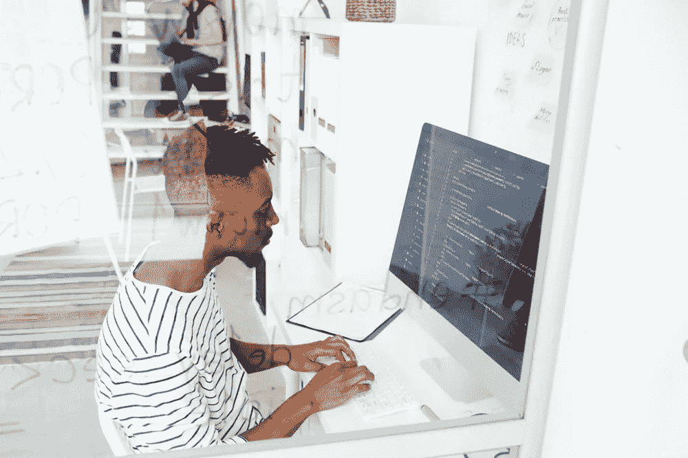

# 是的，我们可以创造移情的人工智能系统。这是我们开始的方式

> 原文：<https://medium.com/hackernoon/yes-we-can-create-empathetic-a-i-systems-this-is-how-were-getting-started-4a14303d06>

现在，我们这些在人工智能前沿工作的人有一个重大的机会:**我们可以在一个互联的世界中成为一股善良的力量**。

通过影响人们在社交媒体上相互交流的方式，我们有能力帮助将针朝着两个方向之一移动:走向更多的消极、孤立和冲突，或者走向更多的同情、联系和积极。

## 我认为选择后者是我们的责任，人工智能可以增强移情参与。

原因如下。

# 我们许多人在网上互动的方式被打破了。

这就是我们世界的现状。网上匿名给了人们一种感觉，他们可以在任何时候想说什么就说什么——不管这有多残酷。

结果呢？钓鱼、欺凌、假新闻——这些癌症破坏了我们都居住的网络社交领域，有时还会导致悲剧(在现实生活中)。即使交流没有被匿名所掩盖，感知到的物理距离也会在残酷的网络评论的因果之间产生一种脱节感。

然而，令人烦恼的事实是，人们会对这些负面信息做出反应，这让问题变得更糟。负面的、耸人听闻的标题会得到更多的关注，无论它们是在你的晚间本地新闻广播还是你的推特上。

考虑到这一点，我们这些有能力解决这些问题的人需要考虑的问题是:我们能做些什么来鼓励人们进行更积极的互动？

对我和我在 [Sensai](https://trysensai.com) 的团队来说，这个问题看起来像这样:

> 我们如何帮助客户找到积极参与的最佳方式、人员和社区？我们如何获得，然后分享我们需要的洞察力，以避免产生负面反应的参与？

这就是人工智能的用武之地。为了回答上面的问题，我们需要解密真正海量的非结构化数据，而我们唯一能做到的方法就是使用人工智能和机器学习。(这就是脸书和谷歌这样的平台用来调节人们分享的大量内容的做法。)

但这还不是全部。

# 一旦我们理解了这一触发因素，我们就可以利用人工智能来鼓励在文化中更具同情心地使用文字、图像和媒体。

事实上，我们可以鼓励围绕所有话题的更具同理心的参与模式，无论这些话题有多么极端或令人沮丧。虽然使用人工智能来解读情绪还为时过早，但有许多技术和工具正在涌现，可以为更美好的世界奠定基础，无论是在线还是离线。

> 我和我的团队正在为此建立一个模型。

它是这样工作的:用户注册我们的服务，这允许我们的人工智能分析他们的社交媒体存在和参与度。基于用户的特定目标——提高品牌知名度、推广产品、招聘新员工等。—我们的系统提供旨在优化参与度的内容推荐，但特别是通过积极和移情，而不是消极。

这样的系统被独特地定位于改善我们的文化，这是不可否认的断裂。那么，负责这些系统的人就有责任使用它们。

# 本质上，人工智能可以促进对社会负责的社交媒体的使用。

归根结底，关键在于我们如何开发人工智能。

我们应该从教导它人类想要变好开始，并向系统注入一套价值观，鼓励对数据输入的同情观点，然后投射出同情的输出。

这里有一个基本的例子。

如果我们的人工智能认为你应该发布一些关于育儿的东西，因为你的粉丝真的对你发布的最后一个与父母有关的帖子做出了回应，这不会暗示父母残忍地捉弄他们的孩子的视频。(遗憾的是，YouTube 上充斥着这类内容。)它会建议播放一段视频，内容是一位家长用去迪斯尼世界的惊喜之旅或一只新宠物来取悦他们的孩子。

或者，如果一个追随者在你的个人资料上发布了一些讽刺或粗鲁的内容，系统可能会建议基于同理心的回应，而不是与该追随者的消极态度相匹配的尖锐回应。

> 以我的经验来看，这种方法已经证明可以解除武装，将冲突转化为理解——或者至少是停止冲突。

在某些情况下，移情方法确实会违背一个人的天性。然而，如果我们让它变得简单——如果一个人所要做的只是点击，或键入几个词——研究表明，更多的人会做正确的事情。

这是我们已经看到的。例如，考虑一下谷歌最近在 Gmail 中提出的回复建议。

假设您收到一封邀请您参加活动的电子邮件。Gmail 提供了这样的回复:“是的，我很乐意！”，“听起来不错！”或者“对不起，我去不了了。”

当然，这个功能的目的是为了节省你的时间。但它也让你免于发出被动攻击、尖刻或讽刺的回应。

> 移情人工智能是指以高效便捷的方式将积极的信息发布到社交媒体领域，从而鼓励你的追随者做出积极的回应。有了足够的动力，你可以积极地影响心情和情绪健康。

对于有良好意愿和使命驱动的公司来说，站在人工智能发展的最前沿是至关重要的，因为这项技术很容易走上另一条路。

社交媒体的影响是指数级的，而且我认为是不可估量的。

这就是为什么我们必须对我们允许影响我们在网上发布和分享的东西的人工智能保持如此谨慎。

> 我知道人们对人工智能有多少恐惧和怀疑。人们担心它会接管世界，潜在地削弱人类的目的，或者以各种其他方式伤害人类社会。

这种怀疑是一件好事，因为它让我们所有在这个领域工作的人都有责任。这迫使我们去思考我们向世界推出的人工智能工具的类型。我们知道我们必须赢得公众的信任，然后随着我们人工智能能力的发展，继续建立在这种信任的基础上。

我们能做到这一点的唯一方法是创造更多积极的互动。

有些日子，当网上欺凌或最新的假新闻丑闻充斥着我们的供稿时，很难相信社交媒体可以成为世界上的一股正义力量。

> 但我真的相信，只要我们人工智能开发者密切监控我们自己的影响，这项技术将创造一个更强大的人类联系。我们会更好地理解彼此。反过来，我们会变得更有同情心。

当我们招募不同的团队，他们有时对语言有不同的理解时，我们有最大的机会扩展我们的共情概念。我们可以一起超越。

这是人工智能真正的权力和责任。