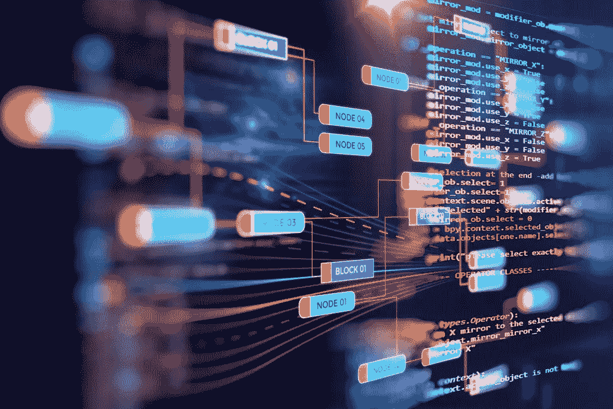

# 是的，我们可以利用区块链上存储的数据。以下是方法

> 原文：<https://medium.com/hackernoon/yes-we-can-make-use-of-the-data-stored-on-the-blockchain-heres-how-f941fea6e511>

现在，有数百万比特的 T2 数据存储在每个公共的 T4 区块链上。它的潜在价值是巨大的。

然而，还没有一种简单的方法来全面地观察它，这意味着我们不能研究它，跟踪它，或者以其他方式很好地利用它。

这是一个失去的机会，也就是说，因为有太多的数据可以利用。例如，如果我们将这些数据植入机器学习模型，我们就可以跟踪趋势，这将有助于我们防止邪恶的用户行为，如盗版或贩毒。

# **目前，我们仅将区块链用于交易目的。**

我们使用比特币区块链从一个地址向另一个地址汇款。通过以太坊的智能合约，区块链上的单个地址可以调用另一个地址上的函数。但是，数据仍然只用于事务或状态机的目的。

我们需要考虑的是:这些钱是如何转移的？它要去哪里？谁在做什么？我们能识别哪些地址是骗子或恐怖分子的地址——黑暗网络的枢纽？

想象一下如果我们能标记这些地址。然后，我们可以生成一个模型来阻止资金流向我们知道属于恐怖分子、毒贩或其他不良分子的交易所或地址。

这将证明对个人、公司和情报机构是有用的。但这种功能也能让我们获得一定的经济洞察力，比如预测一个代币随时间推移的价格的能力，我们可以通过跟踪投机和运动的趋势来做到这一点。

# **问题是，我们还没有一种机制可以帮助我们进行跟踪。**

用户可以查看区块链，并访问与他们和他们周围的人所做的交易相关的信息，但他们不能在更大的范围内或以有意义的可视化方式这样做。在以太坊，很容易通过[以太扫描](http://etherscan.io)追踪一个用户，但不是一次追踪一堆用户。当然，这阻止了我们利用这些数据做有潜在价值的事情，比如追踪资金流向。

原因之一是区块链本身仍处于概念验证阶段。它的数据结构已经被证明是合理的，但是它还没有发展到提供明显效用的程度。它仍然只是一种存储数据的机制。但是现在有了大量的数据，这就相当于一座未开发的金矿。

但这种情况很快就会改变。数据在*那里*——它在那里被使用，它在那里被实验。

# ***现在*是时候开始利用区块链上的数据创造效用了。**

在许多方面，区块链的污秽类似于早期阶段的互联网。

当互联网刚刚起步时，它实际上只是一个相互连接的计算机社区。当然，这个社区产生了数据，但是并不多。

但是，当越来越多的人开始使用它时，数据量呈指数级增长。人们意识到，如果他们要能够使用这些数据——从这些数据中学习、访问、阅读，以一种让其他人能够找到的方式创造更多的数据——他们将需要某种增强的搜索能力。

这也是搜索引擎——以及后来的社交媒体平台——诞生的一个重要原因。

区块链也将面临类似的清算。仅在以太坊和比特币上，就已经完成了数百万笔交易。ico 已经创建。我们已经进入了一个新时代，在这个时代，这项技术已经被广泛采用，其规模与 90 年代初的互联网相似。

# 我们需要的是专门为利用这些数据而设计的应用程序。

这种技术已经广泛应用于其他领域。有些公司(如 [Palantir](https://www.palantir.com/) )收集和分析与电话、银行账户和信息相关的数据，并将这些信息提供给 FBI，以协助搜索嫌疑人。可以很容易地构建类似的东西来跟踪、分析和利用从各个区块链收集的数据。

我们所需要的是一个建立在这种哲学基础之上的界面，以及专注于回答诸如“我在寻找什么？我要找哪些地址？”

公司开始提供这种功能只是时间问题——但是越快越好。许多价值可以从区块链的可用数据中获得，但是区块链也是公共的和完全分散的，这意味着任何人都可以在上面做任何事情。任何人都可以创建一个地址并转移资金。

建立帮助我们追踪和使用区块链数据的机制不仅仅是一个机会。这是保护我们的资金和数据安全的一种方式。