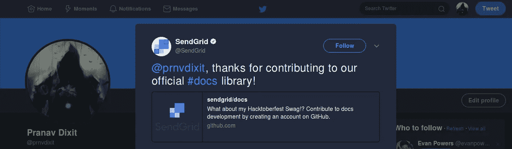
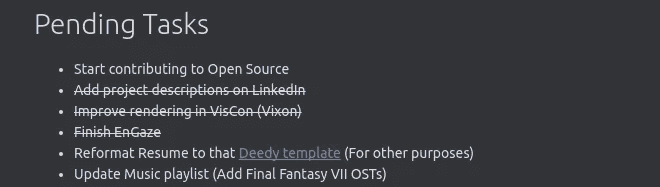
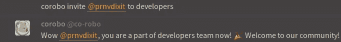
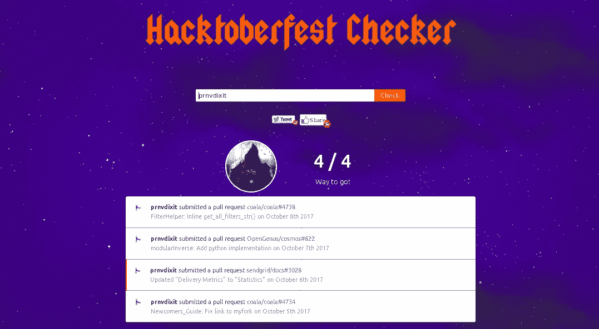

# 又一次为开源做贡献的旅程

> 原文：<https://medium.com/hackernoon/yet-another-journey-of-contributing-to-open-source-6443077b204f>

## 并且作为一个初学者潜入这个 OSS 世界！

Courtesy — Pixabay

> “利用你的天赋、爱好或职业，让你为这个世界做出贡献，这才是真正的出路。”
> 
> —西蒙·津德文

最有可能的是，你在狂热地搜索 Reddit 主题、Quora 答案和其他详细描述的博客帖子时偶然发现了这一点— *“如何开始为开源做贡献”*。嗯，这个帖子和他们没什么区别。

不，等等，回来！这不是复制品。只是你可能仍然对投稿感到困惑，甚至在读了那些博客之后。这篇文章给了你帮助(大概是😛)关于我开始为 OSS 做贡献的旅程的见解。

最有可能的是，你会觉得自己不适合做这件事。很好——真的。几周前，我也处于同样的境地，感觉完全一样。

大约一年来我一直在努力为开源做贡献(自从 GSoC'17 的通知出来以后！).

不管你的背景或经验如何，我可以肯定地告诉你一件事——开始很难。

你必须首先突破“冒名顶替综合症”。如果你不清楚它的意思，**谷歌一下！**这是开始前你需要的第一条也是最重要的建议。

然后，你必须找到一个你想参与的项目——这是最令人生畏的。屡试不爽的方法是——找到你感兴趣的东西。它可以是一种语言，一个你日常使用的软件/工具，或者一个你一直想成为其中一员的组织。

说到底，戒不戒由你自己决定。相信我，如果这是你一直想做的事情，你就不太可能这么做。对我来说，是 Python 一直把我拉回为 OSS 做贡献。

**Isn’t it awesome when an organization like SendGrid tweets to you!**

一开始，什么都不说得通。你不会熟悉组织的提交指导方针、工作流程、编码指导方针等等。

最重要的是，你会看到成千上万行代码像迷宫一样躺在那里。你不知道怎么出去。

我希望你现在也处于同样(或者更好)的状态——迷茫和困惑。

但事实证明，项目的开发者/维护者和你自己一样清楚这些问题。他们知道我上面告诉你的一切。你想知道怎么做吗？……..嗯，他们也是从初学者开始的😉。

因此，如果您需要任何帮助，请随时在频道上联系他们。请记住，在问这个问题之前，你应该总是提到你做了哪些努力——你看过相关文件了吗？你看了项目的投稿指南了吗？你面临哪些错误？

让我告诉你，即使在代码库周围呆了几个星期，我在理解部分代码时仍然面临问题，并且必须定期咨询维护人员或其他开发人员。毕竟我还是这个代码海洋里的一条业余鱼。

# 进行了一次尝试！

整整一年，我都在查看过去的 GSoC 和 GCI 组织(通常，对新来者非常欢迎的组织会被选入其中——这是我希望从我的第一个组织中得到的)。

我会选择其中的一些，浏览他们的 Bug 追踪器/在 GitHub repo 中列出的问题，并看到一些“新人”/“初学者”/“待价而沽”/“第一个问题”标签的问题。

大多数情况下，它们都是一些琐碎的变化，比如文档中的拼写更正，更新文档字符串。但是，请记住*“冒名顶替者综合症”*(我告诉你谷歌一下——这是下一件要记住的事情，在你弄清楚之前讨论的事情之前不要继续)——我实际上从未做出贡献。

经过 3 个月左右的徘徊，最终我选择了“coala”(嗯，我发现一些博客提到它对新人非常友好)作为我的第一个 org。

但我不知道的是，甚至在参与项目之前就存在障碍。耶！设置您的开发环境。我试着使用可用的说明进行安装，但无法安装。我在频道中提出了这个错误，给出了尽可能多的细节——包括我尝试过的解决方案、我咨询过的 StackOverflow 答案、错误日志和消息。该项目的维护者之一 John (@jayvdb)在报告中提出了这个问题。

我等了大约 2 天，这个问题才得到解决。两天后，看到在这个问题上没有任何进展，我就离开了这个频道，并想到永远不再回到 OSS。

**The effort it took to cross that measly task on top 😅**

这是一个多么大的错误啊！——这引出了我的下一个建议，你需要耐心寻找答案。那些人自愿为这个项目做贡献，从他们的日常事务中抽出时间。他们也是人，就像你一样有真实的个人生活——尊重这一点。
大约在这个时候，我认为我可能还不够好，不适合做开源的事情。

另一件对我不利的事情是没有寻求直接的指导——我确实认识一些已经或正在努力进入 GSoC 的高年级学生和队友。但是我太害怕征求他们的意见了——主要是因为我认为这意味着冒着被看起来像个傻瓜的风险。这需要我的下一个建议，问！。是的，如果你问的是经过充分研究的问题，没人会说你是白痴。

与此同时，甚至进入开源的想法也在学术和自我项目之间的某个地方消失了。

# 返校节！

今年夏天，当我在做我的实习项目时——我通过我的一个朋友又一次有了为开源做贡献的想法，他的导师是 coala 的一名开发人员和一名 GSoCer。

不过这一次，我决定向开源迈进一步。我又试了一次，这一次，幸运的是，我能够在我的机器上设置 coala。但是实习又很忙，我不得不再次离开。

我结束了实习，回到了大学。尽管如此，我还是把“开始为开源做贡献”放在了我的待办事项列表的首位。然后，我开始忙于正在进行的实习季节。

在制定了暑期实习计划后，我决定再次为 coala 做贡献。我又看了一遍安装指南、文档、git 基础知识、提交指南、评审指南和 git 一般工作流程。

在接下来的几天里，我查看了更多的问题，制作了新的问题，帮助其他新加入的人，审查了其他的拉请求。在一周左右的时间里，我完成了 coala 的开发流程，并被提升为 coala 的开发人员。

**And a bot carried out my coronation! 😄**

我现在如此全神贯注于这些复习资料，甚至在考试期间也继续这样做(是的，甚至自我控制都变得很难)。虽然那学期我的成绩受到了打击，但我很开心。第一次，我觉得自己很有用😀。

总的来说，我学到了很多东西，无论是大的还是小的细节，这些都是任何学术课程都无法教给我的。

此外，正如我后来知道的那样，有一些像 Hacktoberfest、Mozilla Winter of Security 等活动。除了像 GSoC，GCI 这些提倡开源的热门网站。看看这样的激励是否能对你起到鼓励作用。我也很幸运地偶然发现了 [Hacktoberfest](https://hacktoberfest.digitalocean.com/) 。

Courtesy — [https://hacktoberfestchecker.herokuapp.com/](https://hacktoberfestchecker.herokuapp.com/)

# 最后的话

你们中的许多人可能会这样想——“但是我什么都不知道”…。**错了！**。甚至任何一种语言的*基础知识(甚至非[编程](https://hackernoon.com/tagged/programming)语言也可以——所有项目都有许多文档任务)都足以开始为某个项目做贡献。重点是——从某个地方开始。*

特别感谢米沙，拉塞，约翰和米希，在我需要的时候帮助我。更重要的是*不是*给我答案，而是鼓励我自己去解决它们。

顺便说一下，我有机会指导一些新人——2017 年谷歌代码中的中级难度任务。在指导他人的过程中，我实际上更清楚地理解了一些事情。因此，我最后的建议是，帮助他人——这有助于你更好地理解事物。

# 外卖食品

*   害怕入门没关系，其实挺难的。无论如何，你不需要阅读完整的代码来开始。从某个地方开始。问问题——没有人会因此而对你评头论足。

不是每个人都是天生的天才，你的理解可能会有漏洞——你必须提问。

> “怀疑是好的。困惑是极好的。提问很牛逼。所有这些都是扩展心灵智慧的尝试。”

*   [提问前先做研究](http://catb.org/~esr/faqs/smart-questions.html)。没人会为你这么做。另外，要明白这是为你好。搜索文档、指南/说明、自述文件或谷歌一下。
*   确信你已经理解了到目前为止谈话中的事情，不要留下任何怀疑的痕迹。当基本的东西被错误地理解时，事情真的变得更加混乱和难以解释。
*   要有耐心。有时，复习可能需要一周以上的时间。在这种情况下，你可以做的一件事就是自己开始复习。这将缩短审查队列，并帮助您快速获得审查。
*   在旅途中帮助他人。这也意味着如果你需要任何帮助，你可以[联系我](mailto:prnvdixit@gmail.com)😄

 [## prnvdixit (Pranav Dixit)

github.com](https://github.com/prnvdixit)