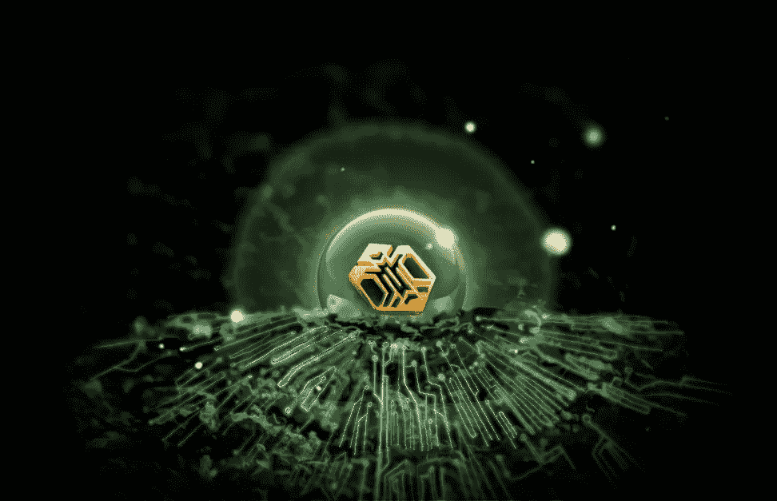
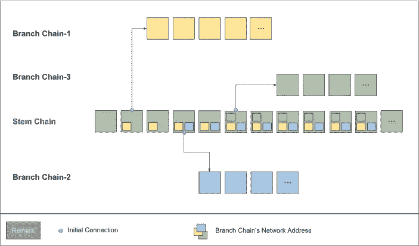
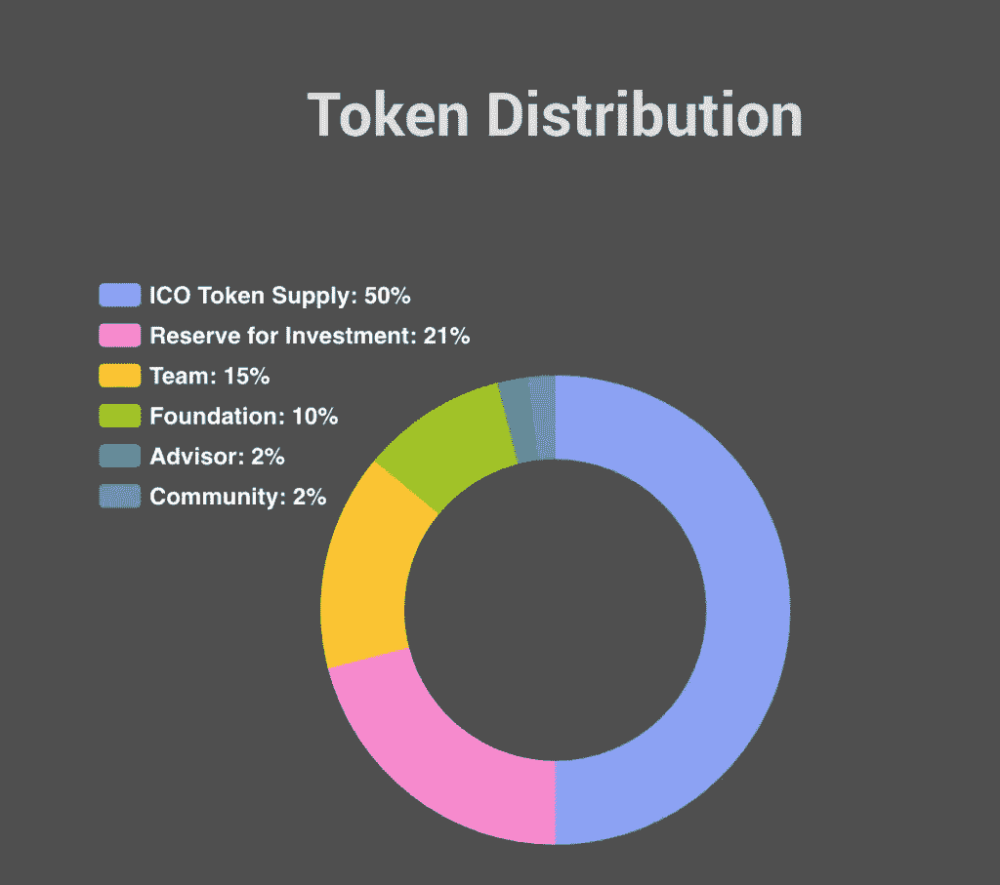
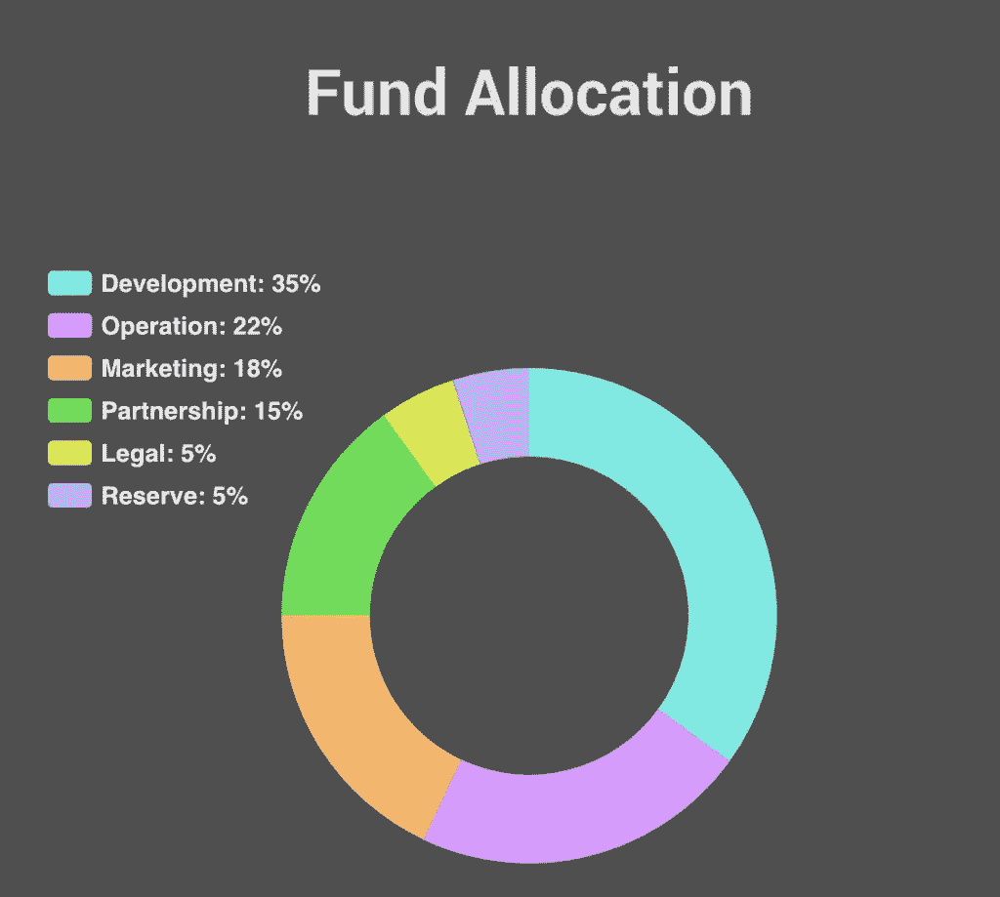

# ygdrash(YEED)——“区块链 3.0”基本面分析

> 原文：<https://medium.com/hackernoon/yggdrash-yeed-blockchain-3-0-fundamental-analysis-bf311f1113c8>

# YGGDRASH 到底想解决什么问题？

YGGDRASH 将自己称为区块链 3.0，梦想着一个每个产品和服务都相互连接的世界。这是一个基于信任的多维区块链生态系统，其中每个分支机构都由声誉来管理，以确保完整性。它建立的愿景是“将一切数字化为现实”，并连接一切和任何区块链网络。

用户还可以使用他们的分支链初学者工具包开发自己的区块链网络和分支链。

YGGDRASH 生态系统即将推出分散式交换，允许投资者使用快速安全的加密交换，而无需将资金转移到第三方平台。反过来，这将防止类似最近发生的黑客攻击。

# 为什么叫 YGGDRASH？

YGGDRASH 是两个词的组合，**ygdrasil**和 **hash** 。Yggdrasil 是一棵巨大的神话之树，可以追溯到 13 世纪。这棵树被认为是神圣的，因为它连接着从地下到天堂的世界之井。Hash 代表在区块链交易和网络中使用的散列值。

从本质上来说，YGGDRASH 是一个旨在使用基于信任的**多维区块链**连接所有区块链的渠道。

# YGGDRASH 生态系统

## YEED——生态系统的主要货币

YEED 是生态系统的主要货币，是用来维护网络的工具之一，也是一种交易手段。它存在的最大原因是连接和维护 YGGDRASH 生态系统上的区块链网络。

每当创建新的区块链时，它不会自动注册到 stem 链。YEED 令牌用于将区块链连接到主网络，随着时间的推移，YEED 将被逐渐消耗以维护网络。

## “茎链”和“支链”

茎链作为区块链的主根，聚集并与所有连接的支链相互作用。分支链可以是独立的区块链或 dApp，有能力拥有自己的治理体系。白皮书指出，支链不应与侧链相提并论，因为它们是根本不同的。

## 圣水——声誉得分评估链

YGGDRASH 有一个名为“圣水”的信誉评分评估链，它激励用户进行有益的活动&在网络上做出贡献，同时限制恶意用户。

你的声誉得分越高，你能得到的好处就越多，其中之一就是费用更低。有了足够高的信誉评分，使用网络时就不用支付任何费用。这个系统类似于高信用分数的人在使用银行的某些服务时不必支付费用。

为了在 YGGDRASH 生态系统中获得更高的声誉得分，用户需要在网络上做出贡献和投入时间。

# 圣水喷泉——声誉得分创造链

与圣水一起工作，圣水喷泉是生态系统的声誉得分创造链的名字。它本质上是一种算法，旨在增加在生态系统中检测到其有益活动的用户的分数。

除此之外，YGGDRASH 将运行一个系统来监控和惩罚那些意图恶意获取信誉分数的用户。

# YGGDRASH 相对于竞争对手的优势

## “零”网络费用——信誉评分系统

Yggdrash 通过应用声誉来调整区块链目前的收费结构。YEED 是一种加密货币，是评价信誉的标准之一。

YGGDRASH 的共识算法，把权限给了信誉高的人。YEED 会对用户的口碑进行评估，口碑好的人不需要为“赞”付费。这一特点本质上与高信用评分的个人支付更少的交易费用，而财务结构稳固的公司获得更高的信用评级的原理相似。

## 最小化块数据大小

YGGDRASH 生态系统使用 Akashic Records & Block Box 来最小化块数据的大小。通过这样做，他们解决了当前区块链存在的问题，包括数据容量问题和受限制的块同步速度。

这种数据缩减将显著减少准备节点的工作量，并将延迟从几天缩短到不到一小时。相比比特币下载一个完整节点需要 14 天，以太坊需要 7 天，这要快得多。

## 授权证明(DPOA)

YGGDRASH 的共识算法是一种授权证明，是一种基于信誉的算法。通过 DPOA，生态系统通过信誉评估链选择信誉得分最高的节点作为代表。DPOA 确保独立性、激励和可扩展性，同时增加连接性。

## 每个 DApp 都是一个独立的区块链

生态系统中的一个 dapp 是一个独立的区块链，因此本质上每个 Dapp 维护自己的网络、治理、数据库和服务。一个 Dapp 上的过载不会影响其他网络。

这提高了数据容量、速度和可扩展性。YEED 改进的一个例子是，当网络由于来自 Crypto Kitty 的大量网络流量而瘫痪时，将其与以太坊网络进行比较。

## 分散式交换机

YGGDRASH 即将推出自己的分散式交易所(DEX ),网络用户可以直接在个人钱包中交易加密货币。

在这个多维区块链上，互操作性得到了保证，因为 YGGDRASH 可以将区块链与不同时期创建的其他区块链连接起来。他们通过阿卡西切片，一种链式连接协议来做到这一点。

## 综合跨境支付提供商

该生态系统正与 Bluepan 密切合作，以改善生态系统中的汇款环境。YGGDRASH 本质上将扮演综合跨境支付平台提供商的角色。

# 基于以太坊弱点的区块链 3.0

YGGDRASH 称自己为区块链 3.0，扩展并最小化以太坊生态系统的弱点。其主要竞争对手是“第二代区块链”以太坊，以及其他区块链平台如 EOS、ICX、0Chain 等。

目前以太坊存在许多问题，包括:

*   可扩展性有限，因为所有 DApp 数据都在单个区块链中处理
*   类似于比特币的经济激励的局限性
*   高昂的汽油费

YEED 解决了这些问题，因为网络上的每个 DApp 都有自己的区块链，使它们具有更大的扩展能力。

# 基本原则

## 团队

YGGDRASH 由一个强大的团队组成，成员来自以前享有盛誉的区块链公司，如 ICON、Bithumb、Coinone。该团队还包括来自卡内基梅隆大学和伯克利大学等顶级学校的顾问。

*   **David Seo(首席执行官)** —之前:Coinone(韩国一家中型交易所)的首席运营官，Meritz 证券公司的项目经理
*   **Peter Ryu(首席技术官)** —之前:ICON Foundation (ICX)的联合创始人/开发团队负责人，THELOOP 的区块链架构师
*   **Joon Seo(首席财务官)**——之前:加州大学伯克利分校 MBA 候选人、安永会计师事务所& Young Korea、安永会计师事务所& Young China Shanghai、现代卡/Capital

YGGDRASH 顾问团队由来自现代资本、汇丰银行、花旗银行、三星和许多其他知名公司的高管组成。目前还不清楚这些顾问在这个项目中的参与程度。此外，据称该公司还与汇款市场最大的公司 Bluepan 合作。

## 目标市场

YGGDRASH 的目标是行业对行业，将不同的 DApps 和区块链网络连接在一起。他们也瞄准了个人和公司。

## 示例用例:乘车共享

Peter 在他的智能手机上设置了一个商务会议，会议在特定的时间和特定的地点举行。当他离开大楼时，一辆无人驾驶汽车正等着他。当他上车时，它会通过一条最佳路径将他带到目的地。到达目的地后，他下车前往会场。

YGGDRASH 在这种情况下如何操作？一旦会议日程确定，安装在他智能手机上的 YGGDRASH(或 DApp)就会呼叫最近的无人驾驶汽车。当分配了最近的、最有信誉的无人车后，汽车立即到达接车点，等待彼得。乘坐费用将在 Peter 上车后立即上传，并在到达后立即支付。

就在付款之后，无人驾驶汽车的声誉上升，来自付款的收入自动分配到无人驾驶汽车分支链的相关账户。想要投资无人驾驶交通工具的人可以通过购买运营无人驾驶交通工具的分支链的代币来投资。如果彼得没有出现，彼得的声誉得分将会降低，并且下次呼叫无人驾驶车辆将会在成本和时间上处于劣势。

# ICO 和 Tokenomics

YGGDRASH 的 ICO 在不到 24 小时内完成，通过私人投资者和公共预售投资者筹集了 40，000，000 美元。不需要公开主销售。

在 Lunar Digital Assets，我们认为 YGGDRASH 是一个非常雄心勃勃且具有潜在破坏性的项目，他们将自己命名为区块链 3.0，改进了以太坊等其他主要代币的弱点。该项目有一个全面的，经验丰富的团队，改变游戏规则的技术，和一个伟大的社区支持令牌。然而，他们有许多工作要做，将会有许多障碍、挑战和竞争对手。然而，我们认为，对 YEED 的投机性持有可能是一项非常有益的长期投资。

**免责声明:**我们与 YGGDRASH 团队没有任何关系。这也不意味着是财务建议。接下来的内容，只是反映了我们对这个项目的理解，以及我们对其前景的个人看法。[永远做你自己的研究。](http://cdn.yggdrash.io/docs/Yggdrash_WhitePaper_En.pdf)

如果你喜欢这个内容，请在这里订阅[我们的邮件列表。您将获得 Lunar Labs 的早期测试版，这是一套优化您的加密货币交易体验的工具，以及直接发送到您电子邮件的最新加密新闻和市场更新。您也可以通过](http://bit.ly/2ozZ20H)[点击此处](http://bit.ly/2GUSqRl)访问我们的网站，了解更多我们的工作！

*原载于 2018 年 3 月 27 日*[*lunardigitalassets.com*](https://lunardigitalassets.com/insights/2018/yggdrash-blockchain-3-0-review-analysis/)*。*