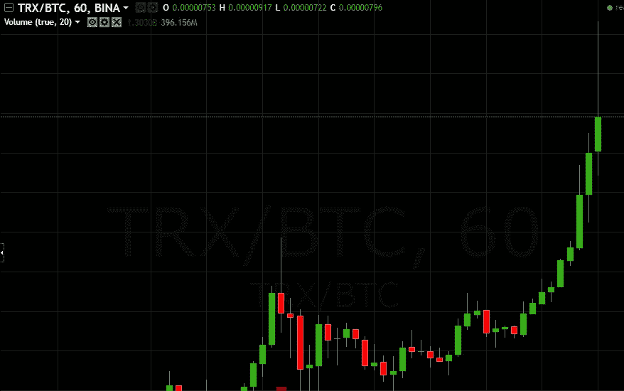

# 哟嗬哟嗬！我的秘密生活！

> 原文：<https://medium.com/hackernoon/yo-ho-yo-ho-a-cryptos-life-for-me-7a5487ce8103>

1 月 3 日早晨，我醒来时，眼前是一片绿色的海洋，还有[*【ATH】*](https://hackernoon.com/tagged/ath)*的市值，但在这个* [*的世界里，我们永远不会快乐。*](https://hackernoon.com/tagged/crypto)

哟嗬哟嗬，我的秘密生活！

今天早上醒来看到一片绿色的海洋！

欣喜若狂……欣喜若狂……我变得富有了，还搭上了去月球的顺风车！火箭已经准备好并装载完毕。我绑好了，准备拿着它。市值上升，波多里奥上升，硬币上升，我的老二上升！

哟嗬哟嗬我的秘密生活！我要退休了！不再有 FUD 和谎言。我是先令。我要发工资了…终于可以上床了！

我等不及了。我等不及了！

但是等等…为什么为什么它会上升？

修正何时到来？

我好奇，我思考。我辩论着，疑惑着。我心跳加速，手心冒汗，头脑开始溃烂。

为什么，为什么，请告诉我为什么。我需要变聪明！我该怎么办？

销售和繁荣？

霍德尔和掠夺？

我查了一下 reddit，他们说卖！他们对霍德尔说！

我卖卖卖。兑现微笑！

我买了一辆兰博基尼，但也许我应该买辆霍德尔？