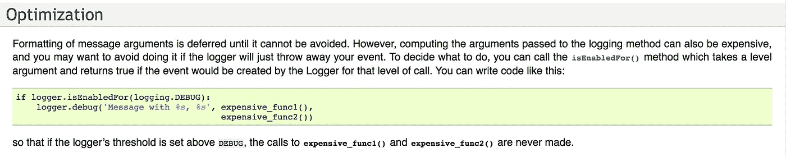

# 你记错了

> 原文：<https://medium.com/hackernoon/you-are-logging-all-wrong-341d4246a6dd>


这篇文章基于几个月前我公司的一位首席工程师发给 R&D 邮件列表的一封电子邮件。

他在电子邮件中描述的场景是如此明显，然而我可以诚实地说——当我回头看提交时，我发现我自己也时不时地这样做。我非常喜欢它，所以我分享了它。

## 需要注意两件事

1.  它在 [Java](https://hackernoon.com/tagged/java) 中谈到了[日志](https://hackernoon.com/tagged/logging)，但是你会看到这个概念很容易被移植到其他语言中。
2.  我们用自己编写的 LogWrapper 对象包装了 log4j，在继续记录收到的消息之前，它会检查系统中的当前日志级别。因此，当你看到 *logger.debug* 时，它是 LogWrapper 类型，当你看到 *m_logger* 时，它是包装的 logger。

这是以错误的方式记录消息的代码示例:

```
List<Stuff> veryLongList = ……// explicit invoke object's toString()
logger.debug(“my long list is “ + veryLongList.toString());logger.debug(“my extra long list is %s”, veryLongList.toString());// implicit invoke object's toString()
logger.debug(“my long list is “ + veryLongList);
```

所有这三个版本都是低效且容易出错的，应该避免。

原因是对 *toString()的调用。*它强制创建一个可能很昂贵的 String 对象，然后传递给 LogWrapper.debug()方法。

要理解这个问题，请看一下*调试*方法是如何实现的:

```
public void debug(Object message) {
   if (ThreadedLogLevelManager.*isDebugEnabled*(m_logger)) {
      m_logger.log(*s_className*, Level.*DEBUG*, message, null);
   }
}public void debug(Object message, Object arg) {
   if (ThreadedLogLevelManager.*isDebugEnabled*(m_logger)) {
      m_logger.log(*s_className*, Level.*DEBUG*, message, arg);
   }
}...public void debug(Object message, Object... args) {
   if (ThreadedLogLevelManager.*isDebugEnabled*(m_logger)) {
      m_logger.log(*s_className*, Level.*DEBUG*, message, args);
   }
}
```

您可以看到，我们首先检查并看到这段代码启用了调试模式，然后才调用执行日志记录的 m_logger。

> 通常甚至不会调用 m_logger，因为调试日志记录在生产中通常是禁用的。

然后，m_logger 本身将消息转换成一个字符串。
你可以在下面看到，它转换成字符串的方式也是我们作为开发人员有时会忘记做的一项重要检查:

```
protected final String convertToString(Object message) {
    return message == null ? (String)message : message.toString();
}
```

这可以防止出现 NullPointerException。

## 正确的方式

记录日志的方法很简单:

```
logger.debug(“my long list is %s”, veryLongList);
```

这有 3 个好处:

1.  仅当启用日志记录时，LogWrapper 才会调用 toString()。
2.  如果有问题的对象为空，它将被记录为“空”字符串，而不是引发异常。
3.  代码更简洁。

这听起来很明显，但是在代码中有大约 100 个这样的例子。

就个人而言，要注意你记录的内容。不要为了记录而记录。

温斯顿·丘吉尔总结得最准确:

> "这份报告，就其篇幅而言，可以保护自己免受被人阅读的风险。"

附注:我的好朋友 elad shmidov 在给我的帖子留言时提到:

> Python 在优化部分的日志[最佳实践](https://docs.python.org/2/howto/logging.html)中也有类似的内容



另一个好朋友/编辑/评论家 [Guy Cepelevich](https://medium.com/u/c8259072fdfa?source=post_page-----341d4246a6dd--------------------------------) 分享了他们在 Ruby 中是如何做的:

```
// define the log method
def log
    logger.debug yield if Environment.type == DEVELOPMENT
end// use it
log {"this is what i want to log: " + String(element_list)}
```

只有当 Environment.type == DEVELOPMENT 时，才会计算花括号中的内容