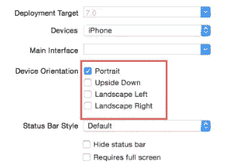
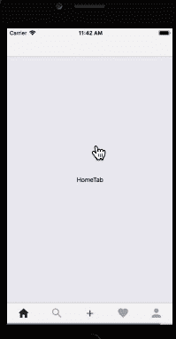

# 你不是一个反动的本地 noob🙅

> 原文：<https://medium.com/hackernoon/you-are-not-a-react-native-noob-c4309ceccd91>

## 在开发✨之前和期间，常见的 React 本机陷阱和概念将对您有所帮助

> React Native 允许您使用 React 的相同知识库，并且您可以进行原生移动应用程序开发。这很有趣🐼


如果你是一名 React 开发人员，并且了解一些本地开发的基础知识，比如 iOS🍎还是安卓🤖然后你会很容易地学会[反应本地](https://hackernoon.com/tagged/react-native)即不是 noob🙈。虽然，不是一一对应的关系。当我最初学习 React Native 时，我忘记了我的 native [development](https://hackernoon.com/tagged/development) 技能是如何被轻易转移的。

以下是 React 原生信息列表，以及作为 React 原生开发人员您将会遇到的问题:

# 整合项目—Expo vs react✨本地 cli

有两种主要的方法来获得一个反应-本地项目:

1.  **世博会**
2.  React 本机 cli。

**Expo** 基本上是一个为新手构建的开源项目，使用 Expo APIs 来帮助快速构建`react-native` 和原型应用。您使用`create-react-native-app`开始了解 Expo。它使您的项目成为纯 JavaScript，您永远不必钻研本机代码。

一旦你准备好发布到 app/play 商店，你基本上可以“弹出”生成 iOS 和 Android 捆绑包/文件夹。(不弹出不能释放)。在这个过程中，当某些东西被转换为本机代码时，可能会出错。不确定你，但这让我很不确定。我不喜欢\_(ツ)_/有太多的魔法。通常很难调试它的根本原因。

> *➕* 你应该在完成每个故事/任务后，在一个设备上构建并验证你的项目。

我建议新手使用 Expo，这样你就可以了解所有东西是如何工作的，尽管与客户一起工作有风险，因为当出现问题时，调试会变得更加困难。

对于 React-Native cli，您可以使用`react-native-cli init`创建一个全栈项目。它生成 Android🤖和 iOS🍎文件夹和文件📁作为一名开发人员，这给了你如此多的可见性。**没有弹出步骤，因为你得到的是默认生成的项目文件夹。**只要您的环境符合最新要求，您就可以立即进行构建并在设备上运行。除非你做一些疯狂的事情，否则这是可行的。✨

# 布局组件💄

您使用 [Flexbox](https://facebook.github.io/react-native/docs/flexbox.html) 风格在页面上布局组件。如果你还不知道 Flexbox，这里有一个很棒的🔗[链接](https://css-tricks.com/snippets/css/a-guide-to-flexbox/)学习借鉴。React-native 还提供了本机特定的组件，比如`Text, View, etc.`你通常将组件包装在`View` 中，因为`View`被设计成嵌套在其他视图中，并且可以有 0 到许多任何类型的子组件。

> *➕* ***提示*** *:* 记住，你是在为不同的设备构建。因此，尽量不要硬编码太多的值，因为“top: 5”对于不同的设备大小会有不同的定位。
> 
> **手机可以旋转**如果这是你的应用程序的一个要求，那么在编写 CSS 时，你需要同时考虑纵向和横向模式。*💄*

我还建议使用[样式组件](https://www.styled-components.com/docs/basics#react-native)💅更多的是一个设计系统。

# 你没有编码🙅对于浏览器🕸

即使感觉如此，你也不是在为🕸浏览器编码，请时刻记住这一点。在进行 web 开发时，您的浏览器会提供**窗口**对象，您可以轻松访问 **setTimeout** 🕐举例来说，但没有本地的对等词，你不会知道发生了什么。

> 现在，这甚至可能在调试构建期间起作用，在调试构建期间，您可能有热重装设置，因此浏览器可能会注入，看起来好像它起作用了。尽管如此，它不会在发布版本中使用，因为它不能访问许多常见的 web API。 🕸️

有很多 npm 包📦在编写包的时候要记住 web，所以这可能也不会起作用，所以在为你的项目选择包之前要小心。也看看它们的包依赖关系，以确保你准备好了。大多数图书馆都非常擅长记录它，快速的谷歌搜索也会告诉你同样的信息，所以先这么做吧！💯

# 异步存储🗑️

机器人🤖和 iOS🍎两者都有相同的存储空间，因此你可以在设备上存储数据，当你卸载应用程序时，这些数据会被删除。

React Native 提供了一个非常有用的 API，称为异步存储，它在两个平台上都做得很好。就像在浏览器中使用本地存储 API 一样，使用 AsyncStorage 的方式也是一样的。

> **在 iOS 上，** **AsyncStorage 由本机代码支持，将小值存储在序列化的字典中，将大值存储在单独的文件中**。**在 Android** ，**上，AsyncStorage 将根据可用情况使用 RocksDB 或 SQLite。**

用户故事示例，

> 作为用户*💁*，我想在登录一次后保持登录状态，即使我关闭了应用程序

在这种情况下，您可能希望使用异步存储。当用户使用登录按钮登录时，存储用户信息或令牌，下次他们回来检查令牌是否存在且尚未过期，并相应地向他们显示您的主屏幕或登录屏幕，这样他们就不必重新登录。

# 异步等待🕐

请记住，这是一个本机应用程序。有一个 UI 线程正在响应用户的手势。现在有了 async await，程序可以在异步任务进行的同时运行其他代码，比如手势响应器和渲染方法。因此通过使用`async await`🕐，您可以同时运行您的代码🎉，例如:

```
const storeUserInfo = async (token) => {
    try {
      await AsyncStorage.setItem("userToken", token);
    } catch (error) {
      console.log(error);
    }
};
```

# 别以为你不会开 Xcode🍎或者安卓工作室🤖

作为一名 React 原生开发者，不要指望永远不会打开 Android studio(Android 的 IDE)和 Xcode(iOS 的 IDE ),因为你很可能会这样做。你越熟悉，对你越有利。

**用户故事示例:**

> 作为用户*👩*，我希望应用程序不要旋转，这样我会有更好的用户体验

从开发人员的角度来看，这意味着您希望将设备方向锁定为仅纵向模式。这是每个平台都有的设置。你必须对 Android 的`androidManifest.xml`和 iOS 的复选框设置进行修改。



iOS config for locking orientation

🍎[https://stackoverflow.com/a/32177887/188130](https://stackoverflow.com/a/32177887/1881309)9

🤖[https://stackoverflow.com/a/44485271/1881309](https://stackoverflow.com/a/44485271/1881309)

➕提示:在你的谷歌搜索中加入“React Native ”,它会帮助你获得更好的搜索结果。💯

# 资产📷

资产是您的图像、音频和视频文件，但最常见的场景是图像。我想不出没有图片的应用程序🤷。

用户案例示例:

> 作为用户*👵*，我想在登录后台看到公司的 logo

因为我们的目标是不同的 iOS 设备🍎和安卓系统🤖每个设备的分辨率不同，因此我的建议是提供 2 倍、3 倍的图像。React Native 在根据不同的屏幕密度挑选正确的图像方面做得很好。

```
company-logo.png
company-logo@2x.png
company-logo@3x.png
```

> 例如，`company-logo@2x.png`将用于 iPhone 7，而`company-logo@3x.png`将用于 iPhone 7 Plus 或 Nexus 5。如果没有与屏幕密度匹配的图像，将选择最接近的最佳选项。

通过采用这种方法，你的应用程序会看起来很漂亮💄而且不会像素化。

# 航行



Navigation example (iOS)

React Native 为 React 导航提供了大量不同的库。其中最受欢迎的是[反应本地导航](https://github.com/wix/react-native-navigation)。

尽管图书馆很好，有很多⭐.我发现它不适合初学者，因为它需要一些本地特定的设置。即使我有本地开发经验，我个人也很难设置它。对于 JS 开发人员来说，它也有一个巨大的学习曲线，因此我会推荐使用[https://reactnavigation.org/](https://reactnavigation.org/)。这个图书馆花了我 5 分钟⏲入门，非常容易使用。

# 调试与发布版本🚀

调试版本主要用于开发，发布版本用于生产，即应用商店🍎玩商店🤖部署。在开发过程中，您正在运行一个调试版本，其中有热重新加载🔥以及远程调试的能力。当您需要在设备上测试它时，您需要一个发布版本。

当您想要在非开发环境中的设备上运行应用程序时，您需要运行以下命令来为您生成发布版本。让我们来看一个 iOS 示例:

```
node node_modules/react-native/local-cli/cli.js run-ios --configuration=Release
```

# 应用生命周期如何对应组件生命周期🚲

React 组件生命周期🚲正确对应 Android 中的活动生命周期或 iOS 中的屏幕。因为你通常构建你的 React 应用程序，你会为 React Native 做同样的事情，所以在组件在`componentDidMount`中渲染之前获取数据等等。

> *但是，你如何知道应用程序是在后台还是前台(非常特定于本机)？你可以从 react-native 获得`AppState`，它基本上有事件监听器，你可以在应用程序进入后台或前台时监听它。以下是一些示例代码:*

```
import { AppState } from 'react-native';class App extends Component {
  componentDidMount(): void {
    AppState.addEventListener("change", this._handleAppStateChange);
  } componentWillUnmount(): void {
    AppState.addEventListener("change", this._handleAppStateChange);
  }// state can be active for foreground and inactive when transitioning between background and foreground
  _handleAppStateChange = (nextAppState) => {     
    if (nextAppState === 'background') {      
       console.log('App is in background!')     
    }
  }
}
```

希望这篇文章对你有用💯它让你很好地理解 React 本机如何工作，以及它如何对应本机开发。🙌

请给它一些👏如果你喜欢的话🙏并在评论中分享你的反馈经验🙌

💌如果你觉得这篇文章有帮助，那么你会喜欢我的时事通讯。我每周写一篇时事通讯，内容涉及前端开发、领导力、职业发展、我的内容创作之旅，以及许多我在其他地方不分享的幕后故事。

👉如果您想了解更多或订阅，请访问下面的链接。:[https://kulkarniankita.com](https://kulkarniankita.com/)