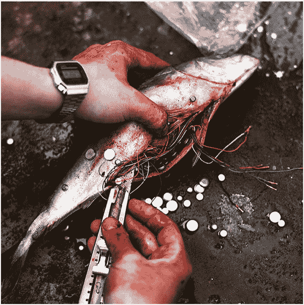
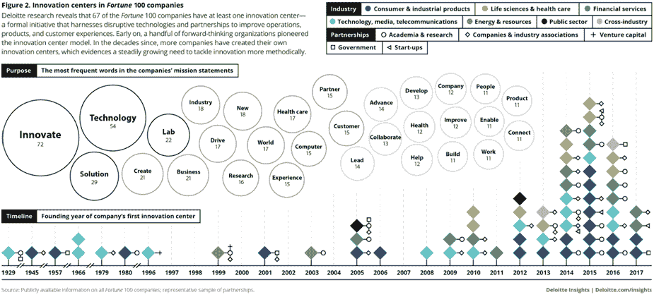
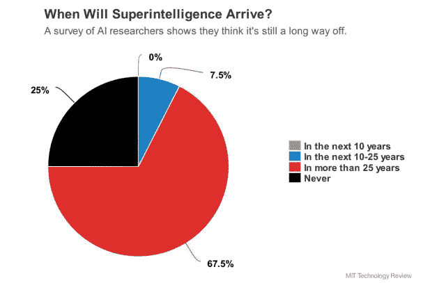

# 你还没有为未来做好准备:指数级技术可能是一场噩梦

> 原文：<https://medium.com/hackernoon/you-are-not-ready-for-the-future-exponential-technologies-can-be-a-nightmare-6fc21c822efb>

[Source](https://www.instagram.com/p/Bamnsd4AxzH/)

假设你刚刚采用了一种新的加密技术。它能抵抗基于量子计算的攻击吗？在你的数据和信息被泄露之前，你有足够的时间掌握后量子密码学吗？当然，你可能与信息安全无关。但是，这种未来情景会对你的业务甚至整个行业产生什么影响呢？

或者想象一下，早上你在新闻中读到:“强大的人工智能已经被创造出来，并正在开发其自身的更高级版本”。值得开始担心吗？以任何可能改变我们世界的技术为例:区块链、量子计算、完全放弃法定货币转而采用加密货币、生物技术，最后是强大的人工智能与人之间的互动，并在精神上加速他们从“未来某个时候”到“今天晚餐前”的出现。在最好的情况下，我们会陷入一场彻底的混乱。最坏的情况是——一场难以置信的灾难在等着我们。

平衡点在哪里？这个看不见的“卢比孔河”，在跨越之后，领导组织在制定发展战略时应该考虑哪些这样的指数力量？科技巨头已经开始行动了——Google X 和 DeepLearning、IBM Watson 和其他项目，它们的存在标志着商业。此外，他们愿意分享他们的经历。这允许开始试验、孵化和扩展指数级技术机会。

# 没时间解释了，是时候进行令人难以置信的创新了！还是没有？

新技术的出现是一个持续的过程，因此现代人似乎总是准备引进一些新的东西。但是它们是真的吗？科普作家斯蒂芬·约翰森在《好点子从何而来:创新的自然史》一书中有一段很好的引言:

> *“如果你看看历史，创新不仅仅来自给人们激励；它来自于创造他们的想法可以相互联系的环境"*

仅有创新的愿望是远远不够的。应该采取什么样的发展战略决策？从区块链和机器学习开始，还是立即关注更雄心勃勃但极其长期的技术，这些技术不断“浮现”在现实和科幻小说之间的地平线上？

选择这些问题的答案类似于阅读茶叶。许多现代组织缺乏必要的一致性，在指数级技术“爆炸”的条件下，没有有效实施创新所必需的结构和过程。比如，你的公司已经有机器人部门了吗？在 2014 年，这样的问题会让人会心一笑。今天，机器人成功地取代了中国先进工厂的工人。工人们对事态的这一转变准备好了吗？几乎没有。

# 好吧，但是处理创新的正确方法是什么？

[Source](https://www2.deloitte.com/insights/us/en/focus/tech-trends/2018/exponential-technology-digital-innovation.html)

让我们转向研究。财富 100 强中有 67 家公司至少有一个 R&D 中心。欧洲德勤数字团队研究了工业、技术和消费领域“创新者”(具有强大创新指标的公司)的方法。以下是它们的工作原理:

-明确制定创新目标，保持具有战略意义的创新举措组合；

-持续关注有助于为现有客户优化现有产品的创新；

-利用基础资产，开发有助于拓展现有市场或开发新产品的相关创新。

领先公司之间的投资结构是相似的，看起来如下:70%的创新资源被引导到现有客户的主要创新；20%用于现有资产的相关工作，只有 10%用于转型计划，即寻找新的市场和需求。

你认为这是成功的公式吗？不太可能。根据上面的分布，总投资回报严格地说是成反比的:70%的利润来自新的机会和计划，20%来自相关领域，只有 10%来自现有客户的创新。

大多数成功的创新者已经找到了他们的理想模式，通过平衡核心的、连续的和变革性的计划，不断引入工具和机会来管理这些计划作为整体的一部分。

# 选择一种方式:让一切保持原样，或者为“不可知”做准备

[Source](https://unsplash.com/photos/UgNjyPkphtU)

哪些创新结构比率将帮助您为指数级技术做好准备？事先不可能知道。那么也许你不应该模仿恐怖电影中的角色，跑去迎接隐藏在黑暗中的未知？

不幸的是，这是最糟糕的情况。指数技术以一种非典型的、非线性的速度发展，你等待开始研究它们的时间越长，你的企业就可能落后得越多。

从观察开始。还没有对某种技术对你的产品、制造方法和竞争环境的影响形成任何假设。

接下来将是一个初步阶段，在这个阶段有可能提出最荒诞的假设，并思考实施这些假设时的行动选择。

真实的演示比意向声明更好——看看由技术巨头实现的场景。没有合适的生态系统，技术的发展将会停滞不前。十年前的区块链在哪里？围绕每个指数力量构建支持生态系统可以帮助您吸引外部业务合作伙伴、供应商，并最终吸引客户和用户。

从假设的任务和状态开始，你的企业应该对指数技术的前景有更深的理解。例如，机器学习在图像识别方面的成功已经成为许多改进的基础——从安全到社会服务的现代化。结合现有服务，您将能够从客户的角度认识到已实现的机会。语音助手终将成为一个强 AI 的界面；智能聊天机器人已经出现在服务和技术支持领域，区块链改变了它应用的所有领域。我们必须做好准备。

创新的采用和随后的引入是一个连续的过程，其中没有机会。当然，也许你的老板是一个天才，他能在众多的可能性中选择一个能让生意好转的，但即使在这种情况下，最好还是确保你的结果。

# 是的，指数技术可能是一场噩梦

[Source](https://unsplash.com/photos/9ZCZoH69dZQ)

每个人似乎都知道该做什么，对吗？然而，当我们展望这种技术飞跃的前景时，我们想起了本文的第一段。

在淘金热期间，每个人都渴望卖掉铲子，但是当月亮开始落到地球上时，你会交易什么呢？有理由去尝试赚钱吗？低估风险变得无处不在。人工智能被学会在国际象棋和围棋中击败一个人，这本身就是一项成就，不是吗？我们期待下一代机器能够学会通过认知测试，但永远不会再猜了。

不信任甚至失望会和任何公司最重要的资源——员工——开一个残酷的玩笑。这与技术无关，而是与使用它们的我们有关。是我们害怕即将到来的变化，因此我们必须找到一种方法来管理这个过程。

我们很难想象技术奇点的出现；我们习惯于线性思考。苹果 Siri、亚马逊 Alexa 或谷歌助手可以设置日历提醒、回答简单问题或控制音乐播放。但是，对于我们大多数人来说，从今天的助手到宇宙歌剧中无所不在的有感知能力的人工智能，实现思维的飞跃是很困难的。

即使在这个例子中，思想线性也是存在的——为什么认为 AI 会继续扮演个人助理的角色？虚拟工人、虚拟科学家、虚拟程序员、虚拟黑客——在我们开始担心失业和其他风险，直至人机公开对立之前，我们的想象力还能走多远？

# 为未来做好准备:向前看

是的，还有时间。不会，明天不会出现强 AI。像量子计算机、真正的电子人、UFO 访问或现实生活中的悬浮滑板——这些事件的发生可能是可疑的。2016 年 3 月，美国人工智能协会[要求](https://www.technologyreview.com/s/602410/no-the-experts-dont-think-superintelligent-ai-is-a-threat-to-humanity/) 193 名人工智能研究人员预测能够超越人类思维的超级智能出现的时间框架。四分之一的受访者认为这根本不可能。67.5%的受访者认为这可能需要四分之一世纪或更长时间。就像象征性的“审判日钟”，虽然箭头离目标很近，但它的运动可以持续几十年甚至上百年。

[Source](https://www.technologyreview.com/s/602410/no-the-experts-dont-think-superintelligent-ai-is-a-threat-to-humanity/)

你对这些数字与“噩梦般”的预测相差如此之远感到惊讶吗？这个学期是你的机会，让你最终不会发现自己处于一个你还没有准备好的世界。现在就开始为未来做准备，花几分钟时间思考如何改变今天的业务。它不一定是人工智能、区块链、密码术、AR\VR 技术——从您今天已经可以实现的东西出发，以改善您的业务并满足您客户的需求。

详细讨论即将到来的指数级技术(它们的风险和机会)是一个辩证的悖论，你必须利用它将新技术成功地集成到你的业务中。如果你准备押注智能聊天机器人，并在今天开放自己的聊天机器人服务，我们可以帮助你: [**用一个白色标签版本的大脑**](https://brn.ai/botfabrik) 创建自己的聊天机器人公司。

我们不能保证聊天机器人会像量子计算的出现或强大人工智能的出现一样对商业产生影响。然而，在短期内迈出创新的第一步，你就为下一步的早日采用打下了基础。今天探索新的机会。如果你同意这一点，点击“鼓掌；)”按钮。

这无助于拉近未来，但我们会感谢你的赞赏。回头见！

[**亚历克斯·加勒特**](https://www.linkedin.com/in/techfunder/) ，[大脑公司(brn.ai)首席执行官](https://brn.ai/)