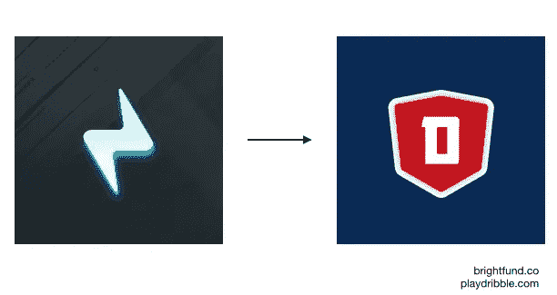

# 你不是你产品的顾客

> 原文：<https://medium.com/hackernoon/you-are-not-your-products-customer-768eaa6e3f0e>

## 但是为你建造它是一个很好的开始

***编者按:*** *这篇文章解决了几年前我和我的联合创始人在* [*运球*](http://www.playdribble.com) *时面临的一个问题。这个难题对于今天的许多创始人来说仍然很普遍。此外，我目前是*[*GoCardless*](http://www.gocardless.com)*的数字营销人员，但仍是 Dribble 的投资者。*

在构建你的产品时，你为自己构建是很自然的。我的意思是，你开发这个产品是为了帮助解决一个你个人想消除的问题，对吗？至少对许多人来说是这样。

因此，为作为客户的你打造产品是一个很好的起点。

The needs of a few may skew the needs of many

你获得的早期用户用大量的时间投资购买了你的解决方案。早期的产品发布从来都不是完美的，所以坚持到底的用户成为你的“超级用户”，提供有价值的反馈(*关于他们自己*)来帮助做出更好的产品(*为了他们自己*)。

你带来的早期员工将有望从你的解决方案中发现同样的价值，并购买产品的长期愿景，因此尽快开始构建功能，以帮助最大化你的“高级用户”(*和他们自己*)的回报。

在这个阶段，你正在为**你**、你早期的**“超级用户】**和你早期的**员工**打造一款解决问题的产品。那是理想的，对吗？

是的，但只是短暂的一瞬间。现在是时候考虑更大的问题了。

# 市场问题

Your target market

我在大学共同创立[运球](http://www.playdribble.com)时亲身经历了这个难题。因为我们有解决利基问题的方案，所以合乎逻辑的用例是针对那些和我们一样的学生，其他学生。因此，所有增长、收购和产品开发工作都是为他们/我们量身定制的。

如果我们坚持为自己和大学同类产品开发产品，我们就会失败，因为市场问题在这个细分市场并不普遍。真正的市场问题在于人口统计学，与学生截然相反。有可支配收入的就业人员(也包括足球迷和普通赌客)。这是我们遗漏的潜在客户群，我们没有为他们开发产品。

因此，我们改变了我们的产品和信息，以适应。变化包括:

*   **复制**。从千年俚语到更加简洁专业。比如[体育](http://www.sportbible.com/)在[天空体育](http://www.skysports.com/)找工作
*   **品牌化**。适合职业体育迷，而不是年轻学生(注意⚡有多年轻)

Dribble logo 2015 — Dribble logo 2016

*   **用户旅程**。少和你的朋友玩社交游戏，多在游戏平台上赢钱
*   **收购。**瞄准那些需要更高 CAC 的人群，因为他们更富有

通过走到一起并致力于所有(以及更多)这些变更，我们能够开始一个持续到今天的正在进行的迭代过程。谢天谢地，我们学到了凯西·温特斯(Casey Winters)给我们上的一课，这位增长领袖帮助扩大了 Pinterest 的规模:

> *“你的客户应该始终关注新用户或潜在用户，而不是早期用户”*

正如 Casey 提到的，一旦早期价值建立，就开始为更大的市场问题构建产品。这个问题极其多样化，用例数量惊人。这种新产品必须不断迭代、成长、进化，才能成为更大市场的活生生的解决方案。然后，也只有到那时，你才会有一个长期可行的产品。

动态而非静态的产品优化是关键。

# 远离早期的高级用户

Your early “power users” are trying to kill you

当处理一个问题时，你开始试图在更大的市场中垄断一个小的利基市场。如果你是一个梦幻足球应用程序(以我们的应用程序为例),你不能直接跳进整个体育市场，因为你会立刻被疯狂的客户获取成本(T21)淹没。

你开始关注一个小得多但高度参与的(每日幻想)市场。

倾听并向早期的超级用户学习将帮助你在你的小天地里达到更高的高度。但是请记住，这只是大馅饼中的一小块。因此，如果你只停留在倾听和迎合他们的需求，你的成长会受到阻碍，因为潜力的上限就映射在这一小块上。

在适当的时候将你的产品和客户获取努力转移到更广阔的市场，并远离超级用户，这将有助于你抓住更大的机会。只有当你达到**产品市场适合度**时，才应该这样做。

你怎么知道你什么时候到达了 PMF？

简而言之，当你有一个产品值得至少一个细分市场使用的时候。问自己的问题:

*   1 个月、3 个月或 6 个月后(时间长短取决于您的业务模式)，我的保留曲线是否平坦？
*   如果我关闭了所有的获取和重定向工作(包括推送通知和电子邮件)，还会有健康的使用吗？

请注意，这篇文章并不意味着你必须忘记你的早期采用者。围绕不断增长的使用案例和用户档案建立社区是吸引早期和当前高级用户的最佳方式。

# 结论

因此，即使你的早期高级用户在开始时是有价值的，也要意识到他们会使你的实验有偏见，扭曲你的数据，使你更难找到新用户，并要求只帮助他们体验的功能。(请注意，高级用户参与度的提高可以忽略不计，因为他们已经非常频繁地使用它了。)

真正的价值是为你的**潜在客户**打造产品，关注**新用户**的增长和发展，并成为**更大市场问题**的解决方案。

这篇文章的目的是希望消除任何早期创始人犯下我和我的共同创始人所面临的类似错误。如果你在这篇文章中发现了价值，并希望其他人看到它，请点击👏

*真的很感谢！*

*你可以在我的网站* [***【光明基金】***](http://www.brightfund.co)*上找到更多我关于 [*成长*](https://brightfund.co/essays/how-to-run-a-growth-experiment)*[战略](https://brightfund.co/essays/how-to-prioritise-your-growth-strategy)*[*用户获取*](https://brightfund.co/essays/are-there-really-only-19-channels-for-growth) *的感悟或者你可以找我的中刊，* [***光明基金***](https://medium.com/brightfund) *。****