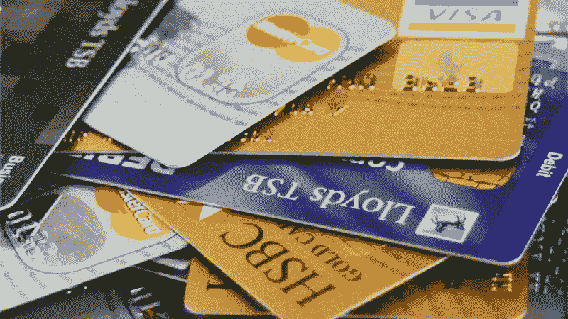
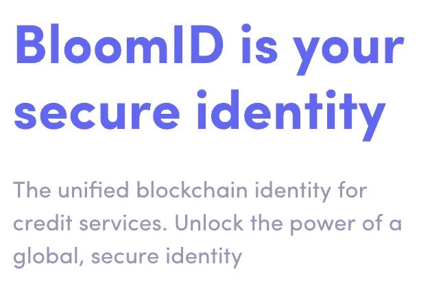

# 你是你的信用评分

> 原文：<https://medium.com/hackernoon/you-are-your-credit-score-a1e1687c7ab2>

当你向银行申请教育贷款或住房贷款时，银行只会看到你的信用评分。你可能会说这家银行相当于一个数字主义者。*(就像种族主义者根据他们的种族来判断人，银行根据他们的信用评分来判断人，因此他们是‘数字主义者’。抱歉，如果你不喜欢这个笑话！)*

> 信用评分是为了反映你的信誉和违约风险。

***信用评分越高，说明你越有信用。***

## **谁算的？又是如何计算出来的？**

你的付款记录和以前的借款历史会成为你的信用评分。大多数零售银行都依赖这种算法。

> B 但是这个算法有很大的缺陷！

考虑一下这种情况—

像你这样的年轻人，绝对没有信用记录，但是名声很好。你可能有一段履行所有承诺的历史，无论是在学校还是大学。或者你可能有非常富有的父母。在计算信用评分时，所有这些提到的因素目前都没有考虑在内。因此，这个算法有很大的缺陷。

像 PayPal 和 PayTM 这样的公司可以根据你在亚马逊购物或支付手机账单等情况，在几秒钟内计算出你的信用评分。而且这些金融科技公司使用的数据绝对相关，不会过时。

名誉是这个社会中每个人都有的东西。按照社会设定的规范正确生活的人比不这样做的人有更高的声誉。迄今为止，信誉还没有被用作在金融机构和个人之间建立信任的一个因素。如果印度的一个小农场主想从银行贷款为他的田地购买一台拖拉机，那么银行官员将把整个处理范围缩小到他的社会号码、信用评分、收入、居住地。一个人远不止这些！由于农民并没有很好地融入经济，他将被银行拒绝获得贷款，尽管事实上农民已经偿还了他之前像小额贷款人一样借出去的钱。

> 只有当人们用权力把人带进来，而不是把人拒之门外时，包容才会发生！

最近，加拿大皇家银行对给区块链打分很感兴趣。在[周四发布的一项专利申请](http://appft.uspto.gov/netacgi/nph-Parser?Sect1=PTO2&Sect2=HITOFF&u=%2Fnetahtml%2FPTO%2Fsearch-adv.html&r=1&p=1&f=G&l=50&d=PG01&S1=20180075527.PGNR.&OS=dn/20180075527&RS=DN/20180075527)中，该银行概述了一个基于区块链的平台，该平台将利用借款人的历史和预测数据自动生成信用评级。所描述的应用提出了一种系统，该系统将利用比现有信用评级系统更多的数据源，在创建不可变记录的同时改进贷款过程。

一家名为 **Bloom** 的公司让信用评分这个概念变得非常令人兴奋！布鲁姆协议:以太坊和 IPFS 支持的分散信用评分。

Bloom 是一种协议，用于通过基于联合证明的身份验证以及创建对等网络和组织信誉担保(“信用赌注”)来评估信用风险。

Bloom 的使命是建立一个强大的全球信用基础设施，降低费用，增加获得信贷的机会，并使信用评分公平。布鲁姆是令人兴奋的，因为获得信贷可以改变生活，但现有的信贷系统对于这样一个重要的功能来说是远远不够的。借款人在申请贷款时必须暴露他们所有的个人信息——攻击者可以利用这些信息来开立新的信用额度。

BloomScore 信用评分是全球性的，允许个人携带他们的分数跨越国家。贷款人将能够向目前被拒绝贷款的数百万信用良好的个人提供贷款。这是迈向金融普惠的第一步。

 [## 印度拥有世界第二大无银行账户人口

### 虽然印度对将更多个人纳入正规银行体系颇感自豪，但成年人的数量…

timesofindia.indiatimes.com](https://timesofindia.indiatimes.com/business/india-has-second-largest-unbanked-population-in-the-world/articleshow/64570254.cms)  [## 全球有 20 亿人没有银行账户——以下是改变这一状况的方法

### 为了扩大全球金融包容性，也许我们应该向撒哈拉以南非洲寻求灵感。

www.weforum.org](https://www.weforum.org/agenda/2016/05/2-billion-people-worldwide-are-unbanked-heres-how-to-change-this) 

随着金融服务在 21 世纪出现前所未有的创新，通过使用分散的技术将被剥夺金融服务的人纳入经济中几乎是上帝自己的计划，这种技术是完全自主的，任何政府、组织或个人都无法控制。

# 民主的时候到了。革命的时候到了！