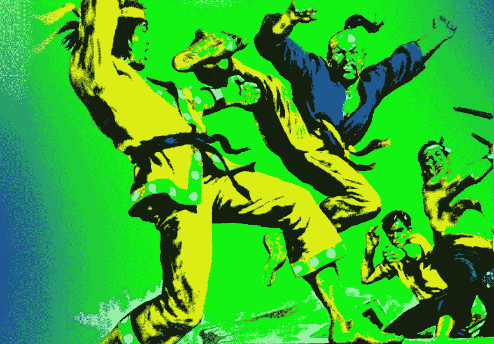
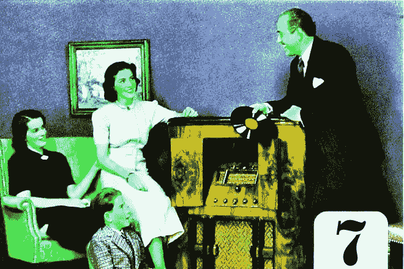

# 你可以在两个小时内掌握大部分社交媒体平台。

> 原文：<https://medium.com/hackernoon/you-can-master-most-of-any-social-media-platform-in-two-hours-7dffc0c37064>

如果说在过去的几个月里，我在努力为博主们增加 SaaS 的过程中学到了什么，那就是，要想有机会获得真正的结果，你需要在所有社交平台上拥有合法的存在。

不仅仅是 Twitter，或者 Instagram，或者 Pinterest——所有的。

Learn ALL the platforms!

是的，我知道有很多，但这实际上是一件好事！它给了每个人很多机会，让他们有一个合法的机会让自己的名字曝光。

# 覆盖所有的基地。

我假设你听说过[加里·维纳查克](https://en.wikipedia.org/wiki/Gary_Vaynerchuk)，或者大多数人都知道的加里维。

他是一个完美的例子，因为他是白手起家，并且已经“膨胀”了。这种成功很大程度上归功于一个简单的事实，那就是他基本上无处不在，而且已经存在了很长时间。

以下是他活跃的社交媒体简介中的几个:媒体、 [Wordpress](http://garyvaynerchuk.com) 、 [Google Plus](https://plus.google.com/+GaryVaynerchuk) 、[脸书](https://www.facebook.com/gary/)、 [Twitter](https://twitter.com/garyvee) 、 [Youtube](https://www.youtube.com/channel/UCctXZhXmG-kf3tlIXgVZUlw) 、 [Soundcloud](https://soundcloud.com/garyvee) 、 [Itunes](https://itunes.apple.com/us/podcast/the-garyvee-audio-experience/id928159684?mt=2) 、 [Instagram](https://www.instagram.com/garyvee/) 、 [Quora](https://www.quora.com/profile/Gary-Vaynerchuk) 、 [Linkedin 【T21 他在很多方面也有不止一个简介。](https://www.linkedin.com/in/garyvaynerchuk)

无论如何，令人印象深刻。

他经常不厌其烦地交叉链接和/或提及他在所有其他平台上活跃的所有平台，使之成为一个伟大的病毒循环。

通过他像这样覆盖他的所有基础，他对于任何人来说都是超级容易跟随的，不管他们偏好的平台是什么。

# 七的法则。

GaryVee 疯狂的另一个方法被称为七的法则。

这是一个源于 20 世纪 30 年代的营销术语，也可以与博客联系在一起，尤其是内容营销，因为两者在许多方面都很相似。

它基本上是说，一般随机的人需要访问你的博客、vlog、网站，或者看到你的名字至少七次，他们才会记住和/或信任你。

然而，一旦你赢得了他们，这些人就会成为你忠实的粉丝。

他们订阅你的时事通讯或 RSS，关注你的个人资料，加入你的社区，发推特和分享你的帖子，甚至可能购买你出售的产品或服务。

你的粉丝越多，写博客就越容易——几乎在每个方面都是如此。

但是对于一个能找到你七次的人来说，你首先要付出时间和努力才能被找到。否则，就不会发生。

你认为我为什么花了 7 个小时为 Hackernoon 写这篇文章？为了被找到！

# “五分钟学会，一辈子掌握。”

我最近将博客的复合增长与扑克锦标赛的复合增长进行了比较，因此我将再次提出它，因为它是相关的。

大约 15 年前，我在一个朋友的家里第一次知道了扑克游戏，确切地说是德州扑克。尽管当时我一窍不通，但我还是坐下来花了 40 美元买入。

忠于著名的扑克谚语*“五分钟学会，但一辈子掌握”*，我在，嗯…五分钟内学会了基础。在他的地方，在他的电脑上，在 Altavista 上，同时在我们开始之前等待其他玩家出现。

在接下来的八个小时左右，或者说在 150-200 手牌之间，我觉得我已经学会了这个游戏的四分之三，或者说 75%。诸如规则、手牌实力、百分比和底池赔率之类的东西。这也有助于人们在玩扑克时喜欢谈论扑克。那天晚上我吸收了很多信息。

今天，在玩了几千个小时后，我仍在努力掌握最后的 10%左右。

而且，就像博客和社交媒体一样，游戏也在不断发展。战略和战术不断变化，所以真正掌握它几乎是不可能的。

但这是一个好消息，因为它不断为新玩家提供空间，应用不同的策略，并能够获胜。

# 学会一个，学会所有。

活跃并掌握每一个主要的社交平台对任何人来说都是一个艰难而不现实的挑战，甚至包括 GaryVee。

他之所以能做到这一点，唯一真正的原因是他有一整个团队的助手在做大部分的工作。我们中没有多少人处于像他那样的地位。

值得庆幸的是，所有现代社交平台都遵循相同的基本前提，在核心上非常相似；它们都有某种标记或订阅功能，评论或讨论的地方，一个赞/鼓掌/投票/竖起大拇指的策展系统，以及类似的规则和礼仪。

这意味着，如果你学会了一个，你应该理解其余的大部分。

它们之间的主要区别在于它们设计的内容类型以及屏幕类型。

例如，我们为博客作者开发了社区网络应用程序 [Snapzu](https://www.snapzu.com) 。

Reddit 是用来链接和对话的。Twitter 是“微博客”的意思。Pinterest 是视觉内容的集合。Quora 是用来问答的。Youtube 是做视频的。Snapchat 和 Instagram 是用于手机照片/故事的。Soundcloud 和 Spotify 是用于音乐和播客的。

# 最后的 25%只来自经验。

我真的相信任何愿意并渴望的人——包括你——可以在两个小时或更短的时间内掌握任何社交平台的四分之三或 75%。

**只是最后一个季度真的很让人头疼。**

它需要奉献、坚持、耐心和时间来获得经验。类似于获得驾驶执照和学习如何驾驶，这是你不能仅仅通过阅读来学习的东西。你最终不得不卷起袖子，走进去，把手弄脏。

因此，尽可能多地登上社交平台是重中之重。请记住，如果你不这样做，你的竞争对手最终会。

感谢阅读。

**PS:努力扩大你的邮件列表？**尝试一种全新的方式来扩大你的邮件列表，利用“数量优势”和交叉推广的力量，而不是陈旧的“免费赠品”选择加入的方法。 [**了解更多**](http://blogenhancement.com) 。