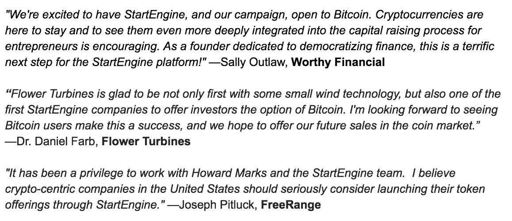
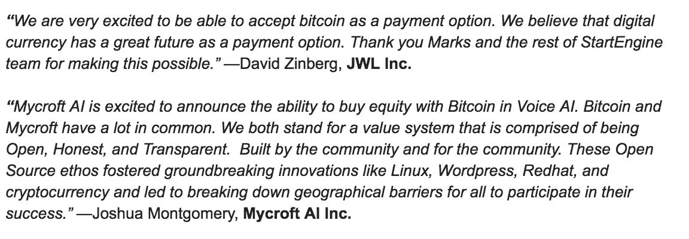

# 你现在可以用比特币投资真正的证券了

> 原文：<https://medium.com/hackernoon/you-can-now-use-bitcoin-to-invest-in-securities-for-real-8fd04b0e82cd>

The future is bright for the disruption of finance.

当很多人听说现在可以使用比特币作为投资美国证券的支付形式时，他们可能不会觉得这有什么大不了的。美国证券是根据新的豁免法规众筹或法规 A+发行的，允许公司从公众那里筹集资金。毕竟，多年来人们不是一直在使用比特币购买从披萨到 ICO 代币的所有东西吗？

然而，这些人可能忽略了一些至关重要的东西:这两项法规要求投资必须由合格的中介机构托管。通俗地说，这意味着你需要一家银行愿意接收比特币付款，并以信托方式持有它，直到交易符合监管要求，然后支付给出售证券的公司。

A few words from some of the entrepreneurs now accepting Bitcoin on StartEngine

让我们更深入地研究一下。到目前为止，还没有银行愿意充当数字资产的托管人。总部位于内华达州的信托公司 Prime Trust 同意成为第一家允许托管包括比特币在内的加密货币的机构。Prime Trust 的首席执行官斯科特·珀塞尔(Scott Purcell)是一名创新者和银行家，他的目标是成为众筹和 ICO 领域交易的监管管道。事实上，Prime Trust 最近[宣布与 IBM](https://www.reuters.com/article/us-crypto-currency-ibm/ibm-partners-stronghold-for-new-digital-stable-coin-idUSKBN1K717K) 合作开发一种新的稳定硬币，其中 Prime Trust 将负责持有支持新的稳定硬币 USD Anchor 的资本。

Bitcoin, the largest cryptocurrency, is now accepted for Regulation Crowdfunding.

那么，为什么银行希望托管加密货币是一件大事呢？简单。对任何处理比特币的公司来说，最大的障碍之一是处理者可能被黑客攻击的风险，在这种情况下，投资者会损失所有的钱。想想 Mt Gox 和[被黑的几十个网站或“交易所](https://www.wsj.com/articles/why-cryptocurrency-exchange-hacks-keep-happening-1531656000)”。他们没有资产托管人，也没有保险，所以当他们被黑客攻击时，比特币就不见了。故事结束。

有了 Prime Trust，游戏就变了。投资者可以放心，他们托管的比特币是受联邦存款保险公司(FDIC)保险的，因为它由银行托管，然后最终转换成美元。这是银行首次保证比特币的安全性。从来没有人这样做过。

A few words from some of the entrepreneurs now accepting Bitcoin on StartEngine

没错，所谓的交易所一直在说，也会说，他们在冷库里保管比特币安全，但最终不是银行。没有联邦存款保险公司的保险，该公司为一家银行高达 250，000 美元的存款提供保险(如果投资者希望存款超过这一数额，就必须在不止一家银行之间进行分割)。Prime Trust 通过提供这种投资者保护，创新并打破了加密货币市场发展的必要障碍。

让我们探索一下这种新解决方案的优势。监管众筹是美国公司最有前途的融资形式之一。可用于 ico 或更传统的众筹结构。StartEngine 指数显示，一个新兴的市场正在帮助数百家、即将成为数千家公司为他们的业务筹集资金。

美国证券交易委员会公布的法规要求融资门户网站，如 WeFunder、StartEngine 或 SeedInvest，使用合格的中介或银行来托管投资者的资金，直到在该门户网站上筹集资金的公司成功达到其最低投资额。直到今天，没有一个融资门户网站能够合法地接受比特币作为一种支付形式，因为没有托管机构能够接受它。

A few words from some of the entrepreneurs now accepting Bitcoin on StartEngine

现在 Prime Trust 开始接受比特币，情况就不一样了。像 StartEngine 这样的融资门户网站现在已经宣布支持比特币，这将意味着公司可以通过融资门户网站上的比特币筹集资金，每年最多可筹集 107 万美元。这个数额看似不大，但意义重大，因为它是合法的。一家公司现在可以向公众出售代币，接受比特币作为回报，同时可以利用 D 506(c)法规向合格投资者出售超过 107 万美元限额的代币来筹集资金。瞧。

多亏了《就业法案》和像 Prime Trust 这样的创新者，ico 正走出阴影，进入一个受监管的市场。现在很明显，加密货币和区块链应用程序将彻底改变金融和其他行业，但同样显而易见的是，这必须并且只能通过遵循美国的既定法规和法律来实现。随着比特币现在成为监管众筹的公认支付方式，就业法案和区块链社区继续走得更近。金融业彻底颠覆的前景是光明的。

*感谢阅读。如果你喜欢你所读的，请鼓掌并跟随我。*