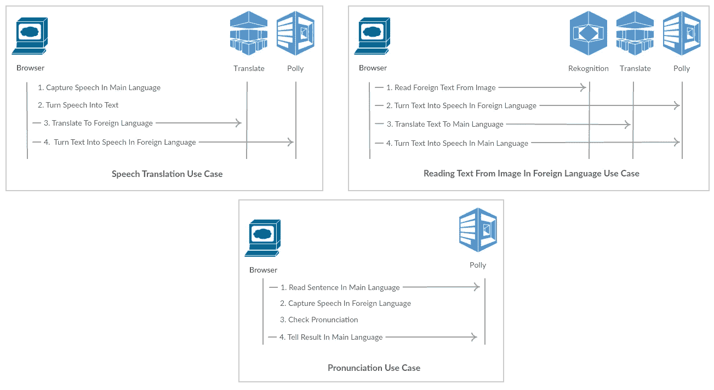

# 有了这些 AWS 人工智能服务，你一定能学会一门新语言:Translate，Rekognition，Polly

> 原文：<https://medium.com/hackernoon/you-cant-fail-to-learn-a-new-language-with-these-aws-ai-services-translate-rekognition-polly-caa5807dec36>

随着 AI 的提升，机器正在做越来越多以前只有人类才能做的工作。根据一份报告，到 2030 年，机器人将会取代 8 亿份工作。看来明天会有所不同，我们应该让我们的孩子做好准备。根据[马云](https://www.youtube.com/watch?v=pQCF3PtAaSg)的说法，我们应该向我们的孩子传授软技能、体育、艺术和音乐，而不是向他们灌输信息。我们的孩子应该成为世界公民，我相信掌握多种语言对成为世界公民非常重要。

四月，[我在无服务器火鸡会议上谈过](https://www.meetup.com/tr-TR/Serverless-Turkey/events/247731314/)AWS[AWS](https://hackernoon.com/tagged/aws)AI 服务比如在 AWS re:Invent 2016 上介绍的 Polly、Lex 和 Rekognition(幻灯片[此处](https://www.slideshare.net/CeyhunZGN/serverless-ai-services-from-aws-polly-lex-and-rekognition))。当我在那里讲话时，我已经承诺要写一些在 AWS re:Invent 2017 上介绍的服务，比如[翻译](https://aws.amazon.com/tr/translate/)和[转录](https://aws.amazon.com/tr/transcribe/)。当我有时间准备这篇博文时，我已经开始思考使用亚马逊翻译的一个好的用例。

当我在考虑不同的使用案例时，我梦想为我的双胞胎准备一个易于使用且有效的电子学习应用程序，这样他们就可以快速学习作为第二语言的西班牙语。所以我准备了一个网络应用程序，孩子们可以用它来翻译单词，做一个发音测试，阅读一篇手写的外语文章。

该应用程序使用 [Amazon Polly](https://aws.amazon.com/tr/polly/) 将单词转换成不同语言的语音。Amazon Translate 用于翻译， [Amazon Rekognition](https://aws.amazon.com/rekognition/) 用于阅读图像中的文本。

Use cases for the demo app

虽然我尝试使用 Amazon Transcribe 将语音转换为文本，但我注意到该服务不适合交互式实时使用，并决定使用 Google 语音到文本 API。我相信转录服务将改善实时使用，这可能是另一个帖子的主题。

我将展示如何一步一步地运行这个演示应用程序。以下是要求。

**要求**

1.饭桶

2.AWS 帐户

3.谷歌云账户

4.网络服务器或 AWS S3 桶

**步骤如下**。

1.获取代码

2.准备 AWS 帐户

3.准备 Google 云帐户

4.运行应用程序

我们开始吧。

**1。** **获取代码**

克隆 GitHub 存储库。

**git 克隆**[**https://github.com/ceyhunozgun/awstranslator**](https://github.com/ceyhunozgun/awstranslator)

**2。** **准备 AWS 账户**

Cd 进入项目目录，创建一个名为 credentials.js 的文本文件。您可以在这里为您的 AWS 帐户[创建一个访问密钥。该凭证应具有对](https://docs.aws.amazon.com/general/latest/gr/managing-aws-access-keys.html)[波利](https://console.aws.amazon.com/polly/home/SynthesizeSpeech)、[翻译](https://console.aws.amazon.com/translate/home?#explorer)和[认可](https://console.aws.amazon.com/rekognition/home?#/text-detection)服务的许可。

请注意，对于这个演示应用程序，为了简单起见，我在 JavaScript 中直接使用了凭证**。**永远不要在生产中使用它们** **这种方式**，为了保护你的凭证，请使用更安全的方式，如亚马逊 Cognito。**

相应地设置您的 AWS 区域。

**3。** **准备谷歌云账号**

要使用谷歌语音 API，你应该[创建一个 API 密钥](https://cloud.google.com/docs/authentication/api-keys)，[创建一个客户端 id](https://support.google.com/cloud/answer/6158849?hl=en) ，[启用语音 API](https://support.google.com/cloud/answer/6158841?hl=en) 。然后把你的 API 密匙和客户端 id 放在下面。关于 Google Speech API 的快速介绍，你可以看这里的。

**4。** **运行 app**

要运行该应用程序，您应该从 web 服务器提供 HTML 文件，因为 Google Speech API 不支持 file:// urls。你可以在你的电脑上使用像 [MiniWeb](https://sourceforge.net/projects/miniweb/) 这样的 http 服务器，或者你可以从 [S3 桶](https://docs.aws.amazon.com/AmazonS3/latest/dev/WebsiteHosting.html)中托管应用程序。

如果一切正常，你可以使用该应用程序翻译句子，进行发音测试，并阅读图片中的文本，如下面的视频所示。

Demo video of the app

**它是如何工作的？**

在观看和使用该应用程序后，您可以找到开发以下功能的步骤。

**AWS JavaScript SDK**

对于这个应用程序，我已经使用 AWS JavaScript SDK 从浏览器访问 AWS 服务。AWS 翻译不包含在默认版本中。为了在浏览器中使用这些服务，我们可以使用 [SDK Builder](https://sdk.amazonaws.com/builder/js/) 。转到 SDK Builder 网站，选择“翻译”并单击“构建”下载您定制的 AWS JS SDK。

**初始化 AWS 服务**

要使用 AWS 服务，您应该通过调用下面显示的方法来初始化它们。

**初始化谷歌服务**

Google API 通过使用下面显示的函数进行初始化。

**使用 AWS 翻译 API**

为了将文本从一种语言翻译成另一种语言，AWS Translate API[Translate text](https://docs.aws.amazon.com/translate/latest/dg/API_TranslateText.html)方法的用法如下。

**使用谷歌语音转文本 API 将语音翻译成文本**

在浏览器中捕获音频数据后，使用 Google Speech API recognize 方法将语音转换为文本。

**使用 Amazon Rekognition 读取图像中的文本**

当我们点击应用程序中的视频时，会拍摄一张图片并发送到 Amazon Rekognition[detect text](https://docs.aws.amazon.com/rekognition/latest/dg/API_DetectText.html)方法，如下所示。

**使用 Amazon Poly 将文本转换为语音**

为了以指定的语言朗读文本，使用了 Amazon Polly[SynthesizeSpeech](https://docs.aws.amazon.com/polly/latest/dg/API_SynthesizeSpeech.html)方法。

**总结**

在这篇文章中，我展示了使用亚马逊翻译、Polly 和 Rekognition 等 AWS 人工智能服务学习新语言是多么容易。

你可以在这里找到代码[。](https://github.com/ceyhunozgun/awstranslator)

我关于 AWS Rekognition、Lex 和 Polly 的另一篇帖子如下:

[带亚马逊 Rekognition、Lex、Polly、DynamoDB、S3 和 Lambda 的无服务器过敏检测器](https://hackernoon.com/serverless-allergy-checker-with-amazon-rekognition-lex-polly-dynamodb-s3-and-lambda-35fd215b51b0)

我会继续写关于 AWS AI 服务的文章。

*如果你喜欢这个帖子，请分享或鼓掌*。

另外，我想听听你们对 AWS AI 服务不同用例的评论。