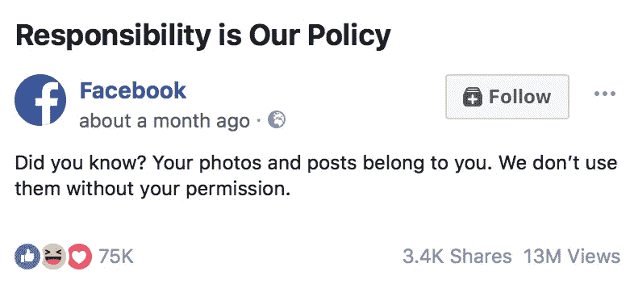
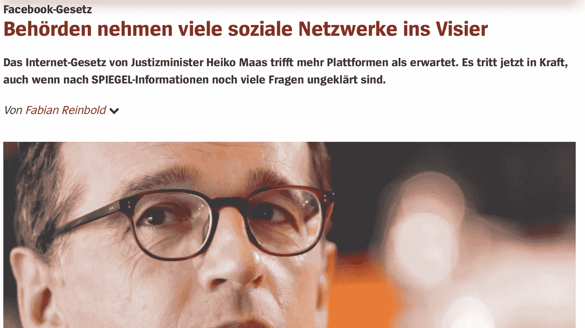
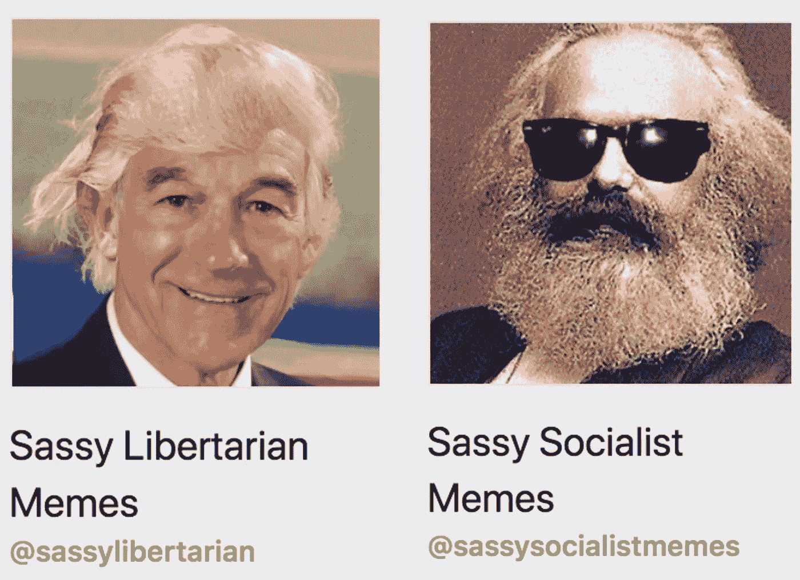
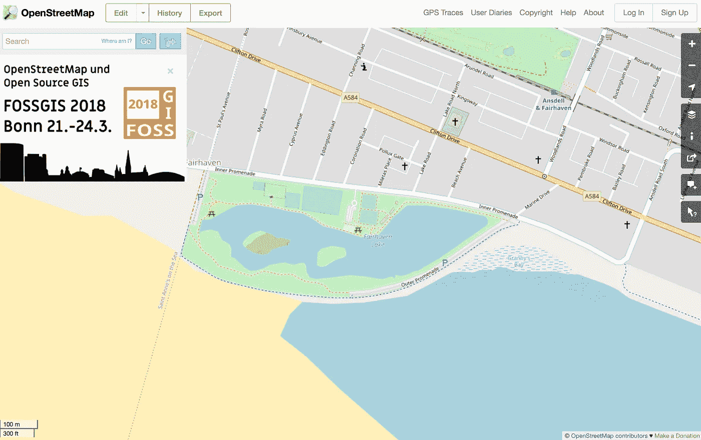
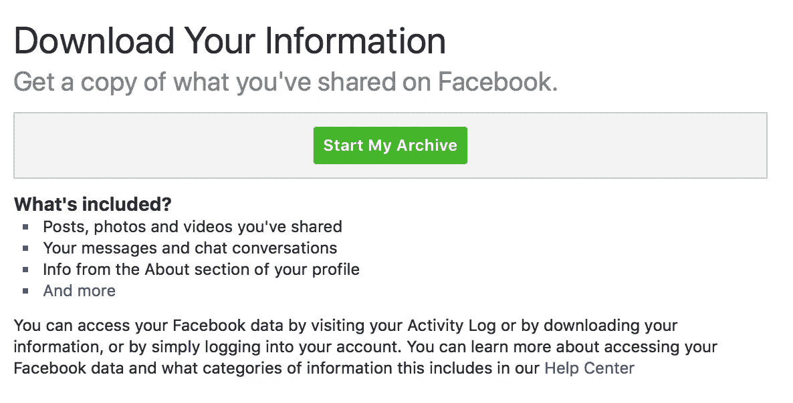

# 你无法控制你的脸书邮报，原因比你想象的要复杂

> 原文：<https://medium.com/hackernoon/you-dont-control-your-facebook-posts-the-reasons-why-are-more-complex-than-you-might-think-ec1ded692749>

前几天，我的[脸书](https://hackernoon.com/tagged/facebook) feed 里弹出了一个推广广告和视频。

它告诉我，我的“照片和帖子”属于我，“(脸书)不会在没有(我)允许的情况下使用它们”。

同样的广告也出现在英国的朋友和同事的供稿中。这似乎是一场运动的一部分。也许这场运动与欧盟即将出台的[通用数据保护条例](https://gdpr-info.eu)有关，也与公众日益意识到围绕数据、数据使用方式以及是否信任这些使用方式[存在争议有关。](https://theodi.org/article/odi-survey-reveals-british-consumer-attitudes-to-sharing-personal-data/)

脸书的[条款和条件](https://www.facebook.com/terms.php)中也有类似的信息:

> “你拥有你在脸书上发布的所有内容和信息，你可以通过你的[隐私](https://www.facebook.com/settings/?tab=privacy)和[应用程序设置](https://www.facebook.com/settings/?tab=applications)来控制如何共享这些内容和信息”。

这两条信息都过于简单。我不完全拥有或控制我在脸书上发布的内容。它不仅属于我，也不影响我。由于过度简化其信息传递，脸书和许多其他组织一样，错过了帮助解释其服务如何工作以及帮助我们所有人在分享内容时做出更好决定的机会。

## 社交媒体内容比你想象的要复杂

对许多人来说，这听起来有些违背直觉。我的意思是我不应该控制我在脸书的数据吗？是关于我的！我创造了它！！

别傻了。[数据“所有权”并不像听起来那么简单](https://web.archive.org/web/20170926083923/https://theodi.org/blog/how-do-we-own-data)。我在脸书的大部分内容不仅仅是关于我的。这也是关于其他人的。

These people are not my friends. They are from a film called [Peter’s Friends](https://en.wikipedia.org/wiki/Peter%27s_Friends). But it shows some people in a picture they may regret in later life.

我的朋友列表是与其他人关系的列表，人们在帖子中标记某人，说他们和他们一起去了餐馆或酒吧，或者分享一张照片或对一群朋友的评论。

当我们在社交媒体上分享关于朋友的内容时，我们大多数人都会考虑朋友的感受，但我们并不总是知道什么对他们来说是重要的。规则没有写下来。我们很多人都会有这样的经历，分享了一些东西，然后有一个朋友说“嗨，你介意删除那个帖子吗，因为 X…”。

有时我们会听取这些反对意见，有时则不会。没有我们的同意，我们的朋友可能无法删除我们的脸书内容，但他们的观点是我们在发帖时考虑的复杂事情的一部分。他们可以在现实生活中和社交媒体上解除我们的好友关系。

## 对其他人的不利影响

除了影响个人关系，《脸书邮报》还可能带来多种负面影响。影响版权人是其一。版权有许多缺陷，但这是社会帮助创作者从他们的作品中获益的方式之一。

A picture by a famous artist, [Mr and Mrs Clark and Percy](https://en.wikipedia.org/wiki/Mr_and_Mrs_Clark_and_Percy). Image used under [fair use](https://en.wikipedia.org/wiki/File:Hockney.clark-percy.jpg#Fair_use_rationale). Copyright [David Hockney](https://en.wikipedia.org/wiki/File:Hockney.clark-percy.jpg#Fair_use_rationale).

如果我确实拥有我在脸书上发布的所有内容，那么我大概可以发布一张别人创作的图片，并开始通过出售东西来赚钱。本该属于艺术家的钱。

我可以，但我不应该。

脸书和我都认识到，我们需要遵守版权法，政府应该帮助执行。版权所有者可以直接向脸书投诉，或者通过相关的国家或国际规则投诉。我不能随心所欲地控制和使用这些内容。如果我以一种不公平的方式侵犯了版权，影响了创作者，那么就会有更少的好东西被创作出来。那就糟了。

Germany recently passed [a new law](http://www.spiegel.de/netzwelt/netzpolitik/facebook-gesetz-behoerden-nehmen-viele-soziale-netzwerke-ins-visier-a-1170820.html) stating that social media platforms have to take down hate speech within 1–7 days or face large fines.

更深入地说，负面影响可能是脸书上的某人发布了一些意图造成伤害的内容。

仅举几个例子，内容可能[诽谤某人](https://www.traverselegal.com/blog/removing-defamation-from-facebook-and-twitter-defamation-lawyer-insights/)，使用[仇恨言论](https://techcrunch.com/2017/10/02/germanys-social-media-hate-speech-law-is-now-in-effect/)，支持[恐怖主义](https://www.wsj.com/articles/facebook-steps-up-efforts-against-terrorism-1455237595)，或者[未经某人同意使用其性图像](https://www.usatoday.com/story/tech/news/2017/11/08/facebook-tests-fighting-revenge-porn-asking-users-file-nude-photos-first/843364001/)。

脸书是一个全球性的服务，这些东西的立法和定义将因国家而异，但在许多国家这些东西将是非法的。发帖者将失去对内容的控制，甚至可能失去他们的自由，因为民主政府利用人民赋予他们的权力来阻止内容被看到和分享。

[脸书有自己的审核规则](https://www.theguardian.com/news/2017/may/21/revealed-facebook-internal-rulebook-sex-terrorism-violence)和[工具](https://hackernoon.com/tagged/tools)，允许脸书的审核者主动干预或让人们[报告内容](https://www.facebook.com/help/www/181495968648557?ref=u2u)并将其删除。同样，这种删除可以在未经发帖者同意的情况下发生。海报不受控制。

并非所有节制规则试图阻止的负面影响都是非法和有意的。其他的是不道德的，或者违反特定社区或社会的社会规范。适度之所以存在，是因为我的帖子的负面影响可能会损害社区的健康和目标。

Both [sassy socialist memes](https://www.facebook.com/sassysocialistmemes/), with 1 millions followers, and [sassy libertarian memes](https://www.facebook.com/sassylibertarian/), with 200 followers, are real Facebook groups.

节制不仅仅是脸书和政府做的。脸书的许多社区团体都有自己的主持人和政策。群组版主也可以不经发帖者同意删除内容。

如果我的内容不够时髦，也许时髦的社会主义迷因或[时髦的自由主义迷因](https://www.facebook.com/sassylibertarian/)的版主会删除我在他们的群中发布的内容。我所居住的小镇的[当地脸书团体](https://www.facebook.com/groups/131752256848313/)和许多其他当地脸书团体一样，对过度的广告或外来者对小镇的批评反应强烈。

## 其他人可以从内容中受益

换个更积极、不那么时髦的话题，人们还应该注意那些可以从他们发布的内容中获益的人。正如英国《金融时报》最近指出的那样，“(可信数据，如脸书上发布的数据)的爆炸，将使我们有能力比以往任何时候都更详细地了解我们的世界”。脸书已经分享了你发布的一些数据，这样其他人也可以受益，我认为它应该做得更多。

[OpenStreetMap’s](http://openstreetmap.org) data is freely available as [open data](https://theodi.org/article/what-is-open-data-and-why-should-we-care/) and used by governments, businesses, communities and indivudals all over the world.

例如，脸书用户帮助维护关于咖啡馆、餐馆和休闲中心的数据。我们不仅仅在脸书需要这种类型的数据，我们生活中的许多其他地方也需要它，所以脸书一直在探索如何与社区维护的 OpenStreetMap 共享数据。这将有助于使用 OpenStreetMap 的成千上万服务的每个人。脸书用户无法控制这种数据流，但他们和许多其他人将从中受益。

In other sectors rather than downloading data I can give a third party that I trust the right to access it

在其他情况下，脸书用户可能希望与他们信任的第三方分享他们发布的内容。

[欧盟通用数据保护条例强化了这一权利](https://theodi.org/article/will-gdpr-and-data-portability-support-innovation/)，尽管这是一项带有[限制](http://www.jenitennison.com/2017/12/26/data-portability.html)的权利。

我可能会决定这样做，以便让我的当地社区受益，例如帮助当地政府了解对某个特定主题的感受，帮助提供我希望获得的另一项服务，例如通过[询问我的朋友是否愿意加入我的](https://signal.org/blog/private-contact-discovery/)新的照片共享服务，或者帮助我了解自己的行为和习惯。

不幸的是，尽管脸书告诉我，我可以控制如何共享数据，但我不能轻易与第三方共享这些数据。

脸书允许人们下载他们发布的数据，但这不是一种标准的格式，我不能简单地给另一个我信任的组织访问它的权利，就像 T2 的英国银行业开始做的那样。

英国银行业预计，由于人们共享数据变得更加容易，竞争将会加剧，新的服务将会出现。也许社交媒体公司和使用其服务的人会从类似的合作努力中受益，以确定如何安全地共享数据，其中大部分包括其他人，而不产生负面影响。

脸书开始分享数据，在他们自己的服务之外创造利益，这是件好事。他们应该做得更多，公开分享谨慎匿名的数据，在安全的条件下与为公共利益工作的研究人员分享更敏感的数据，并让人们安全地分享他们发布给他们信任的第三方的数据。

## 解释这些东西很难，但却是必要的

这种东西很复杂，很难用一种容易理解的方式来解释，但是在试图简化它之前，有必要理解它的复杂性。

像许多其他类型的内容和数据一样，脸书的帖子和照片可以是关于一个以上的人。这些内容可能会给其他人带来负面影响，但也可能带来好处。正因为如此，用户不能完全控制他们发布的内容，他们当然不能像我们拥有房子或汽车那样拥有它。相反，民间社会、政府和服务提供者需要共同努力，设计方法来帮助人们获得更多的控制权，并最大限度地提高社会和经济效益，同时尽量减少不利影响。

过度简化这种必要的复杂性可能会让我们滑入一个由个人完全控制他们所创造的数据的世界。这就是脸书的广告向许多人描述的世界。多傻啊。这个世界将减少利益，增加伤害的风险。

我们不需要更多[冗长而不可读的条款和条件](https://www.theguardian.com/technology/2015/jun/15/i-read-all-the-small-print-on-the-internet)但是随着关于数据的辩论增加，如果像脸书这样的主要服务提供商在帮助创建更知情的辩论和帮助人们做出更好的决定方面承担更大的责任，这将是有益的。