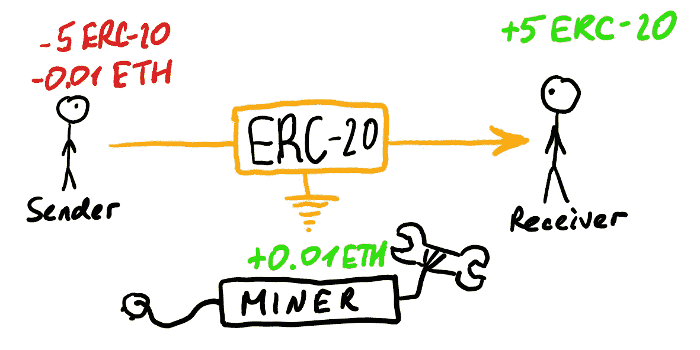
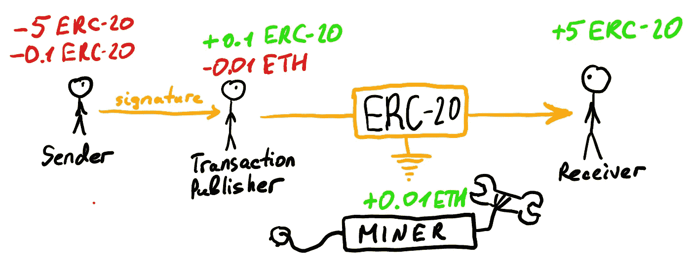
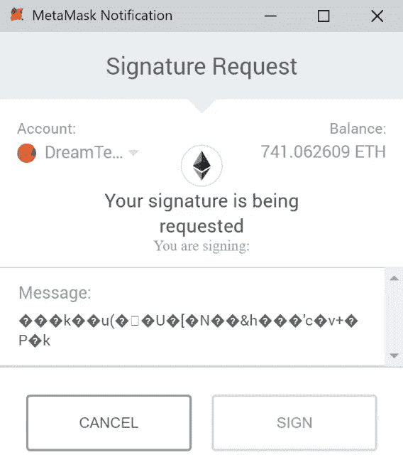
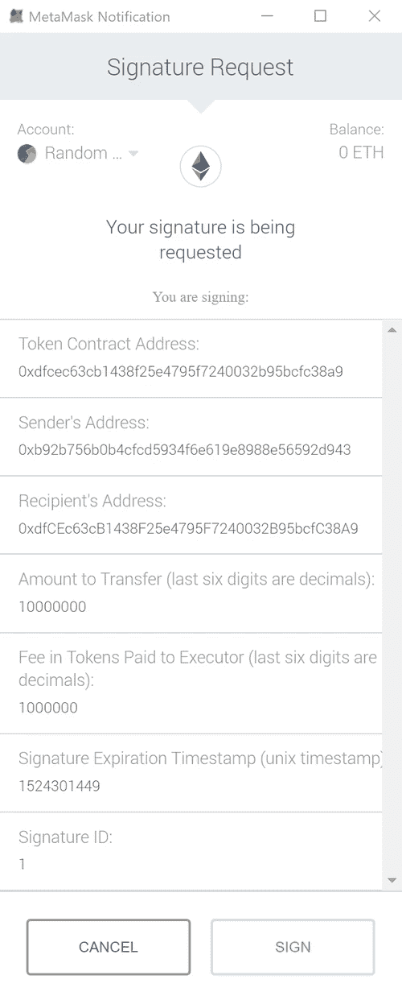

# 你不需要乙醚来转移代币

> 原文：<https://medium.com/hackernoon/you-dont-need-ether-to-transfer-tokens-f3ae373606e1>

## 本文介绍了一种新的令牌(标准)，它不需要令牌持有者持有以太网来管理他们的令牌。我们最近在第一个电子竞技和游戏招聘和管理网络[梦之队](https://dreamteam.gg)的加密创业公司推出了这样一个令牌。

## ERC20 代币

如果你认为 ERC20 代币是新的和可怕的东西，请三思。我们的世界已经充满了代币:

*   不同国家的货币都是代币。比如说，在乌克兰买东西，你需要乌克兰格里夫尼亚。当你用美元信用卡在乌克兰买东西时，你被收取美元，但一家银行在幕后将其兑换成格里夫纳。
*   然后你把这些“代币”换成另一种类型的“代币”，例如，它可以让你乘坐公共交通工具或去你最喜欢的电影院。
*   任何形式的折扣都可以被视为代币。你可以在特定的地方使用折扣，并用它们换取其他“代币”。
*   任何物品，像邮票或冰箱贴，都可以被视为代币！

当然，我们拥有的令牌越多，管理所有令牌就越困难。但最终，一切都将与最稳定的令牌相比较(就像今天的美元或欧元)。

据你所知，为了转移普通的 ERC20 代币，代币所有者的余额中必须有乙醚。这给用户带来了相当大的不便:除了他们想要的令牌，他们还需要在某个地方获得以太。想象一下，花了美元，然后被要求也交出一些格里夫尼亚。

管理两个加密资产而不是一个会给用户(他们必须管理两个资产而不是一个)和应用程序所有者(因为每一个小的复杂性都会大大减少用户数量)带来更多的问题。

## 对乙醚的需求

以太需要转移代币不仅仅是以太坊是怎么做出来的。为了保持任何分散的网络(今天的区块链)平稳运行，它需要支持，而这不是免费的。报酬通常以某种货币费用或计算能力的形式出现。如果每个人都在不支付网络费用的情况下进行交易，网络将会收到数百万次交易的垃圾邮件，最终达到其峰值容量。

在以太坊，你必须为任何网络状态变化支付以太费，从而奖励矿工将你的交易纳入区块。以太网中的费用是为每笔交易支付的，包括转移以太网、部署智能合约和执行智能合约功能。

ERC20 typical transaction fee distribution

考虑到当前的以太坊是由近 90%不同的 ico 和利用 ERC20 令牌的交易组成的，持有以太的不便使得这些项目高度局限于那些在以太坊方面有足够经验的用户，而对于大众来说根本不可用。

## Web3 哲学

如果你曾经学习过以太坊的技术部分，你可能已经注意到了 web3。Web3 不仅仅是以太坊的 JavaScript 库。而是你与以太坊等去中心化网络互动的方式。

在理想的分散式 web3 世界中，每个人都有自己的私钥(秘密)，他们用它代表自己与网络进行交互。如果不知道自己的私钥，任何人都不能代表他人在网络上进行交易。就以太坊和其他加密平台而言，你的钱包(Metamask，Exodus，Trezor 等)为你持有这个私钥，因此只有你能够在这个网络上代表你的帐户(公共地址)进行交易。

## 密码系统

公共地址，或者你账户的地址是由[散列](https://en.wikipedia.org/wiki/Hash_function)私人密钥生成的。从公共地址中不可能知道私有密钥，这是哈希函数的[伟大特性](https://en.wikipedia.org/wiki/Cryptographic_hash_function)之一。这意味着您可以安全地共享您的公共地址。为了证明您拥有私钥，您只需在任何请求的数据上签署您的[数字签名](https://en.wikipedia.org/wiki/Digital_signature)。

在以太坊中，当你要进行一项交易时，比如说发送一些以太或令牌，你必须对交易数据进行签名，并将数据和相应的签名提交给网络。由于[只有私钥所有者才能进行有效的签名](https://en.wikipedia.org/wiki/Public-key_cryptography)，这保证了其他任何人都无法伪造签名，也无法更改已签名的数据并代表您的公共地址在网络上进行交易。

无乙醚传输存在一个问题。在以太坊中，根据设计，交易费从签名账户中扣除。理论上，我们可以通过将天然气价格设置为 0 来将此费用设置为 0。但实际上，今天，交易费是矿工将你的交易纳入下一个区块的唯一动机，所以你必须将其设置为[一个合理的金额](https://ethgasstation.info)。或者，你必须直接联系顶级矿商，要求他们始终将你的交易纳入他们的区块(这甚至不是一个选项)。

然而，这样想想:我们总是要在以太中支付交易费用。然而，谁来支付这笔费用真的很重要吗？例如，我们可以编写这样一个智能契约，它将执行某些操作，而不管哪个帐户进行了交易。此外，我们可以在智能合约本身中利用公钥加密，这为资产管理提供了广泛的可能性。

## ERC20 兼容令牌，无需在发送方的余额上使用以太网即可转移

通过能够以加密方式证明您是帐户(地址)所有者，让我们设计一个与 ERC20 兼容的令牌智能合约，它将允许通过在传输数据上拥有某人的有效签名(传输函数的参数)来传输某人的令牌。在这个场景中，令牌发送者不需要以太网，因为事务将由事务发布者发布。然而，我们仍然需要来自令牌发送者的关于他们发送令牌的意图的一些确认，所以我们必须提示令牌发送者他们的签名，这是一个免费的操作。

这是如何工作的:

1.  令牌发送者签署传递函数的参数(接收者、数量)。令牌发送者有很多方法可以创建签名，下面将详细介绍。现在，假设签名只是一个弹出窗口，令牌发送者在这里单击“签名”。
2.  令牌发送者将他们的签名和相应的签名数据交给交易发布者，交易发布者是一个拥有一些以太网并且能够在以太网上进行交易的账户。
3.  交易发布者在契约中执行一个特殊的函数，比如说，transferViaSignature。该函数将传输数据与令牌发送者的签名一起传送。
4.  智能合约验证签名是否有效，并进行令牌传输。

How can we transfer tokens without Ether in theory, using the transferViaSignature function

太好了，我们刚刚让代币发送者高兴了！现在，他们不需要去交易所买乙醚。然而，这种设计不包括以下问题:

1.  交易发布者总是浪费时间，却从来没有得到回报。
2.  没有什么可以阻止事务发布者多次使用同一个签名。
3.  令牌发送者无法控制签名何时过期，也无法选择销毁签名。
4.  当交易发布者将交易发送到网络时，每个人都会看到签名。例如，通过这种方式，任何人都可以以更高的油价提交相同的交易。因此，事务将从另一个事务发布者发布。

我们可以通过以某种方式激励交易发布者来简单地解决第一个问题。交易发布者可以要求某种费用来补偿所花费的时间。考虑到在许多情况下，令牌发送者只有一种类型的令牌，因此合理的做法是将该令牌中的奖励给予交易发布者，从而不需要其他奖励。

Rewards distribution while transferring tokens with transferViaSignature

为了使签名唯一并解决问题#2，除了传递函数参数之外，令牌发送者还必须签署某种“签名标识符”。智能合同代码然后可以存储签名标识符，并检查是否已经使用了相同的签名。或者，我们可以记住使用过的签名，不允许同一个签名使用两次。

为了让令牌发送者更好地控制何时以及如何使用签名，并解决问题#3，我们可以引入令牌发送者必须签名的另一个参数，即期限。该参数将通过智能协定进行验证，并保证签名在未来的某个时间过期。

最后，为了解决问题#4，当一个事务可以被另一个事务发布者挖掘时，我们还必须在令牌发送者的签名中包含事务发布者的地址。或者，更优雅地，让我们称之为费用接受者。无论是谁提交了交易，交易费都会到给定的地址。

关于第 2 点和第 3 点(签名标识符和截止日期)，这是我们已经在 dream team[实施](https://github.com/dreamteam-gg/smart-contracts/blob/master/contracts/token/DreamTeamToken.sol)的一个设计，但是关于哪些数据需要签名和验证，还有其他几个选项。例如，在 [ERC865](https://github.com/ethereum/EIPs/issues/865) 提案中，它最初启发我做我们自己的实现，没有截止日期，并且使用无符号整数 *nonce* 代替签名标识符。

我还见过一些实现，人们使用 *nonce* 进行签名，就像以太坊使用 nonce 进行交易一样:每个后续交易(通过签名)都需要比前一个交易更高的 nonce 集。虽然这样的实现节省了一些气体(从经由签名的第二次交易开始)，但是它需要更严格的工作流和 dApp 维护，因为两个原因:

1.在令牌发送者一次进行多个签名的情况下，应用程序必须确保事务发布者按顺序向网络提交事务，从而确保 nonce 冲突不会发生。

2.如果没有相对便宜的 deadline 参数，令牌发送者除了手动在网络上进行花费更多时间的交易(将签名中的 nonce 标记为已使用)之外，没有其他选择来使签名过期。

到目前为止，我们已经讨论了通过签名的简单令牌传输。但是 ERC20 标准还具有另外两个功能:approve 和 transferFrom。这些功能可以类比实现，向交易发布者支付少量代币费用。在转账的情况下，直接从允许的金额中收取费用是有意义的，因为几乎唯一的使用情况是当“通过签名”使用该功能时，用于向个人账户提取代币。

现在，让我们来谈谈更复杂的东西:签名标准。

## 签名标准

在撰写本文时，社区还没有建立单一的签名标准，这是一个问题。为了验证智能合约上的签名，我们当然需要知道签名是如何创建的算法。目前，据我所知，不同的客户端(钱包)至少支持 4 种不同的签名标准:

1.  [eth.sign](https://web3js.readthedocs.io/en/1.0/web3-eth.html#sign) ，对数据进行签名。受元掩码支持，但有一个不推荐使用的警告。
2.  [eth.personal.sign](https://web3js.readthedocs.io/en/1.0/web3-eth-personal.html#sign) ，最初在 Geth 中实现，在 ASCII 中预置“\ x19 以太坊签名消息:\n”前缀和一个数据字节长度。由 Metamask、Mist 和其他一些钱包如[信托](https://trustwalletapp.com/)支持。
3.  [" Fixed "](https://github.com/ethereum/go-ethereum/issues/14794)eth . personal . sign，前置" \ x19 以太坊签名消息:\n "前缀和一个十六进制的数据字节长度。在 Trezor 和 Ledger 中实现(也可能在其他软件/硬件钱包中实现)。
4.  [SignTypedData](/metamask/scaling-web3-with-signtypeddata-91d6efc8b290) ，最初由 0x 的 Leonid Logvinov 在 [EIP712](https://github.com/ethereum/EIPs/pull/712) 中提出。受元掩码支持。

让我给你看一个简单的例子。当使用最广泛采用的 [eth.personal.sign](https://web3js.readthedocs.io/en/1.0/web3-eth-personal.html#sign) 时，在你钱包的弹出窗口中，你会看到一些不可读的乱码，从 UX 的角度来看这是非常糟糕的:

Still, you can hope that this dApp doesn’t do anything bad

即使这种乱码可能是可读的十六进制字符串，用户仍然不清楚他们在什么地方签名。 [SignTypedData](/metamask/scaling-web3-with-signtypeddata-91d6efc8b290) 签名标准解决了这一问题，在保持相同安全级别的同时，使签名弹出窗口对用户来说更具可读性:

Readable data that you sign

虽然上述选项中的最佳可用选项显然是使用 [SignTypedData](/metamask/scaling-web3-with-signtypeddata-91d6efc8b290) ，但它尚未被广泛采用，并且仍然是潜在(UX)改进的主题。但是，您可能已经从截图中注意到，转账金额和费用以小数显示，这是一个签名标准限制。我们的代币有 6 位小数。想象一下，在 18 位小数的情况下，用户核对金额会有多难。

在我们的[DREAM Token](https://etherscan.io/address/0x82f4ded9cec9b5750fbff5c2185aee35afc16587#code)([DREAM team Token](https://token.dreamteam.gg/))中，我们在开发时(以及撰写本文时)设法实现了所有现有的标准。我们在智能契约中做了一个单独的[函数](https://github.com/dreamteam-gg/smart-contracts/blob/2eaec56514e2d4207b1c1ea83c65ae1f5eddbb0b/contracts/token/DreamTeamToken.sol#L181)，它执行签名验证，并验证签名过期时间戳。您可以随意查看我们的实施思路，并讨论可以添加或改进的内容。

使用通过签名标准传输的天然气消耗量的一些统计数据:

*   eth.personal.sign: ~79.5k gas(第一次传输 94.5k gas)
*   十六进制字符串上的 eth . personal . sign:~ 123k gas(第一次传输时约为 138.3)
*   signTypedData: ~79.8k 气体(第一次传输时约 94.8k 气体)
*   使用以太的简单令牌传输:大约 36.8k 气体(第一次传输大约 51.8k 气体)

正如你所看到的，通过签名传输令牌比简单地用以太传输令牌多消耗大约 2 倍的汽油。然而，在令牌智能合约中启用这些强大的功能是值得的。

## 结论

今天要发布一个成功的应用程序，你必须使它的用户界面尽可能简单明了。现代公司和创业公司花费数百万设计易于使用的界面，完善用户体验。当涉及到使用标准 ERC20 令牌的以太坊应用时，UX 可能会彻底变坏并使应用无利可图，这都是因为需要在以太中支付费用。

本文中提出的解决方案消除了用户在以太网中付费的需要，同时保持了相同的安全级别。与设计良好的应用程序相结合，它可以消除用户关心底层以太坊平台的需要。

虽然建议的解决方案需要编写与 ERC20 兼容的令牌智能合约，以支持通过签名进行的一些操作，但人们可以采用现有 ERC20 令牌的解决方案，方法是利用与多签名钱包类似的策略:为每个不持有以太网的帐户部署专用(微型)智能合约。一般来说，这里唯一的区别是每个新客户的初始部署成本。

> 感谢您的阅读！关注 Medium 上的 [me](https://nikita.tk) 了解更多关于加密平台、编程和有用事物的有趣故事！

**后续行动**

*   这篇文章解释了用户如何在以太网中转移以太币而不支付费用，然而，你可能想知道，有没有一种服务已经实现了委托转移？[我们正在做这样的事情，很有可能很快就会发布一个委托交易的标准。我要介绍的这个标准令人兴奋的地方是 ***它不依赖于智能合约*** 中的委托交易实现。这意味着，一旦我们为令牌实现了委托事务后端，我们就可以简单地启用支持任何类型的“通过签名的事务”(委托事务)的任何其他令牌。](https://token.dreamteam.gg/)
*   设计 DApps？你可能会有兴趣阅读我的文章[“分散式应用架构:后端、安全和设计模式”](https://medium.freecodecamp.org/how-to-design-a-secure-backend-for-your-decentralized-application-9541b5d8bddb)。
*   [订阅](https://nikita.tk/)敬请关注！