# 除非你理解这个简单的数据结构，否则你不会理解区块链

> 原文：<https://medium.com/hackernoon/you-dont-understand-blockchain-unless-you-understand-this-simple-data-structure-fb1df7982cc5>


Photo by [Brooke Lark](https://unsplash.com/photos/3H_2x19c23A?utm_source=unsplash&utm_medium=referral&utm_content=creditCopyText) on [Unsplash](https://unsplash.com/?utm_source=unsplash&utm_medium=referral&utm_content=creditCopyText)

区块链是一个不可变的、有序的、反向链接的事务块列表。如果你想真正理解区块链，你需要理解链表。

链表是数据元素的线性集合。链表中的线性不是由每个元素的物理位置定义的。相反，链表中的每个数据节点指向链表中的一个或两个其他节点。

对于像[1，2，3]这样的数组，您知道元素 1 位于位置[0]，元素 2 位于位置[1]。

每个元素的物理位置定义了阵列的线性度。链表不会出现这种情况。

节点构成了链表中的元素。每个节点都有一个数据段。和数据一样，每个节点都有一个“向前”和“向后”部分，指向列表中的上一个和下一个节点。

在一个数组中，如果你想在[0]处插入一个项目，你需要将数组 1 中的每个元素向右移动，以便在[0]处留出空间。

有了链表，你可以在列表的任何地方插入数据项，而不必移动整个列表。为此，您必须告诉下一个和上一个节点指向这个新节点。

假设你有一个每天都在增长的数组。有一天，数组中有 5000 个元素。若要在[0]处插入项目，您必须移动 5000 个元素。

有了链表，你不必移动任何项目，你可以插入它们。这使得它们对于快速增长的列表非常有用。

链表具有可伸缩性和适应性。

我们称节点的“向前”和“向后”元素为节点的指针。节点中有 2 / 3 的元素，这取决于它是单向链表还是双向链表。

# 单链表

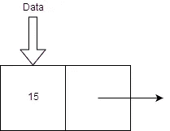

A Node of a Singly Linked List

单向链表有一个数据元素和一个指向下一个节点的指针。当指针没有指向任何东西时，我们说它指向零。

2 **组件**组成了单链表节点——数据和指针。

单链表不能向后指向，因为它们没有“向后”指针。

除了下一个节点所在的位置，指针不存储任何数据。它实际上是一个指针。

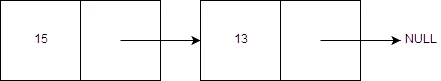

2 nodes in a linked list. One of them is correctly pointing to NULL.

添加了一个新的节点来显示包含多个节点的单链表。

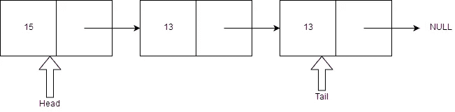

3 nodes in a linked list, with a header and tail pointer.

根据实现的不同，一个链表也可以有两个特殊的指针——头和尾。

头指针指向链表中的第一个节点。尾指针指向链表中的最后一个节点。

如果链表中只有一个节点，约定是 head 指向它，tail 指向 null。尽管这完全取决于程序员，并且在某些情况下，头尾可以指向同一个单个节点。

程序员为链表创建特殊的函数，使它们更容易使用。这些功能是:

*   node.data =从当前节点获取数据
*   node.next =转到下一个节点

# 双向链表

双向链表是一个单向链表，它有一个“反向”组件。

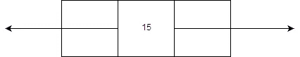

A node in a doubly linked list with 3 components

双向链表中的每个**节点**有 3 个**组件**。向后指针、数据元素和向前指针。

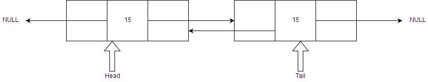

2 nodes in a doubly linked list. Both nodes are correctly pointing at NULL. There are header and tail pointers in this linked list.

和单链表一样，双向链表也有特殊的功能。这些功能是:

*   node.data =从当前节点获取数据
*   node.next =转到下一个节点
*   node.prev =转到上一个节点

如果在头节点上使用 node.prev，那么函数将出错或产生空值。如果在尾节点上使用 node.next，那么函数将出错或产生空值。

# 遍历链表

我们想对链表做的很多事情就是遍历它们。在链表中上下移动。

我们需要做的第一件事是确定我们从哪里开始。嗯，链表的起点(head)是个好地方。

现在我们需要一个遍历整个列表的循环。我们希望遍历每一个节点，直到当前选择的节点为“NULL”或者在 Python 中为 None。一旦我们到达一个“无”节点，我们就知道我们到了终点。

现在我们想在遍历链表时对它做些什么。让我们打印链表中每个节点的每个数据元素。

现在，为了实际移动到下一个节点，我们使用 node.next 函数:

的符号:

被称为**点**符号，因为我们调用链表的函数“下一步”。我们将很快看到如何编写一个链表。

搜索和遍历链表的时间复杂度是 O(n)。如果你不理解大 O 符号，我强烈推荐这篇文章:

[](https://hackernoon.com/you-need-to-understand-big-o-notation-now-4ada3d2ec93a) [## 你现在需要理解大 O 符号。

### 你的算法可能会很慢，除非你学会这一基本技能，否则你可能不会注意到它。

hackernoon.com](https://hackernoon.com/you-need-to-understand-big-o-notation-now-4ada3d2ec93a) 

# 链表编程

链表在大多数语言中都不可用，所以我们必须自己编程。

因为一个节点在我们的链表中具有相同的功能和外观，所以最好将其创建为一个类。

一个类是一个**对象**的模板。您可以从一个类中创建许多对象。

让我们用 Java 设计链表。

您可以使用点符号将 3 种方法应用于该节点:

这个类有一个“构造器”方法，每次我们创建一个新节点时它都会运行。这为我们初始化了节点。构造函数方法设置下一个和上一个指针指向“null”。然后，它将数据设置为“I ”,这是用户希望放入节点的内容。

如果我们想创建一个节点，我们只需编写以下代码:

这创建了 Node 类的一个**实例**，并提供数字“5”作为该节点的数据元素。

当然，只有一个单一节点是没有用的。我们想在链表中添加更多的节点。

还记得前面的例子吗？在这个例子中，将一个元素添加到数组的前面需要将每个元素向右移动 1？

我们将展示如何使用链表更容易做到这一点。

为了在列表的前面添加一个新的节点，我们需要一个方法(函数)来完成这个任务

在我们可以将一个节点添加到前端之前，我们首先必须用我们想要的值创建一个节点:

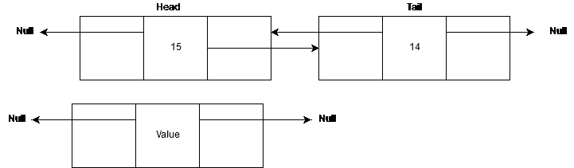

A doubly linked list already exsists with data 15 and 14\. We create a new node with data Value that is not currently connected to the linked list; as such both pointers point to NULL.

现在，根据我们前面对节点类的定义，节点的函数 node.next 和 node.prev 指向 null。让我们改变这一点:

我们没有更新头指针，所以它仍然指向链表的头，这就是我们想要在链表中创建的第二个节点。我们让 node.next 指针指向 head 指针指向的地方。

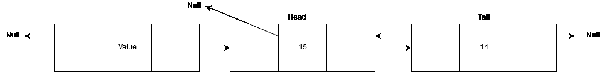

We begin to attach the new node to the rest of the linked list. We tell the forward component to point at where head is pointing at.

因为我们要在链表的前面插入一个新的节点，所以我们需要很快更新 head 指针。首先，我们将定义上一个指针指向的新节点。

我们实际上不需要将 newNode.prev 更新为 null，因为它已经在 Node 类中完成了；然而，为了使事情清楚，代码已经放在那里。


Since we defined both pointers of a doubly linked list node to point to NULL nothing has changed. The code has been put here for extra clarity. This has **not** changed the linked list.

现在我们需要更新第二个节点，头指针仍然指向的节点。它需要知道 node.previous 现在指向一个实际的节点，而不仅仅是 null。

如果头指针没有指向任何东西，因为链表还没有创建，那么我们不需要更新节点。

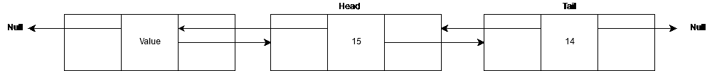

The second node (head node) has been updated so the previous component points at our new node.

如果头指针指向一个节点，那么就通知这个节点。prev 函数指向我们刚刚插入的新节点。

否则，如果头部没有指向任何东西，就把尾部作为新节点。前面我们讨论了一个单个节点是否有一个头指针或尾指针指向它。这是程序员决定的部分。在这里，我们选择了同时将单个节点作为尾部和头部。

我们现在只需要更新头部指针，使其指向链表的新头部:

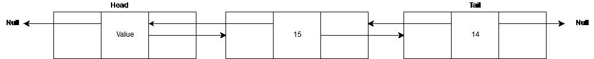

The new node has been inserted at the head of the linked list. We have just updated the head pointer to point to the new head.

我们也可以用类似的方式删除链表前面的节点:

这里我们假设 curr 是一个指向链表中任意节点的指针。

然后，我们希望将 curr 设置为 head，因为我们要删除 head 节点:

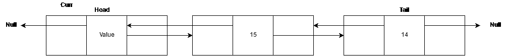

The curr pointer is pointing at the same place the head pointer is.

我们要确保那个头指向某个东西。curr 不等于 null，因为那里有一个节点。

我们向右移动头部指针 1。

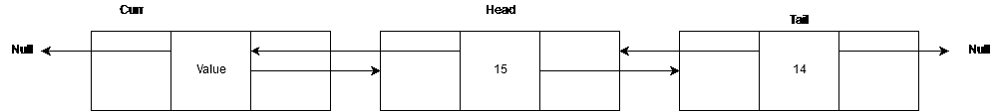

We have moved the head pointer to the right

我们还将 head.prev 设置为 null。

现在我们移除 curr.next 的指针

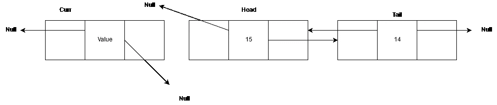

The Curr node is completely disconnected from the linked list.

现在我们让这个节点坐在一个空间里，什么也不做。我们返回这个节点，以防我们想用它做别的事情。

就是这样！该节点不再连接到链表，因此使其“被删除”。

# 将项目插入链接列表

链表的真正强大之处在于能够在其中的任何地方插入条目。

在链表中的任意位置插入一个项类似于在头部插入一个项。你只是改变了几个变量，想法还是一样的。

每当我们想要插入一个新的节点时，我们只需要告诉这个节点下一个和前一个节点是什么。

# 搜索链接列表

链表通常是排序的。项目可以插入链表中的任何位置，所以把它们放在正确的位置是有意义的。如果你有一个数据为 3，4，6 的链表，程序员可能会把包含 5 的新节点放在 4 和 6 之间。但这完全取决于程序员。

我们可以用二分搜索法来搜索名单。但是，这是个坏主意。我们不知道链表的中间在哪里。每次我们想找到中间的节点时，我们都必须计算列表中的每一个节点，然后用 2 减去一半。

我们可以使用顺序搜索的修改版本来搜索链表。

假设链表是按升序排序的。我们可以利用这些信息加快顺序搜索的速度。

因为链表是按顺序排序的，我们知道链表中的节点是按一定的顺序排列的，比如 1，2，3，4，5。如果 node.data 比键(我们正在寻找的)多，我们知道它不在列表中，因为它是排序的。

因此，如果我们想找到 2.5，我们会这样做:

```
1 is selectedis 1 goal? - nois 1 > 2.5? no2 is selectedis 2 goal? nois 2 > 2.5? no3 is selectedis 3 goal? nois 3 > 2.5? yes - we can assume 2.5 is not in list and thus end the search here
```

有许多搜索算法。但是大多数时候，如果你知道一点点关于数据的信息，你可以改变搜索算法，使其更有效。总的来说，二分搜索法是非常有效的，但在这里它不是那么好。不要使用一种算法，因为栈溢出说它是最快的，最好的算法。

算法就像编程语言。我们都有自己喜欢的语言，有时我们会说一种编程语言比另一种好(Python，我爱你)。但是说到底，说一种编程语言比其他所有语言都好是愚蠢和幼稚的。使用适合工作的工具，如果你想改变它！

# 区块链

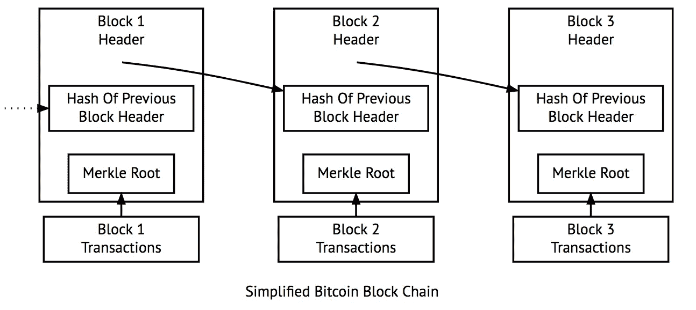

回到区块链科技。之前我说过:

> 区块链是一个不可变的、有序的、反向链接的事务块列表。

所以让我们来解决这个问题。

区块链是不可改变的。理论上你不能改变区块链。这是可能的，但非常非常难做到，尤其是对于像比特币的区块链这样的区块链。

区块链是按照最频繁的交易来排序的，位于链的“顶端”。或者最频繁的交易在最右边。

区块链被“向后”链接，引用链中的前一个块。每个块都引用它后面的块。

每个块都是一个事务。

现在，您应该对链表及其工作原理有了很深的理解。你还应该理解区块链的链表部分。

# 如果你喜欢这篇文章，请联系我！

[LinkedIn](https://www.linkedin.com/in/brandonls/)|[Twitter](https://twitter.com/brandon_skerrit)|[网站](http://brandonskerritt.github.io/) | [简讯](https://upscri.be/885736-2/)