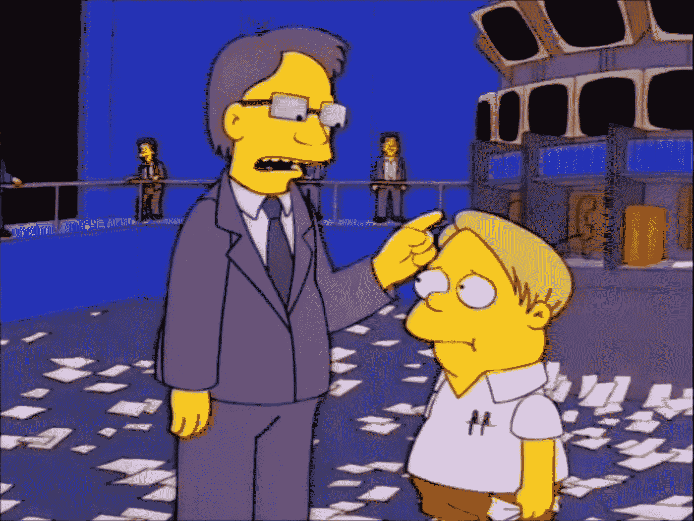

# 你变得贪婪了，马丁…

> 原文：<https://medium.com/hackernoon/you-got-greedy-martin-cdf1c6f5639d>

我们以前看到过这种情况，头条新闻预测秘密市场的死亡，新手在恐慌中出售，不太好的人呼吁保持理智，我们都说，冷静，这很快会过去的…或者不会？

就我个人而言，我不使用加密货币进行交易，我只限于在区块链时间[前后进行采矿和开发一种或另一种服务。因此，当我醒来看到图表崩溃时，我不会变得非常敏感。实际上，我更像是区块链的狂热书呆子和根深蒂固的企业家，然而，加密市场对我很重要，我密切关注。](https://hackernoon.com/tagged/blockchain)

几天前我有一次谈话，我的团队讨论了我们是否应该允许我们的用户在我们的平台上使用[比特币](https://hackernoon.com/tagged/bitcoin)，以太坊和其他加密货币，我完全拒绝了。当我简单而干脆的回答“不”时，每个人都震惊了，他们用愤怒的眼神看着我

不要误解我，正如我之前所说，我热爱区块链技术，我完全赞成它的实施，但我不赞成投机，我没有说它不好或我看错了人，正如我在 a 中所说，首先，我自己开采加密货币，我有额外的收入。但是，区块链技术永远不会成为主流，只要它仍然只是一个泵和倾倒计划，它的最大潜力就不会得到开发。

在我看来，区块链技术在一个不那么饱和的行业为企业家们打开了新的机会。

这是我和我的团队在 bitcon 接触到 6000 美元之前的讨论，我必须说这是一个不可饶恕的代价。

如此不稳定的市场如何变得对普通用户有吸引力？因为实际上我们是在坐过山车。我周围的人和不了解区块链主题的人今天把我视为大亨，明天又把我视为即将失去一切的失败者(这不是真的)，尽管我对这些人如何看待尊重不太感兴趣，如果这让我思考远离技术的人如何看待比特币和区块链，这对这样一项革命性的技术来说并不好。

我知道，或者更确切地说，我理解，作为所有采用过程，这种现象是“正常”的，我也相信比特币在不久的将来会触及更高的价格。然而我不禁想知道。在不久的将来，我们还会看到多少次这种世界末日的场景？

如果你对这个话题不熟悉，我敢给你一点建议。不要被牛市的情绪冲昏头脑，也不要因为下跌而丧失斗志。这种情况已经发生，而且显然将继续发生。市场最终会成熟，但不要带着错误的幻想进入市场，也不要带着破碎的梦想离开。就像社区里说的那样… HODL！

你是怎么处理这个秘密启示录的？