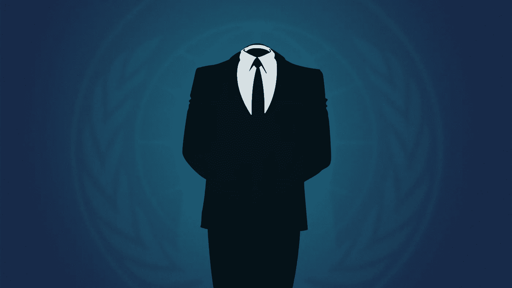
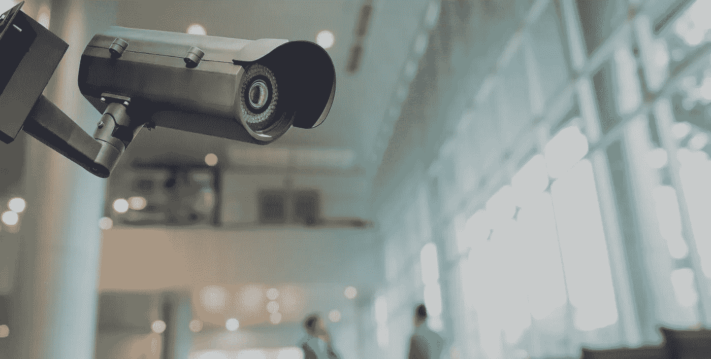

# 你有权匿名

> 原文：<https://medium.com/hackernoon/you-have-the-right-to-anonymity-cec4ab82911f>

匿名权应成为确保数字时代个人和公民基本权利的世界标准。首先，这是言论自由权和隐私权。

爱德华·斯诺登说:

> “说你不在乎隐私权是因为你没什么好隐瞒的，和说你不在乎言论自由是因为你无话可说没什么区别。这是一个非常反社会的原则，因为权利不仅仅是个人的，而是集体的，今天对你没有价值的东西，明天可能对整个人口、整个民族、整个生活方式都有价值。如果你不为它挺身而出，那么谁会呢？”

那么，如果我们谈论的是互联网空间，那么个人私生活中的匿名权和隐私权到底是什么？

1。 **匿名上网(在网上搜索信息)和匿名发送个人信息(电子邮件、即时消息)的权利**

匿名连接是任何互联网用户都必须拥有的一项基本的主观权利。匿名连接被认为是到目的服务器的连接，其中服务器既不能建立连接的来源(IP 地址/位置),也不能为其分配标识符。用户应该有权在互联网上进行匿名信息搜索，包括隐藏他们的 IP 地址和匿名发送消息。2016 年秋季，欧洲法院[审议了](http://curia.europa.eu/juris/document/document.jsf?text=&docid=178241&pageIndex=0&doclang=EN&mode=req&dir=&occ=first&part=1&cid=810242)德国联邦法院提出的一项请求，该请求涉及德国海盗党的一名代表对联邦政府的索赔。该投诉是由一名德国公民提出的，内容涉及用户离开网站后，政府网站上动态 IP 地址的存储。欧洲法院在其第[号裁决中承认](https://arstechnica.co.uk/tech-policy/2016/10/eu-dynamic-static-ip-personal-data/)动态地址(正如其之前对静态地址所做的那样)为个人数据，并指出运营商无权保存动态 IP 地址，除非这样做是为了防范网络攻击。

2。 **匿名支付的权利(包括使用加密货币)**

一个公民应该有权合法地匿名转移资金给另一个人。

人们也普遍认为慈善应该匿名。慈善组织或个人可能有各种各样的原因想要保持匿名:不想公开他们的财务状况，或不愿意表达特别针对或人格化的感激之情，等等。

3。 **匿名创作和发布内容的权利**

作者使用姓名的权利提供了使用或授权使用自己姓名、化名或匿名作品的权利。类似的规定也包含在伯尔尼公约中，该公约规定匿名或用假名发表的作品的版权自其合法表现之日起 50 年内有效。

# 有助于保护匿名的工具

[**Tor(洋葱路由器)**](https://www.torproject.org) 是一款开源软件，允许使用代理服务器系统建立匿名网络连接。这种技术的使用形成了一个匿名网络，在该网络中，数据传输以加密的形式进行(数据包在传输到每个新节点的过程中分三个阶段加密)，从而确保了数据传输和网络连接的保密性

创业公司 [Snowden-Coin](http://snowden-coin.com) 的 [**UltraUpload**](https://ultraupload.io/) 通过创建一个基于 [IPFS](https://ipfs.io) 的 [P2P](https://en.wikipedia.org/wiki/Anonymous_P2P) 文件共享网络来保护隐私。该网络将允许人们将任何数据库转移到区块链，这不会受到影响，甚至是政府的影响。此外，这个网络将允许任何人匿名下载和免费分发任何数据，或者他们可以指定下载费用。

[**VPN(虚拟专用网)**](https://en.wikipedia.org/wiki/Virtual_private_network) 是一种允许在不安全的互联网内创建安全网络或隧道的技术。VPN 是来自安装在用户计算机上的 VPN 客户端和 VPN 服务器的隧道。在这个隧道中，VPN 技术允许您保护、加密和更改在用户计算机和互联网上的网站或 web 服务之间交换的数据。

[**面纱**](https://news.mit.edu/2018/system-patches-private-browsing-0223) 是麻省理工学院发明的一种工具，旨在确保在公共电脑上工作时的匿名性。该工具还可以在匿名模式下使用，并与 Tor 一起作为额外的保护级别。无论使用何种浏览器，Veil 都会在网站显示在屏幕上之前对其进行加密。用户不是在浏览器行中输入想要的 URL，而是在 Veil 网站的地址栏中输入。该网站的面纱版本看起来与原始版本没有什么不同，但该页面将嵌入一种加密算法。

[**I2P**](https://en.wikipedia.org/wiki/I2P) —匿名覆盖网络。这个项目的目标是创建一个运行在互联网上的匿名计算机网络。I2P 网络是重叠的(即运行在另一个网络(Internet)之上)、稳定的(禁用一个节点不会影响网络的运行)和匿名的(不可能或很难确定节点的 IP 地址)。在网络节点之间传输数据时使用加密。您可以放置任何服务(或服务类型)(论坛、博客、文件共享、电子邮件、即时消息系统(聊天)、文件共享系统、VoIP 等)。)内部，同时保持服务器匿名。

值得注意的是，匿名权并没有直接载入任何由国家强制执行的国际文件，仍然只能要求独立国际组织(主要是联合国)和利益攸关方以及发达的司法实践提出建议。与此同时，2016 年，联合国人权理事会通过了一项关于“在线权利”的扩大决议。在最后决议中，联合国大会呼吁各国:

> “……审查其与阅读信件以及截获和收集个人信息有关的程序、做法和立法，包括大规模监视的做法，以保护隐私权。”

在美国，匿名发表意见的权利受到第一修正案的保护，而且保护这一权利的必要性已经被最高法院反复确认。欧洲委员会和欧洲联盟也制定了关于匿名权的具体法律立场。例如，2003 年 5 月，欧洲委员会部长理事会通过了一项关于通信和互联网自由的宣言。

该文件第 7 段规定:

> “为了确保免受在线监视，并增加信息和思想的自由表达，会员国必须尊重互联网用户不披露其身份的愿望。这并不妨碍联盟成员采取措施和协调行动，以便根据国家立法和《保护人权和基本自由公约》以及司法和国家政策领域的国际条约追踪参与犯罪活动的人。”

在司法实践中，ECHR(k . u .诉芬兰案，2008 年 12 月 2 日第 2872 / 02 号申请，Delfi 诉爱沙尼亚案，2013 年 10 月 10 日第 64569 / 09 号申请)也一再承认匿名对于言论自由和隐私权的重要性。同时，[法院澄清](https://www.article19.org/data/files/medialibrary/38006/Anonymity_and_encryption_report_A5_final-web.pdf)匿名不能是绝对的，可以限制为保护其他利益，特别是保护弱势群体:

> “互联网上的匿名和保密不应鼓励各国拒绝保护互联网上犯罪行为的潜在受害者的权利。虽然言论自由和通信保密是首要考虑因素，电信和互联网服务用户应保证其人格完整和言论自由得到尊重，但这种保证不能是绝对的，有时必须服从其他合法要求，如防止动乱或犯罪或保护他人的权利和自由。”

2015 年，联合国特别发言人大卫·凯在其关于在数字时代促进和保护见解和言论自由权的报告中强调了使用加密和匿名保护和加强言论自由的重要作用。在社交网络领域，匿名也已成为一个重要的标准，据称已成为企业营业额的一个常规部分。例如，脸书一度拒绝了它在大规模公众抗议后制定的“实名制政策”。世界上最大的社交网络还采取了另一个非常有趣的步骤——它在匿名 Tor 网络中开设了代表处，从而向其用户灌输了对增加个人数据保护的网络工具的兴趣。