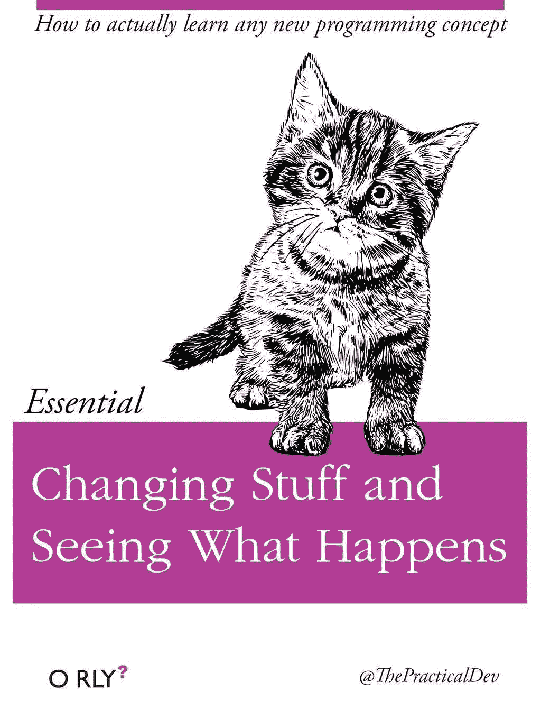
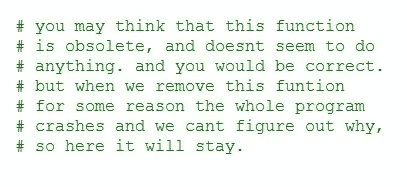
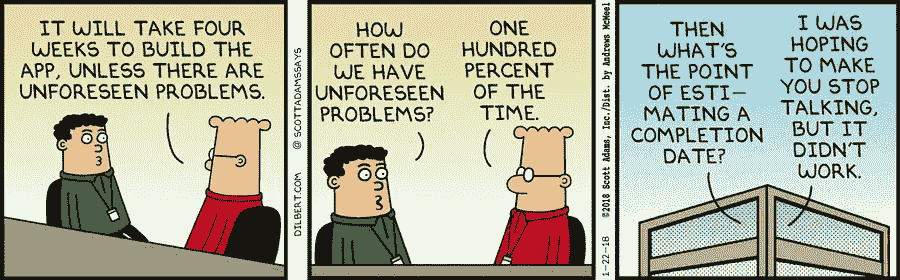
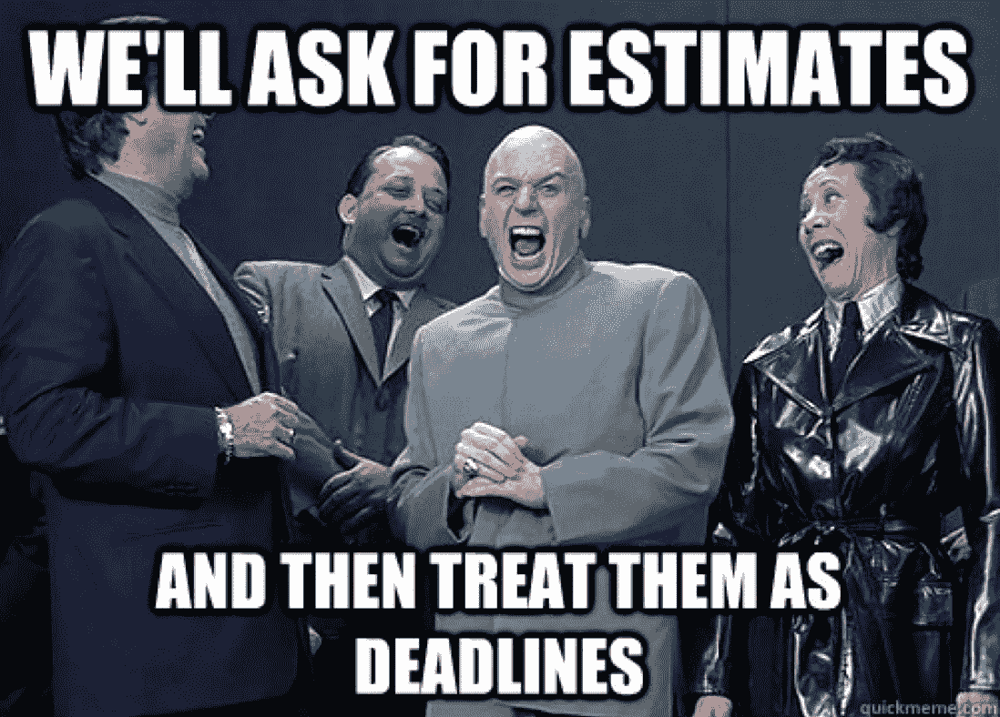

# 你必须在按时交付的软件和优秀的软件之间做出选择

> 原文：<https://medium.com/hackernoon/you-have-to-choose-between-software-delivered-on-time-and-good-software-44f4af1249b1>

[Milky Way, Mars and a Meteor](https://500px.com/photo/270034789/milky-way-mars-and-a-meteor-by-joan-gamell)

希望我用这个有争议的(公认夸张的)标题引起了你的注意。很好。让我用一种稍微更优雅、更少点击诱饵的形式来重述一下:

**一般来说，你既可以拥有按时交付的软件，也可以拥有好的软件，但你不能两者兼得***

**除了在既定的高绩效团队中的特定场合*

在过去的几个月里，我一直在思考为什么交付好的软件不能很好地进行评估和计划。在我的职业生涯中，我见过许多不同的项目运行方式(瀑布式、*真实的*敏捷、敏捷-瀑布式)，它们都有一个共同点:不管我们在做什么样的项目，如果我们“*做对了*”(也就是说，我们没有走那些会给我们带来噩梦的捷径)，我们总是会错过截止日期。

另一方面，每当一个项目被“按时”交付，要么它的范围在过程中被缩小，要么我们不得不偷工减料，以至于在实现过程中积累的技术债务几乎保证了该项目必须在发布后不久被重写，这让我想知道:即使最终结果是一个更丑陋、更不可维护、充满 bug，并且简单地说，是我们最初开始要做的事情的 T10 更糟糕的 T11 版本，一个项目真的“按时”了吗？

我也参与过没有截止日期的项目。确实有“最后期限”，但它们远不是一成不变的，人们知道最后期限是灵活的，质量比按时交付更重要。这些项目生产了最好的软件，拥有最快乐的开发人员，也是我参与过的所有项目中最成功的。但我们都知道这些项目是一个罕见的发现，否则我不会写这篇文章。

那么，为什么给定一个静态的时间表，计划和交付好的软件会如此困难呢？我觉得跟**创意**、**工艺**和**不可预测性**有很大关系。

# 编码的创造性方面

我认为**软件开发本质上是一项创造性的事业**。当然，有一些开发人员执行重复的、琐碎的任务，但是只有当没有人知道如何自动化他们的任务时，他们才会有工作——这不是一个好地方，也不是本文的重点。

对我来说，*创造*新事物并寻找原始解决方案来应对挑战的行为有一些特殊之处，这召唤我从事软件开发，我不认为我是唯一的一个。事实上，我相信创造力是开发人员喜欢他们工作的主要原因。根据我的经验，每当我在有严格且不可改变的“实践集”的环境中工作时(想想技术栈、过程、指导方针等等)。)——也就是说，我拥有的创作自由越少——我就越不投入。“毕竟，如果他们已经想通了，为什么他们*需要*我？”我想知道。另一方面，当很少有自上而下的指令时，我在工作中感到更加充实、兴奋和富有成效，我被给予了创造性的回旋余地，并且被信任可以承认我的技术决策。

值得注意的是，更多的创造自由会导致更多的尝试和错误来找到解决方案——这很好。有些人认为你可以在写一行代码之前就知道完美的解决方案*(即提前)。相反，我认为，对于创造性活动来说，发现给定问题(不仅仅是软件)的解决方案的过程是一个修补的过程:你不能预先拥有完美的知识，而是通过做来学习，反复尝试新事物并保持有效，并通过精炼你的解决方案(如果你是精益/敏捷的，可能会将其发送给你的客户)直到你对它满意为止。*

**

*想想看，你花了多少时间在纸上设计一个特性，而一旦你真正开始实现它，就不得不完全改变设计。总会有*未知的未知*，发现和处理它们的唯一方法是*事后*通过实际编码你的解决方案，而不是花大量时间理论化和假装我们事先有完美的信息。这种修修补补的过程不太适合估算。*

*此外，正如其他创造性努力的情况一样，编码受益于*——这个术语是由亚当·格兰特创造的，他断言，通常你不能按需发挥创造力*，而是创造力来自于你头脑后台运行的一个过程的“推动事件”:***

> ***经常拖延的员工会花更多的时间进行发散性思考，他们的上司认为他们更有创造力。拖延并不总是激发创造力:如果员工没有内在的动力去解决一个重大问题，拖延只会让他们落后。但是当他们对提出新想法充满热情时， ***推迟任务会让他们想到更有创意的解决方案*** *。”****
> 
> ****—格兰特，亚当。"原创:不墨守成规者如何改变世界."****

***同样，对于试图计划和测量软件开发项目的每一分钟的中央计划者来说，这不是好消息。***

# ***构建软件的工艺***

***我所知道的最好的开发者是工匠。工艺是好软件的标志:**你不仅要构建有用的东西，而且要用最好的方式来构建它***——构建有用的东西相对容易，但构建有用且经得起时间考验的东西却非常困难。****

***作为一名手工艺者，你作品的质量决定了你的身份。你把质量看得比数量更重要，因为你不想被人知道你写的是蹩脚的软件，即使你可以让你的产品经理满意，只是让你的软件“外表”看起来很好，但里面充满了令人讨厌的惊喜——我称之为*更好的惊喜开发*。你知道在编写好的软件上投入时间是有回报的，你会顶住“执行得更快”的压力，因为你知道你现在走的捷径越多，你的代码的预期寿命就越短，它在未来会引起更多的问题。***

****

**My eyes bleed**

**工艺就是关心 T21:关心做好工作，关心那些在你之后维护你的代码的人，关心你的软件的消费者是否能轻松使用它，关心你的团队成员，等等。你关心是因为你不是一个混蛋，因为你知道如果你想项目成功，这是正确的事情。**

**简而言之，在一个由短期执行驱动的世界里，优秀的工程师承担着关心质量的艰巨任务——这是一件具有长期后果的事情。**

**实际上，这可以解释为:**

*   **在封装、可扩展性、可伸缩性等之间找到合适的组合。—同样，你需要反复试错，没有人会在第一次尝试中就找到最佳解决方案。**
*   **当你偶然发现代码中糟糕透顶的部分时，花点时间进行重构**
*   **编写好的、完整的测试——甚至可能进行 TDD**
*   **与同事进行代码配对**

**不用说，提前计划所有这些是不可能的，所以这也不会帮你赶上任何截止日期。**

# **你的预测是错误的**

> **即使有明确的要求——似乎从来都没有——也几乎不可能知道一件事要花多长时间，因为我们以前从未做过。如果我们以前做过，我们会把它给你。**
> 
> ***—罗恩·杰弗里斯，* [无估计运动](https://ronjeffries.com/xprog/articles/the-noestimates-movement/)**

**软件项目是[复杂的系统](https://en.wikipedia.org/wiki/Complex_system):它们是由人类创造的，因此受到人际互动、动机、沟通问题和人类心理的影响——如果你问我，所有这些都很难在电子表格上建模和量化。这使得软件项目很难建模(因此也很难预测)。纳西姆·塔勒布在他的书《抗脆弱》中对此做了最好的解释:**

> ***“复杂系统充满了难以检测的相互依赖性和非线性响应。”非线性”的意思是，当你把一种药物的剂量增加一倍，或者当你把一个工厂的员工人数增加一倍，你得到的不是最初效果的两倍，而是更多或更少。在费城过两个周末并没有过一个周末愉快两倍——我已经试过了。”***
> 
> ***—纳西姆·尼古拉斯·塔勒布，*抗脆弱**

**更糟糕的是，鉴于时间不可能是负的，任何计划外的“惊喜”都很可能增加而不是减少完成时间，因为结果中存在*不对称*:**

> ***“就像时间不能为负一样，三个月的项目也不能在零或负的时间内完成。因此，在从左到右的时间轴上，误差会增加到右端，而不是左端。如果不确定性是线性的，我们会观察到一些项目很早就完成了(就像我们有时很早到达，有时很晚到达)。但事实并非如此。”***
> 
> ***—纳西姆·尼古拉斯·塔勒布，*抗脆弱**

**这是一个坏消息，因为*不确定性是确定的*，甚至在估计单个任务时的小误差也会在项目层面上成倍增加。所有这一切都是假设最好的情况，即开发人员经过仔细的估计后已经设定了最后期限，但现实甚至更荒谬:大多数时候“业务”任意设定最后期限，只有到那时工程才会提出一个计划，在那些随机选择的时间点交付需求，这是一个公然的从屋顶开始建造房子，然后在顶部本末倒置的情况。**

****

**Good question**

**这里有一些例子来说明编写软件的一些非线性和反馈循环:**

*   **那时你假设你需要与之通信的 API 接受`accountId`，但它实际上只接受`memberId`。为了重构 API 代码，你不得不在你的评估中增加 4 天的时间——这反过来又不得不经历一个额外增加了 2 天的单独审查过程。**
*   **一个估计需要两天的任务最终需要一周，因为在评审过程中，你的一个团队成员督促你(这是正确的)重构和改进代码中一个早就应该完成的非常丑陋的部分。**
*   **您不得不实施一些新功能的单点任务，碰巧需要更新依赖关系，结果花了 4 天时间，因为依赖关系更新触发了需要更新的依赖关系的连锁反应，并导致了构建中的一系列错误。**

# **我们完蛋了吗？**

**出于惰性，我们一直在玩评估和计划的游戏，以使我们自己确信我们知道我们在做什么，但事实是我们不知道，并且软件项目在经验上是不可预测的。因此，在我看来，我们更应该专注于*做*而不是计划——[#没有人估计](https://ronjeffries.com/xprog/articles/the-noestimates-movement/)？当然，这在许多组织中是行不通的:“我们不能让工程师们不受约束地操作，需要有一些责任！”。我明白了。**

****

**You don’t say?**

**那怎么办呢？我认为它可以归结为在电子表格世界和 IDE 世界之间架起一座桥梁，在某种程度上允许最大限度的创造性、灵活性和工程技术，同时小心地管理对项目干系人的承诺和期望。工程经理是弥合和管理这一鸿沟的最佳人选，他就像是两个世界之间的缓冲器。这不是一件容易的工作，而是一项必要的工作。Aaron Longwell 在他的文章中对此做了很好的解释:**

> ***“因为工程经理处在业务和技术之间，他们需要解决估计和现实之间的矛盾。有点像是被两头拉的叉骨；任何一边都可以折断。当业务方“获胜”时，开发人员就陷入了死亡行军。当开发问题比业务问题更重要时，您最终会超出预算和截止日期。不管怎样，你都完蛋了。成功的软件经理找到了变得灵活的方法；弯曲而不断裂，逐渐化解紧张。服务型领导可以成为找到这种灵活性的向导。”***
> 
> ***—伦·朗韦尔，* [*为什么软件开发需要仆人式领导*](https://adl.io/essays/why-software-development-requires-servant-leaders/#)**

**在产品和工程之间建立基于信任的牢固关系也非常重要。如果有信任，你将能够真诚地、公开地协商时间表。如果你之前已经证明你的团队交付了好的软件，那么就应该有足够的“社会资本”让涉众相信，如果你推迟给定的时间表是为了好的理由和共同的利益。**

**作为经理，我个人使用的另一个“技巧”是避免给出具体的日期，因为它们不可避免地会被用作硬性的截止日期。分散的时间范围效果最好，比如“3 到 5 周之间”。然后，越接近扩散的最后期限，你给它添加的定义就越多:“在 4 月和 5 月之间”在 4 月初变成“在 4 月 15 日和 5 月 3 日之间”，在 4 月 10 日左右变成“4 月 20 日的那一周”，以此类推。通过这种方式，你可以对你的同事开诚布公，同时让你的团队有足够的灵活性来解决不可避免的不可预见的问题。**

**最后，请记住，这取决于开发人员是否支持所交付产品的技术质量，而不是其他利益相关者。表面上看起来动机不同的组织之间会产生紧张关系，这是很自然的。关键是要指出，事实上，你们都(大概)与同一个目标保持一致:以尽可能最快的方式向客户交付高质量的软件——只有优秀的开发人员似乎才明白的要点是，你应该避免采取欺骗性的“快速而简单”的方式，因为从长远来看，这实际上是最慢的方式。**

**总之，这是一个可解决但复杂(且常见)的问题。我想说的是，如果你觉得你的经理或你的组织没有安排你开发好的软件，那就由你来说出来并尝试改变它，或者，如果失败了，找其他地方工作。**

**  I 感谢您的阅读，希望您觉得有用。如果你喜欢它，请**考虑订阅** [ **灰色事件** ](https://graymatters.substack.com/) **🧠** ，这是我与[马里奥·查莫罗](https://medium.com/u/6291e977af46?source=post_page-----44f4af1249b1--------------------------------)共同撰写的每周时事通讯，我们在这里讨论生产力、科技、新常态以及介于两者之间的一切。**