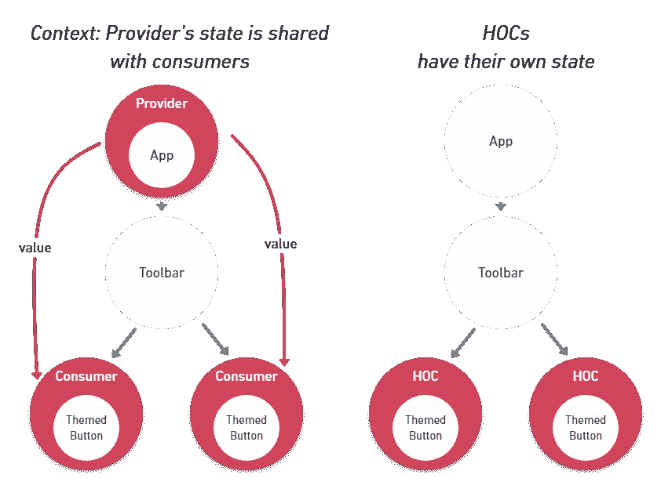
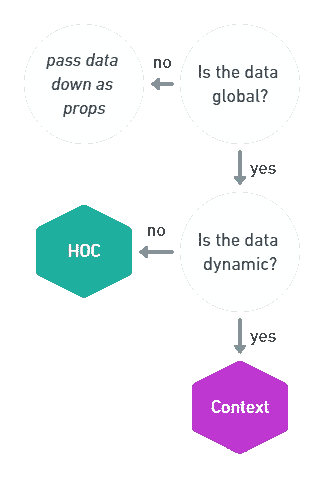

# 你可能不需要反应上下文

> 原文：<https://medium.com/hackernoon/you-might-not-need-react-context-e1adb35b2e04>

React 16.3 终于让[上下文 API](https://reactjs.org/docs/context.html) 稳定了。从那时起，许多开发人员开始使用它来解决“prop-drilling”问题——您需要沿着没有使用它的组件向下传递一个`prop`,以便访问正在树的深处呈现的组件中的那个`prop`。 [React](https://hackernoon.com/tagged/react) 文档如下陈述了上下文 API 的意图:

> 在一个典型的 React 应用程序中，[数据](https://hackernoon.com/tagged/data)是通过 props 自顶向下(父到子)传递的，但是对于应用程序中许多组件所需要的某些类型的 props(例如区域设置首选项、UI 主题)来说，这可能很麻烦。上下文提供了一种在组件之间共享这样的值的方式，而不必显式地通过树的每一层传递一个属性。
> 
> Context 被设计为**共享数据，这些数据可以被认为是 React 组件树的“全局”数据，比如当前认证的用户、主题或首选语言。**

让我们看看跟踪用户活动的例子。为此，我们想在用户每次点击 UI 元素时调用某个`track`函数。

## 平原反应中的追踪者

```
const track = event => console.log(`${event} occured`);

class App extends React.Component {
  render() {
    return <Toolbar track={track} />;
  }
}

function Toolbar(props) {
  return (
    <div>
      <TrackedButton track={props.track} />
    </div>
  );
}

function TrackedButton(props) {
  const onClick = () => {
    props.track("button click");
    // do something on click
  };
  return <Button onClick={onClick} />;
}
```

我们需要在应用程序的许多不同组件中使用`track`功能，在没有任何高级模式的情况下使用 React，我们需要在整个组件树中传递`track`，即使`App`和`Toolbar`没有使用它。

## 带上下文的跟踪器

我们可以使用新的 React 上下文 API 将`track`函数注入到所需的组件中:

```
const track = event => console.log(`${event} occured`);
const TrackerContext = React.createContext(track);

class App extends React.Component {
  render() {
    return (
      <TrackerContext.Provider value={track}>
        <Toolbar />
      </TrackerContext.Provider>
    );
  }
}

function Toolbar(props) {
  return (
    <div>
      {/* does not need to forward props anymore */}
      <TrackedButton />
    </div>
  );
}

function TrackedButton(props) {
  return (
    <TrackerContext.Consumer>
      {value => (
        <Button
          onClick={() => {
            // call track
            value("button click");
            // do something on click
          }}
        />
      )}
    </TrackerContext.Consumer>
  );
}
```

我们创建一个`TrackerContext`，用`Provider`包装根组件，使得`track`功能*消耗*作为`TrackedButton`组件中的`value`。

然而，这不是我们在`Context` API 之前不能做的事情，你**总是可以在 React 中用一个特设的**(高阶组件)来做这件事。使用特设的代码可读性更好。

## 作为特设的跟踪器

我们可以创建一个 HOC，一个接受一个组件并返回一个新组件的函数，这个新组件通过一些增强来呈现原始组件。在我们的例子中，我们只是将`track`函数作为`prop`注入到内部组件中。

```
const track = event => console.log(`${event} occured`);
const withTracker = track => Component => (props) => (
  <Component track={track} {...props}/>
);

class App extends React.Component {
  render() {
    return (
      /* no need to wrap root Component */
      <Toolbar />
    );
  }
}

function Toolbar(props) {
  return (
    <div>
      {/* need to use the HOC here */}
      <TrackedButtonWrapped />
    </div>
  );
}

// TrackedButton is the same as in first solution
function TrackedButton(props) {
  const onClick = () => {
    props.track("button click");
    // do something on click
  };
  return <Button onClick={onClick} />;
}
// Need to create a higher-order component out of TrackedButton
const TrackedButtonWrapped = withTracker(track)(TrackedButton)
```

这样做的好处是代码比使用`Context`要干净得多:

1.  `App`不再需要`ContextProvider`包装。
2.  `TrackedButton`与普通 React 溶液中的成分完全相同。它不再负责检索`track`函数。这是因为我们将`prop`检索转移到了`**TrackedButtonWrapped**` **特设**中，而不是在`Toolbar`中呈现。

> 所以 React.createContext 没用吗？

让我们回到 [React 文档](https://reactjs.org/docs/context.html)中给出的例子。在那里，`Context`是用来*主题*的一个 app。

## 结合上下文进行主题化

代码类似于*跟踪上下文*的例子。`ThemeContext.Provider`提供`theme`和*切换主题*的功能，主题在根组件中设置`state`。这些变量只在需要的地方使用——在`ThemedButton`中设计按钮的样式并在按钮点击时切换主题。

```
const ThemeContext = React.createContext();

class App extends React.Component {
  state = {
    theme: 'light'
  }

  toggleTheme = () => {
    this.setState(({ theme }) => ({
      theme: theme === 'light' ? 'dark' : 'light',
    }));
  }

  render() {
    const value = {
      theme: this.state.theme,
      toggleTheme: this.toggleTheme,
    }
    return (
      <ThemeContext.Provider value={value}>
        <Toolbar />
      </ThemeContext.Provider>
    );
  }
}

function Toolbar(props) {
  return (
    <div>
      <ThemedButton />
    </div>
  );
}

function ThemedButton(props) {
  return (
    <ThemeContext.Consumer>
      {({ theme, toggleTheme }) => <Button theme={theme} onClick={toggleTheme}/>}
    </ThemeContext.Consumer>
  );
}
```

## 主题化:第一次尝试

让我们试着将与`Tracking`相同的特殊模式应用到`Theming`。

> 剧透:行不通。

```
const withTheme = InnerComponent => class extends React.Component {
  state = {
    theme: 'light'
  }

  toggleTheme = () => {
    this.setState(({ theme }) => ({
      theme: theme === 'light' ? 'dark' : 'light',
    }));
  }

  render() {
    return (
      <InnerComponent theme={this.state.theme} toggleTheme={this.toggleTheme} />
    )
  }
}

class App extends React.Component {
  render() {
    return (
      // again no Provider needed
        <Toolbar />
    );
  }
}

function Toolbar(props) {
  return (
    <div>
      {/* use the HOC here */}
      <ThemedButtonWrapped />
      {/* let's add another Button here */}
      <ThemedButtonWrapped />
    </div>
  );
}

function ThemedButton(props) {
  return <Button onClick={props.toggleTheme} theme={props.theme} />;
}
// Need to create a higher-order component out of ThemedButton
const ThemedButtonWrapped = withTheme(ThemedButton)
```

这里怎么了？如果我们添加另一个`ThemedButton`，你会发现它在这里不起作用。每次创建 HOC 时，组件实例都以一个新的`state`开始，因此按钮的主题是相互独立的。你可以在这里摆弄它[。](https://codesandbox.io/s/r5o2zjop5m)

[](https://codesandbox.io/embed/r5o2zjop5m) [## CodeSandbox

### CodeSandbox 是一个为 web 应用程序量身定制的在线编辑器。

codesandbox.io](https://codesandbox.io/embed/r5o2zjop5m) 

**为什么它在跟踪示例中有效？**在跟踪示例中，数据(`track`函数)是*静态的*并且从不改变，因此使用相同函数的每个按钮实例在这里都不是问题。

这就是`Context API`相对于`HOC pattern`的一大优势，也是它如此强大的原因:**使用** `**Context**` **数据在所有** `**Consumers**`中共享*。*



# 摘要

这里是 React 文档对`Context`用例的描述:

> 上下文旨在共享数据，这些数据可以被视为 React 组件树的“全局”数据

我可以更进一步说，`Context API`是用于全局**动态**数据的，这些数据被多个组件实例使用**。在**静态**数据的情况下，您可能不需要`Context`。它总是可以被注入`props`的更简单易用的 HOC 所替代。**

以下是如何决定是否使用 React 的`Context` API 的通用指南:



最初发表于 [cmichel.io](https://cmichel.io/you-might-not-need-react-context/)