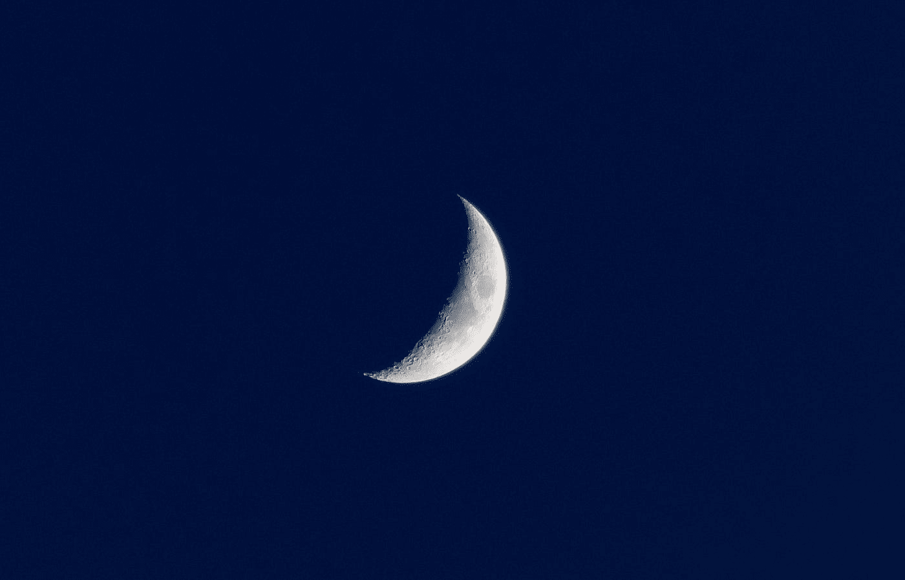

# 你需要超过 6 小时的睡眠

> 原文：<https://medium.com/hackernoon/you-need-more-than-6-hours-of-sleep-5186cfcf1dd5>

Photo by [Jessica Flavia](https://unsplash.com/@flaviajessica?utm_source=medium&utm_medium=referral) on [Unsplash](https://unsplash.com?utm_source=medium&utm_medium=referral)

# 你是否:

*   依靠咖啡因来度过一天？
*   周末比工作日晚上睡得更久？
*   偶尔通宵吗？

# 你做错了。

Watch my video [on YouTube](https://www.youtube.com/watch?v=RFgS2J9hoUs). Subscribe to [my channel](https://www.youtube.com/c/gregyeutter?sub_confirmation=1) for similar content.

当你在一个晚上只睡 6 个小时或更少的时候，你不允许你的身体自我修复。这会让你更饿、更弱、更笨、更虚弱、注意力不集中、更容易情绪波动。

这不是[蠢朋克](https://www.youtube.com/watch?v=gAjR4_CbPpQ)的想法。

# 但是我可以在周末补上！

Photo by [Anthony DELANOIX](https://unsplash.com/@anthonydelanoix?utm_source=medium&utm_medium=referral) on [Unsplash](https://unsplash.com?utm_source=medium&utm_medium=referral)

有个概念叫睡眠债。假设你工作日晚上睡 6 个小时，周末睡 10 个小时，而你应该睡 8 个小时——这是典型的作息时间。

如果你算一下，这将使你一周的总睡眠时间为 6 小时(5 天* 2 小时+ 2 天* 2 小时= -6 小时)。

也许你甚至会在一周内完全收回你的睡眠债务，这样你的债务就是 0 小时。

> 研究人员现在有证据表明，你永远无法从超过 20 小时的睡眠债务中完全恢复。

问题是:**睡眠债不是零和的**。通过弥补睡眠债，你是否能从短期睡眠不足(最多几个晚上)中完全恢复过来，这是一个有争议的问题。但是长期睡眠不足完全是另一回事。

研究人员现在有证据表明，你永远无法从超过 20 小时的睡眠债务中完全恢复过来。在我们典型的每周负债 6 小时的惯例中，你会在 4 周内达到负债 20 小时。

所以不，你真的无法在周末弥补失去的睡眠。

# 没时间睡觉。得去健身房了！

Photo by [Scott Webb](https://unsplash.com/@scottwebb?utm_source=medium&utm_medium=referral) on [Unsplash](https://unsplash.com?utm_source=medium&utm_medium=referral)

饮食和锻炼被广泛认为是健康的支柱。但是如果我告诉你睡眠更重要呢？

当你锻炼时，你实际上需要更多的睡眠来恢复。如果你在锻炼前后睡眠不足:

*   你的肌肉不会像它们原本可以的那样增长
*   你不太可能达到 PRs
*   你会面临更高的受伤风险
*   你可能患有慢性炎症

你最好少去健身房，多睡觉。这样，你的身体在每次锻炼后完全恢复，并为下一次锻炼做好准备。

# 我 6 个小时过得很好！

Photo by [Lily Lvnatikk](https://unsplash.com/@lvnatikk?utm_source=medium&utm_medium=referral) on [Unsplash](https://unsplash.com?utm_source=medium&utm_medium=referral)

哦，你认为你是个例外吗？有一群人被称为[短睡眠者](http://www.sleepeducation.org/sleep-disorders-by-category/insomnias/short-sleeper)，他们只需要 6 个小时的睡眠就能茁壮成长。

> 不到 1%的人有短睡眠者的基因变异。

但是只有不到 1%的人拥有基因变体 T1，是一个短睡眠者。你一生中更有可能被闪电击中，而不是成为这群不眠精英中的一员。

你越是经常剥夺自己一整夜的睡眠，你就越觉得这不是问题。但是仅仅因为你感觉很好[并不意味着你很好](https://well.blogs.nytimes.com/2013/06/17/cheating-ourselves-of-sleep/)。这很像饮酒。

以下是长期睡眠不足的一些额外副作用:

# 更小的睾丸

与睡眠充足的人相比，睡眠不足的男性可能会:

*   减少 29%的[精子数量](https://academic.oup.com/aje/article/177/10/1027/101677)
*   剩余精子中有更多的畸形
*   睾丸激素含量较低
*   [更小的睾丸](http://www.medicaldaily.com/lack-sleep-linked-smaller-testicles-and-lower-sperm-count-245258)

除此之外，运动员的表现也会下降。

# 月经周期中断

男性并不是唯一失眠的人。睡眠不足与不孕不育有关，而且会严重影响月经周期。

# 丑陋的面容

仅一晚睡眠不足的人被认为比那些睡了一整夜的人明显缺乏吸引力和健康。

# 心脏病发作风险

那些长期每晚睡眠 6 小时或更少的人比那些睡眠时间超过 7 小时的人一生中患致命心脏病或中风的可能性高 200%。

# 肥胖

当你睡眠不足时，你往往会有很强的食欲。与饥饿相关的荷尔蒙生长素会增加。与此同时，与饱腹感相关的瘦素水平下降。紧张和饥饿的时候，你更有可能去吃不健康的食物。

此外，当身体没有足够的睡眠时，它不能适当地处理你摄入的食物。这导致血糖升高。从长远来看，不健康的暴饮暴食与体重增加和肥胖有关。

# **更容易生病**

与同一个晚上睡了 7 个小时以上的人相比，一个晚上睡了 6 个小时或更少的人在暴露于病毒时感冒的可能性是 4 倍。

# 进一步阅读

Photo by [Jason Blackeye](https://unsplash.com/@jeisblack?utm_source=medium&utm_medium=referral) on [Unsplash](https://unsplash.com?utm_source=medium&utm_medium=referral)

受人尊敬的睡眠研究者[马特·沃克](https://www.sleepdiplomat.com/)最近出版了《我们为什么睡觉》一书。它以一种易于理解的方式探索了睡眠背后的机制和原理。可以找到[精装](https://www.amazon.com/dp/1501144316/?tag=gregyeutter-20)、 [Kindle](https://www.amazon.com/dp/B06ZZ1YGJ5/?tag=gregyeutter-20) 和[有声](https://www.amazon.com/dp/B0752XRB5F/?tag=gregyeutter-20)格式*的书。

杰出的程序员 DHH 说睡眠不足不是一种荣誉。这个家伙创建了一个广泛使用的 web 编程框架，并经营着一家成功的公司，所以他的建议并不像是来自左翼领域。

你可能也会对我最近的文章[有史以来最佳睡眠的 5 个技巧](https://hackernoon.com/5-hacks-for-the-best-sleep-ever-50cd3079c546)，以及与本文相关的[视频](https://www.youtube.com/watch?v=RFgS2J9hoUs)感兴趣。

感谢阅读。如果你喜欢这篇文章，请点击上面的按钮，与你的朋友分享。我也鼓励你订阅我的 YouTube 频道，获取更多数字健康内容。

*我可能会从点击代销商链接后的购买中获得一小笔佣金。