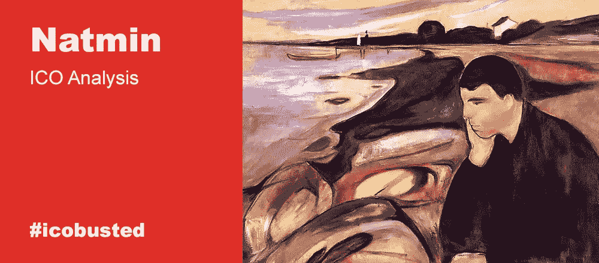

# 要加入托管市场，你需要的不仅仅是区块链

> 原文：<https://medium.com/hackernoon/you-need-more-than-blockchain-to-join-the-escrow-market-b034b3587736>

*专栏作者是* [*亚历山大·萨维金*](https://howtotoken.com/blockchain-experts/) *，我们的投资专家，Howtotoken 的联合创始人。这是#icobusted，我们扫描市场，寻找最新、最引人注目的即将推出的 ico，并对它们进行深入分析，重点关注这些项目背后的商业概念的可行性。这不会涉及前 ICO/ICO 价格差距，没有对团队的喘息和抱怨，也没有代码检查。在这里，我们将试着把每一件事都分解开来，看看当且仅当该产品能够交付时，该产品是否有任何市场前景。*

*如果您对我们的新形式有任何反馈，我们将不胜感激，因此请在评论栏中畅所欲言，说出您最感兴趣的部分，以及我们如何改进这些主题，让您对它们更感兴趣。要了解我们的最新动态，请关注我们:*

*   [推特](https://twitter.com/howtotoken)
*   [脸书](https://www.facebook.com/groups/howtotoken/)
*   [电报](https://t.me/icobusted)

或者只订阅我们的电子邮件简讯(以接收仅通过电子邮件分发的更新和独家材料):

# 纳特明

我们选择 Natmin 项目是因为它简单，它只有一个功能可以交付——托管。这种简单可能是一件伟大的事情。潜在客户可以选择 Natmin，因为它是简单的，易于理解和使用。

# 产品

首先，我想花点时间讲一下什么是托管。托管一种金融服务，用于通过将资金转移到第三方来确保任何类型的交易，该第三方被指定在交易条款满足时释放资金。通常，托管是一种法律安排，主要侧重于保护任何特定交易中涉及的买方和卖方的利益。

Natmin 是众多提供托管服务的项目之一(从小型专业公司到全球最大的银行组织)。当其他人试图使他们的产品清单多样化时，Natmin 只专注于改善托管服务。至少他们是这么说的。没有具体的数字来估计这种影响。

如果没有区块链，这将是另一家提供托管服务的公司，但它应该会减少费用并增加交易安全性。他们开始收取 1%的佣金，并随着交易复杂性的增加而增加额外费用。此外，安全性和交易速度是同一个硬币的两面，没有关于如何解决这一困境的信息(特别是最近有这么多基于以太坊的项目被黑客攻击)。

# 市场

有许多不同的托管市场细分，如互联网托管、银行托管、知识产权托管、房地产托管、M&A 等。较小的公司通常更喜欢专注于其中一个领域，而较大的金融机构则提供广泛的服务。由于服务的特殊性，实际上很难衡量这一细分市场的市值，因为与巨大的运营量相比，运营的边缘性并不是很大。托管服务增长迅速，与区块链相关的项目是这一增长的核心要素之一。

有很多金融机构提供传统的托管服务，其中大多数是银行。还有一个正在崛起的在线托管子行业，由[Escrow.com](https://www.crunchbase.com/organization/escrow-com#section-acquisition-details)引领，而市场的整体结构远非垄断。这个领域有很多玩家，但是没有一个玩家的年收入超过 3000 万美元。

总体而言，任何托管市场的特点都是显著的细分和高度的竞争，这为费用创造了严格的界限。平均市场托管费在 1-4%的范围内(由于给定交易的复杂性)，Natmin 没有提供任何更好的条件。

除了访问托管服务的传统方式，还有许多分散的服务，其中一些完全面向区块链市场。也就是说，市场上充斥着新的创业公司，所以竞争会很激烈。最杰出的创业公司通常瞄准一些特定的利基受众，以此来与更大的项目竞争。一些公司选择一个特定的焦点，比如 descrow.com 的 T2，它控制着投资份额。其他人提供像 [bcgroup.io](https://ibcgroup.io/ru/bitcoin-cryptocurrency-escrow-services/) 这样的专业服务，这些服务最终可能对他们有利。此外，有很多区块链项目提供托管服务，只是作为其平台的一个辅助部分。请记住，一些加密货币是围绕智能合约的想法建立的，仅此一项似乎是徒劳的。

还有预算的问题。我们在 Natmin 的白皮书和几个 ICO 追踪器之间发现了不同数字的 Natmin hard cap，最高数字是 600 万美元。营销预算的 25%最多为 150 万美元。谦虚是好事，但在这种困难的情况下，营销费用可能会飙升。因此，由于起步缓慢，Natmin 可能会面临无法吸引大量用户的局面。

# 摘要

这篇文章写得越长，Natmin 获得成功的机会似乎越来越小。但是还有更多。白皮书中没有任何关于营销工作或竞争分析的内容，所以这真的会让你怀疑他们是否了解市场的现实。Escrow.com 和区块链项目公司有几个强有力的竞争对手，他们很容易花几百万进行推广，甚至实施区块链架构，如果它能提供这么大的优势的话。这并不是说我们试图摧毁 Natmin 项目，只是到目前为止，它还没有成为最好的，就像任何好的投资者一样，你应该总是选择最好的。

*最终利弊:*

(+)大市场(也是高度分散的)
(-)Natmin 产品的竞争优势较弱
(-)存在立场坚定的细分市场领导者
(-)缺乏产品创新

虽然一些投资者可能会关注这个项目，但我们不希望如此。

# 参考

1.  [GGRG 经纪咨询公司 2018 年第二季度灵动域市场概述](https://ggrg.com/wp-content/uploads/2018/08/Quarterly-Report-2018-Q2-Final.pdf)
2.  [分散托管服务是什么？由 SimpleDex](/@simpledex.org/decentralized-escrow-service-what-is-it-cd976b2c755)
3.  [托管支付服务是 Finextra.com B2B 市场的福音](https://www.finextra.com/blogposting/14077/escrow-payment-services-a-boon-to-b2b-market-place)
4.  [PayPal 诉托管服务:字节技术带来的效率和安全](https://byte-technology.com/blog/paypal-v-escrow-services-efficiency-and-safety-by-the-numbers/)
5.  [什么是南加州房屋的买家成交成本](http://simivalleyrealestateanswerman.com/index.php/2018/02/10/what-are-home-buyers-closing-costs-for-a-southern-california-home/)由[西米谷房地产回答人](http://simivalleyrealestateanswerman.com/)

*所有材料仅供参考。任何材料都不应被解释为投资建议。*

*原载于 2018 年 9 月 4 日*[*【howtotoken.com】*](https://howtotoken.com/for-traders/you-need-more-than-blockchain-to-join-the-escrow-market/)*。*