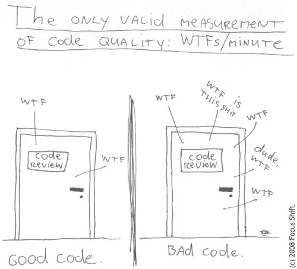

# 你需要停止学习

> 原文：<https://medium.com/hackernoon/you-need-to-stop-learning-ffdb79eca10c>

## 为了你的代码质量，你需要暂时把学习放在一边

大多数开发者都想变得更好，甚至变得更好，这是一条举世公认的真理。

如果说曾经有一个职业是围绕着[学习](https://hackernoon.com/tagged/learning)，自我提升，在自己的工作中做到最好，那就是[软件编程](https://hackernoon.com/tagged/software-programming)。

为了更好地进行[编程](https://hackernoon.com/tagged/programming)，你需要编写更好的代码。众所周知，要写出更好的代码，你需要知道规则。

> 通往伟大代码的道路是由标有 DRY、TDD、YAGNI、KISS、SRP、DIP、XP、…

因此，每当一个开发人员想要变得更好，他们自然会触及那些规则。也许你读到的下一个模式会让你的代码炼金术变得伟大。也许知道一个补充框架，或者学习更多关于数据结构的知识会让你在下一次解决问题时找到一个优雅的解决方案。

> 剧透提示:很可能不会。

# 什么是代码质量？

没有什么比在低质量的代码库上工作更糟糕的了。我们都本能地知道这个术语意味着什么。

> 代码到处都是！其他对象基本都是神级！有一些元编程生成 XML，然后由自制的解析器读取，以构建某种模板引擎……我猜是这样吧？

但是让我们反过来问自己，好的代码质量意味着什么？我们期望在一个好的代码库中找到什么？

> 我们期望找到易于理解的代码。

这就是问题的症结所在，不是吗？毕竟，我们越容易理解正在发生的事情，我们就越容易改变它来解决当前的问题。

这就是所有这些规则的目的:编写易于理解的代码。让我们暂时放弃太抽象的“好”这个形容词。

# 现在是秘密。

> 事实是:你可以永远保持学习，而根本不会成长。

当你专注于规则时，它们变成了拐杖，你为了结构而依附它们，而不是试图在你特定的约束下达到特定的目标。

你最终会将每个新想法与你已经持有的想法进行权衡，并抛弃你认为“没什么价值”的想法。你认为自己在成长，但实际上你只是让自己忙于学习。

> 专注于规则而不记住最终目标是什么将会让你一事无成。

你最终会写第 n 篇博文，讲述为什么新的编程语言比它试图取代的语言更好，或者为什么被遗忘的[框架](https://hackernoon.com/tagged/framework)比流行的更优雅。

但是如果你关注最终目标——写容易理解、清晰的代码— **,那么其他的事情都会迎刃而解。**

你认为《T4》规则最初是如何设计的？有些人努力变得清晰，他们找到了帮助他们到达那里的指导方针。但是他们没有盲目地应用它们，因为他们仍然牢记实际的目标:编写干净的代码。

这就是为什么软件开发中几乎每条规则都有“知道何时打破规则”的条款。

这也是为什么您会看到优秀的开发人员使用被认为有害的反模式或实践，但仍然能生产出令人难以置信的可读性和易于掌握的代码。

# 那么这对你的日常生活意味着什么呢？

如果你想继续学习模式和编程哲学，请这样做，但是要通过“这如何使我的代码更容易阅读”的角度来保持。

但是更重要的是，无论何时你写代码，或者回顾代码，问问你自己:“那种改变会使它更容易理解吗？”——在这个问题上，你要对自己非常诚实！—很快您就会看到您的代码得到改进。你会感到不自在，你会避免构建不必要的抽象，这一切都会水到渠成。

你会重新开始成长。