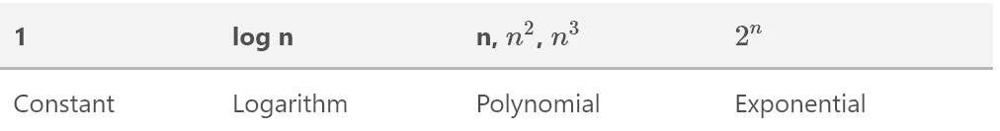
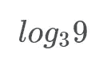
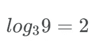
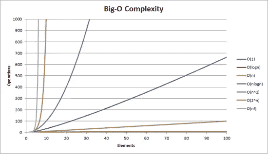

# 你现在需要理解大 O 符号。

> 原文：<https://medium.com/hackernoon/you-need-to-understand-big-o-notation-now-4ada3d2ec93a>


Photo by [Blake Connally](https://unsplash.com/photos/B3l0g6HLxr8?utm_source=unsplash&utm_medium=referral&utm_content=creditCopyText) on [Unsplash](https://unsplash.com/search/photos/computer?utm_source=unsplash&utm_medium=referral&utm_content=creditCopyText)

你的算法可能会很慢，除非你学会这一基本技能，否则你可能不会注意到它。

许多程序员创造的算法结果很慢，但他们不知道它很慢。我们需要一种方法来衡量一个算法运行需要多长时间。

## 我们如何衡量一个算法运行需要多长时间？

我们可以运行一个算法 10，000 次，并测量平均花费的时间，但这产生了一个问题。假设我们有一个算法，它获取一个购物清单，并打印出购物清单上的每一项。如果购物清单最多有 3 个项目，算法可能需要 3 秒钟运行。如果购物清单有 10 件商品，运行可能需要 10 秒钟。

这里捏造了一个问题。我们如何知道“完美的”输入大小是多少，以获得算法所需时间的“完美”度量？为此，我们使用一种叫做 Big-O(发音为 Big Oh)的符号。

大 0 符号是一种用来描述算法效率的符号。一旦你了解了这个表，Big-O 就很容易读懂了:



他们越靠右，花的时间就越长。大 O 符号使用这些函数来描述算法效率。以我们的购物清单为例，那么算法将是 O(n)。我们不知道购物清单中有多少商品，所以我们给它一个阿拉伯变量，比如 n。然后我们将每个商品打印到屏幕上，这需要 o(n)时间。

让我们把每一个都过一遍。

## 常数

常数算法是一种在输入变大时不会花费更多时间的算法。让我们看一个简单的例子:

这里的数字很小，但是:

花费大致相同的时间。但是如果这些数字特别大，比如…

这些数字是硬编码的。如果你输入 50，它仍然会把这两个数加在一起。因此，根据输入的大小，将它们加在一起并不需要太多时间。它们不随输入大小而缩放。它们是不变的。

## 日志

您可能想知道“什么是 log n”？嗯…

对数有时被称为日志。通常以二进制为基数，但也可以不同)。让我们做一个简单的例子:



在这个例子中，问题是“3 的幂给你 9 的幂”。所以 3 的 2 次方等于 9，所以整个表达式看起来像:



对数算法每次运行时都会将列表“减半”。这就是二分搜索法(稍后解释)。如果你给算法一个 10 项的列表，如下所示:

```
a = [1, 2, 3, 4, 5, 6 , 7, 8, 9, 10]
```

算法每次都是这样减半:

```
a = [1, 2, 3, 4, 5] 
a = [1, 2, 3]
a = [2]
```

那么它就是对数函数。

## 多项式时间

如果我们有之前的购物清单，看起来像这样:

```
a = ['water', 'vegetables', 'Bose QC35']
```

如果你遍历列表中的每一项，并大声说出来，那么复杂度将是 n。这是因为列表中有 n 项，项数可以增加或减少。

因为它加倍了输入的时间。这方面的一个例子是:

```
a = [1, 2, 3, 4, 5, 6, 7, 8, 9, 10]
for i in a:
    for x in a:
        print("x")
```

如果你看到一个嵌套的 for 循环，那么它就是 n，如果它是 3 个嵌套的 for 循环，那么它就是 n，依此类推。

## 指数的

这种算法是所有算法中最慢的。例如，假设您有一个仅由数字组成的密码(即 10 个数字，从 0 到 9)。你想破解一个长度为 n 的密码，所以要强行通过每个组合:

要解决的组合。



在 Big O 符号中，我们总是使用*最坏情况*来进行计算。计算机科学家是盲目乐观的。

# 简单的大 O 符号

如果你的算法看起来有点像 O(n + n)呢？有一些超级有用的规则可以简化你的算法。

## 放下常数

如果你有一个描述为 O(2n)的算法，去掉 2 就是 O(n)。

## 去掉非主导术语

O(n + n)变成 O(n)。只保留大 o 中较大的一个。

如果你有一个特殊的和，比如 O(b + a ),你也不能放弃，因为不知道 b 和 a 是什么。

# 摘要

我猜你在期待一本难懂的大 O 指南吧？嗯，就这些了。你需要记住(或学习)层次结构，采用一些算法，并找出它们的大 O 符号是什么。

大 O 代表一个算法需要多长时间，但是有时我们也关心一个算法需要多少内存(空间复杂度)。

还有其他形式的衡量算法时间复杂度，如大θ，它是算法花费的最少时间。

请继续关注下一篇关于搜索算法和如何在书店找到一本书的文章！

# 如果你喜欢这篇文章，请联系我！

[LinkedIn](https://www.linkedin.com/in/brandonls/)|[Twitter](https://twitter.com/brandon_skerrit)|[网站](http://brandonskerritt.github.io/) | [简讯](https://upscri.be/885736-2/)