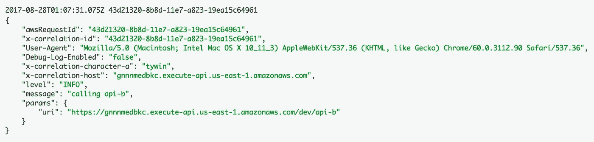
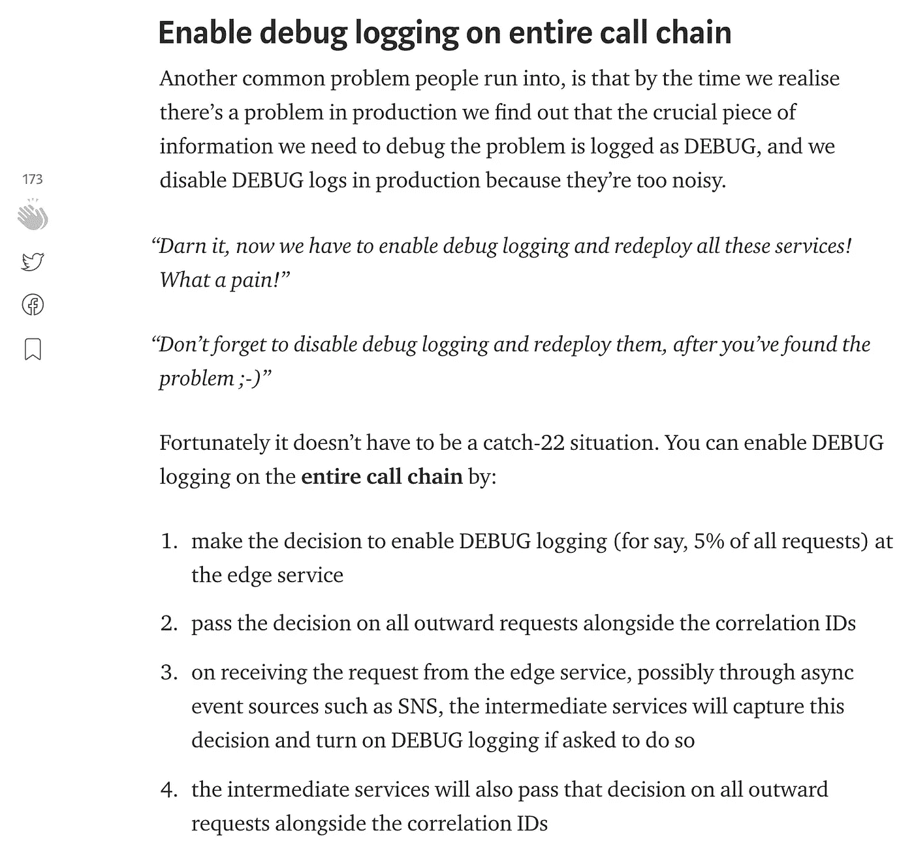
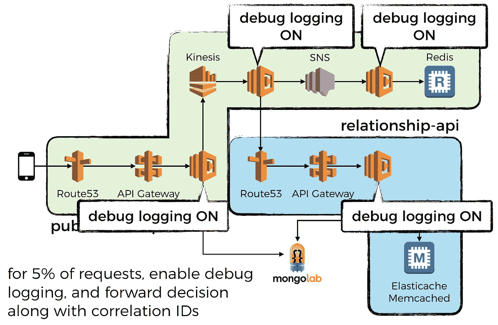

# 您需要在 AWS Lambda 中使用结构化日志记录

> 原文：<https://medium.com/hackernoon/you-need-to-use-structured-logging-with-aws-lambda-f3af9586d6a8>

这是我希望在第一次开始使用《愤怒的 T2》中的 AWS Lambda 时学到的一课，它会从一开始就让我的生活变得更简单。

但是，我们很快就到达了那里，它允许我们[跟踪并在我们的日志消息中包含相关 id](https://hackernoon.com/capture-and-forward-correlation-ids-through-different-lambda-event-sources-220c227c65f5)(然后[将其推送到 ELK 堆栈)](/@theburningmonk/centralised-logging-for-aws-lambda-b765b7ca9152)，其中还包含其他有用的信息，例如:

*   函数执行的年龄
*   祈祷是否是一个冷启动
*   日志级别
*   等等。

回顾过去，我陷入了一个常见的陷阱，那就是忘记了在不同的软件开发范例中曾经很好地服务于我们的实践，至少在我发现如何将这些旧的实践用于新的无服务器范例之前是这样。

在这种情况下，我们知道[结构化日志很重要](https://www.loggly.com/blog/why-json-is-the-best-application-log-format-and-how-to-switch/)和[为什么我们](https://stackify.com/what-is-structured-logging-and-why-developers-need-it/) [需要它们](https://blog.treasuredata.com/blog/2012/04/26/log-everything-as-json/)，以及[如何做好](https://www.loggly.com/blog/8-handy-tips-consider-logging-json/)。但是像许多其他人一样，我们从`console.log` 开始，因为它简单而且有效(在有限的程度上)。

但是，这种方法的上限很低:

*   您不能在日志消息中添加上下文信息，至少不能以**一致**的方式添加(您可以更改您记录的消息，但是上下文信息应该始终存在，例如用户 id、请求 id 等。)和**容易提取**用于**自动化**过程
*   因此，也很难按特定属性过滤日志消息，例如“显示与此请求 ID 相关的所有日志消息”
*   很难根据配置来控制记录的级别(即调试、信息、警告等)，例如，非生产环境在调试级别记录，但生产环境在信息/警告级别记录

这就是为什么，如果你刚刚开始你的无服务器之旅，那么从我的错误中吸取教训，从一开始就把你的日志写成结构化 JSON **。此外，您应该使用您之前使用的任何日志客户端——log4j、nlog、loggly、log4net，无论它是什么——并将客户端配置为将日志消息格式化为 JSON 和**附加尽可能多的上下文信息**。**

正如我在关于如何[捕获和转发集合 id](https://hackernoon.com/capture-and-forward-correlation-ids-through-different-lambda-event-sources-220c227c65f5)的帖子中提到的，为生产中的一小部分请求在整个调用链上启用调试日志记录也是一个好主意。它帮助您捕获逻辑中普遍存在的错误(这很容易捕获，但前提是您从日志中获得了正确的信息),否则您需要重新部署整个调用链上的所有函数来打开调试日志记录…

因此，大规模升级您的无服务器架构是一件简单而有效的事情。查看我关于 AWS Lambda 日志记录的迷你系列，其中涵盖了[日志聚合](https://hackernoon.com/centralised-logging-for-aws-lambda-b765b7ca9152)、[跟踪相关性 id](https://hackernoon.com/capture-and-forward-correlation-ids-through-different-lambda-event-sources-220c227c65f5)，以及一些[技巧和诀窍](https://hackernoon.com/tips-and-tricks-for-logging-and-monitoring-aws-lambda-functions-885af6da29a5)，比如为什么以及如何异步发送定制指标。

嗨，我叫**崔琰**。我是一个 [**AWS 无服务器英雄**](https://aws.amazon.com/developer/community/heroes/yan-cui/) 和 [**量产无服务器**](https://bit.ly/production-ready-serverless) 的作者。我已经在 AWS 中运行了近 10 年的大规模生产工作负载，我是一名架构师或首席工程师，涉足从银行、电子商务、体育流媒体到移动游戏等多个行业。我目前是一名专注于 AWS 和无服务器的独立顾问。

你可以通过[邮箱](mailto:theburningmonk.com)、 [Twitter](https://twitter.com/theburningmonk) 和 [LinkedIn](https://www.linkedin.com/in/theburningmonk/) 联系我。

查看我的新课程，[**AWS 步骤功能完整指南**](https://theburningmonk.thinkific.com/courses/complete-guide-to-aws-step-functions) 。

在本课程中，我们将介绍有效使用 AWS Step Functions 服务所需了解的一切。包括基本概念、HTTP 和事件触发器、活动、设计模式和最佳实践。

点击获取您的副本[。](https://theburningmonk.thinkific.com/courses/complete-guide-to-aws-step-functions)

来了解 AWS Lambda: CI/CD 的操作性**最佳实践**，本地测试&调试功能、日志记录、监控、分布式跟踪、canary 部署、配置管理、认证&授权、VPC、安全性、错误处理等等。

还可以用代码 **ytcui** 获得**票面价格 4 折**。

点击获取您的副本[。](https://bit.ly/production-ready-serverless)