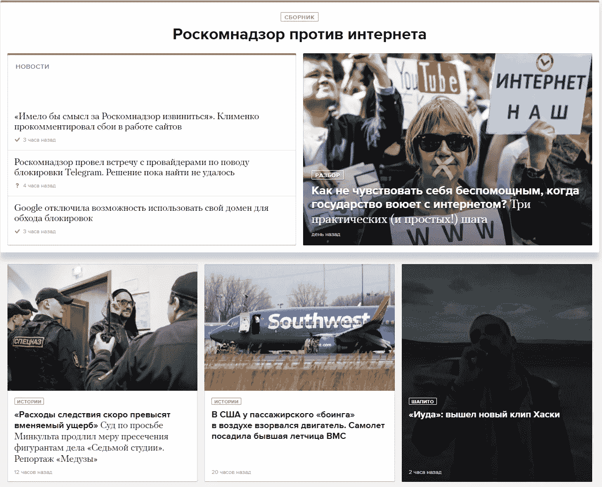
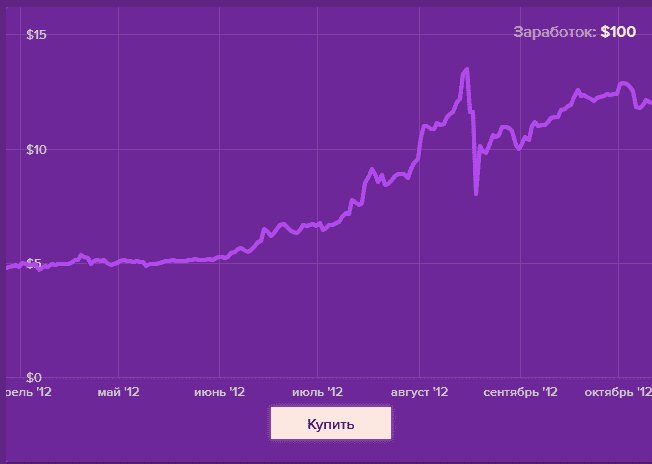
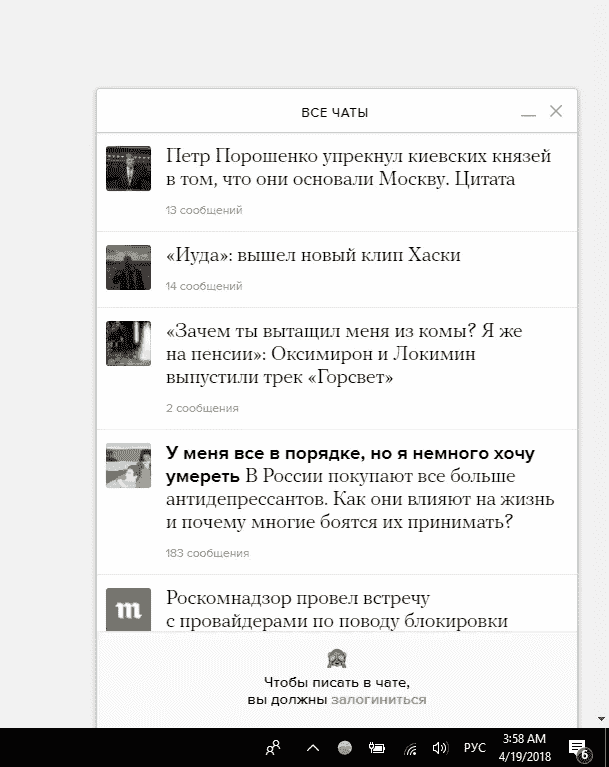
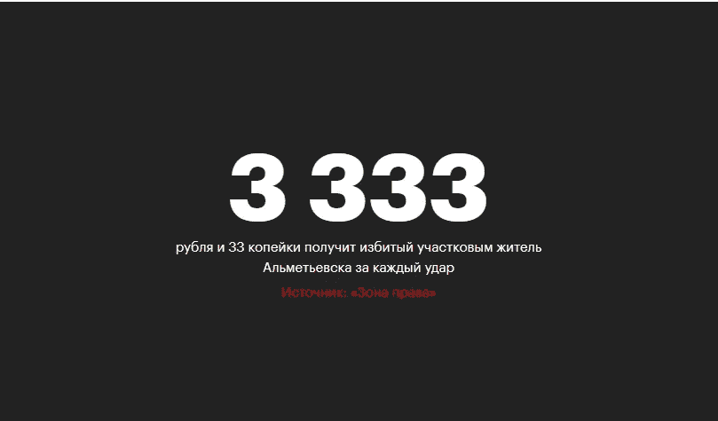
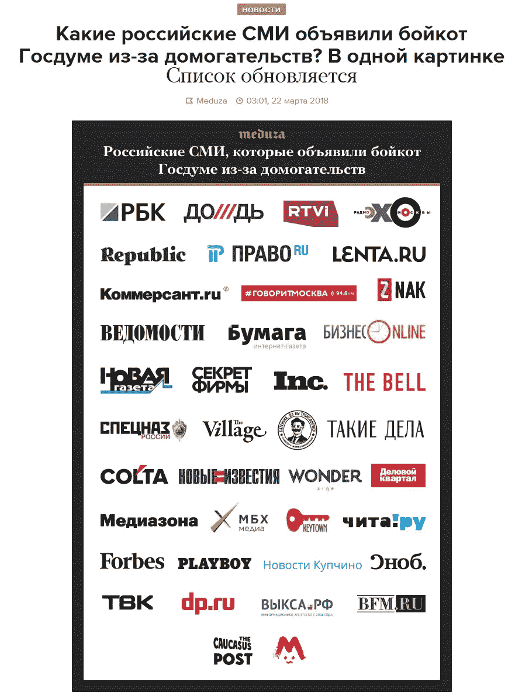
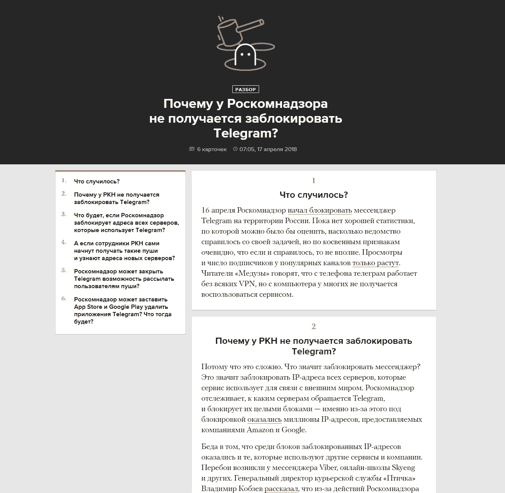
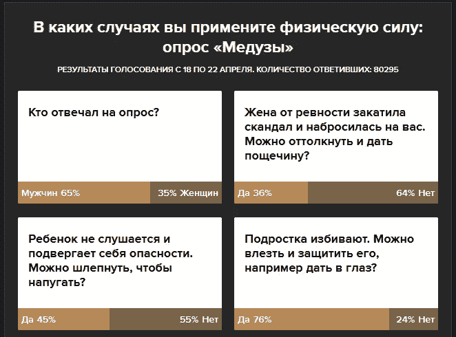
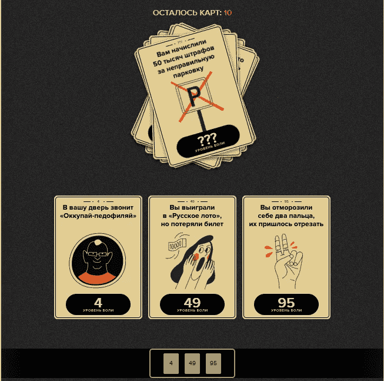
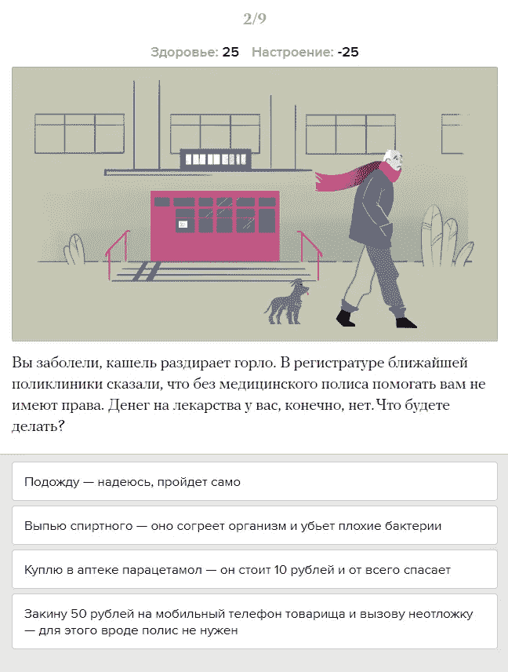

# 你应该每天在你的出版物中使用交互式格式，原因如下

> 原文：<https://medium.com/hackernoon/you-should-be-using-interactive-formats-in-your-publication-daily-heres-why-1a6a4c63137>

各位记者和记者朋友们，你们好。今天，我想谈谈互动故事如何帮助新闻编辑室赢得新读者并吸引现有观众。在与社交媒体的[战斗中，作者和编辑需要不断学习和改进，所以今天我们将讨论一个特定项目的案例——](/staffwriter-co/state-of-the-interactive-journalism-overcoming-newsrooms-crisis-3251a2611605)[Meduza](https://meduza.io)。两年前，作为一份鲜为人知的出版物，Meduza 登上了俄罗斯新闻编辑室 Olymp 的榜首，每月拥有超过 1200 万的读者。让我们一起挖掘[增长](https://hackernoon.com/tagged/growth)的主要驱动力。

Meduza Project, https://meduza.io

Meduza 是一个年轻的俄罗斯独立新闻编辑室，涵盖与政府冲突、政治反对派活动、腐败、个人故事和采访等广泛议题。对俄罗斯媒体来说，这并不是什么新鲜事。很多大玩家(包括 BBC 莫斯科，德国之声)都在同一个市场上玩，所以竞争很大。

这个成功故事背后的秘方是由我的朋友萨马特·加利莫夫领导的惊人的开发团队。我们在莫斯科州立大学学习数学，作为一个非常注重技术的人，他能够运用这种工程方法使 Meduza 获得成功。

> 许多人甚至不把 Meduza 看作是一个新闻编辑室，而是一家技术公司，在尝试创新的新闻报道方式。

Buy / Sell Bitcoin. Meduza’s interactive game

多年来，出版物使用文本和图片来传递一个故事。我们有成功的丰富互动项目([降雪](http://www.nytimes.com/projects/2012/snow-fall/index.html#/?part=tunnel-creek)是引领潮流的第一批项目之一)。但这些都是例外。大多数作者和出版商的思维模式保持不变——文本是必由之路，特殊项目昂贵且难以制作；游戏、测试和调查是低质量的格式，与真正的新闻无关(你好， [Playbuzz](https://playbuzz.com) )。因此，Meduza 团队挑战了这种思维模式。从第一天开始，他们就定期使用互动形式来吸引新读者，并证明这种商业模式是可行的。**没有数周的数据收集、格式制作和润色。只是快速可重复使用的互动应用程序，用于展示每天最热门的新闻**。(他们也做大型项目，但我们不要把它放在这个故事里)。让我们了解一下这些实践是如何帮助观众增长的，以及如何改善我们对交互式媒体未来的看法。

## 1.出版不仅仅是文章和新闻的收集。

Meduza 的主页不是作为一个常规的媒体网站，而是作为一个网络应用程序的实时集合，读者可以通过它发现新闻并获得新的体验。

> **您的出版物不再是文章的集合，而是实时更新的网络应用。**

Meduza 的第一个方法是用聊天取代评论区，并在一盘直播磁带上播放最新、最热门的回复。结果如何？

Meduza replaced comments with Facebook-like messaging app

1.  一个熟悉的信息界面(脸书)帮助你的读者快速适应你的服务并发表更多评论。
2.  一个网站范围内的回复磁带为趋势新闻带来了更多的流量。这种机制促进了病毒式传播，提升了社交媒体的份额。

> **与文章下的传统评论部分相比，实时聊天和磁带中的平均回复数量增加了 23%。**

## 2.新鲜的想法，快速的实验——这很好。简化很酷。

现代媒体的竞争依然激烈，许多新闻编辑室通常都瞄准相同的受众。因此，为了脱颖而出并赢得胜利，人们需要进行实验。有目的地应用吸引人的互动应用程序，可以成为将出版物转变为媒体中心的坚实基础。来自 Meduza 的一个例子——互动卡的概念。列表、标识、引用、图表、数字——所有这些都非常容易适应单一的卡片格式，这激励读者在阅读前言后发现卡片上的内容。这些小的 UX 实验让你的观众为更大的项目做准备，甚至创造需求。卡片——短小精悍的信息——自然也适合广泛的社交媒体分享。

Simple card. Tells the story in one picture. Got social media shares boost.

下面是一个简单的 A/B 测试的结果。俄罗斯国家杜马一名议员在工作场所猥亵女记者。此事公之于众，新闻编辑室开始抵制议会简报以示抗议。加入抵制的名单会不断更新新的品牌。大多数出版物使用简单的文本列表来报告参与者的更新，收到的转发不超过几千次，没有什么吸引力。梅杜扎将所有参与者的标志放在卡片上，并将故事变成了实时互动——“所有加入抵制国家杜马的俄罗斯媒体，在一张图片中，实时更新。”该卡仅在脸书就收集了**近 1 万次转发**。

> **普通文本列表:👍👍卡片上的数千个赞
> 活动标识:👍👍👍👍👍👍👍👍👍👍上千个赞**

Live interactive card with logos

## 3.交互式格式实际上适用于新闻。

许多作者仍然认为游戏、测验和投票只是为了娱乐(还记得“权力的游戏中你是谁？”).我的一些同行直截了当地说,“可玩的噱头”永远不会被认为是真正的新闻。改变这一点。每天，Meduza 使用快速互动来传递更广泛的新闻内容，通过新颖的格式突出趋势话题。

要将互动有机地融入出版物的日常议程，人们需要开始摆脱典型的“只告诉发生了什么”的思维模式。新闻中可以包含哪些附加价值？事实证明，许多话题可能会潜在地影响观众的决定和行动。人们通过阅读新闻来了解最新发展，并能够及时做出反应。就与读者相关的问题提供分析和个性化建议，开始与你的社区建立伙伴关系。

> **新闻—“俄罗斯当局封锁电报信使”
> 教程 app —“在手机上设置 VPN 和代理”**
> 
> **新闻—“俄罗斯举行总统选举”
> 指南—“在旅途中，你如何为总统投票？”**
> 
> **新闻—“西伯利亚购物中心火灾造成 64 人死亡”
> 清单 app —“检查离你最近的购物中心的火警”**

Meduza 积极寻找机会将个性化融入流行议程。拥有超过 1000 万个月的 uniques 意味着没有“一件事适合所有人”的方法，所以这就是交互性有所帮助的地方。交互式应用程序(如指南、逐步指南或计算器)可以针对特定需求，提供有价值的个性化建议或评估。与静态文本相比，即使是简单的交互式应用也能提供真实的用户体验。人们知道，整合这一解决方案的工作已经完成，这种感觉强烈地激励他们去尝试。

Interactive Guide. Captions on the left. Each card is adapting, based on previous interaction.

最近，俄罗斯当局屏蔽了广受欢迎的信使 Telegram。许多新闻编辑室张贴在“你需要找到一个代理人来访问电报”。Meduza 在这个问题上走得更远。他们很快编写了互动指南，询问用户的手机类型、操作系统，并为每个用户提供个性化的分步指导。这个简单的指南(后面没有火箭科学！)被视为真正的内置应用，所以人们知道，一站式解决方案就在那里，并与朋友和社区分享了很多。

> **新闻文章《俄罗斯当局封锁电报信使》
> 👍👍👍
> 教程 app —“在手机上设置 VPN/代理”
> 👍👍👍👍👍👍👍👍👍👍👍👍👍👍👍👍👍👍👍**

此外，在你的出版物中嵌入互动可以收集信息和发布统计数据。通常，新闻编辑室缺乏报道新闻的数据。Meduza 使用互动的方式，以漂亮的投票形式从观众那里收集不充分的数据。数据库实时更新，用户可以在投票结束后立即访问累积的结果。这使得社论能够尝试众包新闻，并进行各种受众研究。

Live updates to interactive poll results, as more data flows in

## 4.雄心勃勃的项目制作不需要单独的团队

让我们看看互动特价的传统利基。调查性的故事、互动的长篇阅读、采访系列、大数据模型——所有这些都是拥有广泛受众的老牌新闻编辑室的特权和骄傲。《金融时报》通过对几十名司机的采访，制作了优步游戏。许多人在这个惊人的项目上工作了数周，其中涉及到专业的图形和软件工程。

Contrary to FT, Meduza’s simple yet engaging card games don’t require a dev team to build

如今，没有多少出版物能负担得起独立的互动制作团队。然而，现代网络技术允许快速构建高质量的交互格式，并且没有庞大的预算。基本的互动机制——游戏、计算、指南、调查和测试很容易适应，并可以与真实的插图配对，这也变得更容易制作。现代工具提供模板和构造函数来快速组装您的定制格式，无需编码。

A homeless living simulator, Moscow.

Meduza 已经将迷你游戏的制作变成了日常事务，由没有开发团队的作者来完成。在他们的 CMS 里有流程——**创建游戏** / **创建测试**。作者需要填写问题卡，定制答案选项，根据脚本将卡片放在一起，添加插图——游戏就准备好了。互动小游戏、测试和民意调查很快在社交媒体和博客上流行起来，这仍然是 Meduza 最强劲的增长动力之一。

一家年轻的俄罗斯媒体创业公司将其新闻业务打造为一个现代化的网络平台，而不是一个普通的新闻编辑室网站。感谢才华横溢的工程师团队，交互式制作工具被内置到 Meduza CMS 中。我们知道，许多媒体团队没有足够的资源或规模来为他们的 CMS 构建内部工具。因此，受 Meduza、FT 和其他提供精彩媒体项目的人的启发，我们制作了 [StaffWriter](http://staffwriter.co/?ref=m2) —一个创建嵌入式互动格式的平台，以便让更多的团队和新闻编辑室开始互动制作。