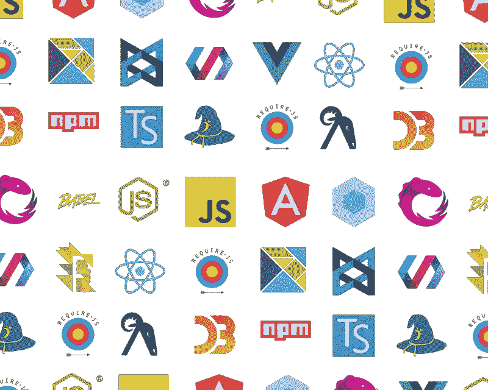
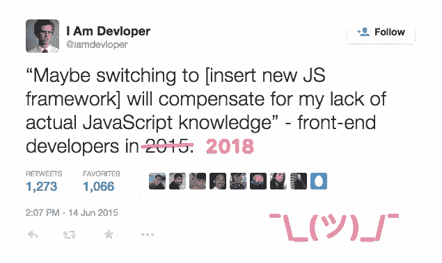
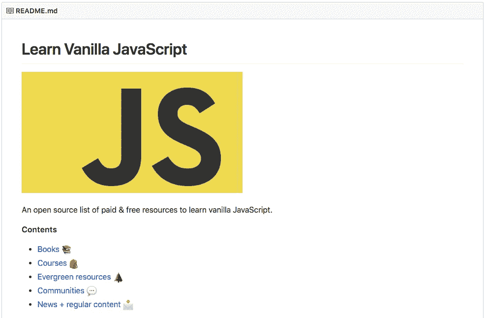

# 你应该在学习 JS 框架之前学习普通的 JavaScript

> 原文：<https://medium.com/hackernoon/you-should-learn-vanilla-javascript-before-js-frameworks-88fb727ab362>


Photo by [Ilya Ilyukhin](https://unsplash.com/photos/UJ-qMFZTs1s?utm_source=unsplash&utm_medium=referral&utm_content=creditCopyText) on [Unsplash](https://unsplash.com/search/photos/vanilla?utm_source=unsplash&utm_medium=referral&utm_content=creditCopyText)

倒回到 2013 年。⏪

我们的小型开发团队即将发布迄今为止最令人印象深刻的客户项目之一。我在我的立式办公桌前，浏览着早晨的电子邮件。我的搭档破门而入:

“我们的 Angular 应用程序有问题，伙计。我发现到处都是错误——我不知道发生了什么，”他说，明显很紧张。

但是我不紧张，也没有压力。我确切地知道从哪里开始寻找，因为我知道我的 [JavaScript](https://hackernoon.com/tagged/javascript) 。

我知道这一切都要感谢机器人**。**

倒回到 2011 年。⏪

那时，我还是一个爱做梦的软件工程师学生，没有受到现实世界编码的商业规则的影响。我对后端开发充满热情，没有任何学习普通 JavaScript 或任何相关内容的欲望。

但是我和我的朋友们不得不为我们的一个班级建造一个软实时、面向任务的机器人。


我们给这个机器人取名为擎天柱，并最终把它卖给了迈克尔·贝。

我们偶然发现了这个叫做 Node.js 的很酷的新东西。没有花哨的依赖，容易产生子进程，异步和事件驱动…许多人在网上说这是 sh*t。我们完全不知道 JavaScript 或 V8 是什么，但它似乎仍然是我们项目的一个好主意。

同行们告诉我要为我的用例找到一个合适的库，并完成一些复制/粘贴艺术来完成套接字通信工作。我本可以做到的。

但我没有。虽然我当时并不知道，但这是我职业生涯早期做出的最好的决定之一。

我开始如饥似渴地阅读。关于异步编程，JavaScript 的历史，它的优缺点，一切。因为我想掌握支持我的项目的语言的基本原理。这花费了相当多的时间、咖啡、啤酒和伪代码。

在管理我的队友的不耐烦和创建一个不那么干净的、功能性的机器人代码库之间，*我学到了一大堆 DMN**。

那么这有什么意义呢？**在使用 JS 框架和库提供的快捷方式之前，我花了足够的时间去理解 JavaScript 的核心原理**。为什么这很重要？嗯，这就是这篇帖子的内容:*不仅仅是假装。*


Source: the ever-hilarious [@iamdevloper](https://twitter.com/iamdevloper).

# 什么是“香草 JavaScript”？


让我引用 [koenpeters 关于栈溢出](https://stackoverflow.com/questions/20435653/what-is-vanillajs)的回答:

> *“vanilla js 是一个名字，指的是使用* ***普通 JavaScript，不需要任何像 jQuery 一样的附加库*** *。人们把它当作一个笑话，提醒其他开发人员，如今许多事情都可以在不需要额外的 JavaScript 库的情况下完成。”*

或者，在我们的情况下，没有新的，花哨的框架。

## 普通的 JS“框架”笑话

在线论坛充满了这样的问题:

> *香草 JavaScript 是什么意思？这个术语是什么时候创造的？*

以“JS 框架”网站自居的普通 JS 网站的历史很短，但很有趣。 [Eric Wastl](https://twitter.com/ericwastl) 在 2012 年创建了它，使用了一点 trolling 和混乱来强调一点:**你可以经常使用普通的 JavaScript 来代替额外的 JS 框架或库。**

虽然埃里克本身并没有创造这个术语，但他的网站无疑帮助推广了它。

## 现代普通 JavaScript 的状态

从历史上来说，开发人员需要绕过普通的 Javascript 来完成许多任务，无论是为了让他们的代码在不同的浏览器上表现一致，还是为了超越 JavaScript 当时提供的功能。我们说的是 6 到 7 天。开发人员在这个过程中经常默认使用 jQuery。但是这种依赖外部库的长期反射现在已经无关紧要了，这要归功于 ECMAScript 规范的发展，以及现代浏览器更紧密地跟上它的步伐。

如今，选择普通的 JS vs jQuery 往往是最明智的选择，这样你的代码库就不会因为不必要的依赖而变得臃肿。一个明显的例子来自优秀的[你可能不需要 jQuery](http://youmightnotneedjquery.com/) :

**jQuery**

```
$('.my #awesome selector');
```

**vs 香草 JS:**

```
document.querySelectorAll('.my #awesome selector');
```

该网站充满了有用的普通 JS 示例——看看吧！

哦，如果你需要更多的社会证据:

# JS 框架的优点和缺点



## 首先，我这里说的 JS“框架”是什么意思？

我把所有的 [Angular](https://snipcart.com/blog/angular-seo-universal-server-side-rendering) 、 [Vue](https://snipcart.com/blog/vuejs-blog-demo) 、 [React](https://snipcart.com/blog/reactjs-wordpress-rest-api-example) 、Backbone、Ember、Knockout、Ext、jQuery、Meteor、Express、Koa、Total、Socket.io 等等都放在同一个盒子里。是的，我知道有些很不一样。是的，我知道有些“不是真正的框架，更像是一个库，顺便问一下，你在 HN 上看到过这个帖子吗？”。

但是，为了这篇文章，请让我们在它们的主要目的上声明它们是等价的。

## 优点:为什么我认为 JavaScript 框架很棒

→他们通过抽象硬而复杂的代码来帮助你。

→它们帮助您更快地发布代码并提高开发速度。

→他们迫使你关注应用的价值，而不是应用的实现。

每当我们讨论 JS 框架的流行时，这些原因很快就会出现。但对我来说，它们更多的是营销方面的原因。我在这里并不是在抨击框架——事实上，在我的职业生涯中，我已经使用了相当多的框架。

我相信 JS 框架中最大的价值是*协作*。他们一致的界面和方法允许来自加拿大、美国和巴西的开发人员相互理解并一起工作。

如果你正在用[插入你最喜欢的框架]构建一个应用程序，到时候，你将能够找到一个有经验的开发人员满怀信心地加入项目代码库。这个人将能够开始处理特性，而不需要你解释你的软件架构的每一部分。

使用框架的另一个关键原因是*实践*。他们让你一遍又一遍地练习。这很好！无论你想完成什么，练习总是会带来精通。

## 缺点:为什么我认为 JS 框架没有那么棒

从事框架实现的人都很有才华——至少大部分是这样。他们做了大量的工作来简化复杂的工作。但是所有这些抽象层次都可能很快变得邪恶。

在每一个应用程序开发中，总有一天会出现一些事情不像预期的那样工作，而你不知道为什么。那就是你必须开始挖掘的时候了。当你开始搜索文档不完整的、复杂的、通用的纯 JavaScript 代码时，你需要对 JS 有深刻的理解。否则，我可以保证你将会失去所有通过使用你的框架节省下来的宝贵时间。为了赶上最后期限，你可能不得不买一台新的浓缩咖啡机。

当然，框架对于开发单个应用的小团队来说是有用的。是的，它们会节省你一些时间(除非你是一个[重构上瘾者](https://snipcart.com/blog/tips-on-code-refactoring-from-a-former-addict))。但是，如果有多个团队在开发多个应用程序，该怎么办呢？你认为所有的团队领导都会同意一整套应用的单一框架吗？如果 2019 年出现一个新的“酷小子”框架会怎样？

问题是:一旦你确定了一个框架，你就会影响*每一个即将到来的工程决策*。此外，您将您的团队束缚在一项可能很快就会被弃用的技术上。这东西让我震惊。

# 为什么要在学习框架之前学习普通的 JavaScript？

**如果你掌握了 JavaScript 基础知识，那么在学习新的 JS 框架时，你唯一的挑战将是它们特定的语法。**

JavaScript 现在是 web 的编程语言。如果你想建立一个体面的网络职业生涯，理解它的核心工程原理是至关重要的。尤其是如果你的目标是人群的最前面。

在过去的 5 年里，超过 10 个前端 JS 框架成为新闻。猜猜有多少人会在未来 5-10 年做同样的事情？如果你只是假装了解 JavaScript，这个推动网络革命的引擎，你将如何跟上？

只要想想“jQuery 开发者”今天在做什么:试图赶上 Angular。明天，他们将努力赶上 React/Vue。悲伤、沮丧的循环继续着。



了解普通的 JavaScript 会让你真正理解——甚至有助于——JS 框架，并在你需要的时候帮助你选择正确的框架。

对我来说，它带来了很多积极的东西:

*   它帮助我在极短的时间内为一个 Ember 应用程序提供了一套杀手级的客户端功能，而我对 Ember 一无所知。
*   它让我得到了一家科技巨头的工作机会，因为我在业余时间编写了一个非常简单的库。
*   它使我能够识别 libs 实现中的错误，并非常快速地提出简单的解决方案。

# 在哪里以及如何学习香草 JavaScript？

我希望我说服了你用普通的 JavaScript 来弄脏你的手。如果你想在网站开发方面大放异彩，这里是我的高级建议:

> *永远保持好奇心，永远阅读原始资料，永远亲自尝试。*

还有一些更具体的建议:

*   每当 Echo JS、Hacker News 或 GitHub 上出现新的 JS 库或框架时，请继续阅读源代码。
*   每当你写一段代码时，试着想一个简单的 JS 解决方案来满足你的需求，而不是立即寻找一个库来集成。
*   上 Stack Overflow，挑战自己，自己回答普通的 JS 问题。

对于初学者；我相信 J.S .在本文中概述的学习流程是一个很好的起点；

现在来看看学习资源:

# [学习香草 JS——GitHub 上的开源资源列表](https://github.com/snipcart/learnvanillajs)👈

我和来自 Snipcart 的朋友[弗兰克一起工作，编辑了**一份精心策划的普通 JS 教程、书籍、课程、文档、新闻资源和博客的列表**。](https://twitter.com/the_fln)

🔔我们希望尽可能保持它的开放性和协作性。所以不要犹豫用叉子+ PR 添加有价值的东西！🔔



一些著名的一次性文章没有添加到上面的列表中:

我希望你能在这个小小的普通 JavaScript wiki 中找到价值！

# 外卖食品

这是我的 TL。博士为你们乡亲:

*   如果你不知道 web 的基本原理，由于语言本身的发展和新框架的不断出现，你最终会碰壁。
*   了解纯 JS 会让你成为能解决复杂问题的关键工程师(在疯狂搜索之前先理性)。
*   它将让您在前端和后端都变得多才多艺、高效工作。
*   它将为你提供创新的工具，而不仅仅是执行。
*   它将指导你何时使用框架[或不使用](https://snugug.com/musings/you-probably-shouldnt-use-javascript-framework/)。
*   它会让你对浏览器和电脑的工作原理有一个更好的总体理解。

使用 JS 框架肯定能让你快速到达某个地方。但如果你不理解背后的核心概念，它不会给你带来什么。就像学习弹吉他不会教你如何作曲，但它会给你一个练习的理由。

我坚信这个“先学习基础/根源”的原则适用于生活中的几乎所有事情。从学习一门新的编程语言到开始一项新的运动。这需要大量的练习，但是一旦你掌握了它，剩下唯一要做的就是发挥创造力。这才是真正有趣的地方。

*如果你喜欢这篇文章，请花点时间👏+* [*分享到 Twitter 上*](https://twitter.com/home?status=You%20SHOULD%20Learn%20Vanilla%20%23JavaScript%20Before%20JS%20Frameworks%20https%3A//buff.ly/2bIkAll%20via%20%40snipcart%20%23webdev) *。评论，问题？点击下面的部分！*

*原载于 snipcart.com*[](https://snipcart.com/blog/learn-vanilla-javascript-before-using-js-frameworks)**。**